# Working with Scoreboard Operations

In this tutorial, we'll show you how to use each of the scoreboard player operations. By the end, you'll create a game with one objective that has six players to represent digits 0, 1, 2, 3, 5, and 10, and another objective with two players whose scores will be changed when you do the operations.

- Numbers: 0, 1, 2, 3, 5, 10

- Friends: Alex and Toast

## Setting things up

1. Start by creating two scoreboard objectives, one called called "Numbers" and another called "Friends."

    - `/scoreboard objectives add Numbers dummy Numbers`
    - `/scoreboard objectives add Friends dummy Friends`

2. Display Numbers with the **list** option and display Friends with the **sidebar**.

    - `/scoreboard objectives setdisplay list Numbers`
    - `/scoreboard objectives setdisplay sidebar Friends`

3. Add players "Zero", "One", "Two", "Three", "Five", and "Ten" to the **Numbers** objective and give each player the number of points that matches their name.

    - `/scoreboard players add Zero Numbers 0`
    - `/scoreboard players add One Numbers 1`
    - `/scoreboard players add Two Numbers 2`
    - `/scoreboard players add Three Numbers 3`
    - `/scoreboard players add Five Numbers 5`
    - `/scoreboard players add Ten Numbers 10`
    > [!NOTE]
    > After you add a player, when you go back into the chat screen to add another, you can press the up arrow on your keyboard to scroll through previous commands and just change the player name and score value. It saves a little bit of typing.
    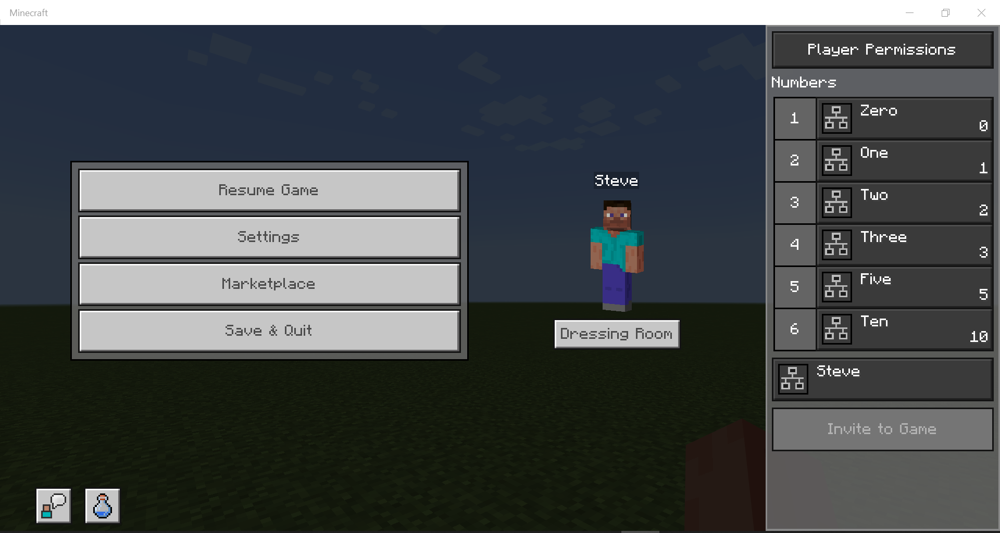

4. Add the players, "Alex" and "Toast", to **Friends** and give each of them a score of 4.

    - `/scoreboard players add Alex Friends 4`
    - `/scoreboard players add Toast Friends 4`
    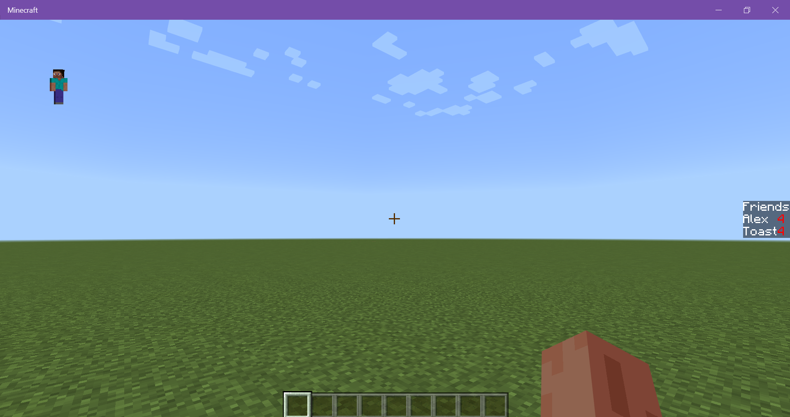

Now that your players and objectives are added, it's time to start operating the game!

## Let's operate!

1. The first step to our operation is assigning values to our players. The current value for Alex's score is 4. Use the `=` operator to assign the value of player Ten's score (10).

    - `/scoreboard players operation Alex Friends = Ten Numbers`

    Now Alex has a score of 10!

    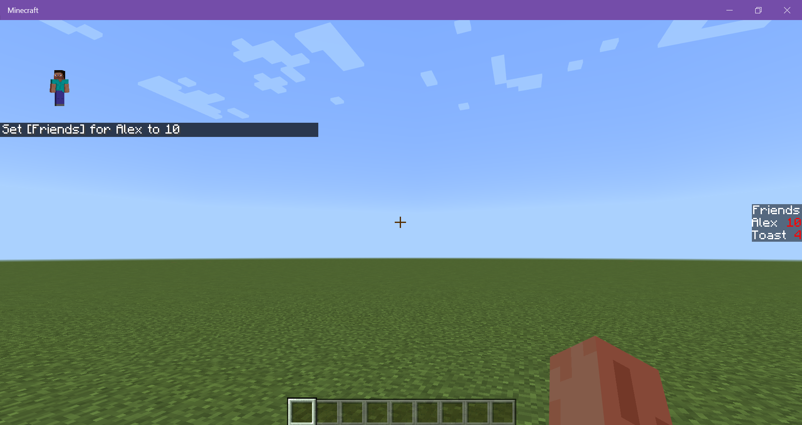

2. Next, we'll swap some values between players to show you one of the ways to give a player a particular score.

    - `/scoreboard players operation Alex Friends >< Toast Friends`

    Now Alex's score is 4 and Toast has a score of 10.
    
    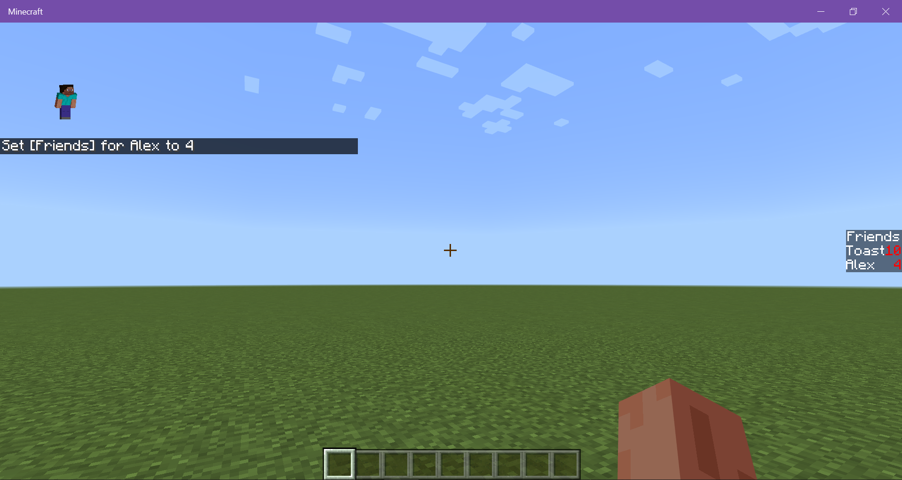

3. Let's try multiplying Toast's score three times, for a final score of 30.

    - `/scoreboard players operation Toast Friends *= Three Numbers`

    Now Toast has 30 points.
    
    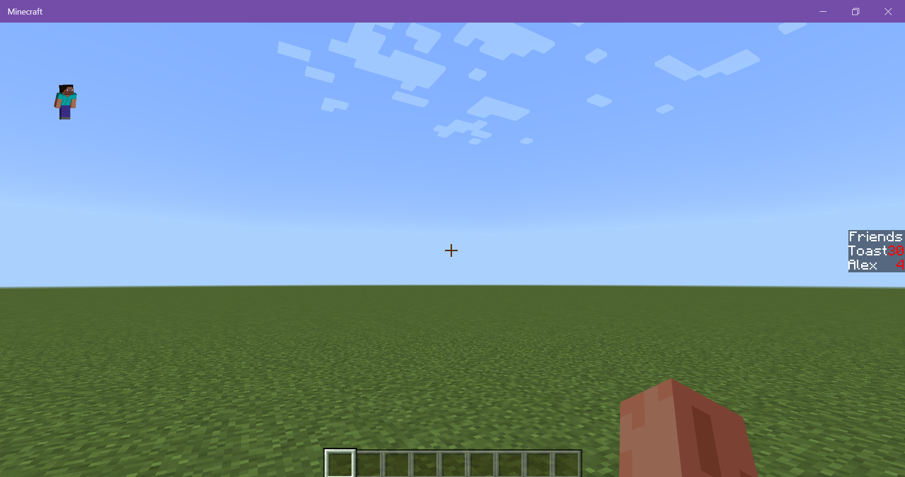

4. Use an operation to add Toast's score to Alex's score.

    - `/scoreboard players operation Alex Friends += Toast Friends`

    Now Alex has 34 points! Since we only ran an operation that affects Alex's score, Toast's score is unaffected and remains at 30.
    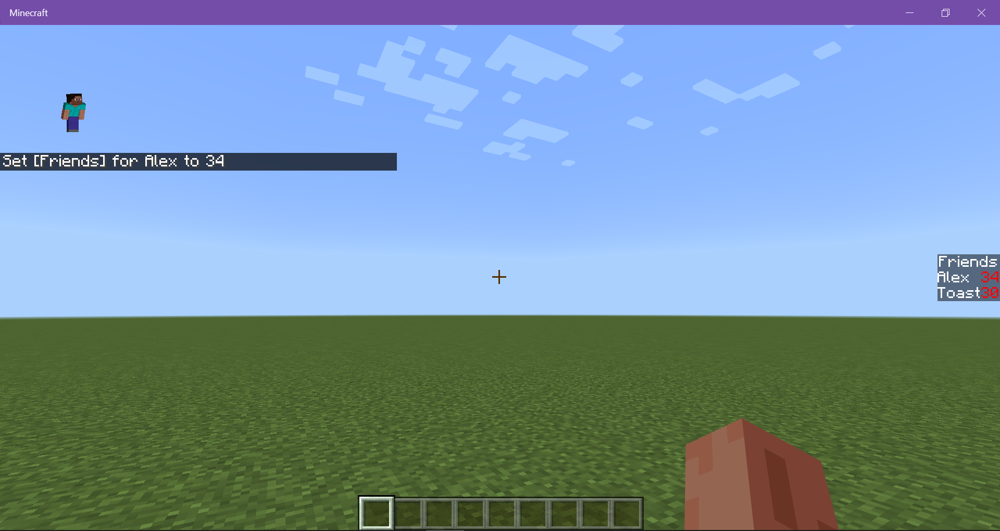

5. Try subtracting 5 from Toast's score.

    - `/scoreboard players operation Toast Friends -= Five Numbers`

    Toast should end up with 25 points after you run the operation.
    
    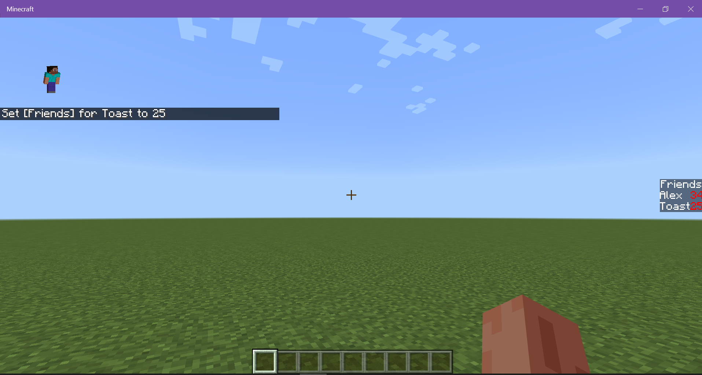
    
6. Things get a bit less straightforward when you use operations to divide (because division isn't always a clean task).
    - Use an operation like the one below to divide Toast's score by 5, leaving no remainder:
        - `/scoreboard players operation Toast Friends /= Five Numbers`
    
    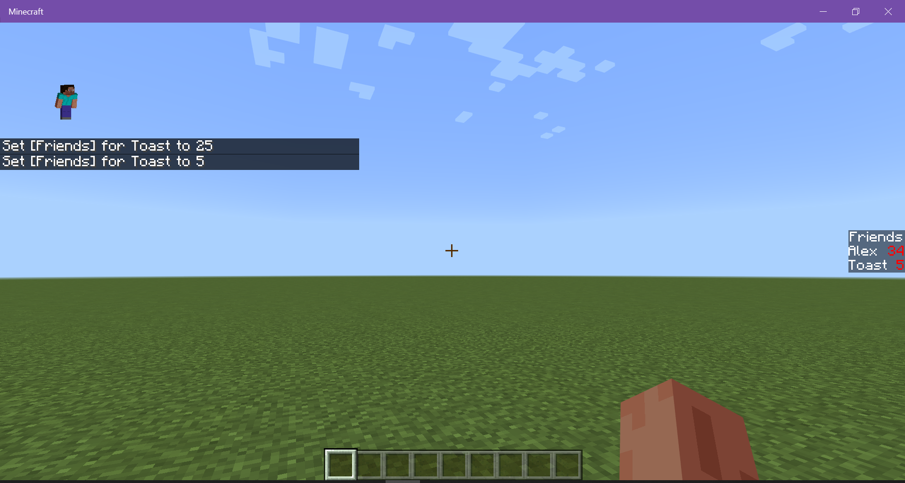

    - To divide Alex's score by 5 and include a remainder, use a command like this:
        - `/scoreboard players operation Alex Friends /= Five Numbers`
    
    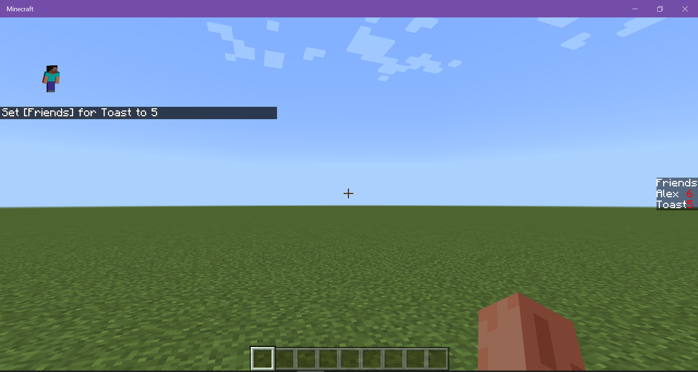

    > [!TIP]
    > In case any of you mathematicians out there are wondering, nothing happens if you divide by zero (Whew!).

7. You can also use operations to compare Toast's score to Alex's score.
    - In this operation, Alex's score is unaffected while Toast's score will be set to whichever score is higher:
        - `/scoreboard players operation Toast Friends > Alex Friends`

    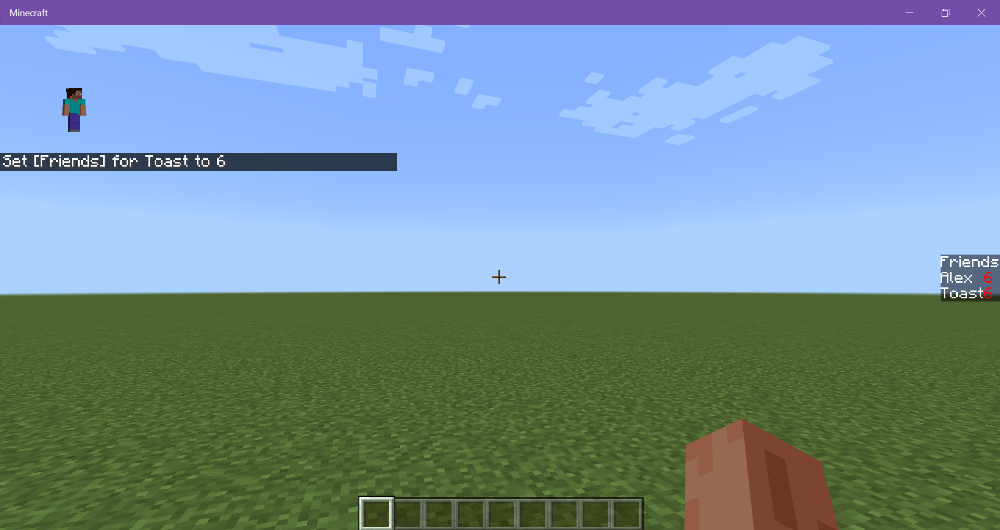

    > [!TIP]
    > If you try the operation again when both scores are equal, you should get the same message.

8. Now let's use the opposite command to compare Toast's score to Three's score.
    - Toast's score will be set to whichever score is lower with this operation:
        - `/scoreboard players operation Toast Friends < Three Numbers`

    Toast's score is set to 3 because Three had a lower score than them.
    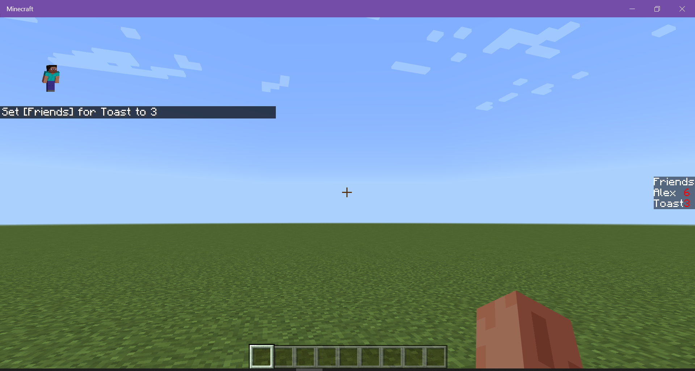

9. The Modulo operation takes Alex's current score, divides it by 2, and then returns the remainder.
    -  This operation sets the returned remainder as Alex's new score:
        - `/scoreboard players operation Alex Friends %= Two Numbers`
    
    Alex's score is set to 0 because it was an even number!
    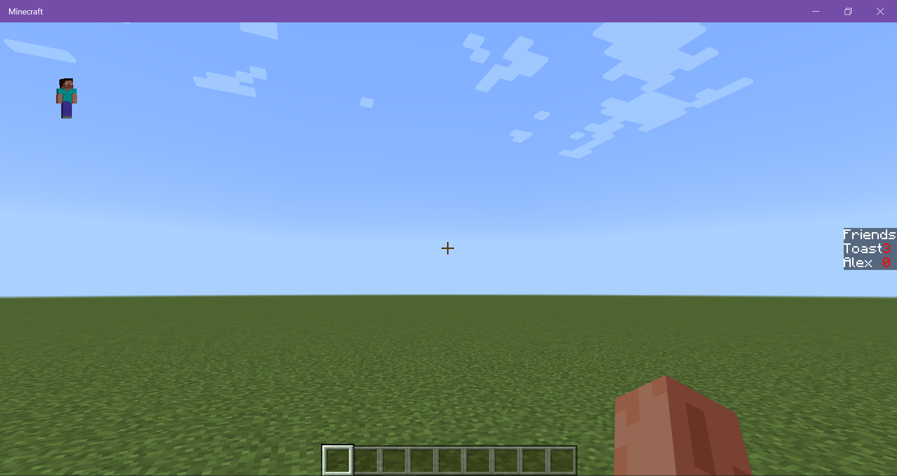

## What's next?

Now that you've learned about scoreboard operations, you should consider looking into command blocks and functions to try combining it all together.

> [!div class="nextstepaction"]
> [Command Blocks](CommandBlocks.md)
> [Introduction to Functions](FunctionsIntroduction.md)
