# Build a gameplay experience with TypeScript

This leverages a starter sample available from [https://github.com/microsoft/minecraft-scripting-samples/](https://github.com/microsoft/minecraft-scripting-samples/) with a simple build process and TypeScript compilation for Minecraft. From it, you can build out and expand simple gameplay styles. You can also use this project as a starter for your own scripting projects.

> [!IMPORTANT]
> Just getting started with JavaScript? You may want to check out the [Scripting Introduction](./ScriptingIntroduction.md) article which will show the basics of creating a very basic behavior pack with JavaScript fundamentals. Once you're comfortable with the JavaScript fundamentals and concepts, this article will help you use TypeScript with Minecraft. TypeScript is a more helpfully structured dialect of JavaScript; however, because TypeScript requires compilation of your TypeScript source into JavaScript that Minecraft can use, there is a bit more project structure you'll need to establish up front that this tutorial will walk you through.  

## Prerequisites

### Install Node.js tools, if you haven't already

We're going to use the Node Package Manager (or NPM) to get more tools to make the process of building our project easier.

Visit [https://nodejs.org/](https://nodejs.org).

Download the version with "LTS" next to the number and install it. (LTS stands for Long Term Support, if you're curious.) You do not need to install any additional tools for Native compilation.

### Install Visual Studio Code, if you haven't already

Visit the [Visual Studio Code website](https://code.visualstudio.com) and install Visual Studio Code.

## Getting Started

1. Download a copy of the starter project from GitHub by visiting [https://github.com/microsoft/minecraft-scripting-samples/](https://github.com/microsoft/minecraft-scripting-samples/) and, under the Code button, selecting `Download ZIP`.

1. The `ts-starter` folder contains a starter TypeScript project for Minecraft.  Note that there is a `ts-starter-complete-cotta` folder that will show you the finished product and code.

1. To make your own environment look like the example, create a folder on your `C:\` drive and call it **projects**. Create a subfolder called **cotta**.

1. Put the extracted contents of the TypeScript Starter Project folder into **cotta**.

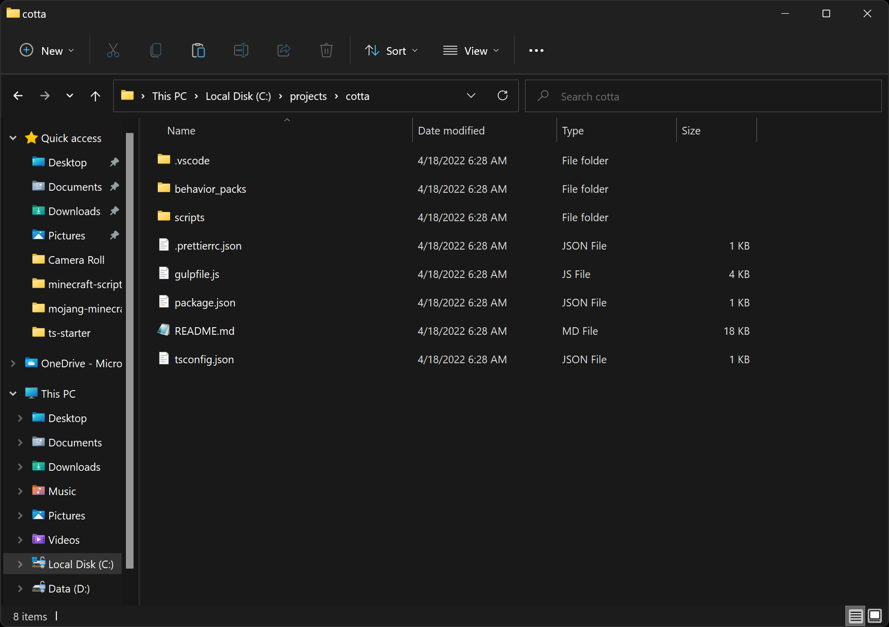

1. Open a Windows Terminal or PowerShell window and change the working directory to your **cotta** folder:

    ```powershell
    cd c:\projects\cotta\
    ```

1. Use NPM to install our tools:

    ```powershell
    npm i
    ```

1. Use this shortcut command to open the project in Visual Studio Code:

    ```powershell
    code .
    ```

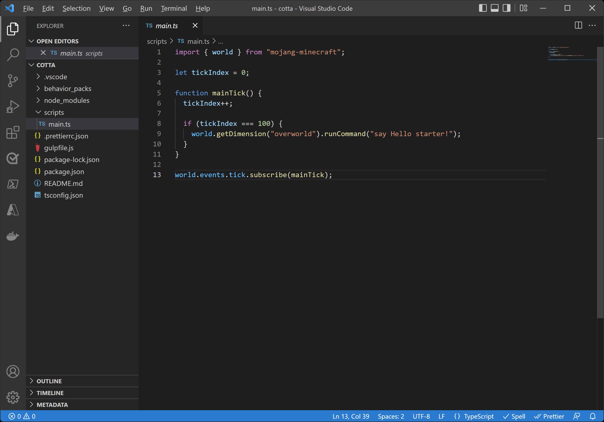

It might also ask you to install the Minecraft Debugger and Blockception's Visual Studio Code plugin, which are plugins to Visual Studio Code that can help with Minecraft development. Go ahead and do that, if you haven't already.

### Chapter 1. Customize the behavior pack

In Visual Studio Code, open the file `.env`. This contains the environment variables to use to configure project:

```
PROJECT_NAME="starter"
MINECRAFT_PRODUCT="BedrockUWP"
CUSTOM_DEPLOYMENT_PATH=""
```

- **PROJECT_NAME** is used as the folder name under all the assets are going to be deployed inside the game directories (e.g., development_behavior_packs\\**PROJECT_NAME**, development_resource_packs\\**PROJECT_NAME**).

- **MINECRAFT_PRODUCT**. You can choose to use either Minecraft or Minecraft Preview to debug and work with your scripts. These are the possible values: **BedrockUWP, PreviewUWP, Custom**.
  Use **Custom** in case of deploy on any other path.

- **CUSTOM_DEPLOYMENT_PATH**. In case of using **Custom** for **MINECRAFT_PRODUCT**, this is the path used to generate the assets.

Go back the Files tree view and open `behavior_packs\cotta\manifest.json`

Update the name and description properties to something like "Cotta Behavior Pack" and "My TypeScript Project".

Update the first and second UUID properties to make it unique to your project. See [this article](https://learn.microsoft.com/minecraft/creator/documents/behaviorpack) for tips on working with behavior packs and creating your own unique UUIDs.

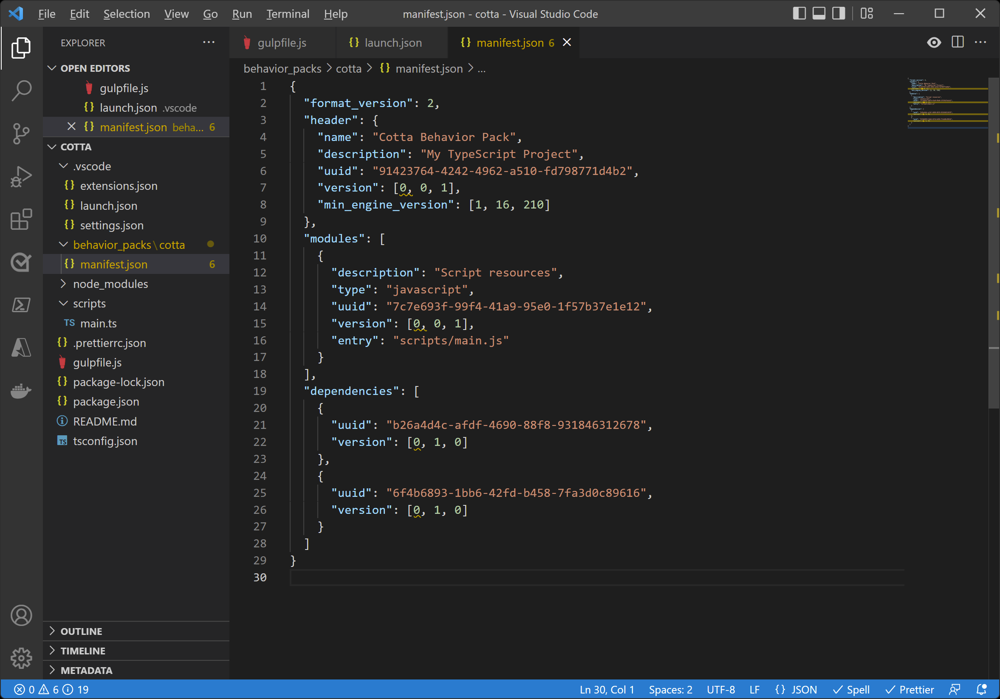

### Chapter 2. Let's test the parts of our project

To get started, go into PowerShell and navigate to your **C:\projects\cotta** directory.
Run this command:

```powershell
Set-ExecutionPolicy -Scope Process -ExecutionPolicy Bypass
```

Run this one, too.

```powershell
npm run local-deploy
```

This uses a build tool called just-scripts and automatically compiles your TypeScript project and pushes it over into Minecraft.

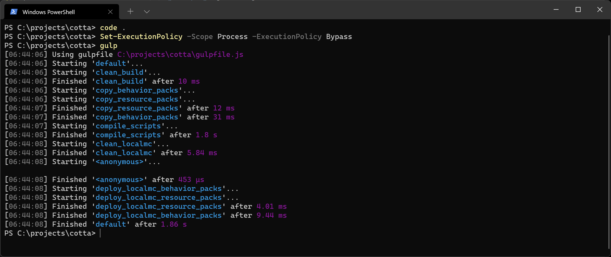

Launch Minecraft and create a new world:

1. Call it **Cotta Test**.
1. Select a Creative game mode.
1. Select a Flat world option, under the Advanced section of the Create New World screen.
1. Under Behavior Packs, under Available, you should see your Cotta Behavior Pack. Select it and Activate it.
1. Create the world and go into it.

Now you're in. Great!

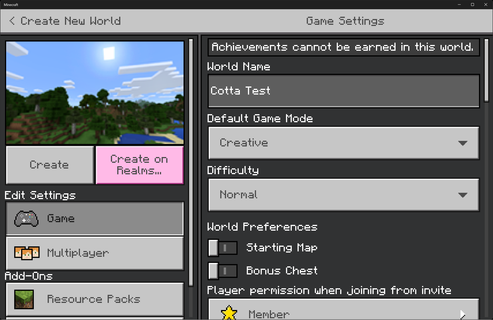

By default, this starter pack comes with a simple script that will display a message every five seconds:

`[Script Engine] Hello starter! Tick: <number>`

This means your behavior pack is working and your tools for compiling and pushing TypeScript are just fine. Awesome!

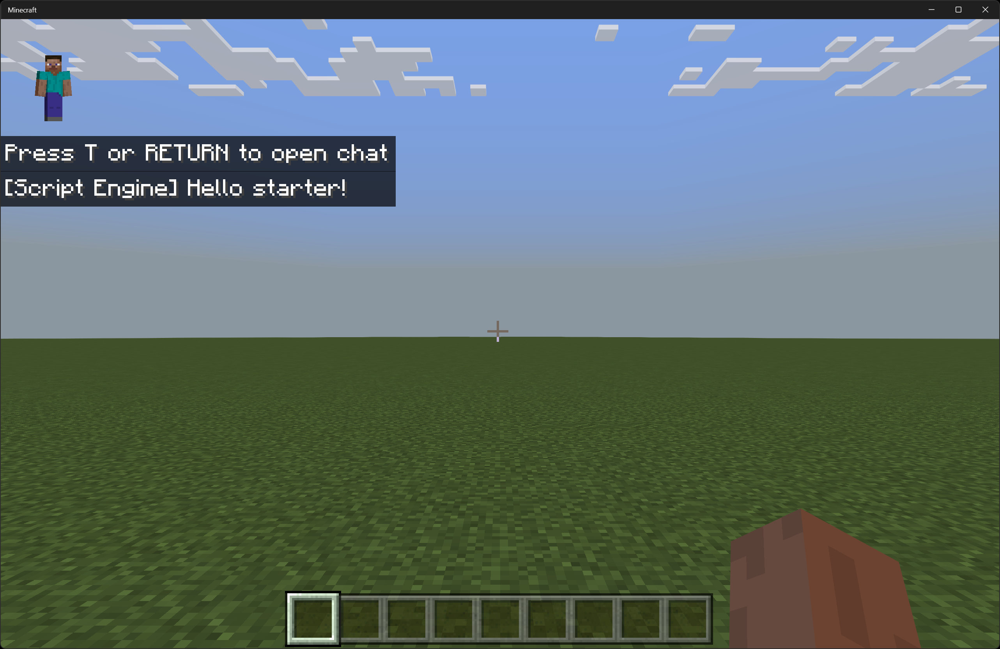

### Chapter 3. Scripting your gameplay

Let's go back to Visual Studio Code and change up some code.

Open up `scripts/main.ts` within Visual Studio Code.

#### Add some initialization code

Remove all the existing script code in **main.ts**. Replace it with this to start:

```typescript
import { world, system, BlockPermutation, EntityInventoryComponent, ItemStack, DisplaySlotId } from "@minecraft/server";

const START_TICK = 100;
const ARENA_X_SIZE = 30;
const ARENA_Z_SIZE = 30;
const ARENA_X_OFFSET = 0;
const ARENA_Y_OFFSET = -60;
const ARENA_Z_OFFSET = 0;

// global variables
let curTick = 0;

function initializeBreakTheTerracotta() {
  const overworld = world.getDimension("overworld");

  let scoreObjective = world.scoreboard.getObjective("score");

  if (!scoreObjective) {
    scoreObjective = world.scoreboard.addObjective("score", "Level");
  }

  // eliminate pesky nearby mobs
  let entities = overworld.getEntities({
    excludeTypes: ["player"],
  });

  for (let entity of entities) {
    entity.kill();
  }

  // set up scoreboard
  world.scoreboard.setObjectiveAtDisplaySlot(DisplaySlotId.Sidebar, {
    objective: scoreObjective,
  });

  const players = world.getAllPlayers();

  for (const player of players) {
    scoreObjective.setScore(player, 0);

    let inv = player.getComponent("inventory") as EntityInventoryComponent;
    inv.container?.addItem(new ItemStack("diamond_sword"));
    inv.container?.addItem(new ItemStack("dirt", 64));

    player.teleport(
      {
        x: ARENA_X_OFFSET - 3,
        y: ARENA_Y_OFFSET,
        z: ARENA_Z_OFFSET - 3,
      },
      {
        dimension: overworld,
        rotation: { x: 0, y: 0 },
      }
    );
  }

  world.sendMessage("BREAK THE TERRACOTTA");
}

function gameTick() {
  try {
    curTick++;

    if (curTick === START_TICK) {
      initializeBreakTheTerracotta();
    }
  } catch (e) {
    console.warn("Tick error: " + e);
  }

  system.run(gameTick);
}

system.run(gameTick);
```


This code does some work to initialize our gameplay for Minecraft by running several commands.

First, we queue up a run to our main tick function, gameTick. Note that at the end, we will requeue a game tick, which will run within the next tick frame. This will give us a callback that fires 20 times a second, and within this, we can put all of our game logic. We want the game to initialize some code; namely, the `initializeBreakTheTerracotta` function.

Note that we wait until `START_TICK` (100 ticks in) before the world is actually initialized. This gives Minecraft time to fully load up and get ready.

Within the initialize function, we run commands that:

- Clear out any existing mobs near the player in the world.
- Set up a scoreboard objective for overall Level of the player, meaning the number of terracotta breaks they have
- Give the current player a diamond sword and some dirty dirt
- Use chat to give the player an instructional message

Now, let's run the code. This time, we're going to run the local-deploy task in "watch mode" - meaning it will just sit in the background and watch for changes, and if they happen, they will automatically compile and deploy to the Minecraft folder. This way, we won't have to worry about separately compiling every time we make a change to code.

Go back to your PowerShell window, and enter:

```powershell
npm run local-deploy -- --watch
```

You should see that the local-deploy task compiles and deploys to the Minecraft folder. From here, we don't need to tend to PowerShell except to see if there are any compilation errors down the road.

When you are done coding for the day, either hit **ctrl-c** in the PowerShell Window to stop the watch mode or close the window.

Now, let's go back to Minecraft.

Save and Quit to exit out of the world. We'll want to reload the world from here - any time you make a script change, you need to exit out of the world and reload it to see changes. Or, you can run the `/reload` command to reload the JavaScript files that have been deployed.

Now load the world. You should see your initialization changes: a new scoreboard, new items in your inventory, and a script message.

Note that as you work through this tutorial, we are going to run the initialization code more than once, so your player is going to get multiples of these items during this development and test phase.

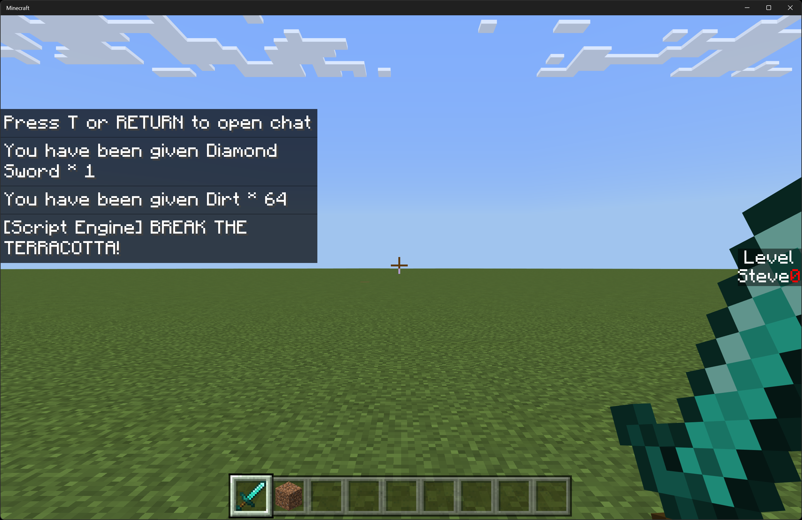

#### Build your arena with some helper code

We're going to start by adding some handy helper utility code functions. This will show you how you can organize your code into separate modules or classes.

Add a new file to your `scripts` folder called `Utilities.ts`. Correct capitalization matters, so make sure the `U` is capitalized. Add the following code:

```typescript
import { world, BlockPermutation } from "@minecraft/server";

export default class Utilities {
  static fillBlock(
    blockPerm: BlockPermutation,
    xFrom: number,
    yFrom: number,
    zFrom: number,
    xTo: number,
    yTo: number,
    zTo: number
  ) {
    const overworld = world.getDimension("overworld");

    for (let i = xFrom; i <= xTo; i++) {
      for (let j = yFrom; j <= yTo; j++) {
        for (let k = zFrom; k <= zTo; k++) {
          overworld.getBlock({ x: i, y: j, z: k })?.setPermutation(blockPerm);
        }
      }
    }
  }

  static fourWalls(
    perm: BlockPermutation,
    xFrom: number,
    yFrom: number,
    zFrom: number,
    xTo: number,
    yTo: number,
    zTo: number
  ) {
    const overworld = world.getDimension("overworld");

    for (let i = xFrom; i <= xTo; i++) {
      for (let k = yFrom; k <= yTo; k++) {
        overworld.getBlock({ x: i, y: k, z: zFrom })?.setPermutation(perm);
        overworld.getBlock({ x: i, y: k, z: zTo })?.setPermutation(perm);
      }
    }

    for (let j = zFrom + 1; j < zTo; j++) {
      for (let k = yFrom; k <= yTo; k++) {
        overworld.getBlock({ x: xFrom, y: k, z: j })?.setPermutation(perm);
        overworld.getBlock({ x: xTo, y: k, z: j })?.setPermutation(perm);
      }
    }
  }
}
```

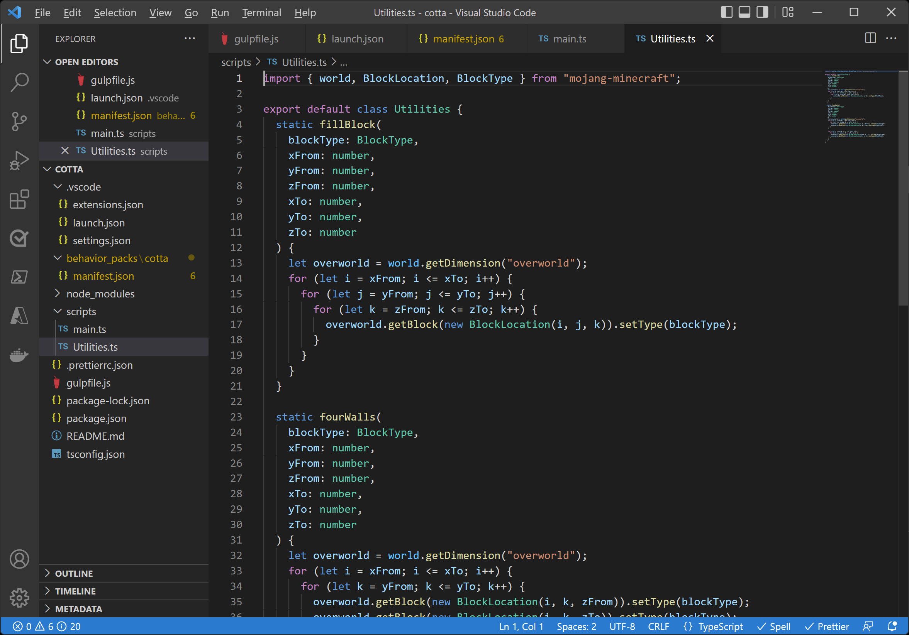

The first utility function here (`Utilities.fillBlock`) is relatively straightforward:

Across three dimensions (within three loops), it will basically set a block in the overworld to a particular type. This function just makes a big chunk of blocks.

The second utility function here (`Utilities.fourWalls`) basically creates a walled enclave. The first inner loop creates two stripes of blocks left to right (across X). The second inner loop creates two stripes of blocks south to north (across Z) - thus completing four walls that join each other.

Go back to **main.ts**. Let's use these functions in our initialization function.

First, we'll need an import function. Add a new line above `const START_TICK = 100;` and make this the second line of the file:

```typescript
import Utilities from "./Utilities.js";
```

Then, within `initializeBreakTheTerracotta`, let's add our arena initialization beneath the `world.sendMessage("BREAK THE TERRACOTTA!");` line of code:

```typescript
let airBlockPerm = BlockPermutation.resolve("minecraft:air");
let cobblestoneBlockPerm = BlockPermutation.resolve("minecraft:cobblestone");

if (airBlockPerm) {
  Utilities.fillBlock(
    airBlockPerm,
    ARENA_X_OFFSET - ARENA_X_SIZE / 2 + 1,
    ARENA_Y_OFFSET,
    ARENA_Z_OFFSET - ARENA_Z_SIZE / 2 + 1,
    ARENA_X_OFFSET + ARENA_X_SIZE / 2 - 1,
    ARENA_Y_OFFSET + 10,
    ARENA_Z_OFFSET + ARENA_Z_SIZE / 2 - 1
  );
}

if (cobblestoneBlockPerm) {
  Utilities.fourWalls(
    cobblestoneBlockPerm,
    ARENA_X_OFFSET - ARENA_X_SIZE / 2,
    ARENA_Y_OFFSET,
    ARENA_Z_OFFSET - ARENA_Z_SIZE / 2,
    ARENA_X_OFFSET + ARENA_X_SIZE / 2,
    ARENA_Y_OFFSET + 10,
    ARENA_Z_OFFSET + ARENA_Z_SIZE / 2
  );
}
```

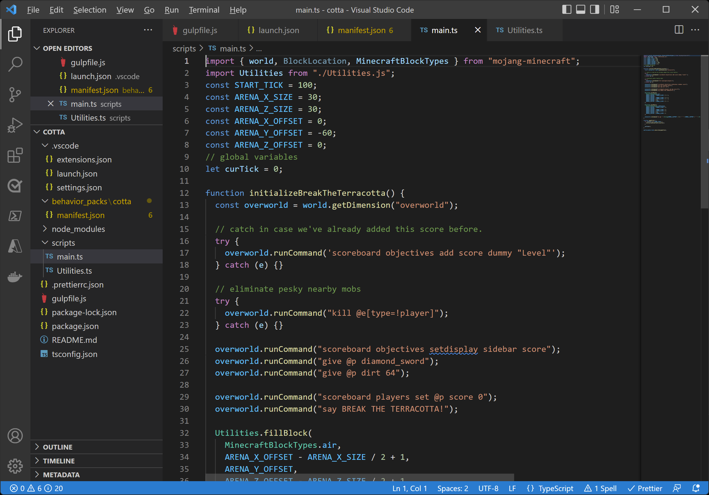

The first line just fills a cuboid with air - basically clearing out the arena of any previous items. The second line re-installs and adds four walls of cobblestone.

Exit out of your Minecraft world and restart it to load your changes. After a brief delay, you should find yourself in an arena.


Now, let's give ourselves some terracotta to break.

### Chapter 4. Add some gameplay basics - scoring and objectives

First, let's track some more game variables. Inside **main.ts**, add this directly beneath the `let curTick = 0` line of code:

```typescript
let score = 0;
let cottaX = 0;
let cottaZ = 0;
let spawnCountdown = 1;
```

Add the following to the `gameTick` function, beneath the `curTick++` line of code:

```typescript
if (curTick > START_TICK && curTick % 20 === 0) {
  // no terracotta exists, and we're waiting to spawn a new one.
  if (spawnCountdown > 0) {
    spawnCountdown--;

    if (spawnCountdown <= 0) {
      spawnNewTerracotta();
    }
  } else {
    checkForTerracotta();
  }
}
```

Now add the `spawnNewTerracotta()` and `checkForTerracotta()` functions after the last function and before the last `system.run(gameTick);` line of code:

```typescript
function spawnNewTerracotta() {
  const overworld = world.getDimension("overworld");

  // create new terracotta
  cottaX = Math.floor(Math.random() * (ARENA_X_SIZE - 1)) - (ARENA_X_SIZE / 2 - 1);
  cottaZ = Math.floor(Math.random() * (ARENA_Z_SIZE - 1)) - (ARENA_Z_SIZE / 2 - 1);

  world.sendMessage("Creating new terracotta!");
  let block = overworld.getBlock({ x: cottaX + ARENA_X_OFFSET, y: 1 + ARENA_Y_OFFSET, z: cottaZ + ARENA_Z_OFFSET });

  if (block) {
    block.setPermutation(BlockPermutation.resolve("minecraft:yellow_glazed_terracotta"));
  }
}

function checkForTerracotta() {
  const overworld = world.getDimension("overworld");

  let block = overworld.getBlock({ x: cottaX + ARENA_X_OFFSET, y: 1 + ARENA_Y_OFFSET, z: cottaZ + ARENA_Z_OFFSET });

  if (block && !block.permutation.matches("minecraft:yellow_glazed_terracotta")) {
    // we didn't find the terracotta! set a new spawn countdown
    score++;
    spawnCountdown = 2;
    cottaX = -1;

    let players = world.getAllPlayers();

    for (let player of players) {
      player.runCommand("scoreboard players set @s score " + score);
    }

    world.sendMessage("You broke the terracotta! Creating new terracotta in a few seconds.");
    cottaZ = -1;
  }
}
```

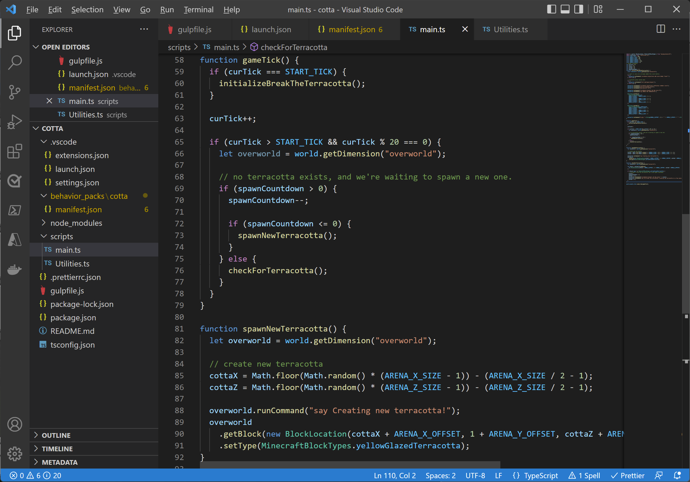

Congratulations! You've just created a very basic and very easy game where you can run around and break terracotta with your sword.

To play, you will need to run the command `/gamemode s` to put Minecraft into survival mode so that you can break the terracotta.

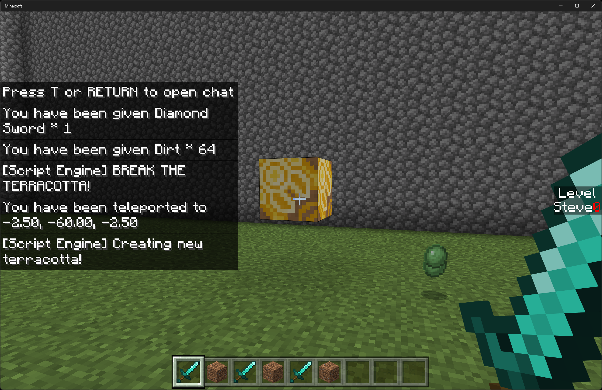

After the terracotta is broken, your score will increment, and a new block is spawned.

#### Add a challenge - let's add some mobs

OK, let's add this function after the `checkForTerracotta()` function:

```typescript
function spawnMobs() {
  const overworld = world.getDimension("overworld");

  // spawn mobs = create 1-2 mobs
  let spawnMobCount = Math.floor(Math.random() * 2) + 1;

  for (let j = 0; j < spawnMobCount; j++) {
    let zombieX = Math.floor(Math.random() * (ARENA_X_SIZE - 2)) - ARENA_X_SIZE / 2;
    let zombieZ = Math.floor(Math.random() * (ARENA_Z_SIZE - 2)) - ARENA_Z_SIZE / 2;

    overworld.spawnEntity("minecraft:zombie", {
      x: zombieX + ARENA_X_OFFSET,
      y: 1 + ARENA_Y_OFFSET,
      z: zombieZ + ARENA_Z_OFFSET,
    });
  }
}
```

This function will spawn 1-2 zombies within the arena, at a random location. You can change the kinds of mobs to spawn, the number, and more within this function.

Let's call that function within our `gameTick` method:

```typescript
  const spawnInterval = Math.ceil(200 / ((score + 1) / 3));
  if (curTick > START_TICK && curTick % spawnInterval === 0) {
    spawnMobs();
  }
```

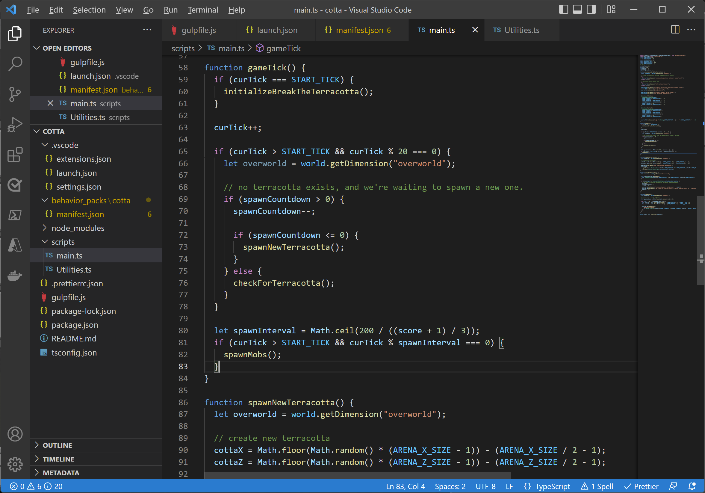

For gameplay, we want mobs to spawn more frequently as your score goes up. To do this, the frequency at which `spawnMobs` is called depends on the `spawnInterval` variable. `spawnInterval` is the span of time between spawning new mobs. Because we divide this interval by our current score, this means that as our score goes up, the interval of time between spawning mobs gets shorter. This makes the challenge harder over time.

As you play, zombies should spawn and start chasing you. They'll spawn slowly at first, but as you break blocks they'll start to accumulate and bother you while you try to break terracotta blocks.

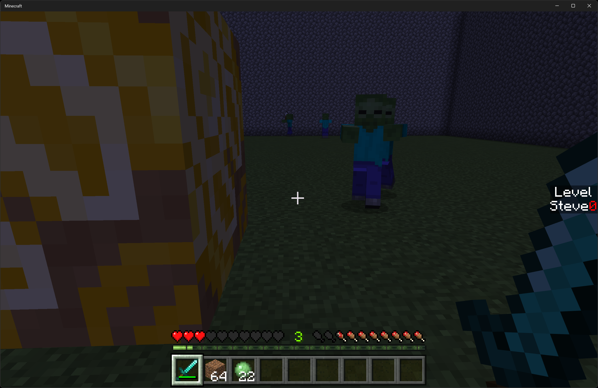

### Add more challenges!

Let's add a new gameplay twist: randomly spawning obstructions in the form of leaves.

Add this function to **main.ts** to randomly place some fuzzy leaves:

```typescript
function addFuzzyLeaves() {
  const overworld = world.getDimension("overworld");

  for (let i = 0; i < 10; i++) {
    const leafX = Math.floor(Math.random() * (ARENA_X_SIZE - 1)) - (ARENA_X_SIZE / 2 - 1);
    const leafY = Math.floor(Math.random() * 10);
    const leafZ = Math.floor(Math.random() * (ARENA_Z_SIZE - 1)) - (ARENA_Z_SIZE / 2 - 1);

    overworld
      .getBlock({ x: leafX + ARENA_X_OFFSET, y: leafY + ARENA_Y_OFFSET, z: leafZ + ARENA_Z_OFFSET })
      ?.setPermutation(BlockPermutation.resolve("minecraft:leaves"));
  }
}
```

And call that function in your gameTick() function:

```typescript
  if (curTick > START_TICK && curTick % 29 === 0) {
    addFuzzyLeaves();
  }
```

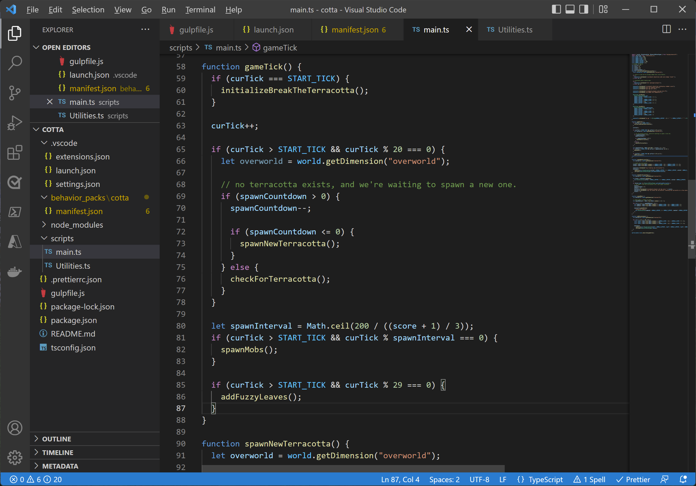

You may wonder why the interval here is 29. The main idea was to select a number to avoid the chance that on a particular tick we do everything at once (create new leaves, spawn mobs AND check terracotta state), so we try to have offset schedules for all of these different game activities.

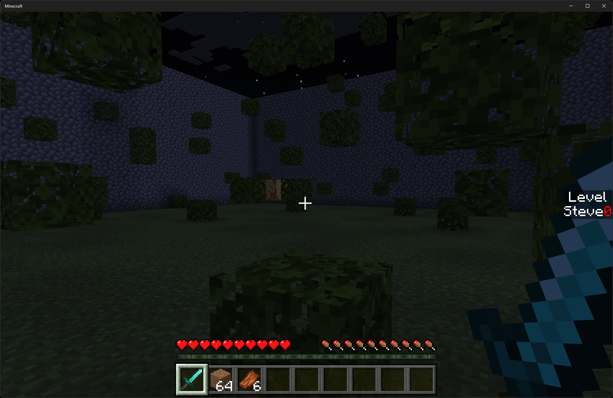

Now exit out and reload your game. As you run around, you should see new leaves get spawned. This should add a little bit more challenge to your gameplay!

### Other Commands

To run a lint operation (that is, scan your code for errors) use this shortcut command:

```powershell
   npm run lint
```

To auto-fix lint issues, you can use this:

```powershell
   npm run lint -- --fix
```

To create an addon file you can share, run:

```powershell
   npm run mcaddon
```

### Summary

With this starter, you've seen how to build a nice little arena game.

Like the randomly spawning leaves, you can see how you can add different gameplay elements into your arena. Maybe rather than leaves, you want to randomly generate some parkour platforms - or some treasures or weapons, or different types of mobs. Experiment and build your own custom competition arenas!
