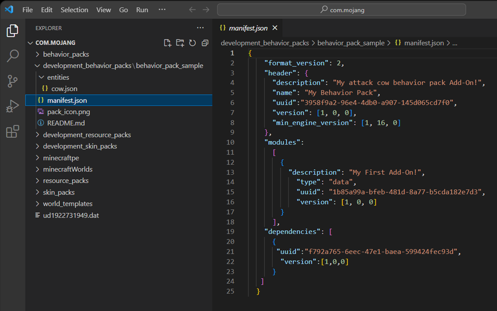
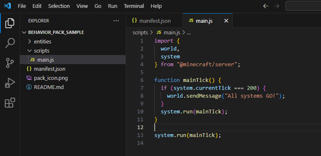
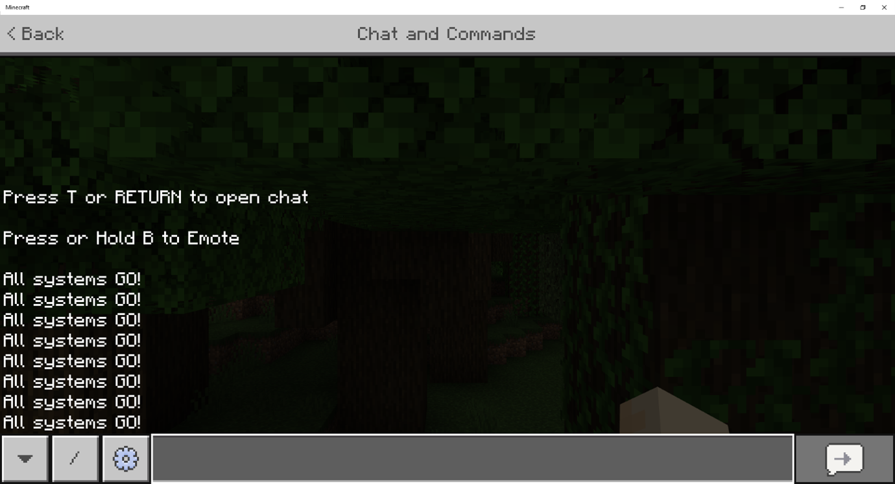
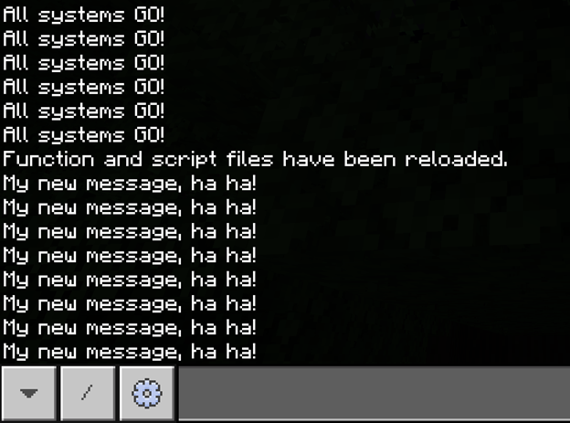
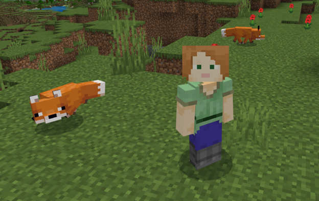
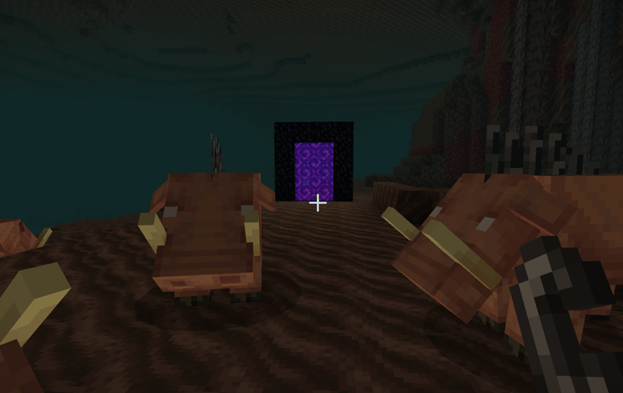
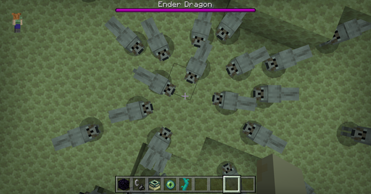

# Introduction to Scripting in Minecraft

"Scripting" is just another way of saying "writing a list of instructions for the computer to follow to make it do what you want it to do."

You can use a script to control many things in your Minecraft world, including characteristics of the world; the behaviors of entities, blocks, and items; and even an entire game loop!

In this tutorial, we will write a few small scripts in the JavaScript programming language, which is used by the rest of the world to create web pages, apps, and more! Minecraft scripts can also be written in TypeScript, which is like a new and improved version of JavaScript. TypeScript is preferable to JavaScript because it provides better error reporting and more abilities than JavaScript. However, it does require more tooling to be installed. That's why, for this beginner tutorial, we will be using JavaScript to show you the simplest way to get a script up and running in Minecraft. You can learn how to set up a Minecraft TypeScript project in the [Build a Gameplay Experience](ScriptingGettingStarted.md) with TypeScript tutorial, which is highly recommended after completing this tutorial!

If you are new to coding in general, this tutorial should break down different elements of code enough for you to understand how to write a basic script. However, if anything seems too advanced or you are confused about something that is discussed in this tutorial, please reference this [Beginner JavaScript Tutorial](https://learn.microsoft.com/shows/beginners-series-to-javascript/) for more information.

Also, all of the concepts you will learn about here will be applicable to TypeScript as well (though it will have slightly different ways of writing things), so you should feel confident in moving on to the TypeScript tutorial after this one.

## Prerequisites

Before you begin, you should have gone through the Getting Started with Add-Ons tutorial and the Introduction to Behavior Packs tutorial.

- [Getting Started with Add-On Development](GettingStarted.md)
- [Introduction To Behavior Packs](BehaviorPack.md)

It should be clear to you how add-on folders must be structured, and what the required files in the behavior pack (such as **manifest.json**) should contain.

## What You Need

Let's set up your computer. Here are the things you will need:

- Minecraft: Bedrock Edition
- A Windows 10 (or higher) computer
- Keyboard and mouse
- Visual Studio Code (or another similar text editor)
- The Attack Cow sample behavior pack downloaded from the Minecraft samples Github repository.

> [!NOTE] 
> If you have never downloaded and used a sample behavior pack, here's how:
> 1. Go to https://github.com/microsoft/minecraft-samples/tree/main, click the green Code button, and choose "Download ZIP" from the drop-down menu.
> 1. Open your Downloads folder and extract the **minecraft-samples-main** zipped folder contents.
> 1. Inside the extracted minecraft-samples-main folder, find the **behavior_pack_sample** folder and open it.
> 1. Look at the **README.md** file inside and follow the instructions to deploy the behavior pack.

## Displaying a Message using Scripting

Our first goal of this tutorial is to make Minecraft display a little message without the player having to lift a finger. It's just a small task, but it will demonstrate that we can make things happen automatically in Minecraft using a script.

To get there, we are going to start with the Attack Cow behavior pack, add the files we need for scripting, and then run the script in a Minecraft world.

### Setup and Test the Attack Cow Behavior Pack

1. If you haven't already followed this step from the README, copy the **sample_behavior_pack** into the **development_behavior_packs** folder in your **com.mojang folder**.
1. Launch Minecraft and create a survival world with cheats on and the Attack Cow behavior pack activated in it. It needs to be a survival world because the cow's attack behavior won't work in a creative world, and cheats should be on so you can summon a cow.
1. Summon a cow using the "/summon" command and make sure it attacks you, as expected. Now we know all systems are go!
1. Save & Quit the world to return to the Minecraft Main Menu screen.

### Add a Script to the Behavior Pack

1. Minimize Minecraft and open your **sample_behavior_pack** in Visual Studio Code.
2. Open and view the **manifest.json** file.



3. In the manifest file, we need to add a new module (our script) as well as a new dependency (@minecraft/server, a module that contains information that we will use in writing our script). This tells the game that our script exists and that it should be processed. So, replace the contents of the manifest.json file with this:

```json
{
    "format_version": 2,
    "header": {
      "description": "My scripting behavior pack Add-On!",
      "name": "My Behavior Pack",
      "uuid":"PUT A NEW UUID HERE",
      "version": [1, 0, 0],
      "min_engine_version": [1, 20, 30]
    },
    "modules":
      [
        {
          "description": "My Second Add-On!",
            "type": "data",
            "uuid": "PUT A NEW UUID HERE",
            "version": [1, 0, 0]
        },
        {
          "description": "Test Scripting",
            "type": "script",
            "uuid": "PUT A NEW UUID HERE",
            "version": [1, 0, 0],
            "entry": "scripts/main.js"
        }
      ],
    "dependencies": [
      {
        "module_name":"@minecraft/server",
        "version":"1.5.0"
      }
   ]
  }
```

4. Replace the three instances of **`PUT A NEW UUID HERE`** with new [UUIDs](https://www.uuidgenerator.net/), just like you did in the [Introduction to Behavior Packs](BehaviorPack.md) tutorial.
5. Save your edited manifest.json file.
6. In the **behavior_pack_sample** folder, create a folder and name it **scripts** and open it.
7. Create a file inside there and name it **main.js**.
8. Copy this code into **main.js**:

```javascript
import {
    world,
    system
  } from "@minecraft/server";

function mainTick() {
  if (system.currentTick === 400) {
    world.sendMessage("All systems GO!");
  }
  system.run(mainTick);
}

system.run(mainTick);
```

9. Save main.js.

When you're done, it should look like this:



10. Go back to Minecraft, create a world with the behavior pack activated. When you go into the world, your test message will appear after about 20 seconds.


That proves your script is working. Neat!

11. Save & Quit the world and go back to your **main.js** file.

For this particular script that we just tried, you must create a new world if you want to update the message in **"world.sendMessage"** and check that it has updated.

Hot reloading (using the **/reload** command) will NOT cause an updated message to display if the original message was displayed before your update, because the 400th tick (meaning the 20th second of the world existing) has already passed, and this line of the code specifically wants that particular tick:

`if (system.currentTick === 400) {`

Don't worry, we'll cover **/reload** later in this tutorial.

Even if you leave the world and come back, the world starts at the tick where it left off, so your update will not be apparent using that method either. In this case where we are executing code on a specific tick, you must create a new world. But this example should teach you that you should be very careful and intentional when relying on a specific tick to execute logic because it will only execute once, at a specific time. 

We will teach you other patterns below that allow you to edit your code and refresh the game using hot reloading (making it much easier and less clunky to make updates). 

## JavaScript Code Explanation

Here's what's happening in the code above...

The `import` part at the top of the script is telling Minecraft which pieces of the game you want to access in your script. After the import statement, contained in curly braces (`"{ }"`), is a list of classes that we want to access from the Minecraft game. A **class** describes an object in the game, contains information about it, and allows you to perform actions on it.

For example, we imported [system](../ScriptAPI/minecraft/server/System.md), which allowed us to access its property `currentTick` and use it in our code. 

We also imported [world](../ScriptAPI/minecraft/server/World.md), which allowed us access to its function `sendMessage`, which we used in our code to send a message to the screen. 

Some other examples of classes are [Player](../ScriptAPI/minecraft/server/Player.md), [Entity](../ScriptAPI/minecraft/server/Entity.md), [Block](../ScriptAPI/minecraft/server/Block.md), and [ItemStack](../ScriptAPI/minecraft/server/ItemStack.md), but there are WAY more that you can read about in the [@minecraft/server Module documentation](../ScriptAPI/minecraft/server/minecraft-server.md).

The **from** part tells Minecraft which module your requested classes are defined in. A module stores a bunch of classes and APIs that you can use. There are several modules in Minecraft, but the most important one that contains most of the basic classes and APIs is **"@minecraft/server"**.

The **function** part defines a function, which is a block of code that completes a specific task. Eventually, you will have many functions that do different tasks, whose names are descriptive of what they do (we will add more functions in a later section of this tutorial).

This function is named **mainTick** because we are using it to define the main game loop. A **game loop** is a sequence of processes (such as updating entity movement, detecting player input and acting on it, or updating the weather) that run over and over again to continuously update the game. A tick describes the time it takes to run the game loop once, which in Minecraft is 1/20th of a second (so 1 second = 20 ticks). The word "tick" can also describe one run through of the game loop, which is why our function is described as the "main tick."

The **system.run** function allows you to provide the name of a function (mainTick in our case) to run during that game tick. This line at the bottom of the file...

`system.run(mainTick);`

... calls our function `mainTick` for the first time. If we did not add this line, the `mainTick` function would be defined but not called, so it would not run and nothing would happen.
We also have the same line at the end of the **mainTick** function itself. This is so that `mainTick` will run again the next tick when this tick is finished. This causes `mainTick` to run once per tick, thus giving us our game loop.

The contents of the `mainTick` function start with this line:

`if (system.currentTick === 400)`

This statement is checking if we are currently on the 400th tick. If we are on the 400th tick, then this statement is true and the code inside the `if` statement's curly braces will be executed:

`world.sendMessage("All systems GO!");`

Otherwise, the code inside the `if` statement's curly braces will be skipped. Lastly, despite whether the `if` statement were true or false, `system.run(mainTick)` will be called again, to check again the next tick.

As mentioned earlier, 20 ticks equals 1 second in Minecraft. If your computer takes longer than 20 seconds to load the world, then this message will not get displayed unless you change the currentTick value from 400 to something greater. This is something to keep in mind as a creator! You do not want any world setup code to run before your world is even loaded!

Anyway, when we load our world with this script in it, that statement is false for a while.

It's like when you're hungry but it's not quite lunchtime, so you keep looking at the clock and asking "Is it lunchtime yet?" Well, it's not lunchtime yet, so the answer is "No. Check again." So, 1/20th of a second later, you check again. "Is it lunchtime yet?" "No. Check again." "Is it lunchtime yet?" "No. Check again."
This continues looping until it finally IS lunchtime, so you get to go have lunch! Yay!

## What is Hot Reloading?

As alluded to previously, hot reloading is a super cool feature of scripting in Minecraft. Instead of having to close the game and reopen it in order to reload your script, hot reloading allows you to reload your script while you are inside your world and the game is still running, and your game will be updated to use the latest version of your script. You will find that this will drastically reduce your game development time because you will be able to test your changes almost instantly.

Let's try it! But first, we'll need to make one change to our current code to make it work with hot reloading.

1. Open **main.js**.
2. Change this line of code:

`if (system.currentTick === 400)`

...to this, instead:

`if (system.currentTick % 200 === 0)`

The "%" is known as the **modulo operator**, and it is used to obtain the remainder of a division between two integers.

Also, we're changing the 400 to 200 so you have a shorter wait time.

So what we are now saying is "if the remainder of the current tick divided by 200 equals 0, then execute this code." In other words, "if the current tick is evenly divisible by 200, then execute this code." So this statement will now be true every 200 ticks, instead of being true solely on the 400th tick. 

Due to this change, our line of code within the `if` statement's brackets:

`world.sendMessage("All systems GO!");`

... will run every 10 seconds, so the message "All systems GO!" will be displayed on the screen every 10 seconds.

First, we will test if our change works correctly, then we will use it to demonstrate how to use hot reloading.

3. Save main.js, and go back into your world that has your behavior pack applied.
4. The message should appear every 10 seconds as expected, so something like this will be displayed in your chat and commands window:



Now that we know our program works, let's use it to learn how hot reloading works.

5. DO NOT SAVE AND QUIT TO THE MAIN MENU. Keep your Minecraft world open and running in the background (you might want to switch to creative mode if you are afraid of monsters creeping up on you!).
6. Switch back to main.js in Visual Studio Code.
7. Change your printed message to something else, such as "My new message, ha ha!"
8. Save main.js, and switch back to your Minecraft window, which should still have your world open and running.
9. Run the command **/reload**:


10. A message will appear stating that your function and script files have been reloaded, followed by your new message:



With that powerful tool now in your toolbox, let's write a couple more cool scripts!

## Using a Variable to Count Seconds

Next, we will implement a simple script that counts the seconds that pass from the beginning of world load.

1. Replace your entire **main.js** file with the following code:

```javascript
import {
    world,
    system
  } from "@minecraft/server";

let secondsPassed = 0;

function mainTick() {
  if (system.currentTick % 20 === 0) {
    secondsPassed += 1;
    world.sendMessage("Seconds Passed: " + secondsPassed);
  }
  system.run(mainTick);
}

system.run(mainTick);
```

The first thing to notice here is the line that says `let secondsPassed = 0;`. Here, we are declaring and initializing a variable. 

A **variable** is a container for a value that can be used, reused, and changed. The let part tells the computer that we are creating ("declaring") a variable; the secondsPassed part is the descriptive name that we are giving the variable; and the = 0 part is putting the value of `0` into the secondsPassed container (or "initializing" it to 0). 
Next time we reference secondsPassed, it will be as if we are referencing the number 0.

Variables can be used to store all different types of values, not just numbers. They can also store things like Booleans (true/false), floating point numbers (decimal numbers), strings (text contained in "quotes"), arrays (lists of things), and classes (objects).

Our variable, `secondsPassed`, is declared in the main part of the script (not inside a function), so it is referred to as a **global variable**. Global variables can be used/changed inside any functions or any part of your script (within the same file).

You can also declare a variable inside a function, inside an if/else block, or inside a for loop, and those are referred to as **local variables**, because they are local to the block within which they are defined (they do not exist outside of that block of code).

The next thing to notice here is that inside the `if` statement, we changed the tick we are checking to 20. Remember that 20 ticks equals 1 second, so we are now running this block of code every second. This is so that our message can report the number of seconds that have passed, each second.

Inside the `if` statement, notice the line that says `secondsPassed += 1;`. This line has the same meaning as:

`secondsPassed = secondsPassed + 1;`

which gets translated to:

`secondsPassed = 0 + 1;`

and can be simplified to:

`secondsPassed = 1;`

So in summary, this line adds 1 to the current value of secondsPassed. The next time this line is run, secondsPassed will equal 1, and 1 more will be added to it, and then it will be 2, and so on. 
The next line, containing the world.sendMessage function call, is printing the number of seconds that have been counted up to that point. 
The message that we are sending is: "Seconds Passed: " + secondsPassed, which will print the string "Seconds Passed: " with the current value of the secondsPassed variable at the end.

In JavaScript you can concatenate, or chain together, different types of variables (such as numbers) seamlessly with strings. In many other languages, you can't use the "+" operator with different types like that.

2. Go back into your world, reload your script, and view the result:


## Conditional (if/else) Spawn Entity Script

In this next example, we will write a script that spawns an entity every 10 seconds. If we are in the Overworld, a fox will be spawned. If we are in the Nether, a hoglin will be spawned. In any other dimension, a wolf will be spawned. Ready? Let's go!



A script like this will require us to use an if/else statement, use a few more variables, write a few more functions, and learn how to spawn entities.

Based on our description above of what we want our script to do, here is the skeleton of the code that we need to write, with some things written in English. To begin, replace your entire main.js with the following code:

```javascript
import {
    world,
    system
  } from "@minecraft/server";

function mainTick() {
  if (system.currentTick % 200 === 0) {
    const playerDimension = getPlayerDimension();
    const playerLocation = getPlayerLocation();
    if (playerDimension !== undefined && playerLocation !== undefined) {
      if (/* we are in the Overworld */) {
        // spawn a fox
      }
      else if (/* we are in the Nether */) {
        // spawn a hoglin
      }
      else {
        // spawn a wolf
      }
    }
  }
  system.run(mainTick);
}

system.run(mainTick);
```

Now, instead of printing a message every second, we will be executing this block of code every 10 seconds! Let's do a quick rundown of this code, and then let's convert it from English to JavaScript together. First, take a look inside the `if` statement that is checking for every 200th tick.

The first two lines are declaring variables called `playerDimension` and `playerLocation` that are being initialized to `getPlayerDimension()` and `getPlayerLocation()`.

If Visual Studio is yelling at you about these function calls, have no fear. That is because these are functions that we have not defined yet, but will define in a little bit. Just know for now that this is how we are obtaining the player's dimension and the player's location (x, y, z coordinates).

You will notice that we used the keyword **const** to declare the `playerDimension` and `playerLocation` variables, instead of the keyword `let`. This is because we do not want the values inside these variables to be accidentally or intentionally changed later on in the code (`const` stands for "constant"). This helps keep our code robust, intentional, and less error prone. In our previous script, we wanted to reassign the `secondsPassed` variable every second, so we used the keyword `let`. In the case of our new script, we do not want `playerDimension` or `playerLocation` to be reassigned at all, so we use `const`.

In the `if` statement below, we are making sure that `playerDimension` and `playerLocation` are NOT undefined so that we can use them in our code. If you try to use something undefined, you will get errors! The "!==" operator means "does not equal", and the "&&" operator means "and". So we only run the code inside that `if` statement if "`playerDimension` does not equal undefined and `playerLocation` does not equal undefined."

Inside that `if` statement, you may not recognize the /**/ and // characters. These denote a comment in the code, which is part of the JavaScript file that will be ignored. You can use comments to help make sense of confusing code by taking notes directly in the code. We are merely using them as placeholders that we will soon replace.

In this block of code, we first come across another `if` statement. This one is checking if we are in the Overworld. If that is true, then a fox will be spawned.

Next, we come across two statements we have not encountered before: **else if**, and after that, an **else**. In the previous script we wrote, we noticed that an `if` statement does not require an `else if` or an `else` to follow it; however, `else if` statements are useful when you want another action (spawning a hoglin) to be executed for a different case (us being in the Nether), and `else` statements are useful when you want to offer a default action (spawning a wolf) for every other case that is not mentioned in the `if` or `else if` statements (us being in any other than the Overworld and the Nether). Note that you can have as many `else if` statements that you want for as many cases as you may have.



Now, we will replace the English comments with code together!

First, we need a way to access the player's dimension (to check which dimension we're in) and the player's location (to know where to spawn the entity). We will do that by implementing the functions that we called above, `getPlayerDimension()` and `getPlayerLocation()`. 

Copy and paste these three functions above the `mainTick` function:

```javascript
function getPlayer() {
  const allPlayers = world.getAllPlayers();
  if (allPlayers.length === 0) {
    return undefined;
  }

  return allPlayers[0];
}

function getPlayerDimension() {
  const player = getPlayer();
  if (player === undefined) {
    return undefined;
  }
  return player.dimension;
}

function getPlayerLocation() {
  const player = getPlayer();
  if (player === undefined) {
    return undefined;
  }
  return player.location;
}
```

As you recall, the function `mainTick` does not have a `return` statement like these functions do. That is because `mainTick` is a function whose task does not need to return a result to the code. However, in these functions, the tasks are intended to give us specific information that we are requesting, such as the player's dimension and the player's location. Thus, wherever we call these functions, that information will be returned to us for us to use.

In the first function, `getPlayer()`, we attempt to obtain and return Player 1.

First, we call `world.getAllPlayers()` to get an **array** (which is a kind of list) of all of the players in the world. We store that array in a variable called **allPlayers**. If that array were empty, we would get errors if we tried to access a player from the array. So, we check that there are indeed players in that array by making sure that the length of the array of players is greater than zero. The `if` statement performs the check and if it comes back **true** that the array is empty, the `getPlayer()` function returns a status of **undefined**.

If the array is not empty, then the function returns the first player in the array, which is denoted as `allPlayers[0]`. 

>[!NOTE]
>In most programming languages, "0" denotes the first item in an array, and you access the first item by putting "[0]" on the end of the array's name. You can access the second item by putting "[1]", the third item by putting "[2]", and so on. Always make sure to affirm that the array's length is what you expect before accessing items willy nilly!

In the next two functions, we use the `getPlayer()` function that we just created to get the player, store it in a variable called **player**, and then return the player's dimension and location properties. Just like before, we will need to assure that `player` is NOT `undefined` before accessing the player's properties, or we will get an error.

Next, let's add our checks that will tell us which dimension the player is in. To do this, we need to access the Dimension's ID property, to check whether it matches either "minecraft:overworld", "minecraft:nether", or anywhere else, like so:

```javascript
  if (playerDimension.id === "minecraft:overworld") {
      // spawn a fox 
  } 
  else if (playerDimension.id === "minecraft:nether") {
       // spawn a hoglin 
  } 
  else { 
      // spawn a wolf 
  } 
```

Now, let's use the [spawnEntity function](../ScriptAPI/minecraft/server/Dimension.md#spawnentity) from the [Dimension class](../ScriptAPI/minecraft/server/Dimension.md) to spawn these entities.

This function is a little different than the ones we've come across so far, because it takes in parameters.

A **parameter** in a function is a piece of data that you give to the function as input, that will affect its output value.

For example, the **spawnEntity** function takes in two arguments: the **identifier** of the entity you want to spawn, and the **location** where you want it to spawn. These input values affect the output because you are telling the function which entity to spawn and where. We must provide these parameters within the parentheses at the end of the function.

For the first parameter, `identifier`, we will provide `"minecraft:fox"`, `"minecraft:hoglin"`, or `"minecraft:wolf"`.

For the second parameter, `location`, we will provide the player's location using the variable we made above, `playerLocation`.

Here are the completed `if` statements:

```javascript
  if (playerDimension.id === "minecraft:overworld") { 
      playerDimension.spawnEntity("minecraft:fox", playerLocation); 
  } 
  else if (playerDimension.id === "minecraft:nether") { 
      playerDimension.spawnEntity("minecraft:hoglin", playerLocation); 
  } 
  else { 
      playerDimension.spawnEntity("minecraft:wolf", playerLocation);
  }
```

Now it is apparent why we store some values inside variables, such as **playerDimension** and **playerLocation**. This greatly helps with reuse of values and conciseness of code.

And that's it! We have implemented our script that spawns foxes in the Overworld, hoglins in the Nether, and wolves in every other dimension! (Spoiler alert: the only other dimension is the End).

Here is how your whole script should look by the end (no pun intended):

```javascript
import {
    world,
    system
  } from "@minecraft/server";

function getPlayer() {
  const allPlayers = world.getAllPlayers();
  if (allPlayers.length === 0) {
    return undefined;
  }

  return allPlayers[0];
}

function getPlayerDimension() {
  const player = getPlayer();
  if (player === undefined) {
    return undefined;
  }
  return player.dimension;
}

function getPlayerLocation() {
  const player = getPlayer();
  if (player === undefined) {
    return undefined;
  }
  return player.location;
}

function mainTick() {
  if (system.currentTick % 200 === 0) {
    const playerDimension = getPlayerDimension();
    const playerLocation = getPlayerLocation();
    if (playerDimension !== undefined && playerLocation !== undefined) {
      if (playerDimension.id === "minecraft:overworld") { 
        playerDimension.spawnEntity("minecraft:fox", playerLocation); 
      } 
      else if (playerDimension.id === "minecraft:nether") { 
        playerDimension.spawnEntity("minecraft:hoglin", playerLocation); 
      }
      else {
        playerDimension.spawnEntity("minecraft:wolf", playerLocation);
      }
    }
  }
  system.run(mainTick);
}

system.run(mainTick);
```

Next, let's go back to the game, run `/reload`, and observe the magic! You will have to build portals to the other dimensions to test if the script works correctly in those dimensions, but I'll let you figure out that part on your own. The only advice I'll give is to do it in Creative mode, or else it'll take mighty long to test them out!



## What to Learn Next

You can spend lots and lots of time learning all about JavaScript. There are free (and not-so-free) resources on the Internet where you can learn everything you want to know about JavaScript. 

Here is another link to [Microsoft's Beginner Series to: JavaScript tutorial](https://learn.microsoft.com/shows/beginners-series-to-javascript/). Note that all of these learnings accrue perfectly to Typescript as well!

To learn more about what we did in this tutorial, look into:

>- Variables (global and local)
>- JavaScript data types like number, Boolean, float, string, array
>- Classes and objects
>- if, else if, and else statements
>- import statement/modules
>- functions

You can use what you learn about JavaScript to change these scripts and decide what happens in your Minecraft world!

### Advanced Topics

When you're more comfortable with JavaScript, you can research the more advanced things you will need for Typescript and scripting in general:

>- npm ecosystem
>- node.js
>- TypeScript
>- Gulp
>- for and while loops
>- Using more code files to organize your project
>- Debugging

## Congratulations!!

You have graduated from Scripting 101! To continue building on your coding skills, please move on to the [Build a Gameplay Experience with TypeScript](ScriptingGettingStarted.md) tutorial! 

There, you will download some tools to make your life much easier as a scripter and take your knowledge to the next level by learning how to implement a functioning game in TypeScript.

You will also learn how to take advantage of all of the goodness of TypeScript and the npm ecosystem like:

>- Intellisense / autocomplete (a game changer) 
>- Inline reference documentation for types (always good to have handy) 
>- Static typing, which helps prevent errors in the long run and makes it much easier to update to new versions of the API when you want to use new features (worth it)
>- Easier debugging due to errors surfacing during compile time, as opposed to runtime (a real time saver) 

These may just sound like abstract coding terms, but trust me, the benefits of going through our TypeScript setup will make your scripting experience go much more smoothly once you begin to expand your knowledge and write more complex scripts. Also, all of our samples are written in TypeScript, so you will have lots of examples to test out! Please give it a go once you feel you've gotten the basics down from this tutorial... you will not regret it! 
