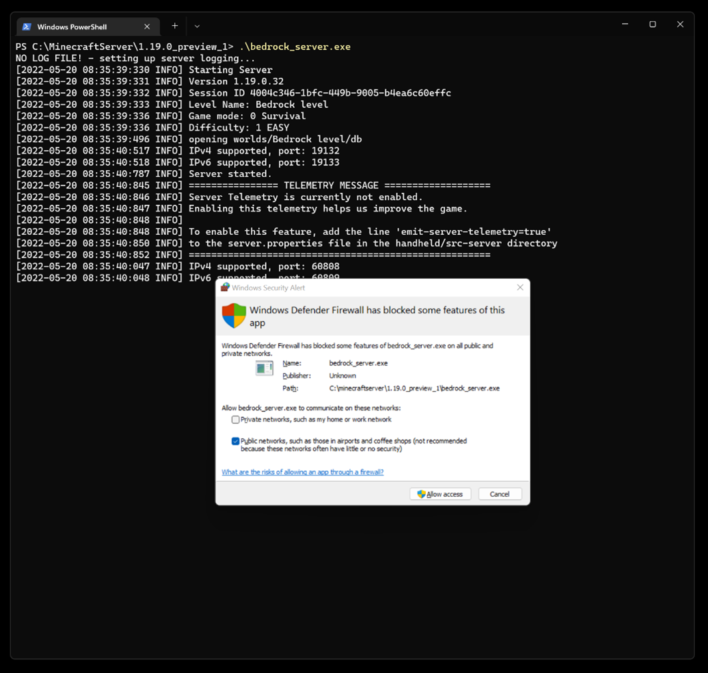

# Using script to add new capabilities to dedicated servers

With version 1.19.0, Bedrock Dedicated Server gains new capabilities in conjunction with experimental GameTest Framework JavaScript. It is now much easier to build deeply customized Bedrock Dedicated Server gameplay experiences by connecting your server to external services and sites. For example, you could use this functionality to connect a dedicated server to back-end infrastructure that powers a website-based leaderboard. Or you can build an advanced administrative console to give server administrators to more flexibility when managing players in a game.

In this article, we'll cover the foundation of everything you need to know about building extended experiences with script + dedicated server.

But first! A few warnings and notices on this topic before we get started:

* ***Important:*** These APIs are experimental as part of GameTest Framework. As with all experiments, you may see changes or even removals of functionality in updated Minecraft versions. Check the [the Minecraft changelog](https://aka.ms/mcchanges) for details on any changes to GameTest Framework APIs.
* We'll cover a few more advanced topics in this article, so you should  be familiar with the [basics of GameTest Framework](GameTestGettingStarted.md) and general Minecraft customization concepts.
* Make sure you back up worlds and files before you get deep into modifying and copying worlds around.
* These tips work only in conjunction with Bedrock Dedicated Server, available at [Bedrock Server Download](https://www.minecraft.net/download/server/bedrock), that you can host on your own. This article does not apply to gameplay servers provided as part of Minecraft Realms.
* See more information on Bedrock Dedicated Server [via this FAQ](https://help.minecraft.net/hc/articles/4408873961869-Minecraft-Dedicated-and-Featured-Servers-FAQ-).

## Running a server

1. The first step in getting started with Dedicated Servers is to download the Dedicated Server zip from the [Bedrock Server Download](https://www.minecraft.net/download/server/bedrock) site.

1. After downloading the Bedrock Server zip file, extract it to a folder of your choosing, like `C:\MinecraftServer\`. As you work and iterate, you may have multiple copies of Bedrock Dedicated Server stored on your PC that you can choose to run, so you may want to consider a naming scheme for different iterations, like `C:\MinecraftServer\1.19.0_1`.

1. To run a Bedrock Dedicated Server, open a command prompt by opening the Start Menu and typing 'Command Prompt', or by using the Windows Terminal app from the Microsoft Store).

1. Use the `cd` command to change directories to where you unzipped the Bedrock Dedicated Server. For example, type `cd "C:\MinecraftServer\1.19.0_1"`.

1. Then, enter `bedrock_server.exe`. This will start up the Bedrock Dedicated Server and have it start listening for joining players.

After the server is started by the steps above, you can type in commands on the console like `op <playername>` to grant operator privileges to a player. When you wish to stop the server, type `stop` on the Bedrock Dedicated Server command line.

## Allow Bedrock Dedicated Server in Firewall

The first time you run a Bedrock Dedicated Server, your operating system may ask if you want to allow Bedrock Dedicated Server through the Firewall. Within Windows, the common options you select (Private or Public Networks) will depend on your networking preferences.
But to allow players from other machines to join your server, you'll need to allow access for Bedrock Dedicated Server through your Firewall by at least one route (Private Networks or Public Networks), if not both. Depending on your configuration, you may need to do additional configuration on your networking router and machine to fully enable multiplayer play with your Bedrock Dedicated Server.

Initial run of a Bedrock Dedicated Server:


## Enable Loopback in Minecraft

You'll probably want to connect to the world hosted by your machine from a Minecraft client running on that same exact machine. By default, the Minecraft and Minecraft Preview game on Windows cannot connect to local services, so you'll need to enable that first by "Enabling Loopback". To do this, stop your server if it is running and then run the following command if you wish to enable loopback for the main Minecraft app:

`CheckNetIsolation.exe LoopbackExempt -a -p=S-1-15-2-1958404141-86561845-1752920682-3514627264-368642714-62675701-733520436`

Run this command line if you wish to enable loopback for the Minecraft Preview app:

`CheckNetIsolation.exe LoopbackExempt -a -p=S-1-15-2-424268864-5579737-879501358-346833251-474568803-887069379-4040235476`

## Test Minecraft Server

1. To test your Minecraft Server, first restart the server by running `bedrock_server.exe`.
1. Then, run the Minecraft app (if you are using the Preview version of the Minecraft Dedicated Server, you should use the Minecraft Preview app).
1. Select Play.
1. For the first time, you will need to add your local machine-hosted server. Select Add Server.
  a. For Server Name, enter "My Local Computer" or any name you want to give it.
  b. For Server Address, enter 127.0.0.1. This is the standard IP address that refers to "localhost" or "the same computer that this app is running on."
  c. You can leave the port as 19132, which is the default port for a Bedrock Dedicated Server.
1. After all that, select Save.

In the Server list, select the new Server entry and then select Join, which should allow you to enter the world. Within your Bedrock Server console, you should see that a new player has joined.

## Troubleshooting server and client versioning

Did you get an "Outdated client" or "Outdated server" message when connecting Minecraft Bedrock Dedicated Server and Minecraft clients? This is because of a mismatch of versions between client and server. Minecraft clients and servers must support the same protocol version.

This protocol version is typically updated across minor and patch versions of the product – so 1.18.0 and 1.19.0 are not compatible with one another, protocol-wise. But also "patch version" differences (like 1.18.10 vs. 1.18.30) will have different protocol versions and therefore not be compatible with each other, either.

When using a Preview Dedicated Server, you'll want to make sure that the players who join your server use freshly updated versions of Minecraft Preview clients to connect to those servers.  Protocol versions can change enough from one week to the next to cause a connectivity issue, and non-Preview versions of Minecraft will probably not be able to connect to Preview Dedicated Server either due to those same protocol version mismatches. So, it's best to have players download a new Preview client from the Microsoft Store right before they play.

## Building out your server world

It is important for Server administrators to understand the content they are hosting via their server and should opt-in to using experimental capabilities. For this reason, by default, generated worlds in Bedrock Dedicated Server do not have the GameTest Framework experiment turned on, and therefore do not run script. That's OK – you'll probably want to carefully build out your custom server world anyways, and as part of that, turn on the GameTest Framework experiment in that world to enable custom scripts.

Here are the steps to creating your Minecraft world:

1. Use the Minecraft Client singleplayer to create and customize the world in the way that you like it. You can use whatever general Minecraft builder tips and techniques you'd like to build the world of your dreams.
1. Enable the GameTest Framework experiment in that world.
1. Within this world, you will also need to add your behavior packs that use script. For building, those behavior packs should not use dedicated-server only modules like "mojang-net" or "mojang-minecraft-server-admin"
1. Then, when you're ready to use that world on a dedicated server, copy it from your Minecraft client's Worlds folder:
`%localappdata%\Packages\Microsoft.MinecraftUWP_8wekyb3d8bbwe\LocalState\games\com.mojang\minecraftWorlds`
1. Each subfolder is a world. Usually the last world you played in will have the most updated "Date modified." Unfortunately, world subfolders don't have very friendly names (typically, something like "fyqEYmKXAwA=") to help you figure out which world is which.
1. Copy the contents of this world subfolder over to your Bedrock Dedicated Server. By default, Bedrock Dedicated Server will load the world it uses from `<Bedrock Dedicated Server>/worlds/Bedrock level`, but you can customize the name of the world to something other than "Bedrock level" in the `<Bedrock Dedicated Server>/server.properties` file.
1. When you run the Bedrock Dedicated Server executable, you should see it load up the world. It will also generate a log entry like the following:

`[2022-05-20 07:00:06:619 INFO] Experiment(s) active: gtst`

Where gtst stands for the GameTest Framework, indicating scripts are now available in your world.

## The Bedrock Dedicated Server configuration system

Now that you have a custom world up and running with a bit of GameTest JavaScript within it, we'll want to extend it to take advantage of the new capabilities.

By default, most server configuration is stored within the "server.properties" file in the root of your Minecraft Bedrock Dedicated Server folder. Here, you can configure default permissions for new players that enter the game, server ports, number of threads, and more. Much of the documentation is embedded in line within "server.properties." To get started, open "server.properties" with your favorite text editor, like Notepad.

For scripting, configuration files are stored in the "<Bedrock Dedicated Server>/config/" folder. In that folder is the subfolder "<Bedrock Dedicated Server>/config/default/", which controls default settings for all script modules.
Within the "default" folder is a "permissions.json" file, which controls the default set of Mojang scripting modules that are accessible to worlds, assuming they have the GameTest Framework experiment enabled.


Note that the [mojang-net](../ScriptAPI/mojang-net/mojang-net.md) module is not enabled by default for scripting maps.

## Enable differentiated module permissions

You can set different permissions for different references to scripts that are embedded as modules within behavior packs.

* Create a subfolder within the config folder next to the "default" folder and name it the same as the module identifier (UUID) of the scripting module. For example, you would create a folder named "a8d43bd0-cffd-4988-949a-5105e14bb5f2" for a scripting module with the following excerpt from its behavior pack's "manifest.json" file:

``` JSON
  "modules": [
    {
      "description": "Script resources",
      "language": "javascript",
      "type": "script",
      "uuid": "a8d43bd0-cffd-4988-949a-5105e14bb5f2",
      "version": [0, 0, 1],
      "entry": "scripts/main.js"
    }
  ],
```

* Next, to customize the set of built in modules your behavior pack's script module can access, you can place a "permissions.json" file within that folder. (Yes, the UUID folder name is a bit clunky, but we hope to improve this in a future update). We strongly recommend keeping `<Bedrock Dedicated Server>/config/default/permissions.json` basic and minimal, while extending additional module permissions on an individual basis.


## Variables and Secrets

You can also empower server administrators to further configure how script modules function. For example, maybe your script has alternate levels of difficulty by controlling mob spawn rate that you wish to let administrators configure. To do this, put a "variables.
json" file within either your `<Bedrock Dedicated Server>config/default/` folder or within a `<Bedrock Dedicated Server>config/<module UUID>/` folder.  By placing it in a JSON file, it makes it more clear to server administrators what they can configure, vs. requiring them to hand-edit your JavaScript. The variables JSON file can contain a basic JSON description. For example:

```json
{
  "mobSpawnRate": 22
}
```

Within your script, you can use the 'variables.get' method to retrieve that property using the [mojang-minecraft-server-admin](../ScriptAPI/mojang-minecraft-server-admin/mojang-minecraft-server-admin.md) module:

```javascript
const spawnRate = variables.get("mobSpawnRate");
```

There is a similar system for storing "secrets" – that is, more sensitive data that you want to ensure can be used only in very constrained ways. For example, secrets could be data like authentication tokens that you wish to pass to a web service.
`variables.json`, `secrets.json` can be placed by a server administrator within either your `<Bedrock Dedicated Server>config/default/` folder or within a `<Bedrock Dedicated Server>config/<module UUID>/` folder. What makes `secrets.json` a little different is that it is not designed to let you get at the value of the secret in JavaScript – at least not directly. Instead, it returns an opaque ServerSecrets object that can be used in certain methods, like the "mojang-net" module's HttpHeader object constructor.
See this sample in the [ServerSecrets object for an example usage](../ScriptAPI/mojang-minecraft-server-admin/ServerSecrets.md).

## Building a process for working with your server

Your next step will probably be to build an automated process to make the application of your JavaScript updates – and debugging – easier with Dedicated Server while you work. You'll likely also want to make it easier to apply your world customizations to the Dedicated Server. These build processes are typically highly customized and will reflect your preferences and what you are comfortable with, but we also have an example of this available to give you some serving suggestions.

1. Familiarize yourself with the [Build a gameplay experience with TypeScript article](ScriptingGettingStarted.md). This article shows how you can get started with a client-side development flow using TypeScript and a build process tool called `gulp`.
It's worthwhile to do the entire example using the Minecraft app to get started.

1. After you've done that successfully, you can take advantage of the special "Dedicated Server" mode of that sample. To do this, edit your gulpfile.js and change two variables at the top of the file:

```javascript
const useMinecraftDedicatedServer = true; 
const dedicatedServerPath = "C:/mc/bds/1.19.0/";
```

1. Set the dedicated server path to match the location of the dedicated server that you'd like to develop with.

1. From there, when you run 'gulp', it will automatically output the behavior pack to your Bedrock Dedicated Server folder. Even better: running 'gulp serve' will automatically start your server and place it into debug mode, and otherwise tear down and restart your server as you make file updates. This creates a very quick debug loop to make changes to script or your behavior packs, and use dedicated server as a quick testing tool. But it's also just a sample, so customize and adapt it to your preferences.

## Wrapping up

Now you have all the ingredients you need to build powerful dedicated servers that can connect to external web services to give you:

* scripting via the GameTest Framework experiment
* connections to external web services via the "mojang-net" module
* configurations for your dedicated server to enable additional permissions and server configuration variables
* build processes for making working with your dedicated server a snap

Because these features are experimental, check [the changelog](https://aka.ms/mcchanges) for upcoming changes that may impact you. We'd also love to know if you have feedback or suggestions – please log them [via our documentation issues](https://github.com/MicrosoftDocs/minecraft-creator/issues).
