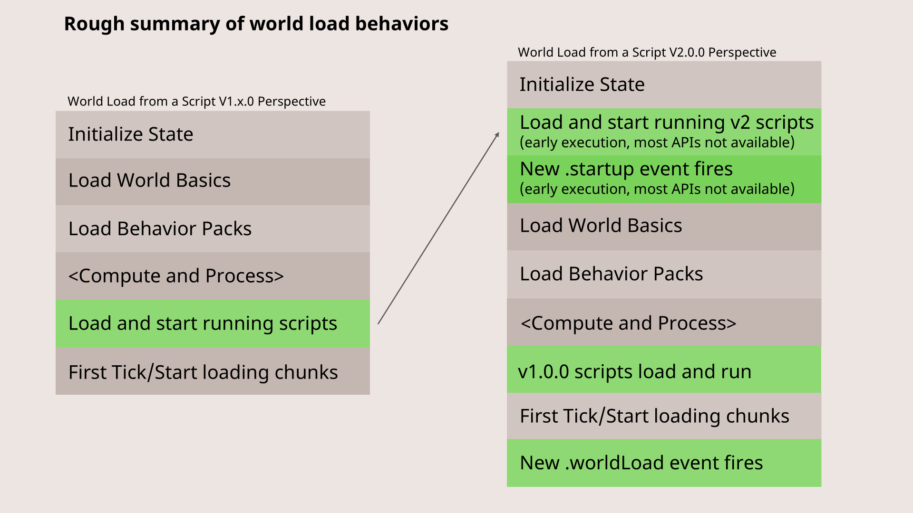

# Scripting V2.0.0 Overview

There is also a video verson available of this overview of Scripting API v2.0.0-beta:

> [!VIDEO https://www.youtube.com/embed/owfBDnOHI_o]

## What's new with Scripting API v2.0.0

Normally, when you hear about "Version 2" of your favorite pieces of software - it's cause for great excitement. A whole new.. thing! Everything is different and hopefully gets better! But the first thing to understand about Scripting API v2.0.0 is: it's not _that_ different from Scripting v1.x.0 versions of Minecraft. Don't get us wrong: we're excited about the infrastructural improvements being made in Script API v2.0.0, but we also hope you'll agree it's not _too_ different from before.

You see, script versions are [intended to follow semver rules and semantics](./ScriptVersioning.md). Any time there is a change to versions that breaks backwards compatibility, you should increment the major version. That's what Scripting API v2.0.0 represents: a set of fixes to some issues with the API structure that are improvements, but can break existing code that was written targeting v1.0.0 _if_ it is upgraded for v2.0.0. Periodically, we can expect to introduce a newer version of scripting that fixes and improves things, but that also isn't strictly backwards compatible with the current API "contract". For this reason, you should expect major version increments to Minecraft scripting API namespaces; for example, scripting API version 3.0.0 might not be too far off in the future.

All of your existing scripts and experiences that target v1.0.0 should continue to work as is as long as they are identified in your `manifest.json` as targeting 1.x.0 of Minecraft APIs. These will continue to be supported in Minecraft for many years to come. They will run in an environment that maximizes 1.0.0 semantic compatibility, and no changes should be required in any of your scripts. That said, when version 2.0.0 comes out of beta and into stable, it'll be beneficial to move any new or in-progress projects to take advantage of the more modern Scripting 2.0.0 environment, especially as newer APIs are released that target 2.0.0 only.

> [!IMPORTANT]
> Scripting V2.0.0 APIs are currently in experimental preview and require the "Beta APIs" experiment to use. They may undergo some changes before becoming stabilized and generally available.

On to the major changes with Scripting API 2.0:

### Earlier Execution and Loading of the Scripting Environment

Scripting 1.0.0 environments, today, are loaded in a world only after Minecraft has loaded a bit of other infrastructure (things like the definitions of entities, and so on.) That said, even in Scripting 1.0.0, the first execution of scripting logic happens typically before even the first chunk has loaded, so the environment is still in a bit of a half-loaded state. It's typical to sometimes wait until later in the cycle - after the first number of ticks, or when a player has joined, or when blocks become available - to do "true" initialization logic for an add-on.



With scripting v2.0.0, script initialization has moved when script is first executed to be much earlier in the startup and load of a world. Most APIs -- even simple APIs like general world gamemode get property queries, are not ready to be accessed and worked with. This change was made so that script can be used to configure parts of the initialization of the server and world before additional content has been loaded. For example, an upcoming capability - custom components v2 - is now registered from script before block JSON files are loaded, to provide better error messages when errors are found in block JSON files.

To help make the behavior more predictable, we've added more protections to the APIs to prevent being called in an unloaded state (early execution privileges).  There also have been a set of updates to events (a `worldLoad` event and a new `startup` event) so that you can run code later in the cycle when things have fully loaded.

### Promise Resolution Changes

In scripting V2.0.0, promises can now resolve alongside after events and system tasks during end-of-tick flushing of queues of deferred runs or asynchronous functions. In previous versions of scripting, promises were resolved only once at the end of the tick. This change will allow promises to resolve more frequently and more immediately after the action they are waiting on has been completed.

#### Scripting V2.0.0 Flushing Order

In scripting V1, the system will continuously flush after events and system tasks at the end of a tick until either the scripting watchdog times out or there is nothing left to flush. For scripting V2, promise resolution is now continuously flushed. Promises will be resolved during the flush by themselves, as well as after every after event type and every system task which was executed during the flush.


In general, the new flushing order of V1 and V2 scripting looks like the following:

- Resolve V1 promises once at the end of the tick
- Flush until no more work needs to be done
  - Resolve V2 promises
  - Run system tasks (V1 and V2)
    - After each task that executes, resolve v2 promises
  - Run after events (V1 and V2)
    - After each event type that executes, resolve v2 promises

#### Examples

```typescript
new Promise<void>(resolve => {
    resolve();
}).then(_ => {
    console.error('Promise resolved');
});
```

In V1, the above example would print the log on the next tick. In V2, this will flush the promise within the same tick, which means it would print the log on the current tick.

```typescript
await system.waitTicks(1);
await system.waitTicks(0); // not possible in v1
```

Also new to V2 is the ability to await 0 ticks with the `waitTicks` function. Previously, in V1, it was not possible to wait 0 ticks since promises would not resolve until the next tick. Now that promises are flushed, it is possible to await 0 ticks and execute this tick.

### Additional API-level Changes

In addition to the infrastructural changes to script load and promise resolution behavior, several APIs have also changed. The best way to see what has changed is to try your code with a `2.0.0-beta` TypeScript definition (e.g., run `npm i @minecraft/server@2.0.0-beta`), and see what might have changed in your code editor of choice.

- `Entity`:
  - `applyKnockback` method now takes a `VectorXZ` parameter for the knockback horizontal force (which includes the strength/magnitude), as well as a vertical strength parameter, in 2.0.0. To convert from V1, you should normalize your previous direction vector and multiply it by the old horizontal strength value. Vertical strength is the same as before.

- `Dimension`:
  - Removed `runCommandAsync` as most commands did not actually run asynchronously. If you are looking to run a function asynchronously, please investigate using Jobs via `System.runJob`.

- `Entity Components`:
  - `getComponents`, `getComponent` and `hasComponent` now throw if the Entity is invalid
  - `EntityComponent.getEntity` method throws if the underlying entity is invalid (instead of return undefined previously).
  - `EntityInventoryComponent.containerproperty` throws if the underlying entity is invalid (instead of return undefined previously).

- `isValid` methods on various classes have been changed to read only properties

- `EffectType`
  - getName method now always returns the minecraft: namespace prefix along with the name

- `Effect`
  - typeId property now always returns the minecraft: namespace prefix along with the name
  
- `minecraft:air` item has been removed (it is still a valid block, however)

### Custom Components V2

"Custom components V2" is a new experiment which must be enabled along with the "Beta APIs" experiment to use the new features for custom components. With the experiment enabled:

- `minecraft:custom_components` is deprecated in favor of flattened custom components
- Custom components now support parameters

#### Flattening

In the previous version of custom components, components had to be listed inside the `minecraft:custom_components` component. This is no longer required and the `minecraft:custom_components` component is deprecated. Instead, you can write your custom components similar to any other Minecraft component. For example:

```json
{
    "components": {
        "minecraft:loot": "...",
        "minecraft:collision_box": {
            "enabled": true
        },
        "my_custom_component:name": {},
        "my_custom_component:another_component": {}
    }
}
```

#### Parameters

Along with flattening a custom component in JSON, you also can provide parameters to the component. The script bindings for custom components have been upgraded to support a second parameter, `CustomComponentParameters`, which grants access to the JSON parameter list for your component. The following example shows how to use custom component parameters in script:

```json
{
    "components": {
        "some_component:name": {
            "first": "hello",
            "second": 4,
            "third": [
                "test",
                "example"
            ]
        }
    }
}
```

```typescript
type SomeComponentParams = {
    first?: string;
    second?: number;
    third?: string[];
};

system.beforeEvents.startup.subscribe(init => {
    init.blockComponentRegistry.registerCustomComponent('some_component:name', {
        onStepOn: (e : BlockComponentStepOnEvent, p : CustomComponentParameters) : {
            let params = p.params as SomeComponentParams;
            ...
        }
    });
});
```

## Upgrading to Scripting V2.0.0

#### Startup Events

Usages of `world.afterEvents.worldInitialize` should change to `world.afterEvents.worldLoad` without additional changes. This event was renamed with v2.0.0 of scripting.

Usage of `world.beforeEvents.worldInitialize` should change to `system.beforeEvents.startup`. The `worldInitialize` before event was removed in favor of the new `startup` event. However, the new `startup` event is also run with early execution enabled. This means that some code previously allowed in `worldInitialize` will no longer work in `startup`. Things like getting players, accessing actors and blocks in the world, should be moved to the `world.afterEvents.worldLoad` event.

#### The `world` Object

The biggest change with early execution is that most of the `world` object will cause an error if called in early execution phase of the script environment. Subscribing to events still works as it does not access the world state, but anything interacting with world state, entities, blocks, players, will be restricted until the first tick takes place.

#### Scripting Startup Flow

For backwards compatibility, scripting V1.x.x startup timing and capabilities has not been modified. Scripting v1.x.x does not use early execution and will be run at the same time as it is today. The general flow for loading the server with scripting:

- V2 scripts are loaded and run with early execution
- V2 scripts receive the `system.beforeEvents.startup` event in early execution
- Wait for the world to finish loading and the game to start ...
- V1 scripts are loaded and run
- V1 scripts receive the `world.beforeEvents.worldInitialize` event
- First game tick takes place ...
- At the end of the tick, all scripts receive the `world.afterEvents.worldLoad` event (named `worldInitialize` for V1)

#### What APIs are available in early execution?

The following are the initial APIs available in early execution mode for scripting v2.0.0-beta:

- `world.beforeEvents.*.subscribe`
- `world.beforeEvents.*.unsubscribe`
- `world.afterEvents.*.subscribe`
- `world.afterEvents.*.unsubscribe`
- `system.afterEvents.*.subscribe`
- `system.afterEvents.*.unsubscribe`
- `system.beforeEvents.*.subscribe`
- `system.beforeEvents.*.unsubscribe`
- `system.clearJob`
- `system.clearRun`
- `system.run`
- `system.runInterval`
- `system.runJob`
- `system.runTimeout`
- `system.waitTicks`
- `BlockComponentRegistry.registerCustomComponent`
- `ItemComponentRegistry.registerCustomComponent`

#### What do I do with code that is in the root context of my scripts that are not early executable?

If you have code using an API that is being run in the root context of a script file, it will need to be deferred to run either during or after the `world.afterEvents.worldLoad` event. There are a number of ways to organize your code to do so. Usage of classes or functions can assist with organizing startup of various systems that can be called within the event callback. Lazy getters can be made to call the API and cache the result only after the lazy getter is called. In many cases, you can simply wrap your "root context" scripts in a `world.afterEvents.worldLoad` call.

## Summary

That's it! Stay tuned for more updates to the 2.0.0-beta APIs; in a few more places, over the coming weeks, we will change the signature of some methods and properties. As always, we appreciate your feedback and bugs while 2.0.0 is in beta. You can open those bugs at [bugs.mojang.com](https://bugs.mojang.com/projects/MCPE/summary).
