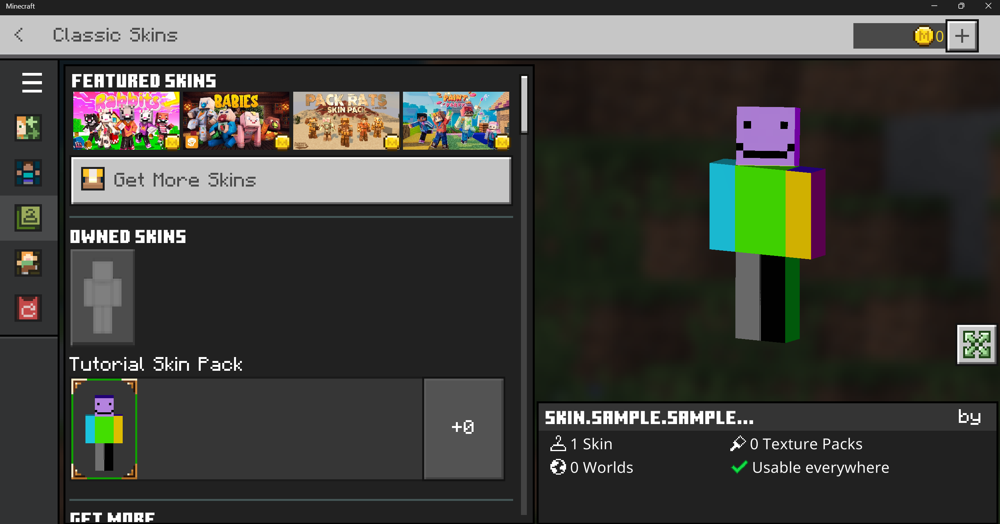
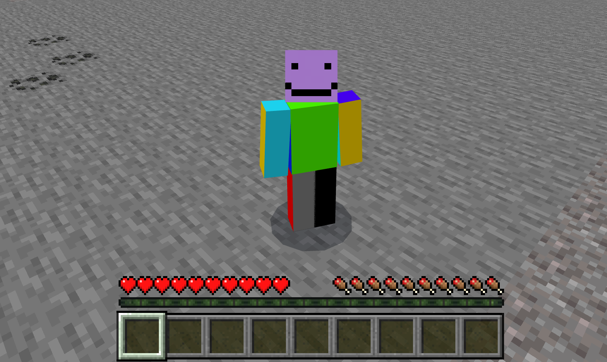
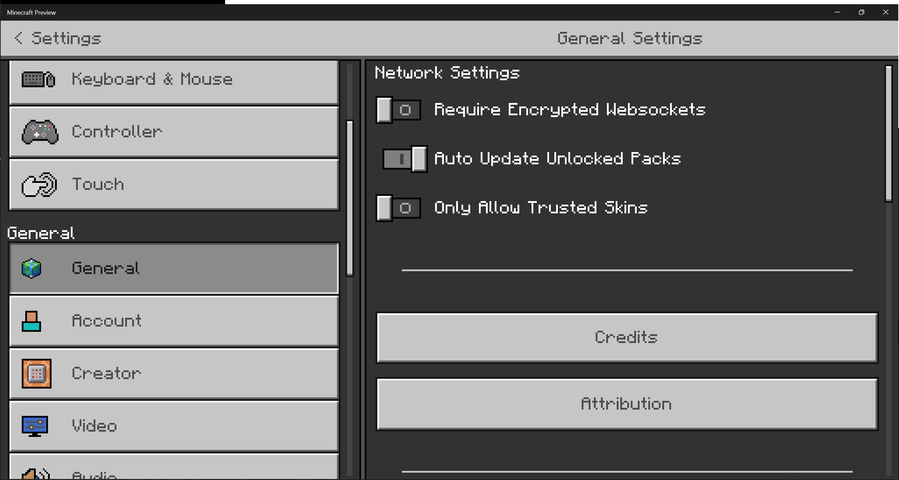

# Introduction to Skin Packs

It takes only a few files to create a custom player skin in Minecraft.

These are the usual ones found in most add-on packs:

- en_US.lang - This file is lives in the **texts** folder and the name might be different, depending on your language preferences
- manifest.json

And these are the files specific to a skin pack:

- <skin_graphic>.png - The image that will be mapped into the player. There are some of tools out there to help with this, but for now, we are just going to use a basic graphic-editing program like Paint.net.
- skins.json - JSON file containing the metadata about the skins in your skin pack

If you put all these files together and make sure everything is complete and correct, then you will have created your own custom skin.

As always, there are lots and lots ... and lots... of tools and resources out in the world about skin packs made by creators like you. This guide is intended to give you an overview of the basics so that you will have a point of reference to learn more.

In this tutorial, you will learn:

> [!div class="checklist"]
>
> - That it's possible to change your skin in Minecraft: Bedrock Edition.

> - How to customize a very simple template.

## Sample Skin Pack

There is a [sample skin pack](https://github.com/microsoft/minecraft-samples/tree/main/skin_pack_sample) available at the Microsoft samples GitHub. It may be used to understand the structure of skin packs and to check your work after the tutorial.

### Requirements

It's recommended that the following be completed before beginning this tutorial.

- [Getting Started with Add-On Development](GettingStarted.md)

## Building the Skin Pack

For Minecraft to find and use your skin pack files, you have to set up the folders and files in a particular structure. This tutorial will guide you through creating the most basic folder and file structure of a pack that can be imported and used in Minecraft.

Start by creating a folder and naming it something like **My_SKIN_Pack**. Then, add the following files:

### manifest.json

1. Create a text file and name it **manifest.json**.

2. Paste this content in there and put in the UUIDs.

```json
{
  "format_version": 2,
  "header": {
      "name": "Tutorial Skin Pack",
      "uuid": "<FIRST GENERATED UUID>",
      "version": [1, 0, 0]
  },
  "modules": [
    {
      "type": "skin_pack",
      "uuid": "<SECOND GENERATED UUID>",
      "version": [1, 0, 0]
    }
  ]
}
```
3. Save and close the file.

### texts/en_US.lang

1. Create a folder and name it **texts**.

2. Create a text file in there and name it for your preferred language, such as **en_US.lang**.

3. Paste in this text:

```
skin.sample.skin_example=Sample Skin
skinpack.sample=Tutorial Skin Pack
skinpack.sample.by=YourNameHere
```

4. Save the file.

### <skin_example>.png

Download this file to use as an example.


### skins.json

Create a text file named **skins.json** and paste this text in there:

```json
{
  "skins": [
    {
      "localization_name": "Sample Skin",
      "geometry": "geometry.humanoid.custom",
      "texture": "skin_example.png",
      "type": "free"
    }
  ],
  "serialize_name": "sample",
  "localization_name": "sample"
}
```

The `serialize_name`  and `localization_name` values are used in the **.lang** file in the paths starting with `skin.` or `skinpack.`


## Deploying the Skin Pack

1. To use your new skin pack, create a **.zip** file of the contents and save it with the **.mcpack** extension.

2. Double-click the **.mcpack** to open it. Minecraft will launch and import the files automatically into the **skin_packs** folder inside your **com.mojang** directory.

You should see messages stating that the import has started and that the skin pack was imported successfully.

3. After Minecraft loads, click the **Dressing Room** button.

4. If you get messages asking you to make a choice between Character Creator or Classic Skin, choose **Classic Skin**.

5. Choose the little, green **Featured Skins** button with the clothes hanger on it, select your skin, then click **Equip**.



You have a new look!



## Troubleshooting

You can always download the [sample skinpack](https://github.com/microsoft/minecraft-samples/tree/main/skinpack) and compare the contents with your files.

If Minecraft doesn't recognize your skin, then go to the main Minecraft Settings page, find the General tab, and make sure "Only Allow Trusted Skins" is toggled off.



## What's Next?

Now that you know more about how skin packs work, maybe you should learn more about how the other add-on packs work.

> [!div class="nextstepaction"]
> [Comprehensive Add-on Pack Contents](ComprehensivePackContents.md)
