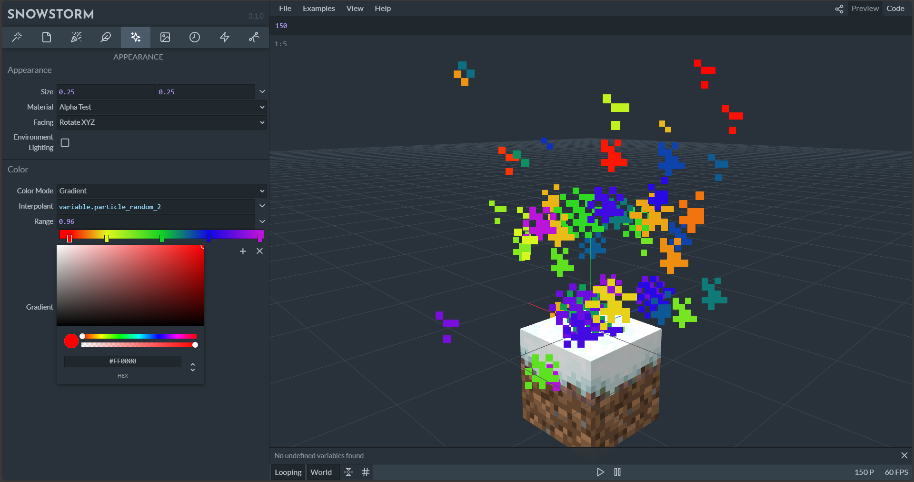

# Snowstorm - Overview

Every experience you build in Minecraft gets better when there are particles and effects to accentuate the action. Minecraft: Bedrock Edition supports a concept of _particles_ - lightweight visual items that you can design - as well as _particle emitters_ - logic for determining when particles are created. You can add these particles to your resource packs and then use them in experiences with the [particle command](./..//Commands/commands/particle.md) and as a part of your JSON definitions.

One tool for visually editing the particle files that underlie these is _Snowstorm_ - an app by [JannisX11](https://github.com/JannisX11/snowstorm), who also created [Blockbench](./MinecraftEntityWizard.md).

You can access Snowstorm as a web appliation via [https://snowstorm.app](https://snowstorm.app) or as a [Visual Studio Code plugin](https://marketplace.visualstudio.com/items?itemName=JannisX11.snowstorm). A Quick Setup tab within Snowstorm makes it easy to get started with various pre-set motions and appearances.

>[!IMPORTANT]
>Snowstorm is provided by external, third-party contributors and is not a Mojang/Microsoft offering. Users should use at their own discretion.

To see how you can use Snowstorm to build particle effects, visit this [tutorial](./ParticleEffects.md).
