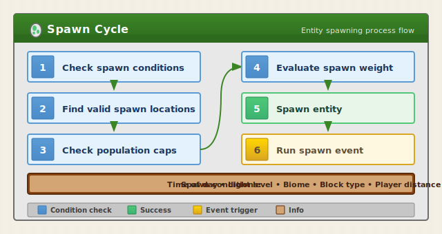
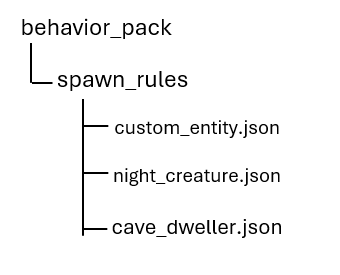

# Entity Spawning Deep Dive

Understanding how entities spawn is crucial for creating balanced and immersive add-ons. This guide covers everything from basic spawn rules to advanced techniques for controlling exactly when and where your custom entities appear.

> [!TIP]
> A complete working sample demonstrating spawn rules with different spawn conditions is available in the [Spawn Rules sample](https://github.com/microsoft/minecraft-samples/tree/main/spawn_rules_sample).

## In this tutorial

You will learn:

> [!div class="checklist"]
>
> - How Minecraft's spawning system works
> - Creating and customizing spawn rules
> - Biome and condition-based spawning
> - Spawn density and population control
> - Spawn events and initialization
> - Troubleshooting spawn issues

## Prerequisites

- Completed basic entity creation tutorials
- Understanding of behavior pack structure
- Familiarity with JSON syntax

## Entity spawning

### The spawning cycle

Minecraft continuously evaluates whether to spawn entities based on several factors:



### Spawn rule files

Spawn rules are defined in the behavior pack's `spawn_rules` folder:



## Basic spawn rule structure

### Minimal spawn rule

```json
{
  "format_version": "1.8.0",
  "minecraft:spawn_rules": {
    "description": {
      "identifier": "custom:forest_critter",
      "population_control": "animal"
    },
    "conditions": [
      {
        "minecraft:spawns_on_surface": {},
        "minecraft:brightness_filter": {
          "min": 7,
          "max": 15,
          "adjust_for_weather": true
        },
        "minecraft:weight": {
          "default": 100
        }
      }
    ]
  }
}
```

### Understanding the components

| Component | Purpose |
|-----------|---------|
| `identifier` | Must match your entity's identifier |
| `population_control` | Which population cap applies |
| `conditions` | Array of spawn condition sets |

## Population control

### Population types

Different population types have different caps:

| Type | Description | Typical Cap |
|------|-------------|-------------|
| `animal` | Passive mobs like pigs, cows | ~10 per player |
| `monster` | Hostile mobs like zombies, skeletons | ~70 in loaded chunks |
| `water_animal` | Fish, dolphins, squid | ~5 per water body |
| `water_ambient` | Small fish, ambient water life | ~20 per water body |
| `ambient` | Bats and similar | ~15 in caves |
| `pillager` | Pillagers and related | Limited by patrols |

### Custom population limits

You can use density limits for finer control:

```json
{
  "minecraft:density_limit": {
    "surface": 5,
    "underground": 2
  }
}
```

## Spawn conditions

### Location conditions

**Surface spawning:**
```json
{
  "minecraft:spawns_on_surface": {}
}
```

**Underground spawning:**
```json
{
  "minecraft:spawns_underground": {}
}
```

**Underwater spawning:**
```json
{
  "minecraft:spawns_underwater": {}
}
```

**On block types:**
```json
{
  "minecraft:spawns_on_block_filter": {
    "blocks": ["minecraft:grass_block", "minecraft:dirt", "custom:fertile_soil"]
  }
}
```

**Prevent on block types:**
```json
{
  "minecraft:spawns_on_block_prevented_filter": {
    "blocks": ["minecraft:stone", "minecraft:cobblestone"]
  }
}
```

### Environmental conditions

**Light level:**
```json
{
  "minecraft:brightness_filter": {
    "min": 0,
    "max": 7,
    "adjust_for_weather": true
  }
}
```

**Height range:**
```json
{
  "minecraft:height_filter": {
    "min": 0,
    "max": 63
  }
}
```

**Difficulty:**
```json
{
  "minecraft:difficulty_filter": {
    "min": "easy",
    "max": "hard"
  }
}
```

**Distance from player:**
```json
{
  "minecraft:distance_filter": {
    "min": 24,
    "max": 128
  }
}
```

### Biome filtering

**Spawn in specific biomes:**
```json
{
  "minecraft:biome_filter": {
    "test": "has_biome_tag",
    "operator": "==",
    "value": "forest"
  }
}
```

**Multiple biome tags (Any):**
```json
{
  "minecraft:biome_filter": {
    "any_of": [
      { "test": "has_biome_tag", "value": "forest" },
      { "test": "has_biome_tag", "value": "taiga" },
      { "test": "has_biome_tag", "value": "jungle" }
    ]
  }
}
```

**Complex biome logic:**
```json
{
  "minecraft:biome_filter": {
    "all_of": [
      { "test": "has_biome_tag", "value": "overworld" },
      { "test": "has_biome_tag", "operator": "!=", "value": "ocean" },
      {
        "any_of": [
          { "test": "has_biome_tag", "value": "cold" },
          { "test": "has_biome_tag", "value": "frozen" }
        ]
      }
    ]
  }
}
```

### Common biome tags

| Tag | Biomes |
|-----|--------|
| `overworld` | All overworld biomes |
| `nether` | All nether biomes |
| `the_end` | All end biomes |
| `ocean` | Ocean, deep ocean variants |
| `forest` | Forest, birch forest, dark forest |
| `plains` | Plains, sunflower plains |
| `desert` | Desert, desert hills |
| `taiga` | Taiga, snowy taiga |
| `jungle` | Jungle variants |
| `mountain` | Mountain biomes |
| `swamp` | Swamp, mangrove swamp |
| `cold` | Cold-temperature biomes |
| `warm` | Warm-temperature biomes |
| `frozen` | Frozen/snowy biomes |

## Spawn weights

### Understanding weight

Weight determines how likely an entity is to spawn relative to others:

```json
{
  "minecraft:weight": {
    "default": 100
  }
}
```

- Higher weight = more common
- Total weights in a biome determine relative spawn rates
- A weight of 100 in a biome with total weight 1000 = 10% chance

### Example weights (Vanilla Reference)

| Entity | Approximate Weight |
|--------|-------------------|
| Zombie | 100 |
| Skeleton | 80 |
| Creeper | 100 |
| Spider | 100 |
| Enderman | 10 |
| Witch | 5 |
| Pig | 10 |
| Cow | 8 |
| Sheep | 12 |
| Chicken | 10 |

## Time-based spawning

### Day/Night spawning

**Night only (Hostile Mobs):**
```json
{
  "minecraft:brightness_filter": {
    "min": 0,
    "max": 7,
    "adjust_for_weather": false
  }
}
```

**Day only (Passive Mobs):**
```json
{
  "minecraft:brightness_filter": {
    "min": 8,
    "max": 15,
    "adjust_for_weather": true
  }
}
```

### Using spawn events for time checks

In your entity behavior, use spawn events:

```json
{
  "format_version": "1.21.40",
  "minecraft:entity": {
    "description": {
      "identifier": "custom:dawn_creature"
    },
    "component_groups": {
      "despawn_invalid_time": {
        "minecraft:instant_despawn": {}
      }
    },
    "components": {
      "minecraft:type_family": {
        "family": ["monster", "custom"]
      }
    },
    "events": {
      "minecraft:entity_spawned": {
        "filters": {
          "test": "hourly_clock_time",
          "operator": "not_in_range",
          "value": [5000, 7000]
        },
        "add": {
          "component_groups": ["despawn_invalid_time"]
        }
      }
    }
  }
}
```

## Spawn events

### The entity_spawned event

Runs when an entity first spawns:

```json
{
  "events": {
    "minecraft:entity_spawned": {
      "sequence": [
        {
          "randomize": [
            { "weight": 70, "add": { "component_groups": ["variant_normal"] } },
            { "weight": 25, "add": { "component_groups": ["variant_rare"] } },
            { "weight": 5, "add": { "component_groups": ["variant_legendary"] } }
          ]
        }
      ]
    }
  }
}
```

### Conditional spawn variants

```json
{
  "events": {
    "minecraft:entity_spawned": {
      "sequence": [
        {
          "filters": {
            "test": "has_biome_tag",
            "value": "frozen"
          },
          "add": {
            "component_groups": ["snow_variant"]
          }
        },
        {
          "filters": {
            "test": "has_biome_tag",
            "value": "desert"
          },
          "add": {
            "component_groups": ["desert_variant"]
          }
        },
        {
          "filters": {
            "all_of": [
              { "test": "has_biome_tag", "operator": "!=", "value": "frozen" },
              { "test": "has_biome_tag", "operator": "!=", "value": "desert" }
            ]
          },
          "add": {
            "component_groups": ["normal_variant"]
          }
        }
      ]
    }
  }
}
```

## Herd and pack spawning

### Spawn groups

Make entities spawn in groups:

```json
{
  "minecraft:herd": {
    "min_size": 2,
    "max_size": 5,
    "event": "minecraft:entity_spawned",
    "event_skip_count": 0
  }
}
```

### Leader-follower pattern

```json
{
  "conditions": [
    {
      "minecraft:spawns_on_surface": {},
      "minecraft:weight": { "default": 50 },
      "minecraft:herd": {
        "min_size": 3,
        "max_size": 6,
        "event": "custom:spawn_as_follower",
        "event_skip_count": 1
      }
    }
  ]
}
```

Entity events:
```json
{
  "events": {
    "minecraft:entity_spawned": {
      "add": { "component_groups": ["pack_leader"] }
    },
    "custom:spawn_as_follower": {
      "add": { "component_groups": ["pack_follower"] }
    }
  }
}
```

## Spawn rule examples

### Example 1: Cave Monster

These spawn rules make sure the cave monster only spawns underground in darkness:

```json
{
  "format_version": "1.8.0",
  "minecraft:spawn_rules": {
    "description": {
      "identifier": "custom:cave_crawler",
      "population_control": "monster"
    },
    "conditions": [
      {
        "minecraft:spawns_underground": {},
        "minecraft:brightness_filter": {
          "min": 0,
          "max": 0,
          "adjust_for_weather": false
        },
        "minecraft:height_filter": {
          "min": -64,
          "max": 30
        },
        "minecraft:difficulty_filter": {
          "min": "normal",
          "max": "hard"
        },
        "minecraft:weight": {
          "default": 80
        },
        "minecraft:herd": {
          "min_size": 1,
          "max_size": 2
        },
        "minecraft:density_limit": {
          "underground": 4
        }
      }
    ]
  }
}
```

### Example 2: Rare biome-specific creature

These spawn rules make sure the creature rarely spawns in specific biomes:

```json
{
  "format_version": "1.8.0",
  "minecraft:spawn_rules": {
    "description": {
      "identifier": "custom:mystic_deer",
      "population_control": "animal"
    },
    "conditions": [
      {
        "minecraft:spawns_on_surface": {},
        "minecraft:spawns_on_block_filter": {
          "blocks": ["minecraft:grass_block", "minecraft:podzol"]
        },
        "minecraft:brightness_filter": {
          "min": 9,
          "max": 15,
          "adjust_for_weather": true
        },
        "minecraft:biome_filter": {
          "any_of": [
            { "test": "has_biome_tag", "value": "forest" },
            { "test": "has_biome_tag", "value": "taiga" }
          ]
        },
        "minecraft:weight": {
          "default": 5
        },
        "minecraft:herd": {
          "min_size": 1,
          "max_size": 2
        },
        "minecraft:density_limit": {
          "surface": 2
        }
      }
    ]
  }
}
```

### Example 3: Water Creature

These spawn rules make sure the creature only spawns in ocean biomes underwater:

```json
{
  "format_version": "1.8.0",
  "minecraft:spawn_rules": {
    "description": {
      "identifier": "custom:sea_serpent",
      "population_control": "water_animal"
    },
    "conditions": [
      {
        "minecraft:spawns_underwater": {},
        "minecraft:height_filter": {
          "min": 20,
          "max": 62
        },
        "minecraft:biome_filter": {
          "test": "has_biome_tag",
          "value": "ocean"
        },
        "minecraft:weight": {
          "default": 15
        },
        "minecraft:herd": {
          "min_size": 1,
          "max_size": 3
        },
        "minecraft:density_limit": {
          "surface": 2
        }
      }
    ]
  }
}
```

### Example 4: Nether-only spawn

These spawn rules make sure the creature only spawns in The Nether:

```json
{
  "format_version": "1.8.0",
  "minecraft:spawn_rules": {
    "description": {
      "identifier": "custom:lava_strider",
      "population_control": "monster"
    },
    "conditions": [
      {
        "minecraft:spawns_on_surface": {},
        "minecraft:spawns_on_block_filter": {
          "blocks": ["minecraft:netherrack", "minecraft:basalt"]
        },
        "minecraft:biome_filter": {
          "test": "has_biome_tag",
          "value": "nether"
        },
        "minecraft:weight": {
          "default": 60
        },
        "minecraft:herd": {
          "min_size": 2,
          "max_size": 4
        }
      }
    ]
  }
}
```

### Example 5: Multi-condition spawn

These spawn rules set different spawn conditions for different situations:

```json
{
  "format_version": "1.8.0",
  "minecraft:spawn_rules": {
    "description": {
      "identifier": "custom:adaptive_creature",
      "population_control": "animal"
    },
    "conditions": [
      {
        "minecraft:spawns_on_surface": {},
        "minecraft:biome_filter": {
          "test": "has_biome_tag",
          "value": "plains"
        },
        "minecraft:weight": {
          "default": 50
        },
        "minecraft:herd": {
          "min_size": 3,
          "max_size": 5
        }
      },
      {
        "minecraft:spawns_on_surface": {},
        "minecraft:biome_filter": {
          "test": "has_biome_tag",
          "value": "forest"
        },
        "minecraft:weight": {
          "default": 30
        },
        "minecraft:herd": {
          "min_size": 1,
          "max_size": 2
        }
      },
      {
        "minecraft:spawns_underground": {},
        "minecraft:weight": {
          "default": 10
        },
        "minecraft:herd": {
          "min_size": 1,
          "max_size": 1
        }
      }
    ]
  }
}
```

## Script-controlled spawning

Use the script object for complete control over entity spawning:

> [!TIP]
> Check out our [Scripting Documentation](../scripting/introduction.md) for more on how to leverage scripts in your add-ons.

```javascript
import { world, system } from "@minecraft/server";

// Custom spawn system
function spawnCustomEntity(dimension, location, entityType) {
    try {
        const entity = dimension.spawnEntity(entityType, location);
        return entity;
    } catch (error) {
        console.warn(`Failed to spawn ${entityType}: ${error.message}`);
        return null;
    }
}

// Spawn based on custom conditions
function conditionalSpawn(player) {
    const dimension = player.dimension;
    const playerLoc = player.location;
    
    // Find a valid spawn location nearby
    const spawnLoc = findValidSpawnLocation(dimension, playerLoc, 20, 40);
    
    if (spawnLoc) {
        // Check custom conditions
        const block = dimension.getBlock(spawnLoc);
        const blockBelow = dimension.getBlock({
            x: spawnLoc.x,
            y: spawnLoc.y - 1,
            z: spawnLoc.z
        });
        
        if (blockBelow?.typeId === "minecraft:grass_block") {
            spawnCustomEntity(dimension, spawnLoc, "custom:forest_creature");
        }
    }
}

function findValidSpawnLocation(dimension, center, minDist, maxDist) {
    for (let attempt = 0; attempt < 10; attempt++) {
        const angle = Math.random() * Math.PI * 2;
        const distance = minDist + Math.random() * (maxDist - minDist);
        
        const x = Math.floor(center.x + Math.cos(angle) * distance);
        const z = Math.floor(center.z + Math.sin(angle) * distance);
        
        // Find surface
        for (let y = 100; y > 0; y--) {
            const block = dimension.getBlock({ x, y, z });
            const blockAbove = dimension.getBlock({ x, y: y + 1, z });
            
            if (block && !block.isAir && blockAbove?.isAir) {
                return { x: x + 0.5, y: y + 1, z: z + 0.5 };
            }
        }
    }
    return null;
}
```

## Troubleshooting spawn issues

### Entity won't spawn

| Issue | Check | Solution |
|-------|-------|----------|
| Wrong identifier | spawn_rules identifier vs entity identifier | Must match exactly |
| Population cap | Other entities using the same cap | Reduce other spawns or change cap type |
| Biome filter | Entity spawning in target biome | Verify biome tags |
| Light level | Current light vs filter | Adjust brightness_filter |
| Block filter | Standing block type | Check spawns_on_block_filter |
| Missing spawn rules file | File exists in spawn_rules folder | Create spawn_rules JSON |
| Format version | Using correct format | Use "1.8.0" for spawn rules |

### Entity spawns too often

| Issue | Solution |
|-------|----------|
| Weight too high | Lower weight value |
| No density limit | Add minecraft:density_limit |
| Herd size too large | Reduce max_size in minecraft:herd |
| Multiple condition sets | Reduce conditions or lower weights |

### Entity spawns in the wrong place(s)

| Issue | Solution |
|-------|----------|
| Wrong biome | Fix biome_filter |
| Wrong height | Adjust height_filter |
| Wrong surface | Use correct spawns_on_surface/underground/underwater |
| Wrong blocks | Update spawns_on_block_filter |

### Debug spawning

Use the following commands to test:

- Force spawn to check rules: `/summon custom:my_entity ~ ~ ~`

- Check current biome: `/locate biome <biome_name>`

- Clear area for testing: `/kill @e[type=custom:my_entity]`

## Best practices

1. Start with low weights and increase them gradually until the entity is to your liking.

2. Use density limits whenever possible to prevent world overpopulation. When controlling for population, match the entity type to the appropriate cap.

3. Test your entities in their target biomes, not just creative flat worlds.

4. Consider performance when customizing your worlds. Too many  entities spawning in an area negatively impacts performance.

5. Document your spawn rules and note the intended spawn behavior to cross-reference when testing your customizations.

6. Test your add-ons in multiplayer if you plan to play with others&mdash;spawning behaves differently with multiple players present.

## Next Steps

> [!div class="nextstepaction"]
> [Entity Behavior Introduction](../EntityBehaviorIntroduction.md)

> [!div class="nextstepaction"]
> [Custom Behaviors and Render Controllers](../behaviorrendercontrollers.md)

## See Also

- [Introduction to Add Entity](../IntroductionToAddEntity.md)
- [Biome Overview](../Biomes/BiomeOverview.md)
- [Spawn Rules Reference](../Reference/Content/EntityReference/Examples/EntitySpawnRules.md)
