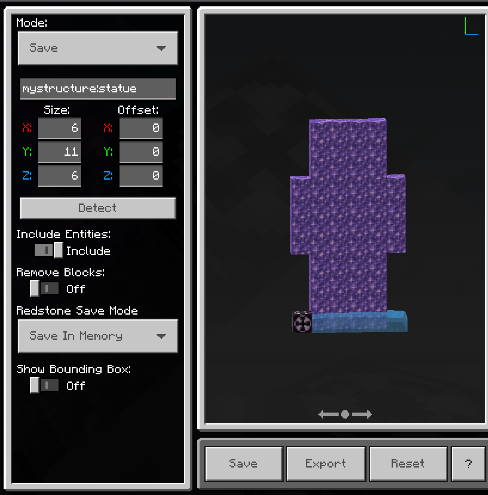
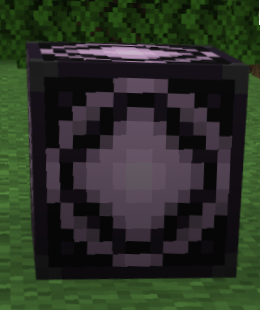
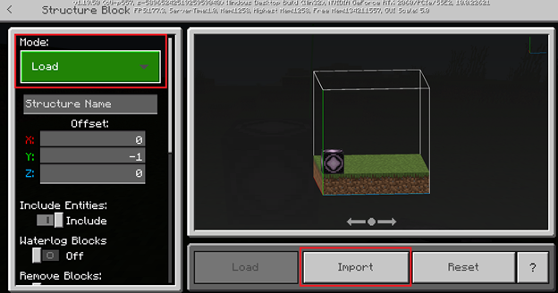
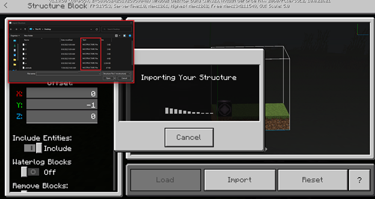
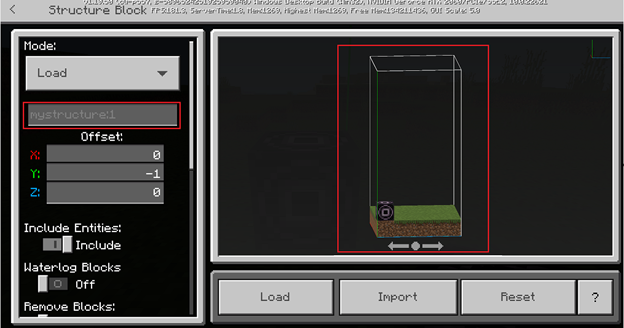
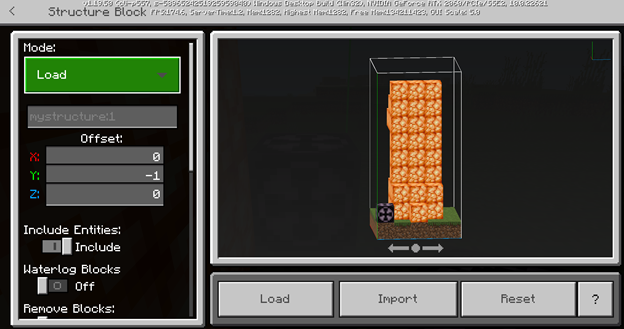
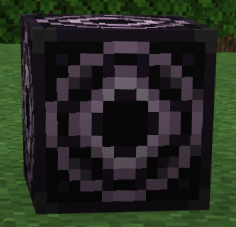
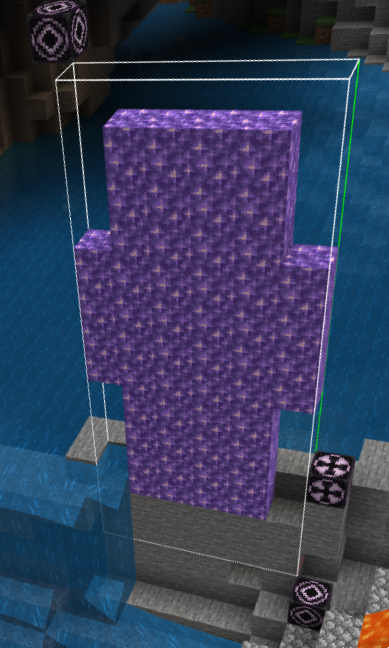
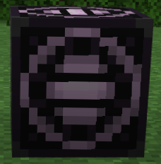

# Introduction to Structure Blocks

Structure blocks are used in Minecraft: Bedrock Edition to save and load blocks and entities that may or may not be arranged in the form of a structure. They can be useful both as building tools and for gameplay animations. Structure blocks can do more than just save and load structures, but that's where we're going to start with this document so we can learn the basics.

You can only edit a structure block in creative mode and they are unbreakable in the survival and adventure game modes.

Like command blocks, you obtain them by using the `/give` command in the chat, and right-click them to open the settings window.

>[!NOTE]
> Any block saved with a structure block will have its state saved. Command blocks will have command information, chests will have their inventory, and even structure blocks will have their structure information when the structure is loaded.

The first thing to notice is the Mode setting. The four structure block modes are:

- **Save** - Saves a structure into a structure block's memory
- **Load** - Loads a saved structure from a structure block's memory
- **Corner** Can be used to save a specific section of a structure into memory, using two blocks to define the selection around a structure
- **3D Export** Exports a .glb file that can be used to 3D print a model

The settings for Corner and 3D Export are different and we will cover those when we get to them. The buttons under the image of the structure change depending on mode, too.

## Save Mode

This is the mode you use when you like entering coordinates to fine-tune your selection.
We are going to select a house, save it, and then load it into a different area, basically making a copy of the house.

1. Start by giving yourself a structure block:

   `/give @s structure_block`

1. Place the structure block in a nice, clear area and notice how the selection bounding box is oriented.

1. Next, go place a structure block next to something interesting like a village house.

1. Open the settings page and adjust the Size and Offset settings of the selection bounding box until you have as much of the house and the surrounding area as you want.

   - Size: Adjusts the boundaries of the selection bounding box.
   - Offset: Adjusts the position of the selection box, relative to the structure block. You can enter values in the X, Y, and Z fields to pinpoint the exact location you want.

   Notice that the colors of the coordinates corresponds to the colors of the lines of the bounding box.

   The maximum size values are:
   - X: 64
   - Y: 257
   - Z: 64

   If you enter too large of a value for any of these coordinates, it will be changed to the highest possible value.
   You can click and drag the selection image to get a better view of your selection.

   The maximum offset values, from sea-level (Y=63) are -127 to 252.

   Offset values are relative to the placement of the structure block. There are not limits for the X: and Z: offset values. As long as the area is loaded, you can grab it.

1. In the Structure Name field, give the structure a short and memorable filename like "house1" and be sure to use only lowercase letters, numbers, underscores, and hyphens in the name.

   The namespace "mystructure:" will be appended to the name when you click outside of the field.

1. Make a note of your structure name.

   `mystructure:house1`

    You might even want to copy it and paste it to a text file. You will need it to be exact when we load your saved house back in.

1. For now, don't worry about the Detect button. We will use it later in Corner mode.

1. We are also going to leave these settings as they are:
   - Include Entities: Saves any entities like animals or mobs that may be present in the selection.
   - Remove Blocks: Removes all blocks and captures only the entities within the selection.
   - Redstone Save Mode: You can use redstone to activate a structure block and make it save or load a structure into your world. We're not doing that yet, so feel free to ignore this setting for now.
     - Save in Memory is faster, but you can only load the structure in this one world. This is the more common way to save.
     - Save to Disk is slower, but saves the structure to be used in different play sessions.
   - Show Bounding Box: Toggle this on and off to see your selection without the lines around it.

1. Click the Save button under the selection image. There will be a **Structure Saved!** message briefly displayed over the structure.

### Save Mode - Reset button

After you make changes to the size and offset settings, if you don't like those settings, you can click Reset to put the coordinates back to the defaults.

These are the defaults:

- Size:
  - X: 5
  - Y: 5
  - Z: 5

- Offset:
  - X: 0
  - Y: -1
  - Z: 0

## Exporting and Importing a Structure

After you make a selection, you can export it as a **.mcstructure** file to save it on your device.

Then you can load the exported structure into a different world.

In a creative mode world, place a structure block and put it in Load mode.
Then, click import.
This imports the structure into your world, and you can see that the bounding box adjusts to the shape of the imported structure. You can still adjust the load offset.
When you're happy with the placement, click Load to load the structure into your world.

## Loading a Structure with Load Mode

To load a structure, start by placing a structure block and put it in 'Load' mode.

### Importing a Saved Structure

Notice the **Import** button. This button allows you to import a .mcstructure file from anywhere on your computer into your Minecraft world.

When you click the **Import** button, a file picker opens that allows you to choose the file you would like to import into your world.

After you have chosen a file, the structure block will then fill out all of the necessary information about the structure into the structure block itself, and ready the structure to load.

For this example, **mystructure:1** was chosen, and the structure block's name and bounds were automatically updated to reflect the information in the .mcstructure file.

When a structure is successfully loaded, you will see a message in the structure block UI telling you the structure has been successfully imported.

After the structure is imported, and the structure block UI looks similar to the UI above, the structure can be loaded into the world.

This is what it will look like when the Load button is clicked:

Here are some other important notes about importing a structure:

- The import button is limited to the windows version of the game (much like the export button).
- You can import multiple different structures into a world with the Import button.
- The structure will be saved to the world once it is loaded into it by clicking the 'Load' button.
- You can only import structures to a world if you are the host of the world. If you are a guest in someone else's world, the import will fail.

## Corner Mode

This mode uses three structure blocks: two to set the size and position of the selection, and one to detect the area selected by the other two blocks.

1. Place a structure block in corner mode outside of one of the structure's sides. Remember the name you use to save it.
1. Place another structure block in corner mode on the opposite corner of the structure and give it the same name.
1. Place a third structure block and select Save Mode.
1. Enter the same name again that was used for the other two corner mode structure blocks.
1. Click Detect. The selection box should encompass the area between the corners of the corner mode blocks. All three blocks must have the same name and there must be at least 1 block between the corners for the Save block to detect the structure.

## 3D Export Mode

Export mode is used to create a .glb file that will be usable in behavior packs or a file that can be used to 3D print a Minecraft structure.

To export a 3D file, follow these steps:

1. In the Structure Name field, enter a name for the structure using only lowercase characters.
1. For Relative Position, select the origin of the structure outline. You can select portions into the ground.
1. Structure size sets the distance from the relative position to build that cube in space in Minecraft.
1. Choose to Remove blocks so that inner blocks will not be printed.

## What's Next?

Now we have seen a structure block in action, you can learn more about how they work and what else you can do with them. Use structure blocks to save and load structures, learn the `/structure` command, and even learn a simple animation using a command block in the tutorial.

> [!div class="nextstepaction"]
> [Structure Blocks Tutorial](structureblockstutorial.md)

To see examples of structures, check out the Minecraft [Structure Blocks Behavior Pack Samples](https://github.com/microsoft/minecraft-samples/blob/main/structure_blocks_sample_behavior_pack/README.md).