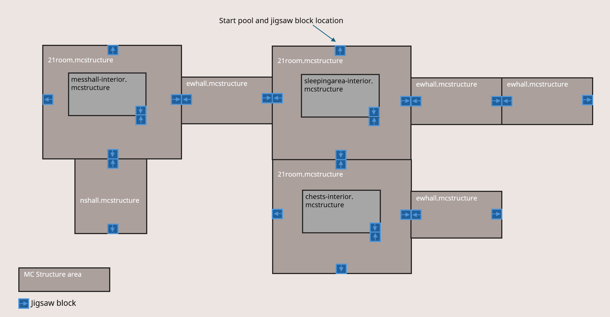

# Working with Jigsaw Structures

In this tutorial, we're going to learn about how to create smaller structures and then replicate and combine them to create larger structures that get assembled together like a jigsaw puzzle. (Hence, the name 'jigsaw'!)

## Demonstration: Working with Jigsaw Structures

> [!WARNING]
> The video tutorial is using an outdated folder structure. Jigsaw structures are now stored in the **worldgen/structures** folder instead of **worldgen/jigsaw_structures**.

> [!VIDEO https://www.youtube.com/embed/57sLxXDkaA0]

This video shows a way use jigsaw structures, and we are using it as a guide to help us learn the process.

## The Jigsaw Process

We are going to create structures, put Jigsaw blocks in the structures, save the structures with structure blocks, and then use a behavior pack to configure jigsaw blocks to generate a super-structure no one has ever seen before.

We recommend reviewing the following articles before you begin:

- [Introduction to Commands](../CommandsIntroduction.md): You should know how to use in-game commands to give yourself a structure block and a jigsaw block in creative mode. (Hint: `/give @s structure_block` and `/give @s jigsaw`)
- [Introduction to Structure Blocks](IntroductionToStructureBlocks.md): You should know how to save and export structures to an external folder.
- [Introduction to Jigsaw Structures](IntroductionToJigsawStructures.md): Skim this to get an idea about the different parts, and keep this page open in a browser tab in case you want more information about each file.

If you want to follow the video exactly, you should know how to use scripts to deploy Add-On packs, but it's not required.

- [Introduction to Scripting](../scripting/introduction.md)
- [Scripting with TypeScript](../scripting/next-steps.md)

## Jigsaw Behavior Pack

> [!NOTE]
> There are a lot of "moving parts" to this feature, so here is a link to the [Jigsaw - Basic Dungeon sample pack](https://github.com/microsoft/minecraft-samples/tree/main/jigsaws/basic_dungeon) that goes along with the video, just in case you get lost along the way. This behavior pack is different from the starter ["Angry Cow" behavior pack](../BehaviorPack.md) mentioned in step 1.

1. If you don't want to do everything from scratch, you can start with the [behavior_pack_sample](https://github.com/microsoft/minecraft-samples/tree/main/behavior_pack_sample) from the Minecraft samples on GitHub.

1. Download the "angry cow" sample behavior pack, pop it into the **development_behavior_pack** folder in your **com.mojang** folder. You won't need a resource pack.

1. (Optional) Create a survival world, find a cow, confirm that the cow is very angry indeed. Then save and close the world.

1. Make sure you know how to get back to your behavior pack files. We're going to edit them and do lots of experimentation.

### Create the Structures for Jigsaw Purposes

> [!NOTE]
> For your first structures, try building them with brightly colored or glowing blocks that will be easy to find.

1. For the easiest creation experience, make another world in Minecraft: It should be creative mode, with no mobs, no weather, no daylight cycles, cheats toggled on, and the **Data-Driven Jigsaw Structures** experiment toggled on.

1. After you create your smaller structures, put jigsaw blocks on the sides where you want them to connect with other structures.

   This is the plan that was used in the video:

   

   Notice how there are only three large structures, according to the names: 21room, nshall, and ewhall. 

   Don't worry about the internal structures of messhall-interior or sleepingarea-interior, or chests-interior, yet. That will be covered later.

3. Use structure blocks to save and export each structure with meaningful names that help you figure out how they should fit together. 

   In the video, "nshall" means "north-south hall", meaning that hallway is intended to connect to the top or bottom jigsaw blocks of the larger structures. It does not actually involve XYZ game coordinates, if you're wondering.

   Also notice that larger structures can connect to other larger structures. It all depends on what template pools you assign to the jigsaw blocks.

4. Export the structures to the **structures** folder in your behavior pack.

### Adding folders and files

1. Open the **development_behavior_pack** folder and create a folder named **worldgen**.

1. Add the four **worldgen** folders and files so that the behavior pack looks like this:

```
com.mojang
development_behavior_packs
  behavior_pack_sample
    entities
    structures
      <namespace>
        <room_structure>.mcstructure
        <hallway_structure>.mcstructure
    worldgen 
      structures
        mystructure.json
      processors
        mystructureprocessor.json
      structure_sets
        mystructureset.json
      template_pools
        mytemplatepool.json
```

Here are the contents for each file:

### structures/mystructure.json

[Reference: Worldgen Jigsaw Structures](../../Reference/Content/WorldgenReference/Examples/JigsawJigsawStructures.md)

Replace the values for `identifier:` and `start_pool:`.

```json
{
  "format_version": "1.21.20",
  "minecraft:jigsaw": {
    "description": {
      "identifier": "mike:basic_dungeon"
    },
    "step": "surface_structures",
    "terrain_adaptation": "none",
    "start_pool": "mike:ns7x4",
    "max_depth": 12,
    "start_height": 0,
    "heightmap_projection": "world_surface"
  }
}
```

### processors/mystructureprocessor.json

[Reference: Worldgen Jigsaw Processors](./../../Reference/Content/WorldgenReference/Examples/JigsawProcessors.md)

Replace the value for `identifier:` and feel free to change which blocks are used to randomly replace bits of your structure.

```json
{
  "format_version": "1.21.20",
  "minecraft:processor_list": {
    "description": {
      "identifier": "mike:stone_brick_replacement"
    },
    "processors": [
      {
        "processor_type": "minecraft:rule",
        "rules": [
          {
            "input_predicate": {
              "predicate_type": "minecraft:random_block_match",
              "block": "minecraft:stone_bricks",
              "probability": 0.2
            },
            "output_state": {
              "name": "minecraft:mossy_stone_bricks"
            }
          },
          {
            "input_predicate": {
              "predicate_type": "minecraft:random_block_match",
              "block": "minecraft:stone_bricks",
              "probability": 0.2
            },
            "output_state": {
              "name": "minecraft:cracked_stone_bricks"
            }
          },
          {
            "input_predicate": {
              "predicate_type": "minecraft:random_block_match",
              "block": "minecraft:stone_bricks",
              "probability": 0.1
            },
            "output_state": {
              "name": "minecraft:cobblestone"
            }
          }
        ]
      }
    ]
  }
}
```

### structure_sets/mystructureset.json

[Reference: Worldgen Jigsaw Structure Sets](../../Reference/Content/WorldgenReference/Examples/JigsawStructureSets.md)

Replace the `identifier:` and the `structure:` values.

To adjust the number and proximity of your generated structures, try changing the `separation` and `spacing` values.

```json
{
  "format_version": "1.21.20",
  "minecraft:structure_set": {
    "description": {
      "identifier": "mike:basic_dungeon"
    },
    "placement": {
      "type": "minecraft:random_spread",
      "salt": 39281139,
      "separation": 12,
      "spacing": 40,
      "spread_type": "linear"
    },
    "structures": [
      {
        "structure": "mike:basic_dungeon",
        "weight": 1
      }
    ]
  }
}
```

### template_pools/mytemplatepool.json

[Reference: Worldgen Jigsaw Template Pools](../../Reference/Content/WorldgenReference/Examples/JigsawTemplatePools.md)

Replace the values for identifier, location, and processors.

There is a fallback value that we are not using yet, but it's okay to leave it there for when we work with it later.

You can replace:

```json
{
  "format_version": "1.21.20",
  "minecraft:template_pool": {
    "description": {
      "identifier": "mike:ns7x4"
    },
    "elements": [
      {
        "element": {
          "element_type": "minecraft:single_pool_element",
          "location": "mike/nshall",
          "processors": "mike:stone_brick_replacement"
        },
        "weight": 4
      },
      {
        "element": {
          "element_type": "minecraft:single_pool_element",
          "location": "mike/21room",
          "processors": "mike:stone_brick_replacement"
        },
        "weight": 1
      }
    ],
    "fallback": "mike:nscap"
  }
}
```

## Test the Behavior Pack

Create a world with your jigsaw behavior pack activated and the **Data-Driven Jigsaw Structures** experiment toggled on.

The jigsaw structure should be generated into the world. Be prepared for some ... interesting placement.

If you can't find your jigsaw structures, you can use the `/locate` command.

When you start entering the command, it should auto-populate after your namespace and give you the structure names that were generated into your world. 

`\locate structure mike:basic_dungeon`

If you want a bit more control, use the `/place` command to generate a jigsaw structure at your location.

Your values will vary, depending on your identifier and name for your pool and `jigsawTarget`.

The schema is:

`/place jigsaw <pool: filepath> <jigsawTarget: string> <maxDepth: int> [pos: x y z] [keepJigsaws: Boolean] [includeEntities: Boolean]`

Here is the minimum command if you used the same names as the sample behavior pack.

`/place jigsaw mike:ns7x4 mike:nx7x4 10 ~ ~ ~`

## Fallback Pools, End Caps, and Interior Vignettes

After you experiment with your jigsaw blocks and structures to get a basic understanding of how they can be configured to pull structures from a pool and join them together, you can see that you can also put smaller structures into a pool and use a jigsaw block to put things you'd like to randomly find, like a bed, crafting table, or maybe a loot chest. You can also use this method to place end caps (also known simply as walls) over the parts of your structures that would be open to the elements, otherwise.

1. First, open your world where you build your original structures so you can build and save whatever additional walls and interior features you want placed in them. For example, in the larger room, maybe sometimes you want beds. Or sometimes you want something like a kitchen.

1. Build your end cap walls and interior features and put jigsaw blocks in them. Pay attention to where you want the jigsaw blocks to make your new structures get places in your original structures. 

1. Save each new structure to your **structures** folder.

1. End caps are included in the pool as the larger structures are built in the fallback pool. The jigsaw behavior pack example shows that the **ns7x4.json** template pool uses the **nscap.json** fallback pool, like this:

```json
{
  "format_version": "1.21.20",
  "minecraft:template_pool": {
    "description": {
      "identifier": "mike:ns7x4"
    },
    "elements": [
      {
        "element": {
          "element_type": "minecraft:single_pool_element",
          "location": "mike/nshall",
          "processors": "mike:stone_brick_replacement"
        },
        "weight": 4
      },
      {
        "element": {
          "element_type": "minecraft:single_pool_element",
          "location": "mike/21room",
          "processors": "mike:stone_brick_replacement"
        },
        "weight": 1
      }
    ],
    "fallback": "mike:nscap"
  }
}
```

The interior structures will be generated from the **5x5int.json** template pool.

```json
{
  "format_version": "1.21.20",
  "minecraft:template_pool": {
    "description": {
      "identifier": "mike:5x5int"
    },
    "elements": [
      {
        "element": {
          "element_type": "minecraft:single_pool_element",
          "location": "mike/beds5x5int",
          "processors": "mike:stone_brick_replacement"
        },
        "weight": 4
      },
      {
        "element": {
          "element_type": "minecraft:single_pool_element",
          "location": "mike/chestcarpet5x5int",
          "processors": "mike:stone_brick_replacement"
        },
        "weight": 1
      },
      {
        "element": {
          "element_type": "minecraft:single_pool_element",
          "location": "mike/kitchen5x5int",
          "processors": "mike:stone_brick_replacement"
        },
        "weight": 1
      }
    ]
  }
}
```

After you get the new bits added in, try it out! What other structures could you generate randomly?

## What's Next?

Now that you have some hands-on experience, take a look at the overview that explains the parts. 

> [!div class="nextstepaction"]
[Introduction to Jigsaw Structures](IntroductionToJigsawStructures.md)
