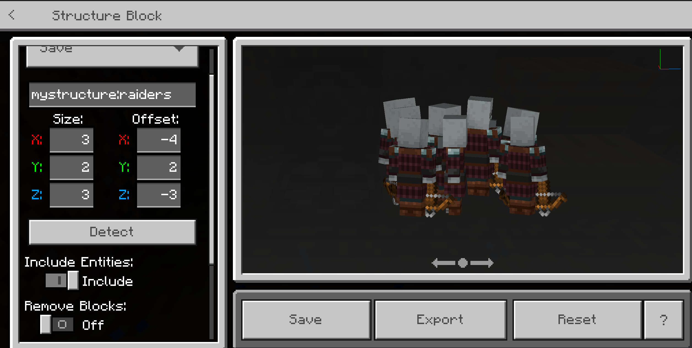

# More Fun with Structure Blocks

After you get comfortable with the basics of saving, exporting, and importing structures with structure blocks, you might find it helpful to use structure blocks to do more.

In this tutorial, you will learn how to use structure blocks to:

- Rotate a structure
- Load a group of mobs
- Take a cross-section of the world

## Rotate a Structure

Suppose you built a structure and then realized it's facing the wrong direction. That's okay. We can fix it.

1. Start by exporting the structure and saving it on your computer.

   

1. Place a structure block and set it to load your exported structure.

1. Before you click Load, set the rotation to the direction you prefer.

   

1. Import the structure.

   

   Now the structure is pointing the correct direction.

## Load a Group of Mobs - Without the Structure

You can use a structure block to select, save, and load just a group of mobs. Basically, you create a structure that *has no blocks* - it's just the mobs inside and the air blocks around them.

1. Start by selecting a structure that will contain your spawned-in mobs.

1. Spawn them in the usual way - with eggs or by summoning them with a command.

1. Select only the blocks containing the mobs. It will look like a room without walls.

   

1. Save the selection like you would any other structure.

1. Use a **load** block to bring in the mobs.

## Take a Cross-Section of the World

A cross-section or "core sample" is a good way to see what's going on underground. You can use this to check for an Ancient City, or to evaluate the density of diamonds, or to see if your [cave carver feature](../../Reference/Content/FeaturesReference/Examples/Features/minecraftCave_carver_feature.md) is functioning as expected.

1. Start by placing a Save structure block on top of the surface of the world.

1. Adjust the Size and offset to make the y settings dig deep down in the ground.

   We are starting at y-level 123, and we want to take a "core sample" from the grass blocks down to bedrock. So that means our size and offset settings should look like this:

   - Size: X = 10, Y = 210, Z = 10

   - Offset: X: 0, Y = -182, Z: 0

   

1. Now, load your saved the core sample structure and see what you find!

   

   This could come in handy for finding Ancient Cities...

## What's Next?

To see examples of structures, check out the Minecraft [Structure Blocks Behavior Pack Samples](https://github.com/microsoft/minecraft-samples/blob/main/structure_blocks_sample_behavior_pack/README.md).
