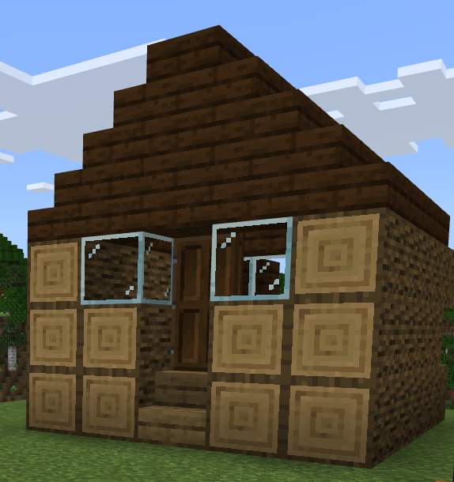
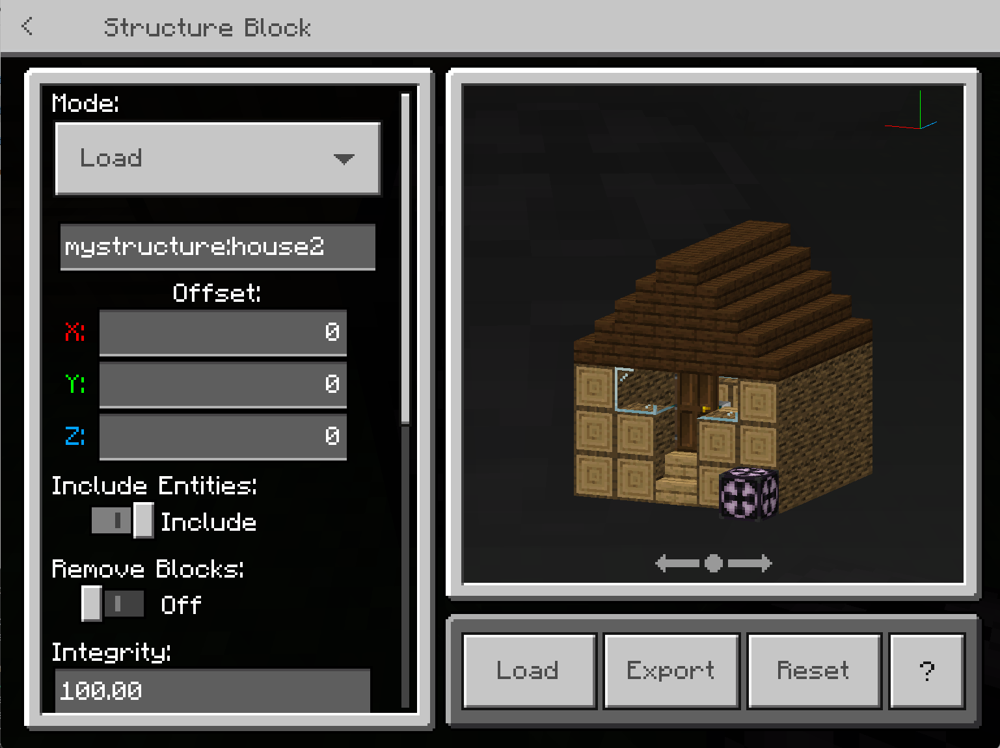
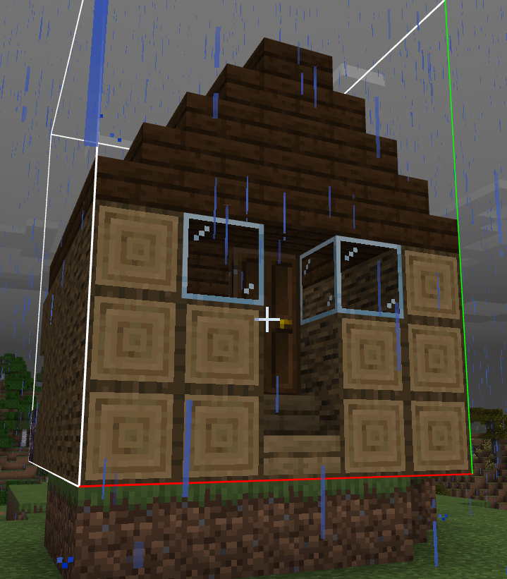
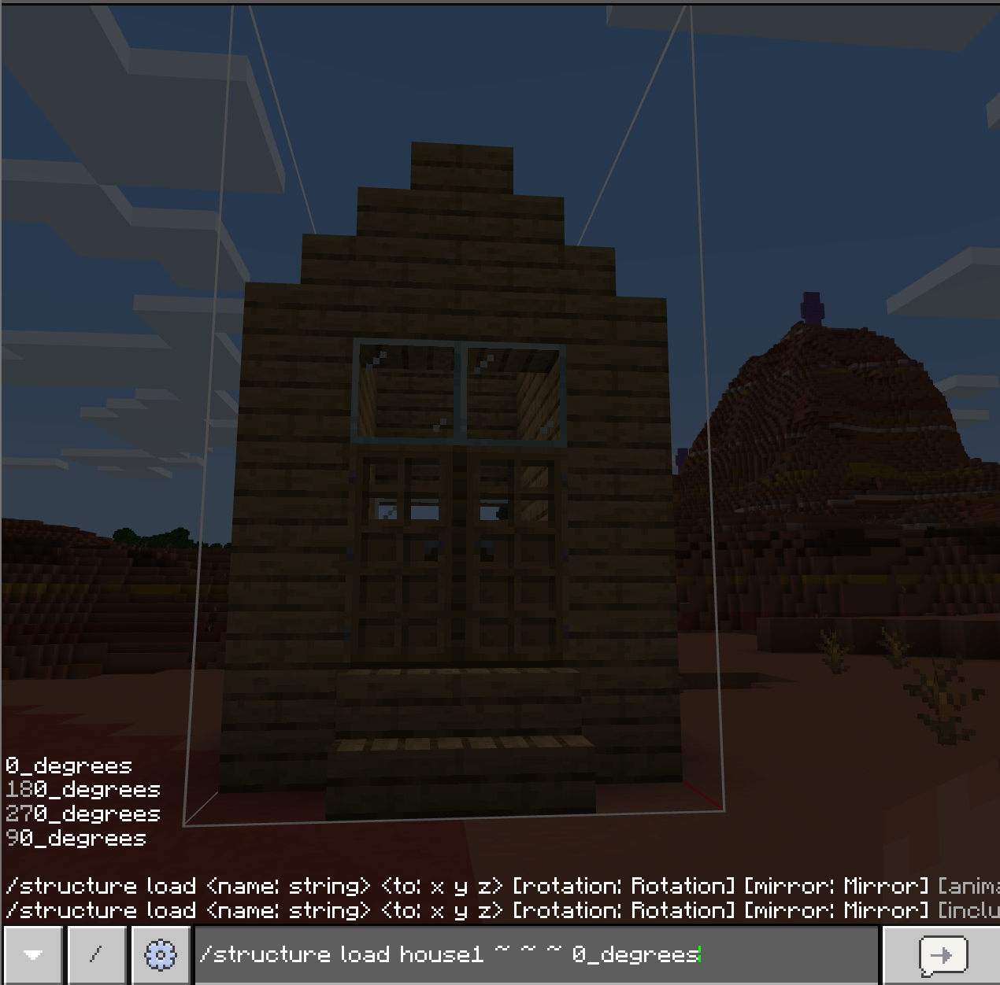
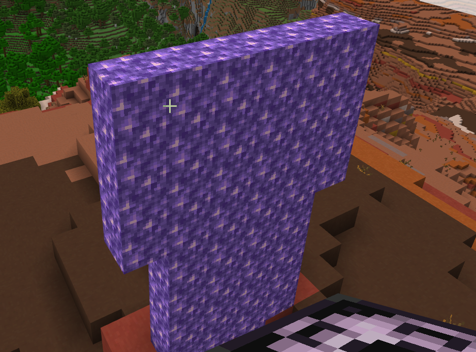

# Structure Blocks and the Structure Command Tutorial

For this tutorial, we're going to use structure blocks and the command `/structure` to create a village and load in an epic statue one block at a time so we can enjoy the animation effects.

We recommend reviewing the following articles before you begin:

- [Introduction to Commands](../CommandsIntroduction.md)
- [Introduction to Structure Blocks](../IntroductionToStructureBlocks.md)

There is a [sample Structure Blocks behavior pack](https://github.com/microsoft/minecraft-samples/tree/main/structure_blocks_sample_behavior_pack) available at the **Minecraft Samples** GitHub repo. You can download it to use the same structures used in the tutorial, or to simply get a sense of the structure of behavior packs.

In this tutorial, you will learn:

> [!div class="checklist"]
>
> - How to save a log cabin structure with a structure block.
> - How to load a log cabin structure with a structure block.
> - How to use the `/structure` command to place structures.
> - How to animate a structure into Adventure or Survival mode using a command block and the `/structure` command.

## Create a structure

A log cabin is included in the [Structure Blocks Samples Behavior Pack](https://github.com/microsoft/minecraft-samples/blob/main/structure_blocks_sample_behavior_pack/README.md) as `mystructure:house2`.

Let's use this as a base to build a village.

> [!NOTE]
> You can build another structure as long as it's smaller than 64 x 384 x 64 blocks, but it's going to be easier to use our prebuilt cabin!

To start, we'll save the log cabin. Start in creative mode.

1. Choose a name for your structure.
2. Place the structure block so that the bounding box will surround the log cabin. (Or use corner mode to detect the corners.)
3. Change the size and offset to better encapsulate the building.
4. Leave Save Entities and Redstone Save Mode as they are, since we are not using them.
5. Leave Show Bounding Box on.
6. Click Save.

Now, the structure is saved and can be placed in your Minecraft world.

## Load the structure

Let's begin building a village by adding another log cabin nearby.

1. Put a structure block on the ground.
1. Load your structure name. We're using `mystructure:house2`.
   - Adjust the offset.
   - Leave Include Entities since this building has no entities.
   - We won't be using Remove Blocks, Integrity, or Seed since we want to make a usable village.
   - We rotated the building 180 degrees.
   - No mirroring or Animation for us!
   - Don't show the bounding box, so that our house loads in without it.
1. Click Load.

We'll need another set of stairs, but otherwise it's looking good! Now you can place as many copies of this log cabin as you'd like to create a village. You can also customize the look of a village by saving different sections of this building as separate structures (like roofs, eaves, and such) and then varying how they're loaded in.

## Using the /structure command

So now we have a saved structure in a structure block. But what if we want to interact with a structure **without** using a structure block? Let's get to know the `/structure` command.

### Save a structure

This command saves a structure and takes in a name, coordinates, and optionally a save mode, a flag to include entities, and a flag to include blocks.

`/structure save <name: string> <from: x y z> <to: x y z> [saveMode: StructureSaveMode] [includesEntities: Boolean][includesBlocks: Boolean]`

### Load a structure

This command loads a structure and takes in the name, location, and optionally rotation, mirroring, animations, entities, and information on whether blocks are include, along with integrity and integrity string.

`/structure load <name: string> <to: x y z> [rotation: Rotation] [mirror: Mirror] [animationMode: StructureAnimationMode] [animationSeconds: float] [includesEntites: Boolean] [includesBlocks: Boolean] [waterlogged: Boolean] [integrity: float] [seed: string]`

### Delete a saved structure

This command deletes the saved structure:

`/structure delete <name: string>`

Let's use the `/structure` command to save and load a structure.

1. Return to your log cabin.
1. Open the console and enter the `/structure save` command with the appropriate coordinates.

- We're using the following: `/structure save house1 -371 120 877 -371 131 881 memory`

Now, let's load that same structure elsewhere, and rotate it, just to see how that works.

1. Move to a new spot that needs a house.
1. Open the console and enter the `/structure load` command with your coordinates.

- We're using `/structure load house1 ~ ~ ~ 90_degrees` to load the house at a 90 degree angle.

Great! Now we can build a village more quickly than before.

## Load a structure with a command block and /structure command

Let's say we want to load a statue in Adventure mode, using an animation. This could be at the end of an epic adventure map to reward a player's persistence.
Or maybe you want to use this as a way to give clues during gameplay.

We're going to place an **impulse command block** and use the `/structure` command to load the statue block by block. When users press a button, the statue will appear majestically.

1. Find a good place for a statue.
2. Open the chat console and type `/give @s command_block` to give yourself a command block.
3. Type `/give @s acacia_button` to give yourself an button of any type of wood, such as acacia.
4. Place the command block and acacia button on two blocks that are directly next to each other.
5. Right-click the command block.
6. Enter `/structure load statue ~ ~ ~ 0_degrees none block_by_block 10`into the command input.  This loads the structure called **statue** at the current location. It does not rotate or mirror it, but animates it in one block at a time over ten seconds. If you wanted to use this mechanic to create a timed scenario, of course you could change 10 to something else.
7. After you load the structure, change your world from Creative mode to Adventure mode. (Hint: Use `/gamemode adventure` or `/gamemode a`.)
8. Click the acacia button and watch!

## What's next?

Now that you're familiar with structure blocks and the `/structure` command, you could become the village building speedrun champion, create tons of cool animations using command blocks, or even try out recursively loading structures using structure blocks. Before you get to that, however, we suggest checking out more commands.

> [!div class="nextstepaction"]
> [Popular Commands](../CommandsPopularCommands.md)
> [Create an In-World Game](../CreateAnInWorldGame.md)

To see examples of structures, check out the Minecraft [Structure Blocks Behavior Pack Samples](https://github.com/microsoft/minecraft-samples/blob/main/structure_blocks_sample_behavior_pack/README.md).
