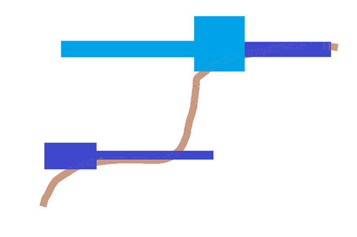

# Terrain Matching Tips & FAQ

Terrain matching means the structure can adapt to the terrain. This is in contrast with Rigid, which means the structure doesn't adapt to the terrain. See `"Projection"` in [Jigsaw Template Pools](../../Reference/Content/WorldgenReference/Examples/JigsawTemplatePools.md).

## Dealing with verticality &mdash; the bane of terrain matching

Terrain matching works in one of two ways when dealing with structures placed on a slope.

- ### Scenario 1:

  Assuming the dark blue structure was already placed and the light blue structure is terrain-matching, the light blue structure attaches to the highest point on the heightmap. Since we're building left from the cliff in this scenario, the highest point is dark blue and the terrain matching light blue structure is placed on top of it.

- ### Scenario 2:

  If the dark blue structure is terrain-matching and the light blue structure was already placed, then the dark blue structure attaches to the highest eligible point on the heightmap. Still building left from the cliff in this scenario, the highest point is light blue and the terrain matching dark blue structure is placed on top of it.

    > [!NOTE]
    > This even occurs in Vanilla (this system is at parity with Java), but with tweaking, they're able to build in a way they want by minimizing the frequency of such unexpected collisions. With how terrain-matching is in Java / Bedrock, this will happen regardless if there is collision detection. What this means for you: there inevitably will need to be tweaking to minimize such collisions.

## Our advice on terrain matching

The best way to mitigate the quirks of terrain matching is to design your structures to accomodate the feature's limitations. To keep your designs lightweight, consider:

- Limiting the amount of hard turns a structure makes to minimize the amount of times a piece loops back on itself. If there's no way to avoid the hard turns, try to dead-end them quickly to prevent interferance with each other.

- Adjusting `"max_distance_from_center"` if you increase a structure's height, since the parameter controls how far a structure can build vertically from its start point. Just keep in mind that structures won't place if they're saved with a height and start point distance that surpasses the `"max_distance_from_center"` value. So, increasing the structure's height might actually prevent some pieces that would normally place from placing.

## Structures FAQ

- ### How does terrain matching determine where to place?

  It searches from the top of the dimension, which is why terrain matching isn't that useful in the nether (where there's a ceiling).

- ### If I have a structure that’s tall on the Y axis, let’s say 64, would that have a greater chance of preventing overlaps with terrain matching?

  If the structure is saved with taller height (e.g. has more saved space above the structure), it might prevent structures from placing directly on top. However, that's not a catch all solution. When the world goes to place your structure, the tall structure height may exceed the bounds determined by your `"max_distance_from_center"`, preventing the structure from being placed.

- ### Will adjusting dimension padding help with making tweaks to terrain matching?

  Dimension padding wouldn't help here since that's mainly padding between the structure and the vertical constraints of the world.

- ### Why does my structure look odd when placed in water?

  Applying waterlogging to your jigsaw might help.
  In the Structures JSON, you can add: `"liquid_settings": "apply_waterlogging"`

- ### What does the `'weight'` parameter do?

  Use `'weight'` to determine an object's probability. A large `'weight'` value does not guarantee an increased probability. Rather, the denominator is determined by all the weights added together. A smaller number (eg. 1) will suffice.

- ### What are structure void blocks?

  Typically, air overrides blocks at the location a structure is placed. Saving your structures with structure void blocks lets existing blocks remain unchanged.

Still having trouble with terrain matching and jigsaw structures? Some creators have found it helpful to have some jigsaws dedicated to "connecting" and other jigsaws dedicated to "placing".
