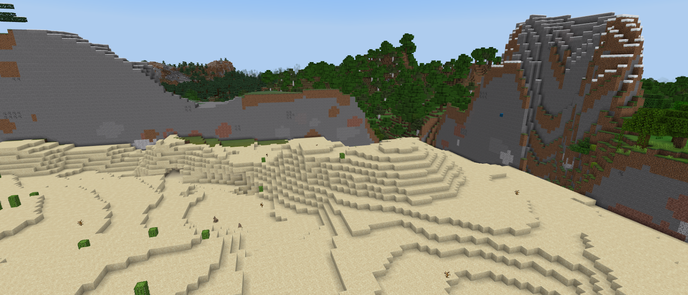

# Survival Spawn Creation

Survival spawns take on many shapes and forms, all with their own considerations. This article focuses on creating a survival spawn that represents the starting of a player's journey in survival Minecraft. Whether it exists in a naturally generated terrain or a custom-crafted one, the player should be able to experience the normal Minecraft survival loop.

## Getting Started

*Minecraft: Java Edition terrain meets Minecraft: Bedrock Edition terrain.*

Survival spawns should generally contain everything necessary for players to experience the Minecraft survival loop. That means access to ores and materials for crafting, as well as access to the End and the Nether. It should also contain substantial edits to the base seed world.

If you're depending on your build blending into natural generation, your first step should be locating an appropriate **Bedrock Edition** seed to base your world on and then generating an area to build on. As of 1.18, Bedrock and Java have seed parity so long as the seed number is 9 or fewer characters.

The most stable way to build a survival spawn is to build it directly in Bedrock Edition, however most publicly available [tools](CommonlyUsedTools.md) for building in Minecraft exist for Java Edition. Fortunately, tools such as [Chunker](https://chunker.app) that allow converting Bedrock Edition worlds into Java Edition worlds exist.

## Generating Bedrock Terrain

Trying to convert a newly created Bedrock Edition world to Java Edition would result in very few Bedrock Edition chunks converting. This is because chunks need to be generated before you can convert a Bedrock Edition world. Currently, chunks must be generated by traversing the world and loading in terrain. This can be accomplished by flying around the world, however, this can be very time-consuming depending on the desired map size. A more efficient way of doing this would be to create a system using commands that teleports the player around the map using relative coordinates to the player. Other tools such as [Code Connection](https://minecraft.fandom.com/wiki/Code_Connection) and the JavaScript API can be leveraged for the task as well.

## Converting Worlds

Converting worlds used to be a clunky and confusing process that was prone to error. With the introduction of [Chunker](https://chunker.app), that process has been made exponentially easier. Not only can you use Chunker to convert worlds, but you can also use it to prune chunks, change world settings, and much much more! [Read how to utilize the power of Chunker](ChunkerOverview.md) to help prepare your worlds!

## Things to Keep in Mind While Building

It's important to keep in mind the purpose of your survival spawn while building it. Survival spawns are generally intended to enhance the survival Minecraft experience. In those cases, survival spawns should be crafted with survival mechanics in mind. Anything that's possible to do within a newly created survival world, such as finding lava to make a Nether portal, or finding an End portal frame to be able to enter the End should also be possible.

Users playing a survival spawn should be able to find ores and caves under the terrain where it makes sense to do so, as well as Overworld resources above ground. If custom terrain is built with a certain biome in mind, creators should consider making sure the actual biome for that region is appropriate (e.g., a cold biome for a snowy forest so the snow doesn't melt). Unintentional voids or air pockets in terrain should also be removed in consideration of players' underground exploration.

Structures should also be created with survival in mind. In survival mode, players can break and place blocks anywhere they choose. Spaces such as hollow unfurnished attics or crawl spaces under the build, as well as evidence that external tools such as [WorldEdit](https://www.spigotmc.org/resources/fast-async-worldedit-voxelsniper.13932/) were used will most likely be discovered by players and should be removed to preserve the survival experience. Buildings that are facades and contain nothing are also discouraged in survival spawns because players may attempt to break through facades to see what's inside.

Survival spawns are an excellent place to start with content creation. While there are many challenging aspects to them such as terrain generation, conversions, and survival mechanics to consider, creating survival spawns is an excellent way to gain valuable experience in world-building, player experience, and general usage of various tools available.
