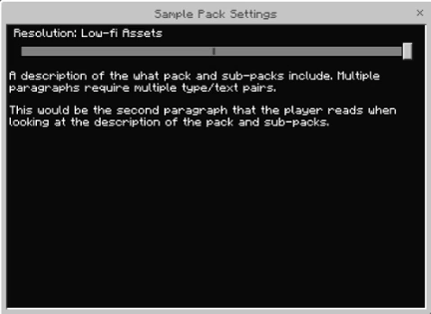

# Utilizing Sub-Packs

One of the most wonderful aspects of being a Minecraft creator (and also, one of the most frustrating) is that no two players are the same: some are younger, some are older; some are on top-of-the-line gaming PCs, some are on muted mobile devices; the list goes on. With such a vast range of factors to account for, how do you ensure that all of your players are having an amazing experience? This is where sub-packs come in!

Sub-packs allow players to choose between different options or variations of a resource pack and to switch said variation at any time, without the need to create separate packs. Creators can use sub-packs to offer multiple levels of fidelity, different content for different user types, and more. As with most features in Minecraft, the only limitation is what you can imagine.

## Creating a Sub-Pack

To create a sub-pack, open the resource pack for your world and create a new folder named `subpacks`. Next, open the `subpacks` folder and create a new folder for each sub-pack you would like to create. We are using the names "SP1," "SP2," and "SP3" for this example, but feel free to use whatever names work for your project.

:::image type="content" source="Media/UtilizingSubpacks/Hierarchy1.png" alt-text="Image of the file layout for a resource pack containing a sub-packs folder with three subfolders for each sub-pack.":::

Now that your folders have been created, you can add the content for each into its' respective folder. Any files that normally go into your resource pack can be added into your sub-pack 'SP' folders.

> [!NOTE]
> Files added to sub-packs will override the files in the main resource pack.

## Adding Sub-Packs to the Manifest

Once you have created your sub-packs, it's time to add them to the manifest.json file. This way, the game knows that the files exist and pulls them into the game.

- **"folder_name":** This is the name for the folder where the sub-pack lives.
- **"name":** This is the name that players will see when choosing the sub-pack.
- **"memory_tier":** This allows you to set a designated amount of RAM that a device must have to run a sub-pack; each tier represents .25 GB. As such, memory_tier 4 = 1 GB RAM, memory_tier 32 = 8 GB RAM, etc.
- **"type":** For our purposes, the type will always be 'label'. This will allow you to enter a description of your pack and sub-packs.
- **"text":** This is the description players will see for your sub-packs. Additional type/text combinations must be used for additional paragraphs.

Note that the 'name' and 'text' fields can not be translated.

## Example Sub-pack Manifest

```json
{
    "format_version": "1.20.30",
    "header": {
        "name": "Name of your resource pack",
        "description": "A brief summary of your pack",
        "version": [1, 0, 0],
        "base_game_version": [1, 18, 0],
        "uuid": "b955dcc1-911e-4d2c-9674-59cb1b760284"
    },
    "modules": [
        {
            "type": "resources",
            "version": [1, 0, 0],
            "uuid": "84d63d51-cd77-4bad-b51c-aac62d9cf773"
        }
    ],
    "subpacks": [
        {
            "folder_name": "SP1",
            "name": "Low-fi Assets",
            "memory_tier": 0
        },
        {
            "folder_name": "SP2",
            "name": "Standard Assets",
            "memory_tier": 16
        },
        {
            "folder_name": "SP3",
            "name": "Hi-fi Assets",
            "memory_tier": 64
        }
    ],
    "settings": [
        {
            "type": "label",
            "text": "A description of what the pack and sub-packs include. Multiple paragraphs require multiple type/text pairs."
        },
        {
            "type": "label",
            "text": "This would be the second paragraph that the player reads when looking at the description of the pack and sub-packs."
        }
      ]
    }
```



Now that our manifest is complete, here is our example sub-pack in action!

## What's Next?

Now that you know how sub-packs work, experiment with using them in different ways! Remove spiders from a spooky pack to help players with arachnophobia, let players choose the music they want to hear while they play your pack, or which biome they start in... Whatever you choose to create, sub-packs are a great tool for making sure you deliver an enjoyable experience for all users.
