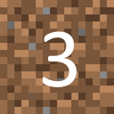

# Create a Variations Block Texture

Variations textures assign blocks a unique texture from an array of weighted textures, based on the block's position in the array. In this tutorial you'll learn how to create custom variations block textures to help achieve more natural looking terrain in your worlds. 

> [!Warning]
> This feature is available in **1.21.110** previews as an experimental feature and is subject to change.

### Prerequisites

We recommend taking a look at the following guides before beginning this tutorial:

- [Getting Started with Add-On Development](./GettingStarted.md)
- [Introduction to Resource Packs](./ResourcePack.md)
- [Create a Custom Die Block](./AddCustomDieBlock.md)


## Creating the texture

To create a custom variations texture you just need to define it in your resource pack's **terrain_texture.json** file. Textures in the `variations` array must have a weight value. If no weight value is provided, the first texture in the array is always selected regardless of the block's position.

> [!Note]
> A variations texture array can't contain more than 256 textures, and the `"weight"` must be between **0.05** and **1000000**. 

Here is an example of a dirt variations block texture:




```json
{
  "resource_pack_name": "vanilla",
  "texture_name": "atlas.terrain",
  "padding": 8,
  "num_mip_levels": 4,
  "texture_data": {
    "dirt_variations": {
      "textures": {
        "variations": [
          { "path": "textures/blocks/Dirt_0", "weight": 10 },
          { "path": "textures/blocks/Dirt_1", "weight": 10 },
          { "path": "textures/blocks/Dirt_2", "weight": 10 },
          { "path": "textures/blocks/Dirt_3", "weight": 10 },
          { "path": "textures/blocks/Dirt_4", "weight": 10 },
          { "path": "textures/blocks/Dirt_5", "weight": 10 },
          { "path": "textures/blocks/Dirt_6", "weight": 10 },
          { "path": "textures/blocks/Dirt_7", "weight": 10 },
          { "path": "textures/blocks/Dirt_8", "weight": 10 },
          { "path": "textures/blocks/Dirt_9", "weight": 10 }
        ]
      }
    }
  }
}
```
The array above has 10 dirt textures numbered 0-9 and each texture has an equal (10%) chance of being selected.


## Adding the texture to a custom block

Using the defined variation texture above create a block definition JSON file in the behavior pack with the following code:

```json
{ 
  "format_version": "1.21.110", 
  "minecraft:block": {
    "description": {
      "identifier": "demo:dirt_variations"
    },
    "components": {
      "minecraft:geometry": "minecraft:geometry.full_block",
      "minecraft:material_instances": {
        "*north*": {
          "texture": "dirt_variations",
          "render_method": "opaque"
        }
      },
      "minecraft:item_visual": {
        "geometry": "minecraft:geometry.full_block",
        "material_instances": {
          "*": {
            "texture": "dirt_variations",
            "render_method": "opaque"
          }
        }
      }
    }
  }
} 
```
This is what our custom block looks like when placed!


## Troubleshooting

A few things to keep in mind about variations textures on custom blocks:

- The blocks JSON file must have a `format_version` greater than or equal to **1.21.110**. Otherwise, variations block textures will not be supported and the first texture in the array will always be selected.

- Your world must have the **Upcoming Creator Features** experiment enabled.
  > [!Note]
  > This requirement will be removed in Minecraft: Bedrock Edition update **1.21.120**.

- Textures in the `variations` array can be animated.
  > [!Tip]
  > Check out [Create an Animated Block Texture](./CreateAnimatedBlockTexture.md) to learn how to make an animated block texture.

- The `variations` array cannot have more than 256 textures.
