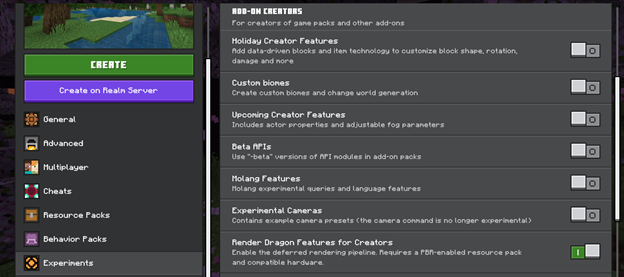
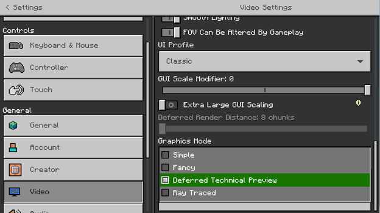

# Enabling Deferred Technical Preview in Your World

If you're running a compatible preview or beta version of Minecraft, you'll find an experimental feature toggle for **Render Dragon Features for Creators**. Enable this feature, and ensure your PBR-enabled resource pack is activated for your world.

Note that if you are hosting a Realm to share worlds in Preview, players will have to download the resource packs to join.

After you enter the world, you'll see new options in the Video settings menu.

Under Graphics Mode, the UI element will change to a checklist with an option for Deferred Technical Preview. Check this option. Your world will now be rendered with the Deferred Lighting Rendering mode!

### Hardware requirements

You must have appropriate hardware and a preview-enabled platform to execute the Deferred Lighting Pipeline. A ray tracing capable video card is not required. Most modern GPUs on Windows should support the Deferred Lighting Rendering mode, with more devices to follow.

On Android, there is a hard requirement at this time that only GLES 3.1 devices running Android OS 9 and above will be able to run the Deferred Lighting Rendering mode.
