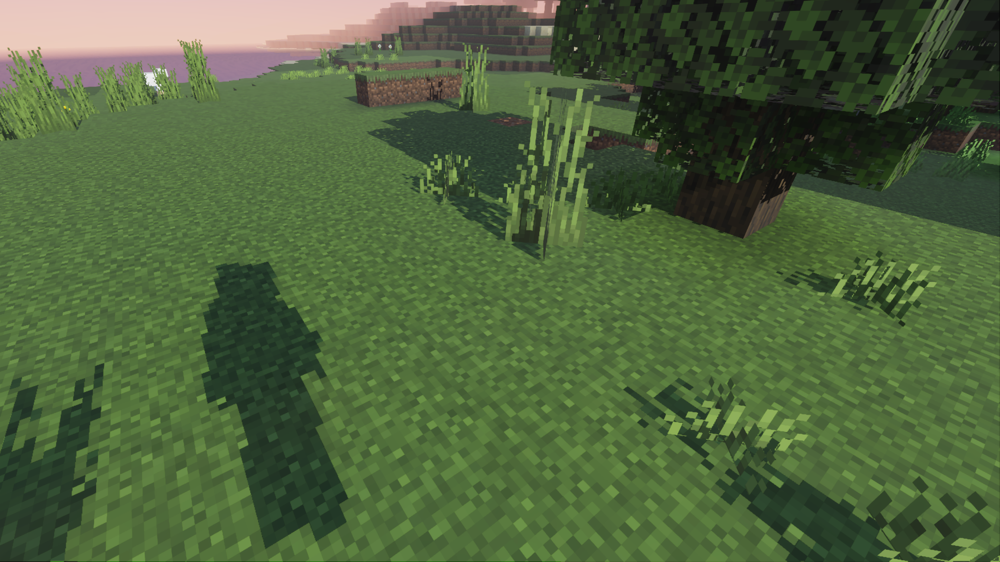
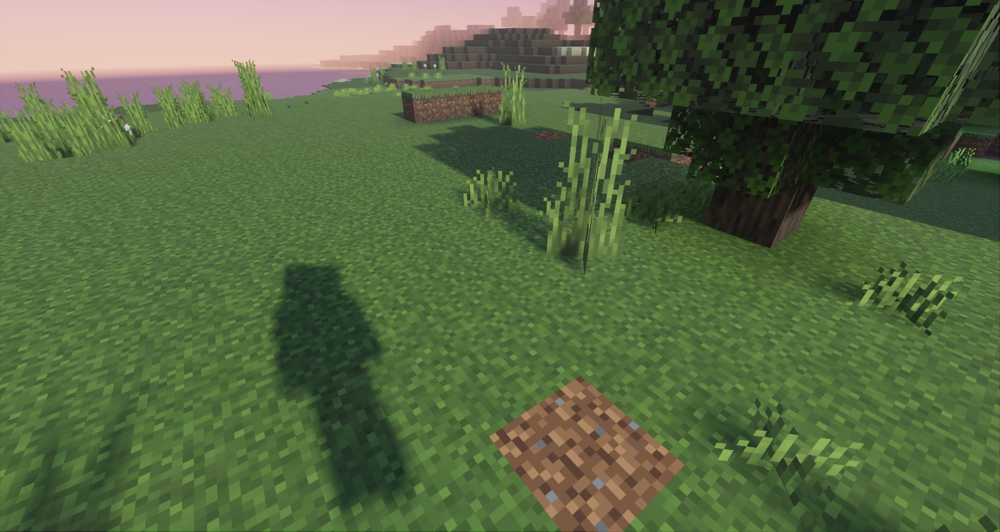

# Shadow Customization

With Vibrant Visuals, Minecraft: Bedrock Edition gives you control over shadow styles in resource packs. You can choose between either blocky or soft shadows, depending on the artistic effect you want to create.

## Styles

Shadows can be styled in one of two ways: **blocky** or **soft**. If a pack does not customize the shadow stylization, then soft shadows will be used by default. This stylization is controlled via the `"shadow_style"` field where valid options are `"blocky_shadows"` or `"soft_shadows"`.

### [Shadow Stylization - Blocky](#tab/ShadowStylizationBlocky)



### [Shadow Stylization - Soft](#tab/ShadowStylizationSoft)



---

When you use blocky shadows, it's recommended you specify a `"texel_size"` value, which represents the resolution in texels (texture units) to which shadows will be quantized. For this effect to look consistent across all blocks in the world, creators should ensure that all of their block textures are the same resolution (i.e., 16x16px or 32x32px) and specify the shadow texel size to match the same pixel dimension (i.e., 16 or 32). If textures are composed of different resolutions, then shadows will not snap consistently. If not provided, this value will default to the resolution of Minecraft's core assets, which is 16.

## Schema

Shadows are configured by the **shadows/global.json** file in a resource pack. They follow this format:

```json
{
    string "format_version", // The 3-part schema version for parsing these shadow settings.
    object "minecraft:shadow_settings"
    {
        string "shadow_style", // The type of shadows to use, either "blocky_shadows" or "soft_shadows"
        integer "texel_size" // The resolution to snap shadow texels to; recommended to use the same resolution as block texture assets in the accompanying pack
    }
}
```

For example, a pack wanting to make use of blocky shadows whose block texture assets have a common resolution of 16x16px would use the following JSON:

```json
{
    "format_version": "1.21.80",
    "minecraft:shadow_settings": {
        "shadow_style": "blocky_shadows",
        "texel_size": 16
    }
}
```
