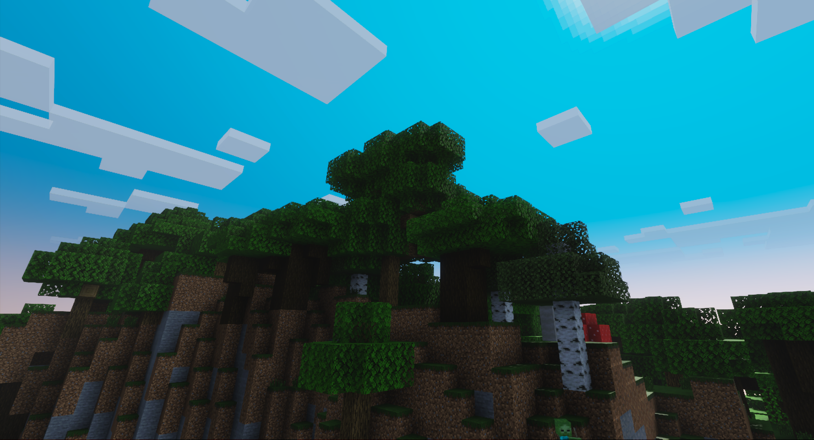
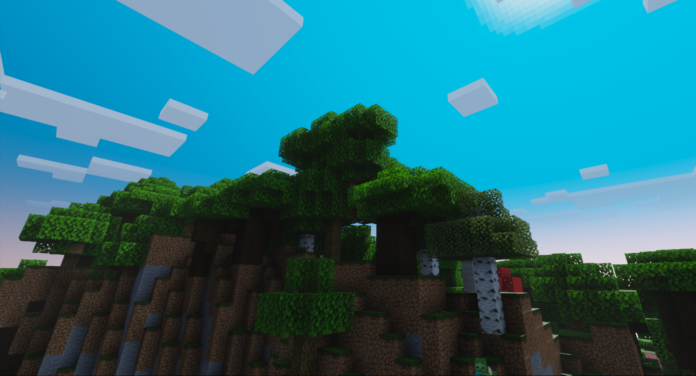

# Subsurface Scattering

Vibrant Visuals adds a new capability to Texture Sets: subsurface scattering. This simulates the effect of light shining on translucent surfaces, like leaves, wax, and skin.

This is a comparison of a forest scene with no subsurface scattering vs full subsurface scattering applied to all leaves:

## [Subsurface Scattering OFF](#tab/SubSurfaceScatteringOFF)

## [Subsurface Scattering ON](#tab/SubSurfaceScatteringON)

---

This effect can be controlled with Texture Sets, much like how metalness, emissive, and roughness are controlled.  Note that metalness and subsurface cannot be used in conjunction with each other for the same pixel in a texture or uniform value. That is, only non-metals can exhibit subsurface scattering effects.  If non-zero values are provided for both metalness and subsurface, then the larger value will win and the other will be ignored.  In the event of a tie, subsurface will take precedence.

$metalness(m,s) = \begin{Bmatrix}
0 : m \leqslant s \\
m : m \gt s
\end{Bmatrix}$

$subsurface(s,m) = \begin{Bmatrix}
0 : s \lt m \\
s : s \geqslant m
\end{Bmatrix}$

(_m_ = Metalness Texture Set; _s_ = Subsurface Texture Set)

Higher subsurface values will increase the effect, allowing more light to penetrate the surface of a given object more and more, while a value of 0 will have no subsurface effect.  The effect is calibrated to allow a maximum penetration depth of roughly 1 block.

To take advantage of subsurface scattering, your texture set must define a four-channel `"metalness_emissiveness_roughness_subsurface"` image rather than the typical three-channel MER image. For more details, read the [Texture Sets documentation](../../Reference/Content/TextureSetsReference/TextureSetsConcepts/TextureSetsIntroduction.md).
