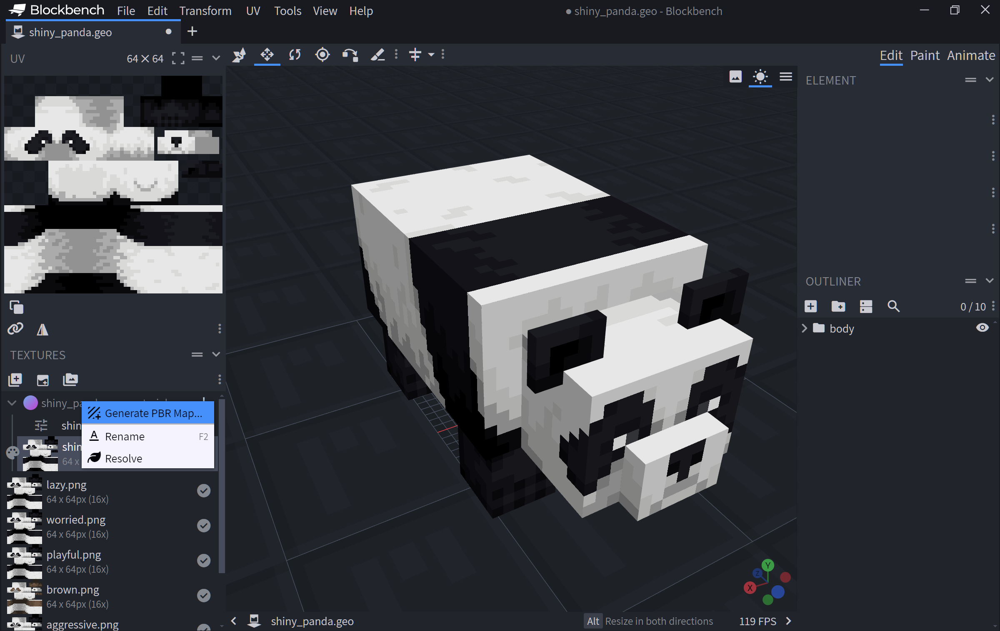

# Use Blockbench to Create Vibrant Visuals Models

You can use Blockbench to create models for Vibrant Visuals, including [MER](./PBROverview.md "Metallic, Emissive, Reflective") and other textures. Blockbench includes several tools to make working with these additional textures easy. In this tutorial, we'll use these tools to create a shiny panda.

## Create our starter mob using the Minecraft Entity Wizard

To get started, download [Blockbench](../Blockbench.md) to your computer. If you haven't already, install the [Entity Wizard](../MinecraftEntityWizard.md) plugin.

Next, we'll use the Minecraft Entity Wizard to create our starter Panda. On the first step of the wizard, give your mob a name like "Shiny Panda".


Throughout the rest of the wizard, select the defaults. For your mob, pick the panda.


At the last step of the Blockbench Wizard, give your pack a name of **ShinyPanda**, and select Export to Folder.  This will place the pack in your Minecraft Preview **development_resource_packs** and **development_behavior_packs** folders.

## Add a MER texture to your panda

To get started and add custom Metalness, Emissive, and Roughness texture to your panda, we're first going to create a material out of your texture. Click **Edit Model** in Blockbench if you're still at the export screen; otherwise, open the model from the **File** menu.


In the Blockbench Textures list, right-click on shiny_panda, and select **Create Material**. This will create a **texture_set.json** file for your texture with metadata on how MER, height, and normal map textures are specified.


Right click on **shiny_panda.texture_set.json**, and select **Generate PBR map**.



In **PBR Channel**, select **Metalness** and click **Confirm**. This results in creating your MER texture file.


Repeat the above steps to generate **Emissive** and **Roughness** maps. These won't create new files, but will add additional colored layers into your MER texture.

While we're here, enable material preview, so you can see a preview of your shiny panda as you work. In the upper right hand corner, select the **View** button and select **Material Preview**.


Now you should have all three colors as layers in your MER texture.

In an MER texture, Metalness is represented by the red channel, Emissiveness by the green channel, and Roughness by the blue channel.

Metalness (M) has the red channel, Emissive (E) has the green channel, and Roughness (R) has the blue channel. Select the Paint "mode" tab, and notice the three different color textures in the Layers palette.


We want to make the panda shiny, so we want to give it a high metalness. To do that, we'll focus on the metal layer and hide the roughness and emissive layers. Using a red-only color, we'll fill in all the darker portions of the panda texture. That should mean that those portions of the texture are high in metalness.

Make sure you now save out your textures! Press **Ctrl+S**. You'll be given the option to save out your new PNG as a separate file (**shiny_panda_mer)**.


## Enable Vibrant Visuals in the resource pack

We need to set the resource pack that Blockbench generated as being compatible with Vibrant Visuals. It should be in your development resource pack folder. If you saved your new pack to the regular version of Minecraft: Bedrock Edition, the folder path will be:

%localappdata%\Packages\Microsoft.MinecraftUWP_8wekyb3d8bbwe\LocalState\games\com.mojang\development_resource_packs\ShinyPanda

Inside the **ShinyPanda** folder, open **manifest.json** with Visual Studio code or another text editor. At the bottom of the manifest, under the `"modules"` array, add a `"capabilities"` array with the `"pbr"` capability specified:

```json
"capabilities": [
    "pbr"
]
```


Next, we need to apply a basic resource pack with fundamental basic settings of Vibrant Visuals. To do this, get the deferred lighting sample settings from [https://github.com/microsoft/minecraft-samples/tree/main/deferred_lighting_starter](https://github.com/microsoft/minecraft-samples/tree/main/deferred_lighting_starter). Follow the instructions in that README to deploy the settings to Minecraft as a resource pack. (You'll want to download the folder, run `npm i` to install dependencies, and then `npm run local-deploy` to deploy it to Minecraft.)

Finally, create your world! Select the Experiments tab and ensure the "Render Dragon Features for Creators" option is turned on.


Under resource packs, activate both your Shiny Panda pack and the Deferred Lighting Starter Settings pack you deployed.


Under resource packs, select your Shiny Panda there, too.

Now create your world, and summon a panda. Note how the reflections and shadows off the trees will now reflect off certain portions of your now-shiny panda.


It's hard to see in the image above, but you can see the reflections of the trees on our shiny panda! Amazing. The new lighting capabilities in Vibrant Visuals open up untold options for new, stunning looks for mobs and other scene elements!
