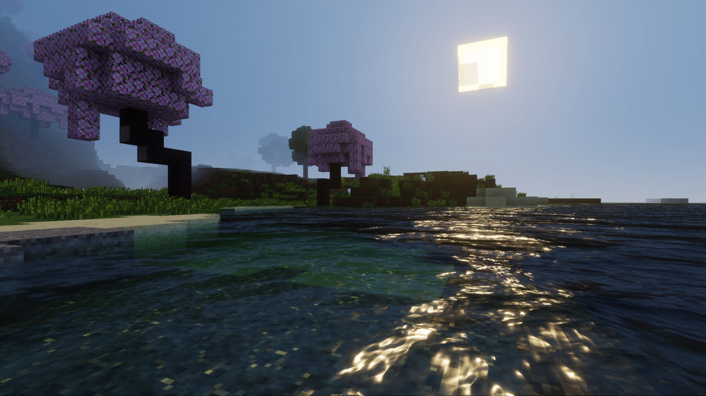

# Water Effects

Vibrant Visuals dramatically enhances the look of water in Minecraft: Bedrock Edition. You get many of the new features simply by enabling Vibrant Visuals in Minecraft's settings, but you can customize the behavior of water blocks through resource packs. Use the Editor to experiment with different water characteristics and help build your JSON schemas.



## Particle concentrations

The composition of particles in a body of water determines its color and how light behaves as it travels through the water. We've boiled them down to three concentrations in mg/L. Use these values to simulate crystal clear lakes, deep oceans, or muddy rivers:

- **CDOM (Chromophoric Dissolved Organic Matter):** High concentrations produce yellow to yellow-brown colors, due to CDOM strongly absorbing blue wavelengths. Open oceans typically have little to no CDOM, and thus retain a blue appearance; fresh water sources, like rivers, tend to have higher concentrations.

- **Chlorophyll:** High concentrations produce green colors, due to chlorophyll strongly absorbing blue and red wavelengths. Sources of chlorophyll, such as phytoplankton, exist in practically every type of body of water, though concentrations widely vary.

- **Suspended sediment:** High concentrations produce red to red-brown colors, due to suspended sediment strongly absorbing blue and green wavelengths. Suspended sediment, like clay and silt, tend to be concentrated in rivers and can indicate recent floods or sources of pollution.

## Waves

Waves are an optional effect that can be used to complement water surface animations to make your water appear more realistic. You can blend them with existing water texture animations, or replace them entirely. The waves in Vibrant Visuals are purely an image-based effect&mdash;waves don't actually move the vertices of the water surface, so the water surface geometry will remain unchanged.

There are a variety of ways to customize waves to convey different types of water:

- **Depth:** Determines how much waves displace the water surface. Larger values will result in deeper waves, whereas smaller values will produce shallower waves.

- **Direction Increment:** An angle, in degrees, that controls how much the heading changes between each octave.

- **Frequency:** Determines how many waves there are per water block. Can also be thought of as the size of the waves. Larger values will create more tightly packed waves, whereas smaller values will spread waves out over a wider area.

- **Frequency Scaling:** Specifies how much wave frequency changes between octaves. A value of 1 will result in no change between octaves. Values higher than 1 will cause frequencies to increase while values less than 1 will cause frequencies to decrease.

- **Mix:** Controls how much each octave is blended into the neighboring octave.

- **Pull:** Controls how much smaller waves are pulled into larger waves. A value of 0 results in no pull. Values larger than 0 will pull waves in a standard concave fashion, whereas values less than 0 will pull waves in a convex fashion, resulting in more pillowing waves as opposed to cresting waves.

- **Sample Width:** Controls the overall resolution of the fractal effect. A value of 1 represents the lowest resolution, resulting in smoother waves, while values less than 1 produce more chaotic waves.

- **Shape:** Adjusts the core shape of waves. A value of 1 results in a pure sine wave, whereas values larger than 1 will produce sharper waves.

- **Speed:** Determines the movement speed of the first wave and the starting value of the Speed Scaling parameter.

- **Speed Scaling:** Controls how much faster each subsequent octave moves. A value of 1 will result in no change between octaves. Values higher than 1 will cause speeds to increase while values less than 1 will cause speeds to decrease.

## Caustics

Caustics make bodies of water more realistic by projecting light rays on underwater surfaces. These rays then scatter and dance as the surface of the water moves. This effect is enabled by default, but can be selectively disabled in given water configurations.

The following parameters can be used to control the appearance of caustics:

- **Enabled:** Whether or not caustics is rendered. If `false`, all other parameters for caustics are ignored. By default, this value is `true`.

- **Frame Length:** The number of seconds to spend on a single frame of animation in the caustics sprite sheet texture. A larger value will result in a slower animation, while smaller values will result in a faster animation. The number of frames is automatically determined by the game based on the width and height of the supplied caustics texture, where # of frames = height / width.

- **Power:** Controls how bright the caustics effect appears. A larger value will increase the brightness/intensity.

- **Scale:** Controls the size of the caustics texture when it is projected on the world. This value scales inversely in that, a larger value means that the texture will appear smaller, repeating/tiling more, whereas a smaller value will cause the texture to appear bigger, covering a larger area of the world.

- **Texture:** Specifies a texture to use for the caustics animation. If this value is not supplied by a resource pack, then the game will automatically provide a built-in texture with 64 frames of animation. Any texture must adhere to the following rules:
    1. All frames of animation must be contained in the single texture.
    2. Animation frames must be laid out vertically, not horizontally.
    3. Each individual frame of animation must have the same resolution as every other frame of animation in a given caustics texture.
    4. Each individual frame of animation must square in dimensions.
    5. The game will infer the number of frames in the animation based on the width and height of the overall texture, where # of frames = height / width.
    6. Like any other resource pack texture, the caustics texture should be located under the "`textures`" directory in the root of your pack, and must be declared in "`textures_list.json`".

## Schema

Water configurations are JSON files located in **water/water.json** in a resource pack. They follow this format:

```json
{
    string "format_version", // The 3-part schema version for parsing these water settings.
    object "minecraft:water_settings"
    {
        object "description"
        {
            string "identifier" // The identifier for these water settings. The identifier must include a namespace.
        },
        object "particle_concentrations" : opt
        {
            float "cdom" <0.0 - 15.0> : opt, // Concentration of chromophoric dissolved organic matter in mg/L; higher concentrations produce more yellow/yellow-brown colors
            float "chlorophyll" <0.0 - 10.0> : opt, // Concentration of chlorophyll in mg/L; higher concentrations produce more green colors
            float "suspended_sediment" <0.0 - 300.0> : opt // Concentration of suspended sediment in mg/L; higher concentrations produce more red/red-brown colors
        },
        object "waves" : opt
        {
            bool "enabled" : opt, // Whether or not waves are on or off
            float "depth" <0.0 - 3.0> : opt, // Controls the amount of wave displacement
            float "direction_increment" <0.0 - 360.0> : opt, // Controls how much the heading changes between each octave
            float "frequency" <0.01 - 3.0> : opt, // Controls the size of individual waves; higher values create more tightly packed waves
            float "frequency_scaling" <0.0 - 2.0> : opt, // Controls how much frequencies change in subsequent octaves
            float "mix" <0.0 - 1.0> : opt, // Controls how much each octave will blend into the neighboring octave
            int "octaves" <1 - 30> : opt, // Determines how many layers of waves to simulate; high values result in more complex waves
            float "pull" <-1.0 - 1.0> : opt, // Controls how much smaller waves are pulled into larger ones
            float "sampleWidth" <0.01 - 1.0> : opt, // Controls the resolutions of the fractal effect; higher values result in smoother waves
            float "shape" <1.0 - 10.0> : opt, // Adjusts the shape of the wave
            float "speed" <0.01 - 10.0> : opt, // Controls the starting speed of the first waves
            float "speed_scaling" <0.0 - 2.0> : opt // Controls how much faster/slower subsequent octaves move
        },
        object "caustics" : opt
        {
            bool "enabled" : opt, // Whether or not caustics are on or off
            float "frame_length" <0.01 - 5.0> : opt, // How many seconds to spend on each frame of animation in the caustics texture
            int "power" <1 - 6> : opt, // Controls how bright the caustics effect appears
            float "scale" <0.1 - 5.0> : opt, // Controls how size of the repetition of the caustics texture
            string "texture" : opt // Resource location to a texture for controlling the shape of the caustics; if not used, a built-in Minecraft texture will be supplied automatically
        }
    }
}
```
Learn more about customizing and applying color grading settings in your pack across different biomes in [Per-Biome Customization](BiomeCustomization.md).

The following example JSON can be used as a starting point for an ocean:

```json
{
    "format_version": "1.21.80",
    "minecraft:water_settings": {
        "description": {
            "identifier": "my_pack:default_water"
        },
        "particle_concentrations": {
            "chlorophyll": 0.5,
            "suspended_sediment": 0.5,
            "cdom": 1
        },
        "waves": {
            "enabled": true,
            "depth": 1,
            "direction_increment": 80.0,
            "frequency": 1,
            "frequency_scaling": 1.2,
            "mix": 0.2,
            "octaves": 28,
            "pull": 0.38,
            "sampleWidth": 0.01,
            "shape": 1.5,
            "speed": 2,
            "speed_scaling": 1.03
        },
        "caustics": {
            "enabled": true,
            "frame_length": 0.05,
            "power": 2,
            "scale": 0.5
        }
    }
}
```
