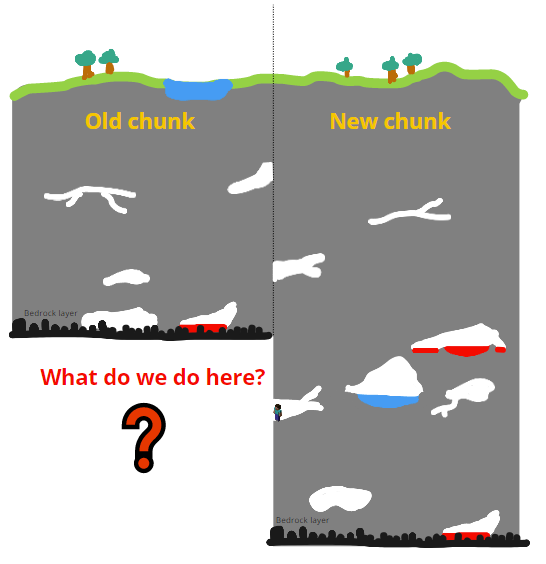
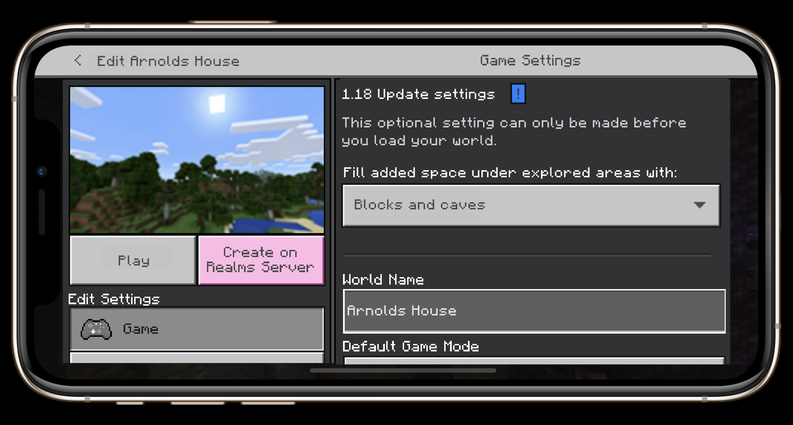
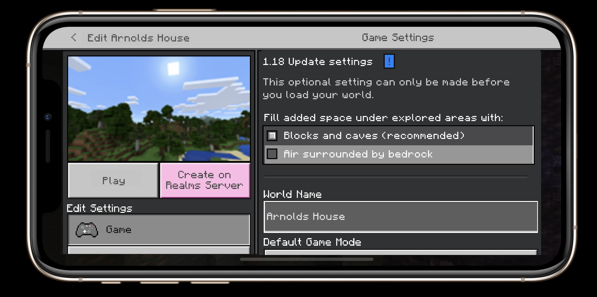
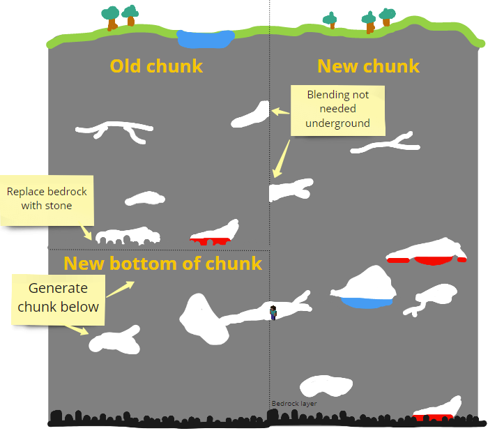
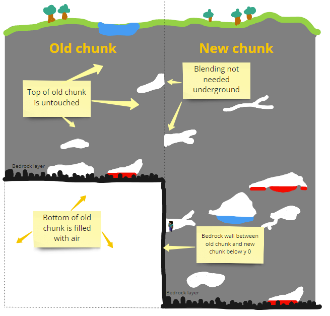

# World Height Changes

With the Caves and Cliffs: Part II update, world height will change to add more area above and below existing Minecraft worlds. Prior to the update, world height had a range of `y` values from 0 to 256. With the update, world height has a range of `y` values from -64 to 320.

All of your existing worlds will be automatically updated to reflect the new world height values. The new area above your world (rows 257 to 320) will be filled with air blocks and you can edit your world to choose how to generate blocks for the new area below your world (rows -64 to -1).

> [!IMPORTANT]
> You can force your Minecraft worlds to keep the old world height values (0 to 256) by [setting a base game version](BaseGameVersioning.md) of **less than 1.18**. All worlds with no base game version or base game versions of 1.18 or later will be automatically updated to use the new world height values.
>
> You may want to set a base game version if players will encounter issues with your world or gameplay experience with the new world height values.

## Updating Your Minecraft World

Existing Minecraft worlds that use the **Infinite** World Type will be updated differently than **Flat** worlds.

### Updating Infinite Worlds

Before you load your existing world, you will need to edit it and choose one of two options to use when updating the world height values.

Depending on which option you choose, the area below your existing world can be filled with blocks and caves based on the new world generation rules, or it can be filled with air surrounded by bedrock walls. *This will setting will only apply to previously explored and saved chunks - new chunks will be generated with caves and blocks in the new area (rows -64 to -1), regardless of the option chosen.*

> [!NOTE]
> If you do not choose an option before loading your world or setting a base game version, your world will automatically be updated with blocks and caves in the area below your existing world.

To choose how to update your existing Minecraft world to reflect the new world height values, follow these instructions:

1. On the main menu, select **Play**.
1. Select the **Edit** button next to the world you want to update.
1. In the **1.18 Update settings** [NAME NOT FINAL] section, choose one of the following options under **Fill added space under explored areas with:**
    1. Blocks and caves (recommended)
      
    1. Air surrounded by bedrock
      
1. Select **Play**.

For more information on these options, see below.

#### Blocks and caves

Choosing this option will fill the area below all explored and unexplored chunks with blocks and caves according to the new world generation rules. This option is recommended, as it will provide the most seamless transition between all chunks, whether they were explored and saved prior to the update or not.

#### Air surrounded by bedrock

Choosing this option will fill the area below all explored chunks with air and create a layer of bedrock surrounding this area between explored chunks and unexplored chunks. Unexplored chunks *will still generate blocks and caves* in the new area (rows -64 to -1) according to the new world generation rules and bedrock walls will be generated between explored and unexplored chunks from rows -64 to -1.

### Updating Flat Worlds

Similar to Infinite Worlds, Flat Worlds has two scenarios based upon if it's an existing flat world created before 1.18, or if it's a newly generated flat worlds.

> [!NOTE]
> The `Blocks and Caves` option is not available for flat worlds.

#### Upgrading Existing Flat Worlds

Launching an existing Flat World in 1.18 will adjust the world height to the new values of -64,320  However, block placements and chunks will remain in their original location, with the newly added spaces being filled with air.

#### New Flat World

When creating a new Flat world, the map will automatically be updated to reflect the new world height values by shifting the entire world down so that the bottom of the world remains the lowest point in the overworld bounds. This means that the previous bottom of the Flat world (row 0) will now be at a height of row -64 and the new area above the previous world height will be filled with air blocks.
