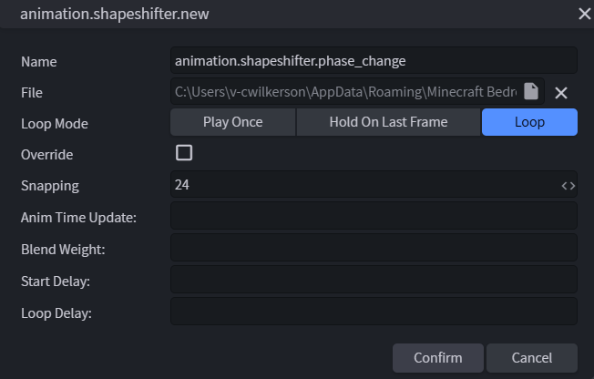
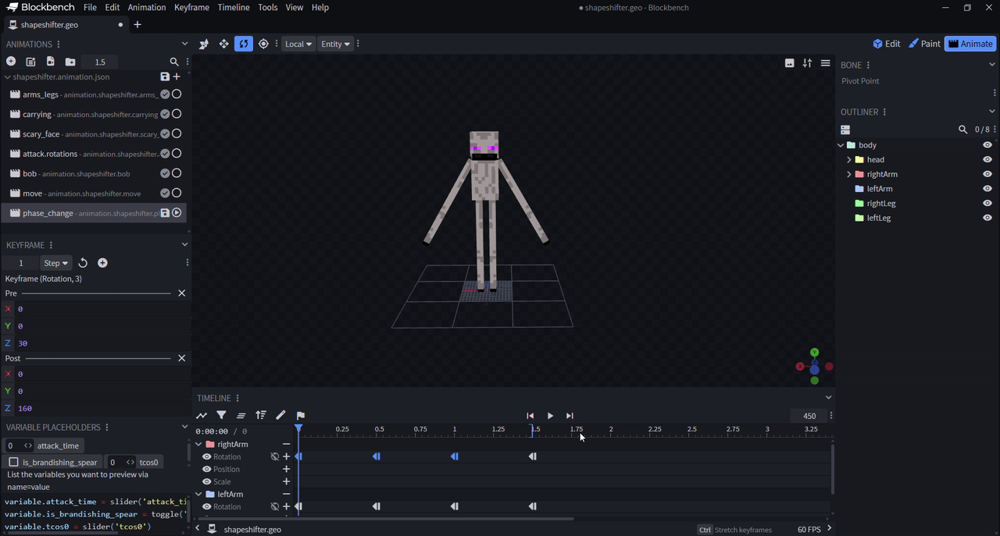

# Custom Animations and Animation Controllers

This tutorial is a continuation of [Custom Behaviors and Render Controllers](../Documents/behaviorrendercontrollers.md). We're going to add a custom sound and explore how to customize animations, leveraging the behavior and resource packs we set up in the previous guide to introduce you to animation controllers in a familiar way.

Feel free to customize the shapeshifter entity in any way you want – these steps are intended to be a framework for your own designs. Just keep in mind that any changes you make will cause deviations from our sample and you may have to debug some things until you get your adjustments working correctly. Just keep at it! Once you have a strong grasp on pack management, the sky truly is the limit for what you can do with your worlds.

## Prerequisites

We strongly recommend that you read through these guides and can confidently complete the previous tutorial before you begin this advanced tutorial.

- [Custom Behaviors and Render Controllers](../Documents/behaviorrendercontrollers.md)
- [Animation Documentation](../Documents/Animations/index.yml)
- [Animations vs. Animation Controllers](../Documents/AnimationsVsControllers.md)
- [Particle Effects](../Documents/ParticleEffects.md)

## Customizing mob sounds

First, we're going to create and add a custom sound for when the Shapeshifter changes forms.

1. Create a sound pack folder in the shapeshifter resource pack we created in the [previous tutorial](../Documents/behaviorrendercontrollers.md) to house the shapeshifter’s custom sounds.

2. Record your custom sound and save it to the new sounds folder as an .ogg file. For this tutorial, our sample will leverage a custom sound we called phase_change.ogg.
    > [!TIP]
    > Check out our article on [adding new sounds](../Documents/AddCustomSounds.md) for a refresher on how to structure your sound pack to customize sounds in Minecraft: Bedrock Edition.

3. Tether the new sound to the shapeshifter mob by adding a `sound_effects` object to the client entity file (i.e. shapeshifter.entity.json) description. This maps the short name used in the animation controller to the full sound identifier.

    ```json
    "sound_effects": {
        "phase_change": "shapeshifter.phase_change"
    }
    ```

4. Add the following in a sound_definitions.json file in the sounds folder:

    ```json
    "format_version" : "1.20.20",
    "sound_definitions" : {
        "shapeshifter.phase_change" : {
            "__use_legacy_max_distance" : true,
            "category" : "block",
            "max_distance" : null,
            "min_distance" : null,
            "sounds" : [
                "sounds/shapeshifter/phase_change"
            ]
        }
    } 
    ```

5. Finally, add a `play_sound` object to the server-side behavior file (i.e. shapeshifter.behavior.json) description, before the `randomize` component we created in the first tutorial:

    ```json
    {
    "play_sound": {
        "sound": "shapeshifter.phase_change"
        }
    }
    ```

## Customizing particle and emissive properties

Next, we're going to leverage the [witchspell particle](https://github.com/Mojang/bedrock-samples/blob/main/resource_pack/particles/witchspell.json) and its emissive properties for when our shapeshifter transforms.

1. Create a particle folder in the shapeshifter resource pack and paste the witchspell.json file into it.

2. Add a `particle_effects` object to the client entity file (i.e. shapeshifter.entity.json) description, before `animations`:

    ```json
    "particle_effects": {
        "shapeshift": "sample:witchspell_emitter"
    }, 
    ```

3. Add the `emit_particle` object to the server-side behavior file (i.e. shapeshifter.behavior.json) description, before the `play_sound` component we created in the previous section:

    ```json
    {
    "emit_particle": {
        "particle": "witchspell_emitter"
        }
    },
    ```

## Customizing bone animations

Now it's time to add a custom animation to the Shapeshifter to signal when it's changing forms.

1. Open shapeshifter.geo in Blockbench to edit the shapeshifter.

2. Click **Animate** in the top right corner of the canvas, then create a new animation and select shapeshifter.geo as the file to save to.


3. Use Blockbench to create a custom animation for the shapeshifter, then save your animation to update the shapeshifter’s file.

    > [!TIP]
    > To save your animation, go to the Blockbench file menu bar, select **Animation**, then click **Save All Animations**.

    

    We made our shapeshifter wave its arms as it begins to change phases for our sample, but feel free to let your creativity guide you!

4. Finally, add an animation_controller file to the animation_controllers folder in your shapeshifter’s resource pack.

    ```json
    "format_version": "1.10.0",
    "animation_controllers": {
        "controller.animation.shapeshifter.phase_change": {
          "initial_state": "default",
          "states": {
            "default": {
              "animations": ["phase_change"],
              "transitions": [
                {
                  "phase_changing": "q.property('minecraft:shape') != 'shapeshifter'"
                }
              ]
            },
            "phase_changing": {
              "animations": ["phase_change"],
              "sound_effects": [
                {
                  "effect": "phase_change"
                }
              ],
              "transitions": [
                {
                  "default": "q.property('minecraft:shape') == 'shapeshifter'"
                }
              ],
              "blend_transition": 0.2
            }
          }
        }
      }
    ```

    We associated our animation with the component that controls the shapeshifter's geometry, but feel free to get creative to give your shapeshifter even more unique parameters!

### See Also

- [Snowstorm Documentation](../Documents/SnowstormOverview.md)
