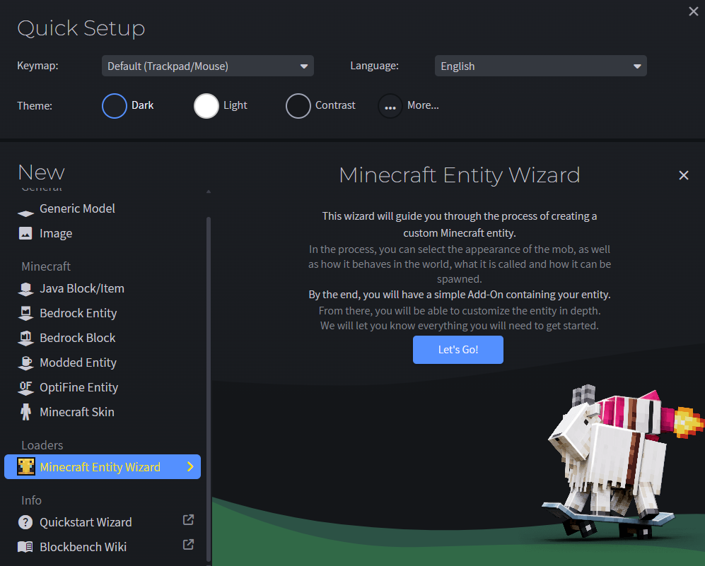
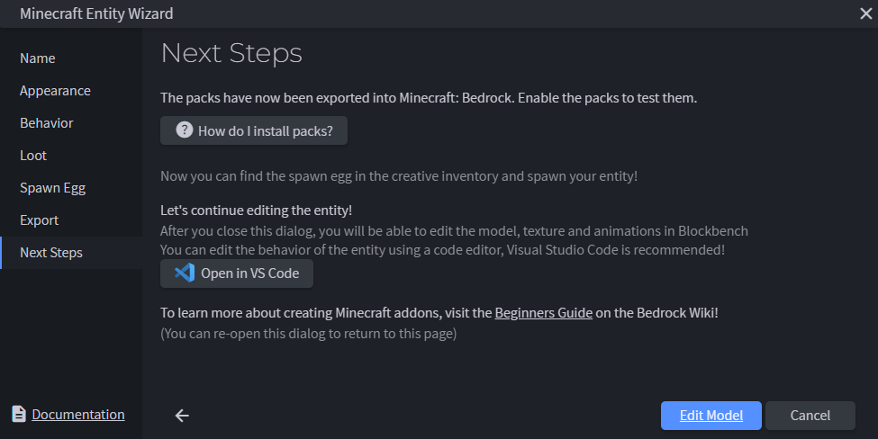

# Custom Behaviors and Render Controllers

Customizing mobs in Minecraft: Bedrock Edition is a great way to stretch your creative muscles, and leveraging the more advanced resource and behavior pack elements can help take your world building to the next level. In this tutorial, we'll build on our introductory guides to resource and behavior packs by transforming an existing Minecraft entity into one of our own design.  

We'll explore some of the more advanced applications of mob customization with an example of an entity that changes shape on certain cues you specify – the Shapeshifter! The Shapeshifter works like an enderman in most ways, because we'll be starting with the vanilla enderman entity as a base, but you'll learn how to tweak it to your liking so that it fits more neatly into your worlds.

## Prerequisites

Before you begin this advanced tutorial, we strongly recommend you read through these guides until you can confidently complete the introductory resource and behavior pack tutorials.

- [Intro to Resource Packs](../Documents/ResourcePack.md)
- [Intro to Behavior Packs](../Documents/BehaviorPack.md)
- [Create a New Entity](../Documents/IntroductionToAddEntity.md)
- [Client Entity JSON](../Reference/Content/EntityReference/Examples/ClientEntityDocumentation/ClientEntityDocumentationIntroduction.md)

## Customizing entity design

The easiest way to create a custom entity is to start with one of the vanilla ones on [this public GitHub repository](https://github.com/microsoft/minecraft-samples). We recommend you use [Blockbench](https://www.blockbench.net/) to manage and edit custom Minecraft entity models and textures, as it has a number of helpful tools designed to streamline the creative process and remove some of the guess work involved for creators who are newer to setting up projects with Minecraft.

1. Download and/or open [Blockbench](https://www.blockbench.net/), then update BlockBench and Minecraft: Bedrock Edition to the latest version available if you haven't already done so.

2. Install the Minecraft Entity Wizard plugin and use it to create a new entity.


3. Name the entity *shapeshifter* and create an entity identifier.


4. Select the **Enderman** in *Appearance*.

5. Set the behavior to **Same Behavior** in *Behavior*.

6. Navigate to **Export** and select **Export to Folder** to save your project as a new resource pack in the com.mojang folder. Set the pack name, author(s), and pack icon, then click **Export**.

    > [!TIP]
    > If you already have a resource pack you want to add the entity to, you can alternatively select **Integrate into Pack**.

7. Select **Edit Model**, then use the Blockbench canvas to paint and customize the vanilla shapeshifter.


8. We changed the color of the blocks that make up the vanilla enderman entity from shades of black to shades of grey, but you can go wild with the edits you make at this stage. Check out the [Blockbench wiki](https://www.blockbench.net/wiki) for more information on how to get the most out of their tool.


9. When you're finished editing your new model, save the project to add your visual changes to shapeshifter.entity.json.

## Altering entity behavior

Now that the shapeshifter entity looks the way you want it to, it's time to use render controllers and adjust the entity.json file to assign some rules for how and when it transforms. The first file we'll adjust is shapeshifter.entity.json, which should automatically go to a folder called 'entity' in your custom mob's resource pack folder.

Minecraft: Bedrock Edition uses entity.json files as a library of references to things like textures, geometries, animations, etc. that other files in a resource pack define for a mob. This, paired with the corresponding file in the behavior pack ‘entities' folder, constitutes the bulk of every mob in Minecraft. In other words, a mob is the sum of all the references its client (resource pack) entity.json file points to and the behaviors outlined in the corresponding behavior pack file. That's why it's so important to know how to structure these files when creating a custom mob!

1. Open the shapeshifter.entity.json file placed in your resource pack in Visual Studio Code. Add textures and define geometry components for the mobs you want the shapeshifter to change into. In our sample, we'll be creating a Shapeshifter that can transform into a chicken, cat, sheep, or a polar bear.

    ```json
    "format_version": "1.8.0",
    "minecraft:client_entity": {
        "description": {
            "identifier": "sample:shapeshifter",
            "min_engine_version": "1.8.0",
            "materials": {
                "default": "entity_emissive_alpha",
                "invisible": "enderman_invisible"
            },
            "textures": {
                "default": "textures/entity/shapeshifter",
                "chicken": "textures/entity/chicken",
                "cat": "textures/entity/cat/calico",
                "sheep": "textures/entity/sheep/sheep",
                "polar_bear": "textures/entity/polarbear"
            },
            "geometry": {
                "default": "geometry.shapeshifter",
                "chicken": "geometry.chicken",
                "cat": "geometry.cat",
                "sheep": "geometry.sheep",
                "polar_bear": "geometry.polarbear"
            },
          }
    ```

2. Take a look at [shapeshifter.behavior.json](https://github.com/microsoft/minecraft-samples/tree/main/shapeshifter/behavior_pack/shapeshifter/entities/shapeshifter.behavior.json) in the shapeshifter sample. Notice anything interesting? This is where we define the property mentioned in the render controller called `minecraft:shape`, which sets values for the mobs our Shapeshifter can turn into.

    ```json
    "minecraft:entity": {
        "description": {
            "identifier": "sample:shapeshifter",
            "is_spawnable": true,
            "is_summonable": true,
            "is_experimental": false,
            "properties": {
            "minecraft:shape": {
              "type": "enum",
              "values": ["shapeshifter", "chicken", "cat", "sheep", "polar_bear"],
              "default": "shapeshifter",
              "client_sync": true
            }
          }
        },    
    ```

3. With the Shapeshifter's `minecraft:shape` property defined, we're ready to create a new folder in your resource pack named render_controllers and create a shapeshifter.render_controllers.json file with the following.

    ```json
    "format_version": "1.8.0",
    "render_controllers": {
        "controller.render.shapeshifter": {
            "arrays": {
                "materials": {
                  "Array.materials": ["material.default", "material.invisible"]
                },
                "geometries": {
                  "Array.geos": ["geometry.default", "geometry.chicken", "geometry.cat", "geometry.sheep", "geometry.polar_bear"]
                },
                "textures": {
                  "Array.textures": ["texture.default", "texture.chicken", "texture.cat", "texture.sheep", "texture.polar_bear"]
                }
              },
              "geometry": "Array.geos[(q.property('minecraft:shape') == 'shapeshifter' ? 0 : (q.property('minecraft:shape') == 'chicken' ? 1  : (q.property('minecraft:shape') == 'cat' ? 2 : (q.property('minecraft:shape') == 'sheep' ? 3 : 4))))]",
              "materials": [{ "*": "Array.materials[query.is_invisible]" }],
              "textures": [
                "Array.textures[(q.property('minecraft:shape') == 'shapeshifter' ? 0 : (q.property('minecraft:shape') == 'chicken' ? 1  : (q.property('minecraft:shape') == 'cat' ? 2 : (q.property('minecraft:shape') == 'sheep' ? 3 : 4))))]"
              ]
            }
          }
    ```

    In the render controller above, we use an entity property to store the shapes the Shapeshifter can assume. The molang expressions for geometry, materials, and textures tell the game to select a different geometry and texture pair to broadcast to the player, based on the current shape of the Shapeshifter as defined in the behavior entity.json file.

4. Finally, square off the logic in the entity behavior pack to set the trigger for the entity's transformation and to randomize the new form your shapeshifter takes. You can use the files from our [sample](https://github.com/microsoft/minecraft-samples/tree/main/shapeshifter) as a reference to make sure you're on the right track.

## Testing the entity

With pack management out of the way, now all that's left is to test your packs in-game to make sure the shapeshifter behaves and render the way you expect it to.

1. Open Minecraft: Bedrock Edition.

2. Create a new world with cheats activated.

3. Select and activate the resource and behavior packs you created in the previous steps.

4. Summon the entity in game to see that it renders as expected.
    > [!TIP]
    > Type / to open the command line, then execute the command: summon[entity identifier] to summon the specified entity.

## What next?

Now that you've successfully created a custom entity, try adding further complexity to it with animations and animation controllers to get more comfortable with entity customization.

### See Also

- [Scripting with TypeScript](../Documents/scripting/next-steps.md)
- [Molang Query Functions](../Reference/Content/MolangReference/Examples/MolangConcepts/QueryFunctions.md)
- [Molang Math Functions](../Reference/Content/MolangReference/Examples/MolangConcepts/MathFunctions.md)
- [Molang Syntax Guide](../Documents/molang/syntax-guide.md)
