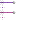
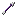
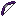
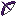

# Creating Custom Projectiles

Have you ever wanted to create a custom projectile in Minecraft? While you have to build new projectiles around the properties of existing ones, there's a lot of flexibility in what you can do. Maybe you'd like a custom version of an arrow, or of a snowball. This tutorial explains how to create them using a combination of different item and entity components.

## Prerequisites

Before tackling custom projectiles, you should be familiar with these other tutorials:

- [Introduction to Resource Packs](./ResourcePack.md)
- [Introduction to Behavior Packs](./BehaviorPack.md)
- [Getting Started with Add-On Development](./GettingStarted.md)
- [Adding Custom Items](./AddCustomItems.md)

## Overview

You can find the samples for this tutorial in the [Minecraft Samples repository](https://github.com/microsoft/minecraft-samples).

> [!IMPORTANT]
>
> These examples currently require the **Custom Projectiles** experimental toggle to be enabled!

In making custom projectiles, we'll take advantage of some existing item and entity components. Some of these have similar (or even identical!) names, but they have slightly different functions depending on whether they're entity or item components.

### Item components
- [`minecraft:projectile`](../Reference/Content/ItemReference/Examples/ItemComponents/minecraft_projectile.md): defines an item as a projectile that can be shot from dispensers or spawned/used as ammunition. The entity defined in its `projectile_entity` property must have the `minecraft:projectile` entity component.
- [`minecraft:throwable`](../Reference/Content/ItemReference/Examples/ItemComponents/minecraft_throwable.md): makes an item, like a snowball, throwable by the player. This defines behaviors like swinging, draw duration, and launch power. The item requires the `minecraft:projectile` item component to specify the target entity to be thrown.
- [`minecraft:shooter`](../Reference/Content/ItemReference/Examples/ItemComponents/minecraft_shooter.md): makes an item, like a bow, shoot projectiles. The item must have the `minecraft:use_modifiers` item component to function properly, and the items defined in its `ammunition` property must also have the `minecraft:projectile` item component.

### Entity components
- [`minecraft:projectile`](../Reference/Content/EntityReference/Examples/EntityComponents/minecraftComponent_projectile.md): defines core projectile behavior including trajectory, physics, damage, sounds, particles, and on hit effects.
- [`minecraft:shooter`](../Reference/Content/EntityReference/Examples/EntityComponents/minecraftComponent_shooter.md): defines ranged attack behavior. This is required for the [`minecraft:behavior.ranged_attack`](../Reference/Content/EntityReference/Examples/EntityGoals/minecraftBehavior_ranged_attack.md) goal to determine which projectiles to shoot. The entities defined in its `projectiles` property must have the `minecraft:projectile` entity component. If you use the [`minecraft:behavior.fire_at_target`](../Reference/Content/EntityReference/Examples/EntityGoals/minecraftBehavior_fire_at_target.md) goal instead, the `shooter` component is unnecessary, as that goal defines the target projectile in its `projectile_def` property.

## Create a custom snowball

To create our custom snowball, we're going to create a throwable item that spawns a projectile entity. First, let's work on the entity.

### The snowball entity

1. The **custom_snowball.json** file goes into the **behavior\_pack/entities/** folder.

```json
{
  "format_version": "1.26.0",
  "minecraft:entity": {
    "description": {
      "identifier": "my:custom_snowball",
      "is_experimental": false,
      "is_summonable": true,
      "is_spawnable": false,
      "spawn_category": "misc"
    },
    "components": {
      "minecraft:collision_box": {
        "height": 0.25,
        "width": 0.25
      },
      "minecraft:physics": {},
      "minecraft:projectile": {
        "angle_offset": 0.0,
        "on_hit": {
          "impact_damage": {
            "apply_knockback_to_blocking_targets": true,
            "damage": 3,
            "knockback": true,
            "filter": "blaze"
          },
          "particle_on_hit": {
            "num_particles": 6,
            "on_other_hit": true,
            "on_entity_hit": true,
            "particle_type": "snowballpoof"
          },
          "remove_on_hit": {}
        },
        "gravity": 0.03,
        "power": 1.5,
        "isolated_physics": true
      },
      "minecraft:pushable": {
        "is_pushable": true,
        "is_pushable_by_piston": true
      },
      "minecraft:damage_sensor": {
        "triggers": {
          "cause": "all",
          "deals_damage": "no"
        }
      }
    }
  }
}

```

This entity definition is pretty similar to the Vanilla snowball. We've just made two additions:

- the `isolated_physics` property disables outside forces like friction and drag, giving it a longer trajectory similar to other Vanilla projectiles.
- the `minecraft:damage_sensor` property ensures the snowball can't be damaged or killed.

> [!IMPORTANT]
>
> The `isolated_physics` property requires the Custom Projectiles experimental toggle to be enabled. (Note that when that toggle is enabled, `isolated_physics` gets a default value of `true`, so it isn't strictly needed in the entity JSON.)

2. Next, we'll need to add **resource_pack/animations/custom.animation.json** to ensure the snowball, which is just a 2D sprite, always faces the camera. (This is called "billboarding.")

```json
{
  "format_version" : "1.10.0",
  "animations" : {
	"animation.custom.billboard" : {
	  "loop" : true,
	  "bones": {
		"body": {
		  "rotation": [ "query.camera_rotation(0)", "query.camera_rotation(1) - query.body_y_rotation", 0.0 ]
		}
	  }
	}
  }
}
```

3. In **resource\_pack/render\_controllers/custom\_snowball.&shy;render\_controllers.json**, we'll set the `is_hurt_color` to 0 to prevent the red flash whenever the snowball is destroyed.

```json
{
  "format_version": "1.10.0",
  "render_controllers": {
    "controller.render.custom_snowball": {
      "geometry": "Geometry.default",
      "materials": [ { "*": "Material.default" } ],
      "textures": [ "Texture.default" ],
      "filter_lighting": true,
      "is_hurt_color": {
        "r": 0.0,
        "g": 0.0,
        "b": 0.0,
        "a": 0.0
      }
    }
  }
}
```

4. Next, the snowball needs a texture. Add this image to **resource\_pack/textures/items**:


5. Last but not least, its resource definition uses the render controller, animation, and texture we just added. Add **resource\_pack/entity/custom\_snowball.entity.json**:

```json
{
  "format_version": "1.10.0",
  "minecraft:client_entity": {
    "description": {
      "identifier": "my:custom_snowball",
      "materials": {
        "default": "entity_alphatest"
      },
      "textures": {
        "default": "textures/items/custom_snowball"
      },
      "geometry": {
        "default": "geometry.item_sprite"
      },
      "render_controllers": [ "controller.render.custom_snowball"],
      "animations": {
        "flying": "animation.custom.billboard"
      },
      "scripts": {
        "animate": [
          "flying"
        ]
      }
    }
  }
} 
```

### The snowball item

We're done with the entity! On to the custom snowball item.

1. First, since the snowball is a 2D sprite, we can use its texture again as its own icon by defining it in **resource_pack/textures/item_texture.json**:

```json
{
  "resource_pack_name": "Custom Projectiles",
  "texture_data": {
    "my:custom_snowball": {
      "textures": "textures/items/custom_snowball"
    }
  }
}
```

2. Now, we can define the item itself in **behavior_pack/items/custom_snowball.json**:

```json
{
  "format_version": "1.21.3",
  "minecraft:item": {
    "description": {
      "identifier": "my:custom_snowball"
    },
    "components": {
      "minecraft:icon": "my:custom_snowball",
      "minecraft:projectile": {
        "projectile_entity": "my:custom_snowball"
      },
      "minecraft:throwable": {
        "do_swing_animation": true
      },
      "minecraft:display_name": {
        "value": "Custom Snowball"
      }
    }
  }
}
```

The key parts to the item definition are:

- `minecraft:icon` corresponds to the texture defined in **item\_texture.json**.
- `projectile_entity` defines what entity to spawn when thrown (in this case, the custom snowball entity we just created).
- `minecraft:throwable` allows the item to be thrown.

### The finished snowball

Put it all together, and now we should be able to launch a custom snowball in game that looks like this!

:::image type="content" source="./Media/custom_projectiles/snowball.gif" alt-text="The custom snowball in flight":::

## Create a custom bow and arrow

This is similar to the snowball example, but it needs a model to render as a 3D object, making it a little more complicated. As before, we'll start with the entity.

### The arrow entity

1. Put this in **behavior_pack/entities/custom_arrow.json**:

```json
{
  "format_version": "1.26.0",
  "minecraft:entity": {
    "description": {
      "identifier": "my:custom_arrow",
      "is_experimental": false,
      "is_summonable": true,
      "is_spawnable": false,
      "spawn_category": "misc"
    },
    "components": {
      "minecraft:collision_box": {
        "height": 0.25,
        "width": 0.25
      },
      "minecraft:dimension_bound": {},
      "minecraft:hurt_on_condition": {
        "damage_conditions": [
          {
            "cause": "lava",
            "damage_per_tick": 4,
            "filters": {
              "operator": "==",
              "test": "in_lava",
              "subject": "self",
              "value": true
            }
          }
        ]},
      "minecraft:physics": {},
      "minecraft:projectile": {
        "anchor": 1,
        "gravity": 0.05,
        "power": 5.0,
        "hit_sound": "bow.hit",
        "on_hit": {
          "arrow_effect": {},
          "impact_damage": {
            "apply_knockback_to_blocking_targets": true,
            "damage": 1,
            "knockback": true,
            "power_multiplier": 0.97,
            "destroy_on_hit": true,
            "semi_random_diff_damage": true,
            "max_critical_damage": 10,
            "min_critical_damage": 9
          },
          "stick_in_ground": {
            "shake_time": 0.35
          }
        },
        "offset": [0, -0.1, 0],
        "should_bounce": true,
        "uncertainty_base": 1,
        "uncertainty_multiplier": 0,
        "isolated_physics": true
      },
      "minecraft:pushable": {
        "is_pushable": false,
        "is_pushable_by_piston": true
      },
      "minecraft:damage_sensor": {
        "triggers": {
          "cause": "all",
          "deals_damage": "no"
        }
      }
    }
  }
}
```

As with the snowball, this is a simplified version of the Vanilla definition, adding the `isolated_physics` and `minecraft:damage_sensor` properties. (Also, like the snowball, you'll need to turn on the Custom Projectiles experimental toggle.)

2. Add this to **resource_pack/animations/custom.animation.json**:

```json
{
  "format_version" : "1.10.0",
  "animations" : {
	"animation.custom_arrow.move" : {
	  "loop" : true,
	  "bones": {
		"body": {
          "rotation" : [ "variable.shake_power - query.target_x_rotation", "-query.head_y_rotation(0) - query.body_y_rotation", 0.0 ],
		  "scale" : [ 0.7, 0.7, 0.9 ]
		}
	  }
	}
  }
}
```

3. The render controller again sets `is_hurt_color` to 0. In **resource_pack/render_controllers/custom_arrow.render_controllers.json**:

```json
{
  "format_version": "1.10.0",
  "render_controllers": {
    "controller.render.custom_arrow": {
      "geometry": "Geometry.default",
      "materials": [ { "*": "Material.default" } ],
      "textures": [ "Texture.default" ],
      "filter_lighting": true,
      "is_hurt_color": {
        "r": 0.0,
        "g": 0.0,
        "b": 0.0,
        "a": 0.0
      }
    }
  }
}
```

4. Now, here's where we stop following the snowball's path: the arrow is a true 3D model, not a sprite, so we'll need to define a geometry for it (**resource_pack/models/entity/custom_arrow.geo.json**):

```json
{
  "format_version" : "1.12.0",
  "minecraft:geometry" : [
	{
	  "description" : {
		"identifier" : "geometry.custom_arrow",
		"texture_width" : 32.0,
		"texture_height" : 32.0
	  },
	  "bones" : [
		{
		  "name" : "body",
		  "pivot" : [ 0.0, 1.0, 0.0 ],
		  "cubes" : [
			{
			  "origin" : [ 0.0, -1.5, -3.0 ],
			  "rotation" : [ 0.0, 0.0, 45.0 ],
			  "size" : [ 0.0, 5.0, 16.0 ],
			  "uv" : {
				"east" : {
				  "uv" : [ 0.0, 0.0 ]
				}
			  }
			},
			{
			  "origin" : [ 0.0, -1.5, -3.0 ],
			  "rotation" : [ 0.0, 0.0, -45.0 ],
			  "size" : [ 0.0, 5.0, 16.0 ],
			  "uv" : {
				"east" : {
				  "uv" : [ 0.0, 0.0 ]
				}
			  }
			},
			{
			  "origin" : [ -2.5, -1.5, 12.0 ],
			  "rotation" : [ 0.0, 0.0, 45.0 ],
			  "size" : [ 5.0, 5.0, 0.0 ],
			  "uv" : {
				"south" : {
				  "uv" : [ 0.0, 5.0 ]
				}
			  }
			}
		  ]
		}
	  ]
	}
  ]
}

```

5. Now the arrow needs a texture saved as **resource_pack/textures/entity/custom_arrows.png**:



6. And, finally, the resource definition brings everything together (**resource_pack/entity/custom_arrow.entity.json**):

```json
{
  "format_version": "1.10.0",
  "minecraft:client_entity": {
    "description": {
      "identifier": "my:custom_arrow",
      "materials": {
        "default": "entity_alphatest"
      },
      "textures": {
        "default": "textures/entity/custom_arrows"
      },
      "geometry": {
        "default": "geometry.custom_arrow"
      },
      "animations": {
        "move": "animation.custom_arrow.move"
      },
      "scripts": {
        "pre_animation": [
          "variable.shake = query.shake_time - query.frame_alpha;",
          "variable.shake_power = variable.shake > 0.0 ? -Math.sin(variable.shake * 200.0) * variable.shake : 0.0;"
        ],
        "animate": [
          "move"
        ]
      },
      "render_controllers": [ "controller.render.custom_arrow" ]
    }
  }
}

```

### The arrow item

1. Unlike the snowball, the arrow needs a separate texture for its icon. Save this image as **resource_pack/textures/items/custom_arrow.png**:



2. We'll refer to it in **resource_pack/textures/item_texture.json**:

```json
{
  "resource_pack_name": "Custom Projectiles",
  "texture_data": {
    "my:custom_arrow": {
      "textures": "textures/items/custom_arrow"
    }
  }
}
```

3. Add the item definition JSON (**custom_projectiles_behavior_pack/items/custom_arrow.json**):

```json
{
  "format_version": "1.21.3",
  "minecraft:item": {
    "description": {
      "identifier": "my:custom_arrow"
    },
    "components": {
      "minecraft:icon": "my:custom_arrow",
      "minecraft:projectile": {
        "projectile_entity": "my:custom_arrow"
      },
      "minecraft:display_name": {
        "value": "Custom Arrow"
      }
    }
  }
}

```

The key parts to the item definition are:
- minecraft:icon - Corresponds to the texture defined in **item_texture.json**
- minecraft:projectile - Its projectile_entity property defines what entity to spawn when dispensed/shot (in this case, the custom arrow entity we just created)

### The finished arrow

Now we have a custom arrow that can be shot by a dispenser, but not thrown like a snowball.

:::image type="content" source="./Media/custom_projectiles/dispenser_arrow.gif" alt-text="The custom arrow in flight":::

### The bow

We're not finished yet, though&mdash;the custom arrow needs its custom bow! We'll go through the item definition more quickly this time.

1. Save this image to **resource_pack/textures/items/custom_bow_standby.png** (the name will be explained in a minute):



2. Add the texture to **resource_pack/textures/item_texture.json**:

```json
{
  "format_version": "1.21.3",
  "minecraft:item": {
    "description": {
      "identifier": "my:custom_bow"
    },
    "components": {
      "minecraft:icon": "my:custom_bow_standby",
      "minecraft:use_modifiers": {
        "use_duration": 72000
      },
      "minecraft:shooter": {
         "ammunition": [
          {
            "item": "my:custom_arrow",
            "search_inventory": true,
             "use_in_creative": true
          }
        ],
        "max_draw_duration": 1.5,
        "scale_power_by_draw_duration": true
      },
      "minecraft:display_name": {
        "value": "Custom Bow"
      }
    }
  }
}

```

The important new property here is `minecraft:shooter`, which defines the bow's ammunition to be our custom arrow item. The `minecraft:use_modifiers` component determines how long an item (the bow) takes to use, and it's required for shooters.

3. As with the arrow, we want the bow to render as a 3D object, so we need to add a bow model. Actually, we need to add _four_ bow models: one at standby (rest), and three for different states of charging (being pulled back) before releasing the arrow. We'll define the geometry in **resource_pack/models/entity/custom_bow.geo.json**:

```json
{
  "format_version" : "1.16.0",
  "minecraft:geometry" : [
	{
	  "description" : {
		"identifier" : "geometry.custom_bow_pulling_0",
		"texture_width" : 16.0,
		"texture_height" : 16.0
	  },
	  "bones" : [
		{
		  "name" : "rightitem",
		  "texture_meshes" : [
			{
			  "local_pivot" : [ 6.0, 0.0, 6.0 ],
			  "position" : [ 2.0, 1.0, -1.0 ],
			  "rotation" : [ 0.0, -135.0, 90.0 ],
			  "texture" : "custom_bow_pulling_0"
			}
		  ]
		}
	  ]
	},
	{
	  "description" : {
		"identifier" : "geometry.custom_bow_pulling_1",
		"texture_width" : 16.0,
		"texture_height" : 16.0
	  },
	  "bones" : [
		{
		  "name" : "rightitem",
		  "texture_meshes" : [
			{
			  "local_pivot" : [ 6.0, 0.0, 6.0 ],
			  "position" : [ 2.01, 1.0, -1.0 ],
			  "rotation" : [ 0.0, -135.0, 90.0 ],
			  "texture" : "custom_bow_pulling_1"
			}
		  ]
		}
	  ]
	},
	{
	  "description" : {
		"identifier" : "geometry.custom_bow_pulling_2",
		"texture_width" : 16.0,
		"texture_height" : 16.0
	  },
	  "bones" : [
		{
		  "name" : "rightitem",
		  "texture_meshes" : [
			{
			  "local_pivot" : [ 6.0, 0.0, 6.0 ],
			  "position" : [ 2.01, 1.0, -1.0 ],
			  "rotation" : [ 0.0, -135.0, 90.0 ],
			  "texture" : "custom_bow_pulling_2"
			}
		  ]
		}
	  ]
	},
	{
	  "description" : {
		"identifier" : "geometry.custom_bow_standby",
		"texture_width" : 16.0,
		"texture_height" : 16.0
	  },
	  "bones" : [
		{
		  "name" : "rightitem",
		  "texture_meshes" : [
			{
			  "local_pivot" : [ 6.0, 0.0, 6.0 ],
			  "position" : [ 2.0, 1.0, -2.0 ],
			  "rotation" : [ 0.0, -135.0, 90.0 ],
			  "texture" : "default"
			}
		  ]
		}
	  ]
	}
  ]
}
```

4. Next, we'll define an attachable for the bow. Ensure you've saved the following images to your **textures/items** folder for the different charging state textures.

 `custom_bow_pulling_2.png`

 `custom_bow_pulling_1.png`

 `custom_bow_pulling_0.png`

5. Add **resource_pack/attachables/custom_bow.json**:

```json
{
  "format_version": "1.10.0",
  "minecraft:attachable": {
    "description": {
      "identifier": "my:custom_bow",
      "materials": {
        "default": "entity_alphatest",
        "enchanted": "entity_alphatest_glint"
      },
      "textures": {
        "default": "textures/items/custom_bow_standby",
        "custom_bow_pulling_0": "textures/items/custom_bow_pulling_0",
        "custom_bow_pulling_1": "textures/items/custom_bow_pulling_1",
        "custom_bow_pulling_2": "textures/items/custom_bow_pulling_2",
        "enchanted": "textures/misc/enchanted_item_glint"
      },
      "geometry": {
        "default": "geometry.bow_standby",
        "custom_bow_pulling_0": "geometry.custom_bow_pulling_0",
        "custom_bow_pulling_1": "geometry.custom_bow_pulling_1",
        "custom_bow_pulling_2": "geometry.custom_bow_pulling_2"
      },
      "animations": {
        "wield": "animation.bow.wield",
        "wield_first_person_pull": "animation.bow.wield_first_person_pull"
      },
      "scripts": {
        "pre_animation": [
          "variable.charge_amount = math.clamp((query.main_hand_item_max_duration - (query.main_hand_item_use_duration - query.frame_alpha + 1.0)) / 10.0, 0.0, 1.0f);",
          "variable.bow_tex_idx = query.main_hand_item_use_duration == 0.0f ? 0 : variable.charge_amount / 0.5f + 1;"
        ],
        "animate": [
          "wield",
          {
            "wield_first_person_pull": "query.main_hand_item_use_duration > 0.0f && c.is_first_person"
          }
        ]
      },
      "render_controllers": [ "controller.render.custom_bow" ]
    }
  }
}

```

The key parts to the attachable are:

- The geometries listed correspond to the identifiers used by the model definition, and the textures to the location you just added the images to.
- `bow_tex_idx` is defined and updated in the `pre_animation` script. This will be used by its render controller to determine what texture and model the bow should use based on its charging state. This in turn uses `charge_amount` to determine its charge state based on item use duration.

6. Bring it all together in **resource_pack/render_controllers/custom_bow.render_controllers.json**:

```json
{
  "format_version": "1.10",
  "render_controllers": {
    "controller.render.custom_bow": {
      "arrays": {
        "textures": {
          "array.bow_texture_frames": [
            "texture.default",
            "texture.custom_bow_pulling_0",
            "texture.custom_bow_pulling_1",
            "texture.custom_bow_pulling_2"
          ]
        },
        "geometries": {
          "array.bow_geo_frames": [
            "geometry.default",
            "geometry.custom_bow_pulling_0",
            "geometry.custom_bow_pulling_1",
            "geometry.custom_bow_pulling_2"
          ]
        }
      },
      "geometry": "array.bow_geo_frames[variable.bow_tex_idx]",
      "materials": [ { "*": "variable.is_enchanted ? material.enchanted : material.default" } ],
      "textures": [ "array.bow_texture_frames[variable.bow_tex_idx]", "texture.enchanted" ]
    }
  }
}
```

As with the attachable definition, the `bow_tex_idx` variable tracks charging state, selecting the proper texture and geometry to use. The textures and geometries correspond to the ones defined in the attachable.

### Animating the player

We're not quite finished: we need to adjust the player animation so that when the custom bow is in use, the player model moves correctly.

Make a copy of the Vanilla `player.animation_controller` and add `query.get_equipped_item_name == 'custom_bow'` to the `"third_person_bow_equipped"` animation:

**resource_pack/animation_controllers/player.animation_controllers.json**

> [!NOTE]
>
> This only shows what's changed, _not_ the full animation controller!

```json
{
  "format_version" : "1.10.0",
  "animation_controllers" : {
	"controller.animation.player.root" : {
	  "initial_state" : "first_person",
	  "states" : {
		"third_person" : {
		  "animations" : [
			{
              // BEFORE:
              // "third_person_bow_equipped" : "query.get_equipped_item_name == 'bow' && (variable.item_use_normalized > 0 && variable.item_use_normalized < 1.0)"
              // AFTER: 
			  "third_person_bow_equipped" : "(query.get_equipped_item_name == 'bow' ||  query.get_equipped_item_name == 'custom_bow') && (variable.item_use_normalized > 0 && variable.item_use_normalized < 1.0)"
			}
		  ]
		}
	  }
	}
  }
}
```

### The finished bow and arrow

Now we have a custom bow that changes models/textures based on charging status and shoots custom arrows that persist in the world upon impact!

:::image type="content" source="./Media/custom_projectiles/shooting_custom_arrows.gif" alt-text="The custom bow shooting the custom arrow":::

## Mobs and custom projectiles

Players can use the snowball and the bow and arrow we've created, but what about non-player mobs? They can span custom projectiles through mob goals. 

There are two different ways for a mob to specify a projectile attack, but both require that the mob has a navigation component and a targeting goal. We'll reuse our custom snowball from the previous examples and create a snow golem that launches our snowballs at chickens.

Let's define a render controller for our custom snow golem, which just repurposes the Vanilla snow golem's assets.

```json
{
  "format_version": "1.8.0",
  "minecraft:client_entity": {
    "description": {
      "identifier": "my:custom_snow_golem",
      "min_engine_version": "1.8.0",
      "materials": {
        "default": "snow_golem",
        "head": "snow_golem_pumpkin"
      },
      "textures": {
        "default": "textures/entity/snow_golem"
      },
      "geometry": {
        "default": "geometry.snowgolem.v1.8"
      },
      "animations": {
        "move": "animation.snowgolem.move.v1.8",
        "look_at_target": "animation.common.look_at_target"
      },
      "animation_controllers": [
        { "move": "controller.animation.snowgolem.move.v1.8" }
      ],
      "render_controllers": [ "controller.render.snowgolem" ]
    }
  }
}
```

Now we'll create the entity's behavior definition. There are two ways to do this; we'll look at both.

### Using `fire_at_target`

```json
{
  "format_version": "1.26.0",
  "minecraft:entity": {
    "description": {
      "identifier": "my:custom_snow_golem",
      "is_spawnable": true,
      "is_summonable": true,
      "is_experimental": false
    },
    "components": {
      "minecraft:collision_box": {
        "height": 1.8,
        "width": 0.4
      },
      "minecraft:navigation.generic": {},
      "minecraft:behavior.fire_at_target": {
        "projectile_def": "my:custom_snowball",
        "priority": 1,
        "attack_range": [
          0,
          10
        ]
      },
      "minecraft:behavior.nearest_attackable_target": {
        "priority": 1,
        "entity_types": [
          {
            "filters": { "test" :  "is_family", "subject" : "other", "value" :  "chicken"}
          }
        ],
        "must_reach": true,
        "must_see": true
      },
      "minecraft:persistent": {},
      "minecraft:physics": {}
    }
  }
}
```

Here's some key parts to this definition:

- A navigation component is required for an entity to find targets, like `minecraft:navigation.generic`.
- `minecraft:behavior.nearest_attackable_target` defines which entities to target.
- `minecraft:behavior.fire_at_target` gives the entity a ranged projectile attack, using the projectiles defined by `projectile_def`. 

> [!NOTE]
>
> The `fire_at_target` goal overrides definitions in the projectile component.

### Using `ranged_attack`

Alternatively, minecraft:behavior.fire_at_target can be replaced with minecraft:behavior.ranged_attack. However, the entity definition must now also have the minecraft:shooter component to determine what projectile to shoot.

```json
{
    // Simplified from the above
    "minecraft:entity": {
        "components": {
            // BEFORE:
            // "minecraft:behavior.fire_at_target": {
            //   "projectile_def": "my:custom_snowball",
            //   "priority": 1,
            //   "attack_range": [
            //     0,
            //     10
            //   ]
            // },
            // AFTER:
            "minecraft:behavior.ranged_attack": {
                "priority": 1,
                "speed_multiplier": 1.25,
                "attack_interval": 1,
                "attack_radius": 10
            },
            "minecraft:shooter": {
                "def": "my:custom_snowball"
            }
            //...additional components
        }
    }
}
```

Here are some points to note:

- When you use `minecraft:behavior.ranged_attack`, you must also use `minecraft:shooter` to define the projectile to shoot.
- Unlike `minecraft:behavior.fire_at_target`, this doesn't override the projectile component's anchor and offset.
- The `navigation` and `nearest_attackable_target` components are still required.

### The finished snow golem

Regardless of whether you use `fire_at_target` or `ranged_attack`, you'll get a chicken-attacking snow golem!

:::image type="content" source="./Media/custom_projectiles/snow_golem_target_chicken.gif" alt-text="The snow golem targeting the chicken":::
