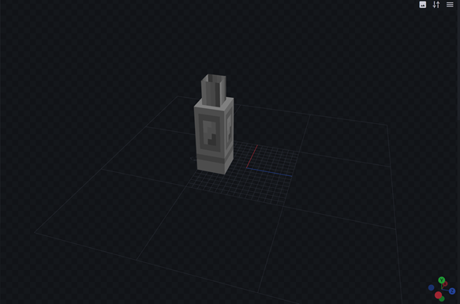
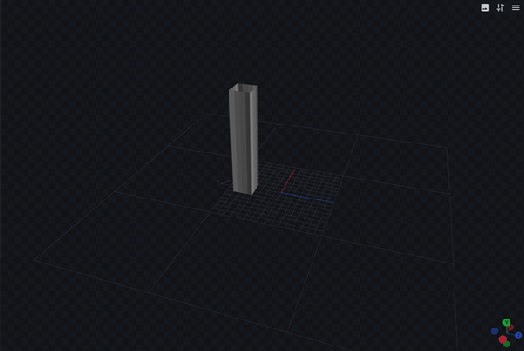
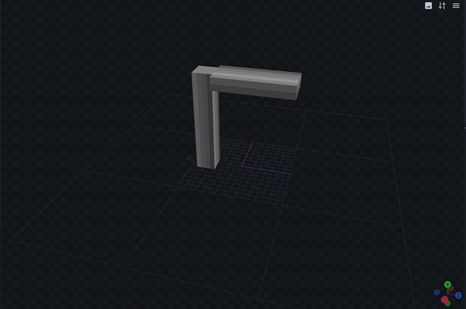
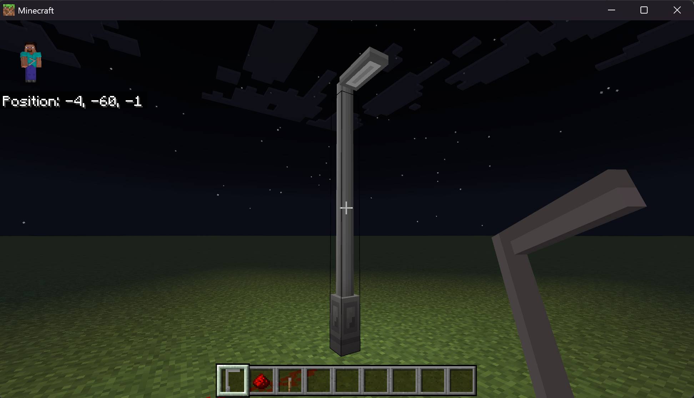
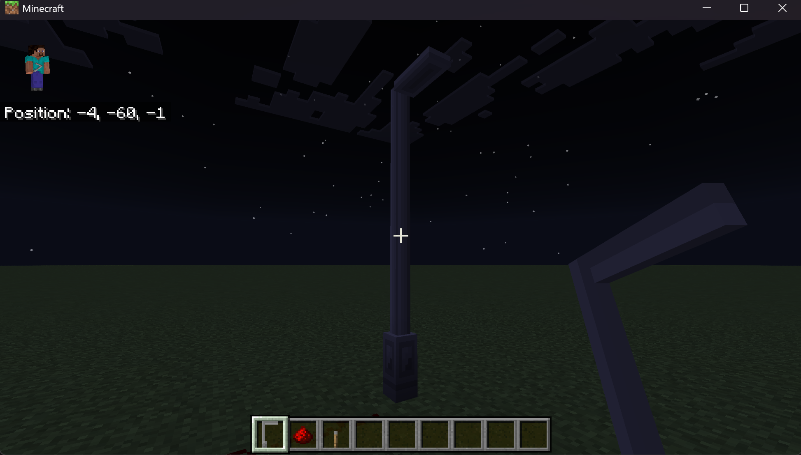

# Create a Multi-Block

A **multi-block** is a collection of individual blocks that behave as one single block, such as a door or a bed. When you place a multi-block, all its component blocks are placed at once; if a player breaks any part, the entire multi-block will break. Player and Redstone interactions have the same behavior: any interaction with a single block within the multi-block interacts with all the blocks.

In this tutorial, we'll be examining the four-part light post multi-block from the [Minecraft Samples repository](https://github.com/microsoft/minecraft-samples/tree/main/multi-block_sample).

:::image type="content" source="./Media/multi-blocks/light_post_block.png" alt-text="Light Post multi-block":::

## Definition

Here's how the light post in the Samples repo is defined.

### The multi-block trait

First, we use a new [block trait](./intro-block-traits.md), `minecraft:multi_block`. This trait gives the block a new [state](../Reference/Content/BlockReference/Examples/BlockStatesAndPermutations.md#block-states) called `minecraft:multi_block_part`; the values of this new state correspond to the individual block parts. `0` indicates the light post's starting block, and `2` indicates the end block.

The multi-block trait has two properties:

- `direction` indicates which direction to place the parts from start to end in a single axis. This field supports two values, `"up"` and `"down"` (that is, vertical multi-blocks).
- `parts` is optional; it specifies how many block parts there are, from `2` to `4`. The default is `2`.

> [!NOTE]
>
> The `direction` property can accept any valid [direction](../ScriptAPI/minecraft/server/Direction.md), but the first iteration of multi-blocks only supports `up` and `down`.

First, let's define the light post without any components:

```json
{
  "format_version": "1.26.1",
  "minecraft:block": {
	"description": {
	  "identifier": "multiblock:light",
	  "traits": {
		"minecraft:multi_block": {
		  "enabled_states": [
			"minecraft:multi_block_part"
		  ],
		  "parts": 4,
		  "direction": "up"
		}
	  }
	},
	"components": {
	}
  }
}
```

### Geometry and visuals

Next, we'll need to add geometry for our four block parts. The light post has three unique geometries:

| Geometry | Image                                            |
|----------|--------------------------------------------------|
| base     |    |
| pole     |    |
| light    |  |

And, the geometries will use one of two textures:

| Texture    | Image                                            |
|------------|--------------------------------------------------|
| light\_on  |    |
| light\_off |  |

With these, we can set up the block parts. We'll also add some other components like [`collision_box`](../Reference/Content/BlockReference/Examples/BlockComponents/minecraftBlock_collision_box.md), to let each block have a unique box for per-block collisions, and [`selection_box`](../Reference/Content/BlockReference/Examples/BlockComponents/minecraftBlock_selection_box.md) to allow cursor selection of the individual blocks in the multi-block. Selecting an individual block will still select the whole multi-block; the boxes are combined together for interaction purposes.

Here's the new block definition. Note that parts 1 and 2 share the same geometry, and part 3 chooses the `on` or `off` texture based on the `multi_block:light_on` state.

```json
{
  "format_version": "1.26.1",
  "minecraft:block": {
	"description": {
	  "identifier": "multiblock:light",
	  "traits": {
		"minecraft:multi_block": {
		  "enabled_states": [
			"minecraft:multi_block_part"
		  ],
		  "parts": 4,
		  "direction": "up"
		}
	  },
	  "states": {
		"multi_block:light_on": [ false, true ]
	  }
	},
	"components": {
	  "minecraft:selection_box": {
		"origin": [-2, 0, -8],
		"size": [5, 12, 5]
	  },
	  "minecraft:geometry": "geometry.light_post_base",
	  "minecraft:material_instances": {
		"*": {
		  "texture": "light_post_off",
		  "render_method": "opaque"
		}
	  }
	},
	"permutations": [
	  {
		"condition": "q.block_state('minecraft:multi_block_part') == 0",
		"components": {
		  "minecraft:collision_box": {
			"origin": [-2, 0, -8],
			"size": [5, 12, 5]
		  },
		  "minecraft:geometry": "geometry.light_post_base"
		}
	  },
	  {
		"condition": "q.block_state('minecraft:multi_block_part') == 1 || q.block_state('minecraft:multi_block_part') == 2",
		"components": {
		  "minecraft:collision_box": {
			"origin": [-2, 0, -7],
			"size": [5, 16, 3]
		  },
		  "minecraft:geometry": "geometry.light_post_pole"
		}
	  },
	  {
		"condition": "q.block_state('minecraft:multi_block_part') == 3 && q.block_state('multi_block:light_on') == false",
		"components": {
		  "minecraft:collision_box": {
			"origin": [-2, 14, -7],
			"size": [5, 4, 15]
		  },
		  "minecraft:geometry": "geometry.light_post_light",
		  "minecraft:material_instances": {
			"*": {
			  "texture": "light_post_off",
			  "render_method": "opaque"
			}
		  }
		}
	  },
	  {
		"condition": "q.block_state('minecraft:multi_block_part') == 3 && q.block_state('multi_block:light_on') == true",
		"components": {
		  "minecraft:collision_box": {
			"origin": [-2, 14, -7],
			"size": [5, 4, 15]
		  },
		  "minecraft:geometry": "geometry.light_post_light",
		  "minecraft:material_instances": {
			"*": {
			  "texture": "light_post_on",
			  "render_method": "opaque"
			}
		  }
		}
	  }
	]
  }
}
```

### Combining block traits

The multi-block trait can be combined with other block traits. For the light post, we'll add the [`placement_direction`](../Reference/Content/BlockReference/Examples/traits/placement_direction.md) trait, which will allow the light post to rotate depending on the direction the player is facing.

Here's the updated definition file, with some parts elided to save a little space. For each cardinal direction state, we use the [`transformation`](../Reference/Content/BlockReference/Examples/BlockComponents/minecraftBlock_transformation.md) component to apply a rotation to the block parts.

```json
{
	"format_version": "1.26.1",
	"minecraft:block": {
		"description": {
			"identifier": "multiblock:light",
			"traits": {
				"minecraft:placement_direction": {
					"enabled_states": [
						"minecraft:cardinal_direction"
					]
				},
				"minecraft:multi_block": {
					"enabled_states": [
						"minecraft:multi_block_part"
					],
					"parts": 4,
					"direction": "up"
				}
			},
			"states": {
				"multi_block:light_on": [ false, true ]
			}
		},
		"components": {
			...
		},
		"permutations": [
		...,
		{
			"condition": "q.block_state('minecraft:cardinal_direction') == 'north'",
			"components": {
				"minecraft:transformation": {
					"rotation": [0,0,0]
				}
			}
		},
		{
			"condition": "q.block_state('minecraft:cardinal_direction') == 'south'",
			"components": {
				"minecraft:transformation": {
					"rotation": [0,180,0]
				}
			}
		},
		{
			"condition": "q.block_state('minecraft:cardinal_direction') == 'west'",
			"components": {
				"minecraft:transformation": {
					"rotation": [0,90,0]
				}
			}
		},
		{
			"condition": "q.block_state('minecraft:cardinal_direction') == 'east'",
			"components": {
				"minecraft:transformation": {
					"rotation": [0,270,0]
				}
			}
		}
		]
	}
}
```

The four directions of the light post look like this:

:::image type="content" source="./Media/multi-blocks/light_post_directions.png" alt-text="Image of the light post multi-block showing its four directional facings":::

## Creating the item

To place the multi-block light post, let's make a custom item with the [`block_placer`](../Reference/Content/ItemReference/Examples/ItemComponents/minecraft_block_placer.md) component, along with the [`icon`](../Reference/Content/ItemReference/Examples/ItemComponents/minecraft_icon.md) component to render the item.

```json
{
  "format_version": "1.21.100",
  "minecraft:item": {
    "description": {
      "identifier": "multiblock:light"
    },
    "components": {
      "minecraft:icon": {
        "textures": {
          "default": "light_post_item"
        }
      },
      "minecraft:block_placer": {
        "block": "multiblock:light",
        "replace_block_item": true
      },
      "minecraft:display_name": {
        "value": "light_post"
      },
      "minecraft:max_stack_size": 64
    }
  }
}

```

And, here's what the item looks like:

:::image type="content" source="./Media/multi-blocks/light_post_item.png" alt-text="The finished light post multi-block item.":::

## Scripts

Light posts need power, so ours can only turn on when Redstone is connected to it. We'll need to do the following:

1. Add a [`redstone_consumer`](../Reference/Content/BlockReference/Examples/BlockComponents/minecraftBlock_redstone_consumer.md) component to the light post.
2. Add a [custom component](./scripting/custom-components.md), `multi_block:light_post_component`.
3. Define the component in a script which listens for [Redstone update events](../ScriptAPI/minecraft/server/BlockComponentRedstoneUpdateEvent.md) to change the `multi_block:light_on` state on all block parts.
4. Use the [`minecraft:light_emission`](../Reference/Content/BlockReference/Examples/BlockComponents/minecraftBlock_light_emission.md) component to emit light from the end part.

### Adding the components

At the end of the `components` block in the multi-block definition file, we need to add our two new components. We'll also make the light post destructible while we're at it, to give it a bit more flavor.

```json
"components": {
  // ...
  "minecraft:destructible_by_mining": {
    "seconds_to_destroy": 3
  },
  "minecraft:destructible_by_explosion": {
    "explosion_resistance": 3
  },
  "minecraft:movable": {
    "movement_type": "popped"
  },
  "multi_block:light_post_component": {},
  "minecraft:redstone_consumer": {}
}
```

In the multi-block definition file, the conditions for the end block part need to have the `light_emission` component added. Change the ones for part `3` to read like this:

```json
{
  "condition": "q.block_state('minecraft:multi_block_part') == 3 && q.block_state('multi_block:light_on') == false",
  "components": {
	"minecraft:collision_box": {
	  "origin": [-2, 14, -7],
	  "size": [5, 4, 15]
	},
	"minecraft:geometry": "geometry.light_post_light",
	"minecraft:material_instances": {
	  "*": {
		"texture": "light_post_off",
		"render_method": "opaque"
	  }
	},
	"minecraft:light_emission": 0
  }
},
{
  "condition": "q.block_state('minecraft:multi_block_part') == 3 && q.block_state('multi_block:light_on') == true",
  "components": {
	"minecraft:collision_box": {
	  "origin": [-2, 14, -7],
	  "size": [5, 4, 15]
	},
	"minecraft:geometry": "geometry.light_post_light",
	"minecraft:material_instances": {
	  "*": {
		"texture": "light_post_on",
		"render_method": "opaque"
	  }
	},
	"minecraft:light_emission": 15
  }
}
```

And, we'll need a script to power our custom component:

```javascript
import { system } from "@minecraft/server";

class LightPostComponent {
  static componentName = "multi_block:light_post_component";

  constructor() {
    this.onRedstoneUpdate = this.onRedstoneUpdate.bind(this);
  }
  checkStateIsGood(state) {
    if (state === undefined) {
      return false; // no state
    }
    else if (typeof state !== 'boolean') {
      return false; // bad state
    }
    return true;
  }

  setLight(block, powerLevel) {
    const perm = block.permutation;
    const lightOnState = perm.getState('multi_block:light_on');
    if (this.checkStateIsGood(lightOnState)) {
      if(powerLevel > 0) {
        block.setPermutation(perm.withState('multi_block:light_on', true));
      }
      else {
        block.setPermutation(perm.withState('multi_block:light_on', false));
      }
    }
  }

  onRedstoneUpdate(event) {
    const parts = event.block.getParts();
    if (parts === undefined) {
      return; // not a multi-block
    }
    
    parts.forEach((part) => {
      this.setLight(part, event.powerLevel)
    });
  }
}

system.beforeEvents.startup.subscribe((initEvent) => {
  initEvent.blockComponentRegistry.registerCustomComponent(LightPostComponent.componentName, new LightPostComponent());
});
```

Now, our light post will come on when Redstone is connected to it!

[Illuminated light post](./Media/multi-blocks/light_on.png)

## Wrapping up

This walk-through of the light post multi-block should give you a good understanding of how multi-blocks are assembled out of individual block parts, from traits to components to event scripting. And, it should be a good starting point for creating your own multi-blocks!
