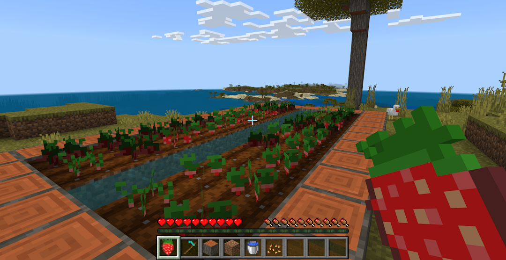

# Building with Custom Components

## Create an Add-On with custom components

There are a variety of components built into Minecraft, with various parameters used to control their behavior. With [custom components](./custom-components.md), you can define your own behavior for blocks and items through scripting!

In this tutorial, we'll use custom components and scripting to add a new strawberry crop and strawberry item. Strawberries give you temporary night vision, but if the strawberry plants aren't picked when they are ripe, they'll go bad. You'll have to time it just right to get fresh strawberries! In this sample, you'll see the block components that manage crop growth rates in addition to custom item effects.



You can find the source code for this example at <https://github.com/microsoft/minecraft-scripting-samples/tree/main/custom-components>.

### Prerequisites

Before going through this tutorial, you should have worked through the following tutorials this one builds on:

* [Getting Started with Add-On Development](../GettingStarted.md)
* [Introduction to Behavior Packs](../BehaviorPack.md)
* [Introduction to Scripting](./introduction.md)

You should be comfortable with how add-on folders are structured, what required files the behavior pack should contain, and how to use scripting with your behavior pack.

In addition, it'll be helpful to know how to make blocks and items in your add-on. (Our sample source code provides textures for the strawberries!) Read [Creating a Custom Die Block](../AddCustomDieBlock.md) for information on making your own.

## Item custom components

The strawberry item utilizes custom components to give players nght vision after eating them. First, let's make the strawberry item itself:

```json
{
  "format_version": "1.21.90",
  "minecraft:item": {
    "description": {
      "menu_category": {
        "group": "minecraft:itemGroup.name.crop",
        "category": "nature"
      },
      "identifier": "starter:strawberry"
    },
    "components": {
      "minecraft:icon": "strawberry",
      "minecraft:max_stack_size": 64,
      "minecraft:use_modifiers": {
        "use_duration": 1.6,
        "movement_modifier": 0.35
      },
      "minecraft:food": {
        "can_always_eat": true,
        "nutrition": 1,
        "saturation_modifier": 0.5
      },
      "minecraft:use_animation": "eat"
    }
  }
}
```

### Adding custom components to items

> [!NOTE]
> [Scripting V2.0.0](./v2-overview.md) changes and simplifies this process, as well as giving custom components a few new special powers, and this tutorial uses V2.0.0. Read the [overview](./v2-overview.md) for more information!

To add custom components to an item, you just add them to the item's `components` block like any built-in component. When events defined in the component run (such as eating the strawberry), the custom event handlers we've written in the script will run. If there's more than one custom script in the `components` block, each one will be run in the order it appears. This means that one item can run the same components in a different order than another item.

We'll add our new component under the `minecraft:use_animation` key:

```json
"minecraft:use_animation": "eat",
"starter:add_night_vision_on_consume": {}
```

The name you choose for your custom component requires a namespace before it. In the code above, the namespace is `starter` and the component name is `add_night_vision_on_consume`.

### Registering item custom components

Now that our item has been configured to have a custom component, we need to register the behavior for the component.

First, we add our component using the same name we defined in the JSON component to the `ItemComponentRegistry` and provide a list of events that this component is listening for. In this case, we listen for the `onConsume` event for item custom components, which will run our code when the item is consumed by a player. The code adds the night vision effect to the player.

```typescript
import { ItemComponentConsumeEvent, system } from "@minecraft/server";

system.beforeEvents.startup.subscribe((initEvent) => {
  initEvent.itemComponentRegistry.registerCustomComponent('starter:add_night_vision_on_consume', {
    onConsume(arg: ItemComponentConsumeEvent) {
      arg.source.addEffect('minecraft:night_vision', 600);
    }
  });
});
```

Notice that the component code and name do not reference the strawberry item itself. You can reuse components on multiple items that have similar behavior.

## Block custom components

Block custom components work very similarly to item custom components. First we need our block definition:

```json
{
  "format_version": "1.21.10",
  "minecraft:block": {
    "description": {
      "identifier": "starter:strawberry_crop",
      "states": {
        "starter:crop_age": [ 0, 1, 2, 3, 4 ]
      }
    },
    "permutations": [
      {
        "condition": "query.block_state('starter:crop_age') == 4",
        "components": {
          "minecraft:loot": "loot_tables/strawberry_grown_crop.json"
        }
      }
    ],
    "components": {
      "minecraft:geometry": "geometry.starter_crop_geo",
      "minecraft:loot": "loot_tables/strawberry_seed.json",
      "minecraft:collision_box": false,
      "minecraft:placement_filter": {
        "conditions": [
          {
            "allowed_faces": ["up"],
            "block_filter": ["minecraft:farmland"]
          }
        ]
      },
      "tag:minecraft:crop": {}
    }
  }
}
```

### Adding custom components to blocks

In the block JSON, we use a special key, `minecraft:custom_components`, to define the custom components this block has. In this case we are going to add two different definitions: one in the base of the block and one within the permutation. When both a block permutation and base block use the `minecraft:custom_components` component, only the components listed in the permutation will have their script code run. This allows you to reorder, remove, or add new custom components to specific permutations of a block.

Since the first four permutations (ages 0&ndash;3) of the strawberry crop all use the same custom components, we can just put this in the base block's component list. The last permutation (age 4) will have some additional functionality so we can harvest the fully grown strawberries, so it will need its own `minecraft:custom_components` to override the one in the base block.

```json
{
  "format_version": "1.21.10",
  "minecraft:block": {
    "description": {
      "identifier": "example:strawberry_crop",
      "states": {
        "starter:crop_age": [ 0, 1, 2, 3, 4 ]
      }
    },
    "permutations": [
      {
        "condition": "query.block_state('example:crop_age') == 4",
        "components": {
          "minecraft:loot": "loot_tables/strawberry_grown_crop.json"
        },
        "minecraft:custom_components": [
          "example:crop_harvest"
        ]
      }
    ],
    "components": {
      "minecraft:geometry": "geometry.example_crop_geo",
      "minecraft:loot": "loot_tables/strawberry_seed.json",
      "minecraft:collision_box": false,
      "minecraft:placement_filter": {
        "conditions": [
          {
            "allowed_faces": ["up"],
            "block_filter": ["minecraft:farmland"]
          }
        ]
      },
      "tag:minecraft:crop": {},
      "minecraft:custom_components": [
        "example:crop_grow"
      ]
    }
  }
}
```

### Registering block custom components

Similar to items, we register the component in our script with a list of events that the component is listening to and the behavior that should occur when the event is raised. For items we used the `ItemComponentRegistry` to do this; for blocks we use the `BlockComponentRegistry`. In this case, we have two components to fill out. The item example above shows how to do this by placing your behavior in the registration statement. These two components will look at two ways you can organize your code.

#### "example:crop_grow" component

This component is designed to grow crops, which we do by listening to the `onRandomTick` event for block custom components and changing the block's permutation to the next age. This component is registered by giving the event a function to run where the previous item custom component example had its code.

```typescript
import {
  BlockComponentRandomTickEvent,
  world
} from "@minecraft/server";

function cropGrowRandomTick(event : BlockComponentRandomTickEvent) {
  const age = event.block.permutation.getState('starter:crop_age');
  if (age === undefined || typeof age !== 'number') {
    return;
  }
  else if (age === 4) {
    return; // fully grown
  }

  event.block.setPermutation(event.block.permutation.withState('starter:crop_age', age + 1));
}

world.beforeEvents.worldInitialize.subscribe(initEvent => {
  initEvent.blockComponentRegistry.registerCustomComponent('starter:crop_grow', {
    onRandomTick: cropGrowRandomTick,
  });
});
```

#### "example:crop_harvest" component

The crop grow component exists on only the finished crop when it is ready to be harvested. This component lets the player harvest the strawberries on a block without breaking it. It then "replants" the strawberries by changing the block permutation back to the first growth stage. This component is registered by making a new class that implements the `BlockCustomComponent` object, giving you a third way to register components. The same can be done with items and the `ItemCustomComponent` object.

```typescript
import {
  BlockCustomComponent,
  BlockComponentPlayerInteractEvent,
  world
} from "@minecraft/server";

class BlockCropHarvestComponent implements BlockCustomComponent {
  onPlayerInteract(event : BlockComponentPlayerInteractEvent) {
    if (event.player === undefined) {
      return;
    }

    const blockPos = event.block.location;
    event.dimension.runCommand('loot spawn ' +
      blockPos.x + ' ' +
      blockPos.y + ' ' +
      blockPos.z + ' loot strawberry_grown_crop'
    );
    event.block.setPermutation(event.block.permutation.withState('example:crop_age', 0));
  }
};

world.beforeEvents.worldInitialize.subscribe(initEvent => {
  initEvent.blockComponentRegistry.registerCustomComponent('example:crop_harvest', new BlockCropHarvestComponent());
});
```

Congratulations! You now have a block and an item using custom components.

For a version of this Add-On that implements this in a more full-featured fashion, check out the [custom components sample at the Minecraft Scripting Samples repository](https://github.com/microsoft/minecraft-scripting-samples/tree/main/custom-components). Copy that folder to its own directory and install the Node prerequisites with `npm i` first, as described in the [Introduction to Scripting](./introduction.md).
