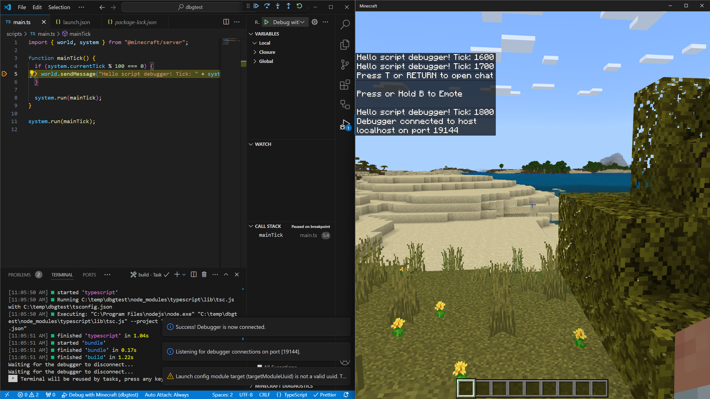

# Debugging Scripts in Minecraft

When your scripts don't behave as expected, having a solid debugging strategy makes the difference between hours of frustration and quickly finding the root cause. This guide covers everything from basic console logging to advanced debugging with Visual Studio Code, helping you become more effective at finding and fixing script issues.

## Prerequisites

Before diving into debugging, you should be familiar with:

- [Introduction to Scripting](./introduction.md)
- [Developer Tools for Minecraft](./developer-tools.md)

## Debugging strategies overview

There are several approaches to debugging scripts in Minecraft, each with its own strengths:

| Approach               | Best For                           | Difficulty |
|------------------------|------------------------------------|------------|
| Console logging        | Quick checks, simple issues        | Easy       |
| Content log            | JSON errors, pack loading issues   | Easy       |
| VS Code debugger       | Complex logic, variable inspection | Medium     |
| Custom tooling         | Variable inspection over time      | Medium     |
| Visual debug utilities | Spatial issues, entity tracking    | Advanced   |
| Script profiler        | Performance problems               | Advanced   |

## Console logging basics

The simplest debugging technique is printing messages to the console. To do that in Minecraft, you'll need to enable the [content log](../ContentErrorLog.md).

To enable it, click **Settings**, then **Creator**. Scroll to **Content Log Settings**.

:::image type="content" source="./media/debugging/content-log-setting.jpg" alt-text="Minecraft: Bedrock Edition content log setting GUI":::

You can enable the following options:

- **Content Log File** writes the log output to a file. (See below for information on where to find the file!)
- **Content Log GUI** displays errors in the Minecraft UI in real time.
- The **GUI Log Level** can be set to **Verbose** (everything), **Info** (anything logged to the console, including warnings and errors), and **Warn** (just log warnings and errors).

To find the log file:

1. Navigate to your Minecraft logs folder:
   - **GDK (1.21.120+)**: `%APPDATA%\Minecraft Bedrock\logs\`
   - **Preview**: `%APPDATA%\Minecraft Bedrock Preview\logs\`
   - **Legacy UWP**: See [GDK Migration on Windows](../GDKPCProjectFolder.md) for older paths
2. Open the most recent `.log` file.
3. Search for your debug messages.

### Using console.log() and console.warn()

The most reliable way to output debug information is `console.warn()`:

```javascript
import { world, system } from "@minecraft/server";

system.runInterval(() => {
    const players = world.getAllPlayers();
    console.warn(`Player count: ${players.length}`);
    
    for (const player of players) {
        console.warn(`Player ${player.name} at ${player.location.x}, ${player.location.y}, ${player.location.z}`);
    }
}, 100);
```

> [!TIP]
> When you use `console.warn()`, messages will always appear in the content log regardless of the log level it's set at. If you use `console.log()`, messages will not appear in the log unless the log level is set to Verbose or Info.

### Debug output tips

Sometimes it's useful to create more "structured" output with more information that's still easy to scan.

```javascript
function debugEntity(entity, context) {
    console.warn(`=== DEBUG: ${context} ===`);
    console.warn(`  Entity: ${entity.typeId}`);
    console.warn(`  Location: ${JSON.stringify(entity.location)}`);
    console.warn(`  Health: ${entity.getComponent("health")?.currentValue ?? "N/A"}`);
    console.warn(`  Velocity: ${JSON.stringify(entity.getVelocity())}`);
    console.warn(`========================`);
}
```

You can also use conditional flags to zero in on specific elements you're trying to debug. In this example, we create a `debugLog` function that only outputs to the console when the `DEBUG_MODE` constant is set to `true`. The `DEBUG_SPAWNING` and `DEBUG_COMBAT` flags can be set independently to show specific categories.

```javascript
const DEBUG_MODE = true;
const DEBUG_SPAWNING = true;
const DEBUG_COMBAT = false;

function debugLog(category, message) {
    if (!DEBUG_MODE) return;
    
    const categoryFlags = {
        "spawning": DEBUG_SPAWNING,
        "combat": DEBUG_COMBAT
    };
    
    if (categoryFlags[category]) {
        console.warn(`[${category.toUpperCase()}] ${message}`);
    }
}

// Usage
debugLog("spawning", `Spawned entity at ${location.x}, ${location.y}, ${location.z}`);
```

## Using the Visual Studio Code debugger

For complex issues, the Visual Studio Code debugger lets you pause execution, inspect variables, and step through code line by line. You can read detailed documentation for the debugger in its [Developer Tools section](./developer-tools.md#get-insight-into-your-code-with-minecraft-script-debugging).

### Quick setup checklist

1. Install the debugger extension: [Minecraft Bedrock Edition Debugger](https://aka.ms/vscodescriptdebugger)

2. Enable loopback (run once as Administrator):

    ```powershell
    # For Minecraft retail
    CheckNetIsolation.exe LoopbackExempt -a -p=S-1-15-2-1958404141-86561845-1752920682-3514627264-368642714-62675701-733520436

    # For Minecraft Preview
    CheckNetIsolation.exe LoopbackExempt -a -p=S-1-15-2-424268864-5579737-879501358-346833251-474568803-887069379-4040235476
    ```

3. Create **launch.json** in your **.vscode** folder:

   ```json
   {
       "version": "0.3.0",
       "configurations": [
           {
               "type": "minecraft-js",
               "request": "attach",
               "name": "Debug with Minecraft",
               "mode": "connect",
               "localRoot": "${workspaceFolder}/",
               "port": 19144
           }
       ]
   }
   ```

4. Start debugging in VS Code (F5), then connect from Minecraft:

   ```text
   /script debugger connect
   ```

### Debugging techniques

#### Setting breakpoints

Click in the gutter (left margin) of your code to set breakpoints. When execution reaches that line, Minecraft pauses and Code shows the current state:



#### Conditional breakpoints

Right-click on a breakpoint to add a condition. The breakpoint only triggers when the condition is true:

```javascript
// Only break when player health is low
player.getComponent("health").currentValue < 5
```

#### Watch expressions

In the Watch panel, add expressions to monitor, such as:

- `player.name`
- `entity.location`
- `myVariable > 10`

#### The debug console

While paused, use the Debug Console to evaluate expressions:

```javascript
> world.getAllPlayers().length
2
> player.dimension.id
"minecraft:overworld"
```

### Debugging tips

1. Start simple: Begin with one breakpoint at the suspected problem area.
2. Step through slowly: Use F10 (Step Over) to execute one line at a time.
3. Check assumptions: Use the Watch panel to verify your assumptions about variable values.
4. Look at the call stack: The Call Stack panel shows how you got to the current line.

## Building tooling

As an alternative or adjunct to Visual Studio Code's debugger, you can create your own extensible tool set that monitors changes in values over time. This is similar to the Watch panel in Code, but runs entirely in-game, and can display more targeted or complex information.

For a guide to this approach, read our article on [Building Debug Tools](../../Casual/DebugTools.md).

## Visual debug utilities

The [`@minecraft/debug-utilities` module](./developer-tools.md#the-debug-utilities-module) lets you render visual debugging information directly into the game world. With debug drawing utilities, you can build specialized tools that display targeted information.

### Drawing debug shapes

```javascript
import { world } from "@minecraft/server";
import { DebugDrawer, DebugBox, DebugLine } from "@minecraft/debug-utilities";

const drawer = new DebugDrawer();

// Draw a box around an area of interest
const box = new DebugBox(
    { x: 0, y: 64, z: 0 },    // min corner
    { x: 10, y: 74, z: 10 },  // max corner
    { red: 1, green: 0, blue: 0, alpha: 1 } // red color
);
drawer.draw(box);

// Draw a line showing entity velocity
function showVelocity(entity) {
    const loc = entity.location;
    const vel = entity.getVelocity();
    
    const line = new DebugLine(
        loc,
        { x: loc.x + vel.x * 10, y: loc.y + vel.y * 10, z: loc.z + vel.z * 10 },
        { red: 0, green: 1, blue: 0, alpha: 1 }
    );
    drawer.draw(line);
}
```

### Use cases for visual debugging

- Collision bounds: Visualize selection or collision areas
- Pathfinding: Show entity navigation paths
- Spawn zones: Mark where entities should spawn
- Trigger areas: Display event trigger regions
- Direction vectors: Show facing or movement directions

## Script profiling

When your script runs slowly, the profiler helps identify bottlenecks.

### Running the profiler

1. Start profiling in-game:

   ```text
   /script profiler start
   ```

2. Play through your experience normally for a few minutes.

3. Stop profiling:

   ```text
   /script profiler stop
   ```

4. Open the generated `.cpuprofile` file in VS Code.

### Reading profiler results

The profiler shows:

- Function names: Which functions were called
- Self time: Time spent in the function itself
- Total time: Time including called functions
- Call count: How many times the function ran

Look for:

- Functions with high total time
- Functions called more often than expected
- Unexpected API calls that consume time

### Improving loop performance

Take advantage of filtering in API calls that support it, so only the objects you're interested in are returned rather than filtering within your script's loop. For instance, if you're only searching for zombies around the player, ask specifically for them in your `getEntities` call.

```javascript
// SLOW: Processing all entities every tick
system.runInterval(() => {
  const entities = overworld.getEntities();
  for (const entity of entities) {
    // Process every entity...
  }
}, 1);

// BETTER: Filter entities and reduce frequency
system.runInterval(() => {
  const zombies = overworld.getEntities({
    type: "minecraft:zombie",
    maxDistance: 50,
    location: player.location
  });
  for (const zombie of zombies) {
    // Just process every zombie...
  }
}, 20); // Every second instead of every tick
```

That also shows another useful trick: the `getEntities` call is relatively time-consuming; you want to fetch its value _outside_ your loop, and use the cached value. If you know a value won't change (such as the size of the Overworld), it can be moved entirely out of the `runInterval` call:

```javascript
const overworld = world.getDimension("overworld");
system.runInterval(() => {
  // ... use cached overworld size here
}, 1);
```

## Debugging checklist

When encountering issues, work through this checklist:

### 1. Check the Content Log

> [!div class="checklist"]
>
> - Enable Content Log GUI in settings
> - Look for error messages and stack traces
> - Note the exact error message

### 2. Verify Pack Loading

> [!div class="checklist"]
>
> - Pack appears in world settings
> - No manifest.json errors in log
> - Correct module versions in dependencies

### 3. Add Debug Output

> [!div class="checklist"]
>
> - Add `console.warn()` at key points
> - Log input values and intermediate results
> - Verify code paths are being executed

### 4. Test in Isolation

> [!div class="checklist"]
>
> - Create a minimal test case
> - Remove unrelated code temporarily
> - Test with fresh world

### 5. Use the Debugger

> [!div class="checklist"]
>
> - Set breakpoints at problem areas
> - Inspect variable values
> - Step through suspicious code

## Resolving errors

### Error: "Script threw an exception"

This generic error means your script encountered a runtime error. Look at the accompanying stack trace:

```text
[Scripting][Error]-Script threw an exception: TypeError: Cannot read property 'x' of undefined
    at checkPlayerLocation (scripts/main.js:45)
    at mainTick (scripts/main.js:23)
```

This is often caused by accessing properties on `undefined` values, calling methods on objects that don't exist, or an out-of-bounds array index. Add checks for this in your code.

```javascript
// Before (problematic)
const x = player.location.x;

// After (safe)
const location = player?.location;
if (location) {
  const x = location.x;
}
```

### Error: "Module not found"

Verify your **manifest.json** file includes the correct dependency and version:

```json
{
  "dependencies": [
    {
      "module_name": "@minecraft/server",
      "version": "1.17.0"
    }
  ]
}
```

### Error: "Read-only property"

Some properties in the Script API are read-only:

```javascript
// WRONG
player.location.x = 100; // Error: location is read-only

// CORRECT
player.teleport({ x: 100, y: player.location.y, z: player.location.z });
```

### Error: "Unregistered event callback"

If you see errors after `/reload`, event handlers may have been duplicated:

```javascript
// Problem: Multiple subscriptions after reload
world.afterEvents.playerSpawn.subscribe(onPlayerSpawn);

// Solution: Track subscription state
let isSubscribed = false;

function initializeEvents() {
    if (!isSubscribed) {
        world.afterEvents.playerSpawn.subscribe(onPlayerSpawn);
        isSubscribed = true;
    }
}
```

### Error: "Failed to register custom component"

Custom components must be registered during the startup event:

```javascript
// WRONG: Registering outside startup event
world.beforeEvents.startup.subscribe((event) => {
  // This is too late if other code already ran
});

// CORRECT: Use system.beforeEvents.startup
system.beforeEvents.startup.subscribe((initEvent) => {
  initEvent.blockComponentRegistry.registerCustomComponent('mypack:my_component', {
    onStepOn: (e) => { /* ... */ }
  });
});
```

## Related resources

- [Developer Tools for Minecraft](./developer-tools.md)
- [Content Error Log](../ContentErrorLog.md)
- [Building Debug Tools](../../Casual/DebugTools.md)
- [Debug Utilities API Reference](../../ScriptAPI/minecraft/debug-utilities/minecraft-debug-utilities.md)
