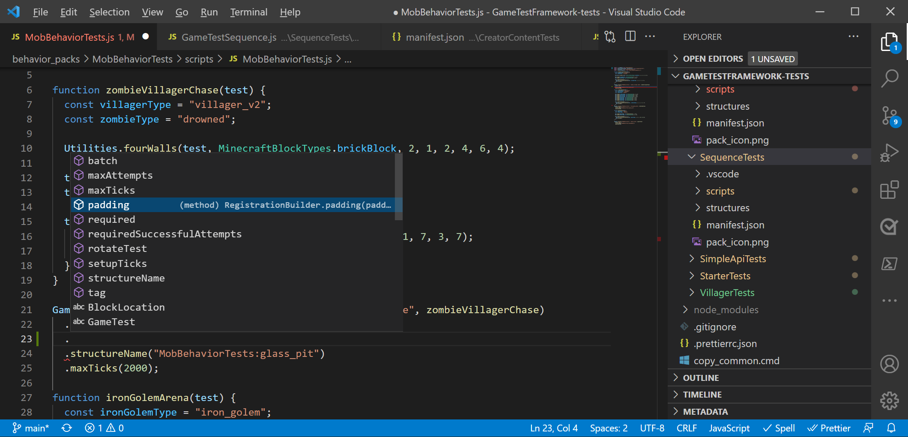
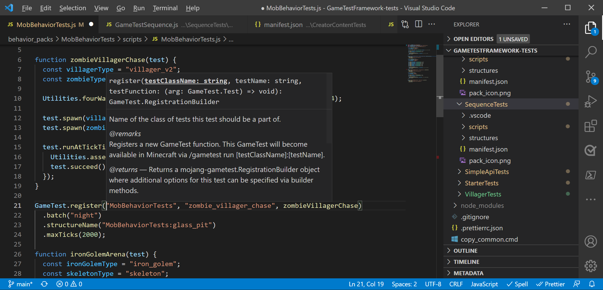
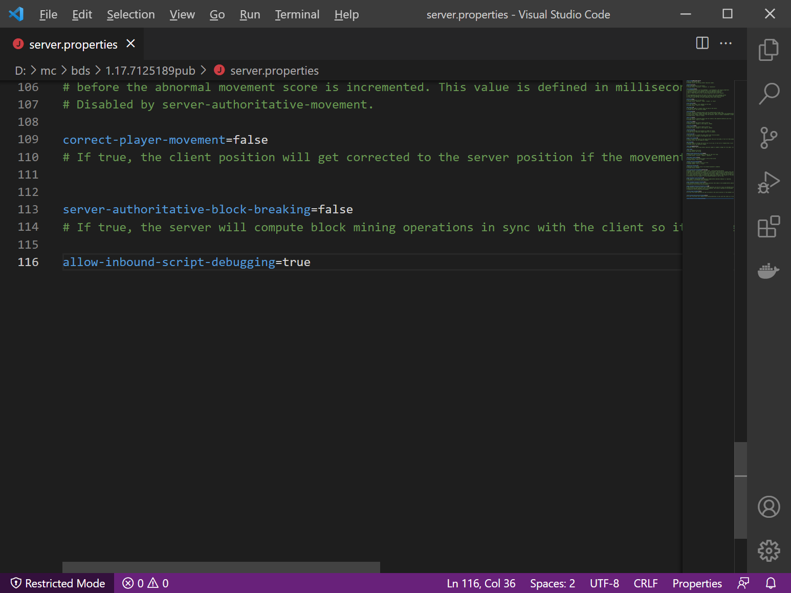
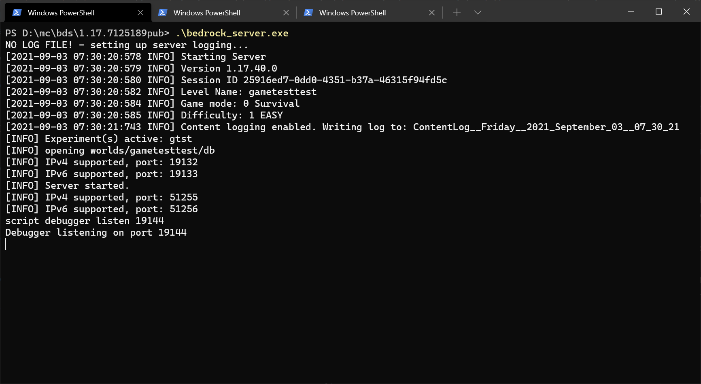
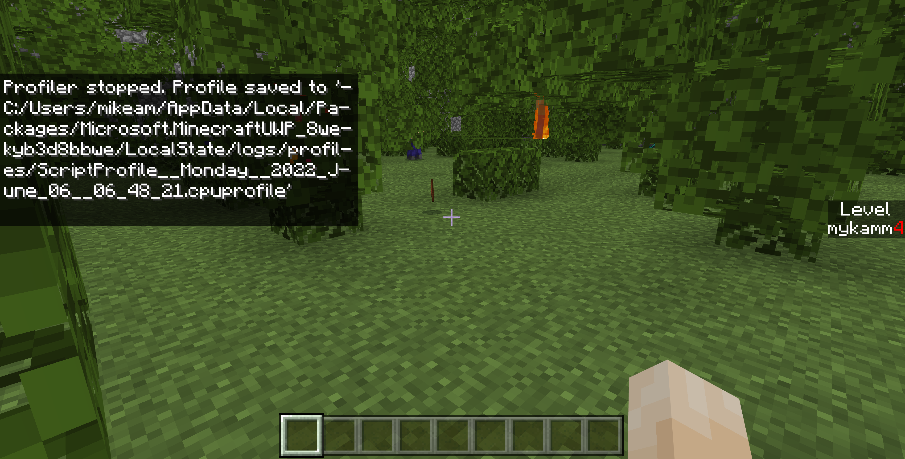
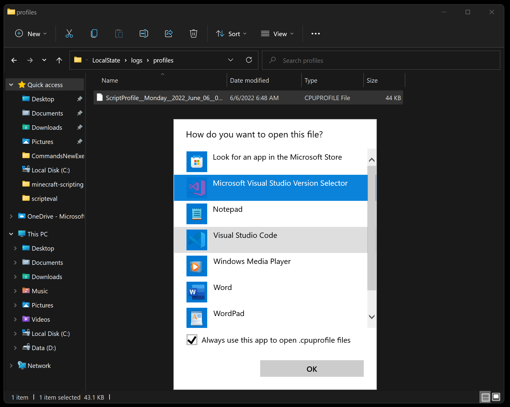
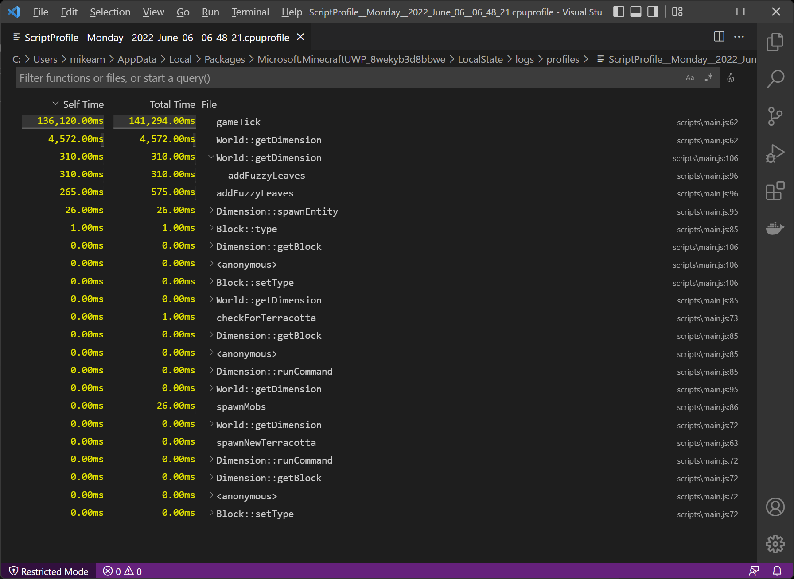
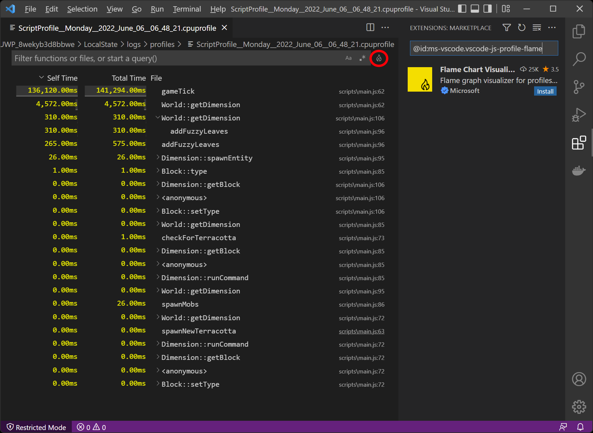

# Developer Tools for Minecraft

There are a few tools that can make the process of writing your JavaScript easier and more fun within Visual Studio Code. In this article, we'll discuss how you can install custom type definitions for Minecraft to provide autocomplete as you work, the Minecraft Script Debugger with breakpoint debugging, the Script Profiler for performance analysis, and visual debugging utilities for in-world debugging.

> [!TIP]
> In the GitHub repository at <https://github.com/microsoft/minecraft-scripting-samples>, there are various starter samples and examples that come with these tools pre-configured, so if you start your project using those, a lot of the configuration work is already done for you.

## Custom type definition files for Visual Studio Code Intellisense

Visual Studio Code can display detailed type information for different libraries to provide hints and code-completion dropdowns as you type. Type information has been made available for scripting modules `@minecraft/server`,`@minecraft/server-ui`, and several beta modules such as `@minecraft/server-gametest`.

To get started, use the Node Package Manager, or NPM. NPM makes it easy to download and install different modules of code within your packages. Install Node.js (which includes NPM) on your development device. More info on installing NPM is available from [nodejs.org](https://nodejs.org). Install the latest LTS version of Node.js to get started.

Once Node.js is installed, getting the latest type definitions is a snap. From Visual Studio Code, open the folder where your behavior pack folder is located and simply run the following commands from a terminal console window:

```powershell
npm i @minecraft/server
npm i @minecraft/server-gametest
```

This will install type definitions in the **node_modules** folder within your project.

To edit with new code hinting, just open up Visual Studio Code. As you write JavaScript, you should see it autocomplete:



and inline reference documentation for types:



>[!Note]

> We are updating these type definitions to match the latest APIs, so be sure to check NPM often to see if there are updated type definitions.

If you wish to access the latest beta API versions of modules, you can use the `@beta` version signifier:

```powershell
npm i @minecraft/server@beta
npm i @minecraft/server-ui@beta
```

## Get insight into your code with Minecraft script debugging

As you build more of a code base in script, you'll want to inspect your code at various points to see the state of variables and test your algorithms. In many starter projects, people start by using commands like Console.log or Chat to print various variables as they go – informally, this is called "print debugging". But for developers, there is a better way! With scripting in Minecraft Bedrock Edition, you can use script debugging capabilities that make inspecting data in Minecraft script a snap.

To get started, you'll want to use Visual Studio Code as your editor for the JavaScript files you've been developing. Steps from there include:

1. Install the Minecraft Bedrock Edition Debugger within Visual Studio Code – you'll need to do this once
1. Open Visual Studio Code within your development_behavior_packs folder
1. Depending on your testing client - either in Bedrock Dedicated Server or within Minecraft Bedrock clients -- connect Minecraft Bedrock Edition and Visual Studio Code
1. Set break points and add watch variables in your code as you go, and then connect Minecraft to Visual Studio Code

### Debugging with Minecraft Bedrock Edition

#### Step 1: Install the Minecraft Bedrock Edition Debugger within Visual Studio Code

To use debugger capabilities, you'll want to install the Minecraft Bedrock Edition Debugger within Visual Studio Code. To do this, please click on the button below to download the **Minecraft Bedrock Edition Debugger** from Visual Studio Code's marketplace.

> [!div class="nextstepaction"]
> [Minecraft Bedrock Edition Debugger](https://aka.ms/vscodescriptdebugger)

#### Step 2: Open Visual Studio Code within your development_behavior_packs folder

In order for the debugger to know where to find your source JavaScript or TypeScript files, you'll need to specifically open up a window of Visual Studio Code relative to the behavior pack where your JavaScript or TypeScript source files are. This may be inside of Minecraft's development behavior packs folder (e.g., `%APPDATA%\Minecraft Bedrock\users\shared\games\com.mojang\development_behavior_packs` for GDK builds), or you may have your source code located in a separate folder (e.g., `c:\projects\myaddon`). (See [GDK Migration on Windows](./../GDKPCProjectFolder.md) for more details on folder locations, including pre-GDK builds.)

Open up a Visual Studio Code window pointed at the folder with your add-on script source.

#### Step 3: Prepare Visual Studio Code for a connection

To debug with Minecraft Bedrock Edition, you'll need to connect from Minecraft and into Visual Studio Code. This set of steps assumes you are debugging on the same Windows machine that you are running Minecraft from, but you can also debug across machines and across clients if you want to. If you are debugging across devices, you may need to open up a port within your firewall on the machine that you are running Visual Studio Code within.

You'll want to configure Visual Studio Code to know how to connect to Minecraft. If you're using a sample project such as the TS starter <https://github.com/microsoft/minecraft-scripting-samples/tree/main/ts-starter>, this **.vscode/launch.json** file is already configured for you. But if you're creating a project from scratch, follow these instructions:

At the root of the behavior pack you want to debug, add a **.vscode** subfolder. Add the following **launch.json** file into that **.vscode** folder.

If your source is in JavaScript and you are developing directly against that source (you do not use a script build process), you'll want to configure **launch.json** as follows:

```json
{
  "version": "0.3.0",
  "configurations": [
    {
      "type": "minecraft-js",
      "request": "attach",
      "name": "Debug with Minecraft",
      "mode": "connect",
      "preLaunchTask": "build",
      "targetModuleUuid": "7c7e693f-99f4-41a9-95e0-1f57b37e1e12",
      "localRoot": "${workspaceFolder}/",
      "port": 19144
   }
  ]
}
```

`localRoot` should point at the folder which contains your behavior pack with script within it.
Port 19144 is the default networking port for Minecraft Script Debugging.

In the example above, `targetModuleUuid` is an optional parameter that specifies the identifier of your script module, which is located in your behavior pack's **manifest.json** file. This is important to use if you are developing add-ons in Minecraft while there are multiple behavior packs with script active.

If your source is in a language like TypeScript that generates JavaScript for Minecraft, you will want to use `sourceMapRoot` and `generatedSourceRoot` parameters in **launch.json**:

```json
{
  "version": "0.3.0",
  "configurations": [
    {
      "type": "minecraft-js",
      "request": "attach",
      "name": "Debug with Minecraft",
      "mode": "connect",
      "preLaunchTask": "build",
      "targetModuleUuid": "7c7e693f-99f4-41a9-95e0-1f57b37e1e12",
      "sourceMapRoot": "${workspaceFolder}/dist/debug/",
      "generatedSourceRoot": "${workspaceFolder}/dist/scripts/",
      "port": 19144
   }
  ]
}
```

Note that `generatedSourceRoot` should point at a folder where your generated JavaScript files (*.js) are stored, for example, the outputs of a TypeScript build process. `sourceMapRoot` should point at a folder where you have source map files&mdash;typically created during your build process&mdash;that tie your generated JavaScript source files back to your potential TypeScript source.

#### Run your Minecraft Behavior Pack

Now that you've prepared Visual Studio Code and prepared your behavior pack, you're ready to start debugging!

Within Visual Studio Code, click the "Debug with Minecraft" option under the Run menu (or hit F5) to start debugging. This will place Visual Studio Code into "Listen Mode", where it awaits a connection from Minecraft.

Start Minecraft and load into a world with your scripting behavior pack.

Use this slash command to connect Minecraft to Visual Studio Code:

```text
/script debugger connect
```

You should see a "Debugger connected to host" response from this command if the connection is successful.


You can set breakpoints in your code by clicking on the left-hand side of the editor, on specific lines of code. As you run the tests in the behavior pack, your breakpoints should be hit. You can also view local variables and add watches as necessary.

### Debugging with Minecraft Bedrock Dedicated Server

The procedure for debugging with Bedrock Dedicated Server is a little different. When debugging with Bedrock Dedicated Server, Bedrock Dedicated Server (not Visual Studio Code) will listen for debug connections initiated from Visual Studio Code. You'll want to start by installing the Minecraft Bedrock Edition Debugger for Visual Studio Code as described above.

#### Configure your Bedrock Dedicated Server

By default, Bedrock Dedicated Servers are not configured to allow debug connections. To enable this debugging, you'll need to change some settings within the `server.properties` file of your Bedrock Dedicated Server.

These settings configure debugging on Bedrock Dedicated Server:

- `allow-outbound-script-debugging` (true/false): enables the `/script debugger connect` command. Defaults to `false`.
- `allow-inbound-script-debugging` (true false): enables the `/script debugger listen` command (and the opening of ports on a server).  Defaults to `false`.
- `force-inbound-debug-port` (number): Locks the inbound debug port to a particular port. This will set the default script debugging port and prevent a user of the `/script debugger listen` command from specifying an alternate port.



Within Bedrock Dedicated Server's console, use this slash command to start listening on a port:

```text
/script debugger listen 19144
```

You should see a "Debugger listening" response from this command.



Within Visual Studio Code, you'll want to configure your debug settings in **launch.json** to have Visual Studio connect to Dedicated Server. To do this, set `mode` to `connect`.

```json
{
    "version": "0.3.0",
    "configurations": [
      {
        "type": "minecraft-js",
        "request": "attach",
        "name": "Debug with Minecraft",
        "mode": "connect",
        "preLaunchTask": "build",
        "sourceMapRoot": "${workspaceFolder}/dist/debug/",
        "generatedSourceRoot": "${workspaceFolder}/dist/scripts/",
        "port": 19144
      }
    ]
  }
```

Now, click **Start Debugging** inside of Visual Studio Code.

As with when you debug against Minecraft clients, you can set breakpoints in your code by clicking on the left-hand side of the editor, on specific lines of code.

### Using the Minecraft Scripting Profiler

A profiler is a set of monitoring code that measures the amount of time spent running various functions. With it, you can identify where most of your time is spent within your scripts. This may then lead you to discovering unexpected function calling patterns that may consume a lot of time.

#### Run the profiler during a typical session for your script

To get started, ensure you have a behavior pack with JavaScript within it. Your first step is to create a profile session, or in other words, log the performance characteristics of your script as you play through the game.

To run the script profiler and start a new profile session, run the following command:

```text
/script profiler start
```

Then, exercise your code by running through and playing Minecraft. You'll want to go through normal gameplay or testing patterns to have your JavaScript exercised in representative ways of how players might encounter your experience.

After a while (several minutes, perhaps), end your profiler session by running the following command:

```text
/script profiler stop
```

This will create a **.cpuprofile** file with a timestamp within your Minecraft log folder.



For GDK builds of Minecraft (version 1.21.120+), the log folder is located at:

`%APPDATA%\Minecraft Bedrock\logs\`

For Minecraft Preview or legacy UWP builds, see [GDK Migration on Windows](./../GDKPCProjectFolder.md) for folder locations.

To view a CPUProfile, simply open it within Visual Studio Code. The first time you open a CPUProfile file, your operating system will ask you how you wish to open the file. Select Open in [Visual Studio Code](https://code.visualstudio.com):



(Note that if you wish to have source links from the profile resolve to your source files correctly, start Visual Studio Code (or set its working directory) within the root of your behavior pack.)

By default, this will give you a simple visual listing of the functions that were called during your CPU Profile session, and the cumulative time that they have taken:



As a developer, you can start to optimize your code to adjust for performance - in this case, perhaps organizing code to share instances of a dimension object rather than repeatedly calling world.getDimension.

Note that within Visual Studio Code, you can install an optional "Flame Chart" plugin by clicking the little flame icon in the upper right of your screen (circled in red, below):



Note: In versions 1.19.10 and beyond, the script profiler has been expanded to support coverage of core Bedrock API calls in addition to overall function calls.

With this profiler capability, you can quickly identify hotspots and where server time is spent, and spend your time optimizing your code where it matters.

### Script debugging command reference

#### Debugger commands

- `/script debugger connect [host] [port]` - Connect to a debugger session
- `/script debugger listen <port>` - Start listening for debugger connections  
- `/script debugger close` - Close debugger connection

#### Profiler commands

- `/script profiler start` - Begin performance profiling session
- `/script profiler stop` - End profiling and generate .cpuprofile file

#### Diagnostics commands

- `/script diagnostics startcapture` - Begin comprehensive diagnostics capture
- `/script diagnostics stopcapture` - End diagnostics capture session

## The Debug-Utilities module

The `@minecraft/debug-utilities` module lets you render visual debug information directly in the game world. These tools are particularly useful for debugging spatial logic, entity behaviors, and world interactions.

### Visual debug shapes

- **DebugBox**: Render wireframe boxes to visualize collision bounds, regions, or areas of interest
- **DebugSphere**: Display spherical debug markers for radius-based calculations
- **DebugLine**: Draw lines between points to visualize connections, paths, or directions
- **DebugArrow**: Show directional indicators for vectors, movement, or facing directions
- **DebugCircle**: Render circular indicators for range or area effects
- **DebugText**: Display text labels in 3D world space for labeling objects or showing values

### Runtime monitoring

- **Runtime Statistics**: Use `collectRuntimeStats()` to gather memory usage and performance metrics for script runtimes
- **Plugin Statistics**: Use `collectPluginStats()` to collect type usage stats for each active script plugin/add-on
- **Watchdog Controls**: Use `disableWatchdogTimingWarnings()` to control performance warning thresholds

For more details, consult the [`debug-utilities` reference page](../../ScriptAPI/minecraft/debug-utilities/minecraft-debug-utilities.md).

## The Diagnostics module

The `@minecraft/diagnostics` module provides Sentry integration for comprehensive error tracking and monitoring:

```javascript
import { sentry } from '@minecraft/diagnostics';

// Initialize error tracking
sentry.initialize({
    dsn: 'your-sentry-dsn',
    environment: 'development'
});

// Capture errors with context
try {
    // Your script logic
} catch (error) {
    sentry.captureException(error, {
        level: SentryEventLevel.Error,
        extra: { customData: 'debugging info' }
    });
}
```

For more details, consult the [`diagnostics` reference page](../../ScriptAPI/minecraft/diagnostics/minecraft-diagnostics.md).

## Troubleshooting common issues

### Debugger won't connect

If running `/script debugger connect` gives "Failed to connect" or times out, check the following:

1. Verify VS Code is in "listening" mode (you should see "Waiting for debugger to connect..." in the Debug Console)
2. Ensure you ran the loopback exemption command as the administrator.
3. Check that port 19144 isn't blocked by firewall or antivirus software.
4. Verify **launch.json** has the correct port number.
5. Try restarting both Minecraft and VS Code.

### Breakpoints not triggering

If you've set breakpoints but they don't seem to be doing anything, check the following:

1. If you're using TypeScript, verify `sourceMapRoot` and `generatedSourceRoot` paths in **launch.json** are correct.
2. Ensure you're setting breakpoints in the source file, not the compiled output.
3. Add a `console.warn()` debugging statement to verify the code path is actually being run.
4. If you have multiple behavior packs with scripts, specify a `targetModuleUuid` in **launch.json**.
5. **Reload needed**: Run `/reload` after connecting the debugger if scripts were already running

### Profiler not generating output

If `/script profiler stop` doesn't create a **.cpuprofile** file, check the following:

1. Ensure you have write permissions to the logs folder.
2. Wait a few seconds after stopping before looking for the file.
3. Check both the logs folder and the root of your Minecraft data folder.
4. Verify there's a script actually running (profiles are empty without script activity).

### Console messages not generating output

If your `console.warn()` calls aren't showing up anywhere, try the following:

1. Enable **Content Log File** in Settings > Creator.
2. Enable **Content Log GUI** to see messages in-game.
3. Check the log file in the logs folder (not just **content_log.txt**).
4. Ensure your script is actually loading (check for errors at the top of the log).

### Type definitions not working

If Visual Studio Code doesn't show autocomplete for Minecraft APIs, make sure that `@minecraft/server` is installed in your project's **node_modules** directory. If it isn't, run `npm_install` in your project folder, and restart Code's TypeScript server. If there are still problems, check that `@minecraft/server` is listed as a package dependency.

### Script changes not taking effect

If it doesn't look like your script changes are being reflected in the world, check the following:

1. Run `/reload` to reload scripts without leaving the world.
2. Exit and re-enter the world for manifest changes.
3. Clear **development\_behavior\_packs** and redeploy for stubborn issues.
4. Verify your build process completed successfully (check for TypeScript errors).

## Summary

That's it! Between updated code helpers as you add lines of JavaScript or TypeScript, the extensive debugging and profiling capabilities within Visual Studio Code, and the visual debugging and diagnostics tools, we hope you'll be able to build, debug, and optimize complex creations in Minecraft: Bedrock Edition much more quickly.

For more debugging strategies and common error patterns, see [Debugging Scripts in Minecraft](./debugging-scripts.md).
