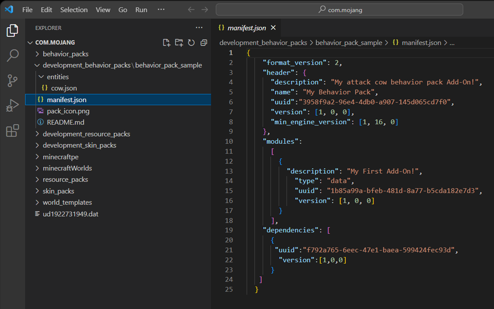
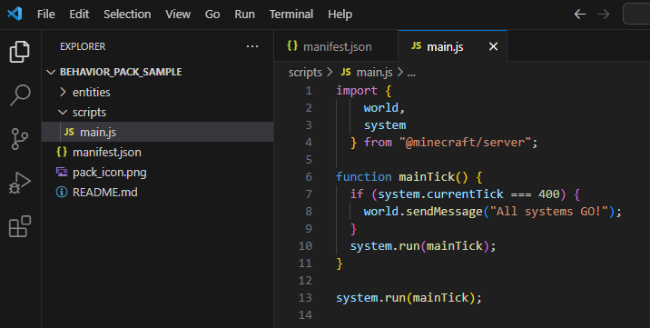
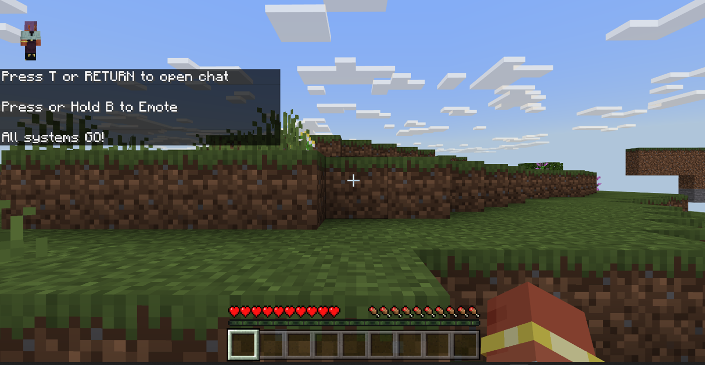
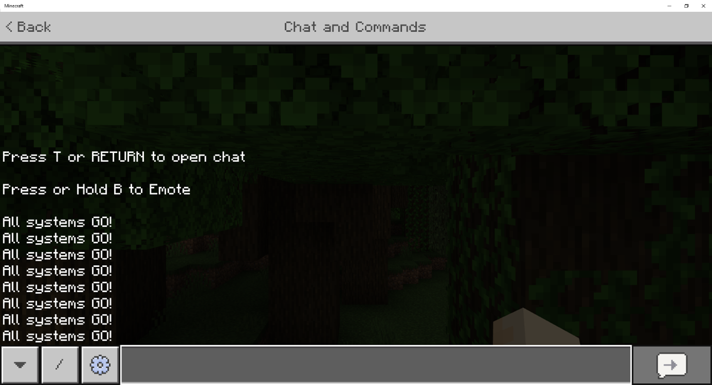
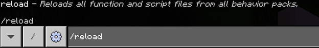
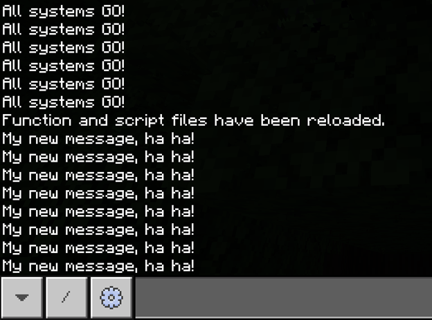
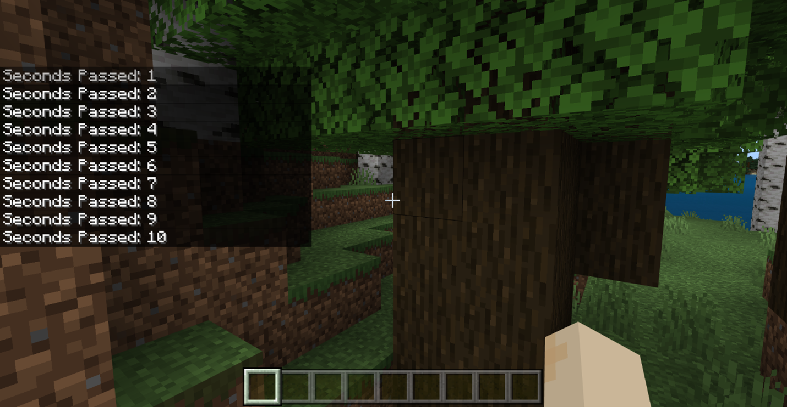
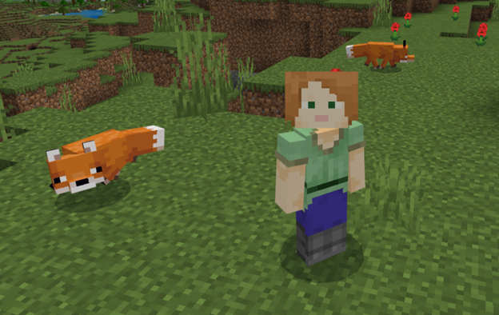
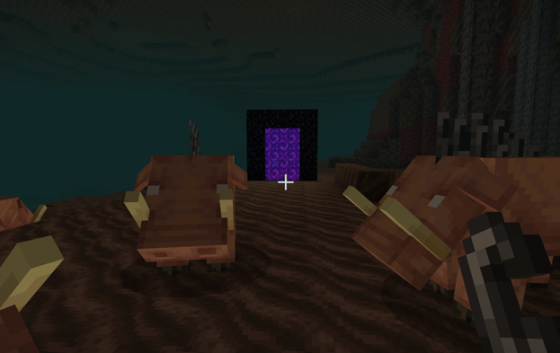
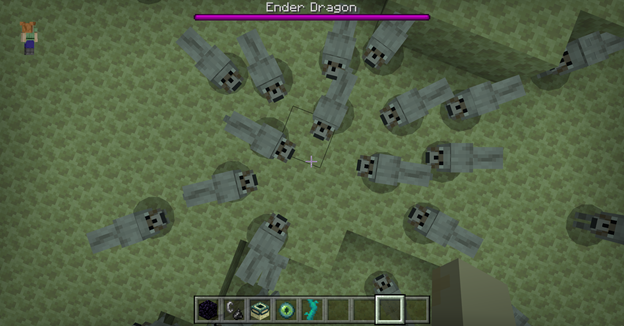

# Introduction to Scripting in Minecraft

Add-Ons in Minecraft: Bedrock Edition let you do a lot of customization through changing properties and textures, from new behaviors to entire new entities. With _scripting,_ you can take customization to a whole new level. A _script_ is essentially a program, a set of instructions for Minecraft to perform at certain times or in response to events and actions. Scripts can control entities, blocks, and items, manipulate the world, and even create entirely new game mechanics!

Bedrock Edition uses a programming language called JavaScript for scripting. This is a popular language originally introduced to make more complex websites and web applications; now it's used for many more applications, including extensions for Minecraft. If you've never written any programs before, don't worry&mdash;this tutorial should break things down enough for you to quickly pick up the basics. If you want to go into more detail, though, you can check out Microsoft's [Beginner JavaScript Tutorial](/shows/beginners-series-to-javascript/).

> [!TIP]
> Actually, a lot of Minecraft scripts are written in a dialect of JavaScript called [TypeScript](https://www.typescriptlang.org/), which we'll delve into in [Next Steps: Scripting with TypeScript](../scripting/next-steps.md). TypeScript adds additional syntax and features to JavaScript, although it requires a few additional steps to get up and running. Everything you learn in this tutorial applies to TypeScript, too, though!

## Prerequisites

You'll need a computer running Windows 10 or 11, and, of course, Minecraft: Bedrock Edition. Before you begin, you should have completed the Getting Started with Add-Ons tutorial and the Introduction to Behavior Packs tutorial.

- [Getting Started with Add-On Development](../GettingStarted.md)
- [Introduction To Behavior Packs](../BehaviorPack.md)

It should be clear to you how add-on folders must be structured, and what the required files in the behavior pack (such as **manifest.json**) should contain.

You'll need a text editor, ideally one that's designed for programming. [Visual Studio Code](https://code.visualstudio.com/) is an excellent choice, and has some [Minecraft-specific tools](./developer-tools.md) that will come in handy when you start developing more complicated scripts.

This tutorial uses the Attack Code sample behavior pack from the Minecraft Samples GitHub repository. If you haven't already downloaded it, here's how:

If you have never downloaded and used a sample behavior pack, here's how:

1. Go to <https://github.com/microsoft/minecraft-samples/tree/main> in your web browser. Click the green **Code** button, and select **Download ZIP** from the drop-down menu.
1. Open your Downloads folder and extract the **minecraft-samples-main** zipped folder contents.
1. Inside the extracted **minecraft-samples-main** folder, find the **behavior\_pack\_sample** folder and open it.
1. Look at the **README.md** file inside and follow the instructions to deploy the behavior pack.

## Displaying a message using scripting

Our first goal is to make Minecraft display a little message without the player having to lift a finger. It's just a small task, but it demonstrates that we can make things happen automatically in Minecraft using a script.

To get there, we're going to start with the Attack Cow behavior pack, add the files we need for scripting, and then run the script in a Minecraft world.

### Setup and test the Attack Cow Behavior Pack

1. If you haven't already followed this step from the README, copy the **sample_behavior_pack** into the **development_behavior_packs** folder in your **com.mojang** folder.
1. Launch Minecraft and create a survival world with cheats on and the Attack Cow behavior pack activated in it. It needs to be a survival world because the cow's attack behavior won't work in a creative world, and cheats should be on so you can summon a cow.
1. Summon a cow using the `/summon` command and make sure it attacks you, as expected. Now we know all systems are go!
1. Save & Quit the world to return to the Minecraft Main Menu screen.

### Add a script to the Behavior Pack

1. Minimize Minecraft and open your **sample_behavior_pack** in Visual Studio Code.

2. Open and view the **manifest.json** file.

    

3. In the manifest file, we need to add a new module (our script) as well as a new dependency (`@minecraft/server`, a module that contains information that we will use in writing our script). This tells the game that our script exists and that it should be processed. So, replace the contents of the **manifest.json** file with this:

   ```json
   {
       "format_version": 2,
       "header": {
         "description": "My scripting behavior pack Add-On!",
         "name": "My Behavior Pack",
         "uuid":"PUT A NEW UUID HERE",
         "version": [1, 0, 0],
         "min_engine_version": [1, 20, 30]
       },
       "modules":
         [
           {
             "description": "My Second Add-On!",
               "type": "data",
               "uuid": "PUT A NEW UUID HERE",
               "version": [1, 0, 0]
           },
           {
             "description": "Test Scripting",
               "type": "script",
               "uuid": "PUT A NEW UUID HERE",
               "version": [1, 0, 0],
               "entry": "scripts/main.js"
           }
         ],
       "dependencies": [
         {
           "module_name":"@minecraft/server",
           "version":"1.5.0"
         }
      ]
     }
   ```

4. Replace the three instances of **`PUT A NEW UUID HERE`** with new [UUIDs](https://www.uuidgenerator.net/), just like you did in the [Introduction to Behavior Packs](../BehaviorPack.md) tutorial.

5. Save your edited **manifest.json** file.

6. In the **behavior_pack_sample** folder, create a folder and name it **scripts** and open it.

7. Create a file inside there and name it **main.js**.

8. Copy this code into **main.js**:

    ```javascript
    import {
        world,
        system
      } from "@minecraft/server";

    function mainTick() {
      if (system.currentTick === 400) {
        world.sendMessage("All systems GO!");
      }
      system.run(mainTick);
    }

    system.run(mainTick);
    ```

9. Save **main.js**.

    When you're done, it should look like this:

    

10. Go back to Minecraft, create a world with the behavior pack activated. When you go into the world, your test message will appear after about 20 seconds.

    

    That proves your script is working. Neat!

11. Save & Quit the world and go back to your **main.js** file.

For this particular script, you must create a new world if you want to update the message in **"world.sendMessage"** and check that it has updated. Even if you leave the world and come back, the world picks up at the tick where it left off&mdash;so you'll never see the new message! (If you know about the `/reload` command, that won't work either, for the same reason: the 400th tick has already passed. If you don't know about `/reload`, we'll be covering it later in the tutorial.)

> [!CAUTION]
> As this example demonstrates, you should be very careful and intentional when relying on a specific tick to execute logic&mdash;it will only execute once in a given world, ever!

### Walking through the first example

Here's what's happening in the code above...

The `import` part at the top of the script tells Minecraft your script needs to bring in **classes** from the Minecraft game. A class describes an object in the game and allows you to perform actions on that object. Everything between the `{` curly braces `}` is a class:

- [`System`](../../ScriptAPI/minecraft/server/System.md) has the property `currentTick`.
- [`World`](../../ScriptAPI/minecraft/server/World.md) has the function `sendMessage`, which we used to send a message to the screen.

Other examples of classes include [`Player`](../../ScriptAPI/minecraft/server/Player.md), [`Entity`](../../ScriptAPI/minecraft/server/Entity.md), and [`Block`](../../ScriptAPI/minecraft/server/Block.md). You can read about all of the available classes in the [@minecraft/server module documentation](../../ScriptAPI/minecraft/server/minecraft-server.md).

The `from`part of the `import` statement tells Minecraft which module your requested classes are defined in. A module stores a bunch of classes and APIs that you can use. There are several modules in Minecraft, but the most important one that contains most of the basic classes and APIs is `@minecraft/server`.

Next, we define a `function`, a block of code that completes a specific task. This function is named `mainTick` because we are using it to define the main game loop. A **game loop** is a sequence of processes (such as updating entity movement, detecting player input and acting on it, or updating the weather) that run over and over again to continuously update the game. A tick describes the time it takes to run the game loop once, which in Minecraft is 1/20th of a second (so 1 second = 20 ticks). The word "tick" can also describe one run through of the game loop, which is why our function is described as the "main tick."

The `System.run` function allows you to provide the name of a function to run during that game tick. This line at the bottom of the file...

```javascript
system.run(mainTick);
```

... calls our function `mainTick` for the first time. If we did not add this line, the function would be defined but not called, so it would not run and nothing would happen.

The contents of the `mainTick` function start with this:

```javascript
if (system.currentTick === 400) {
  world.sendMessage("All systems GO!");
}
```

An `if` statement is a conditional. The part in the parentheses, `system.currentTick === 400`, tests a condition, and if the condition is true, the code within the `{` curly braces `}` is executed. If it isn't, the code is skipped. So, what this code says is that when `currentTick` is equal to `400`, then the system should send a message to the world reading "All systems GO!".

There's one last line in the function: `system.run(mainTick)` again. That makes sure that we'll run this check again on every tick. Without this line, then only the `run` at the bottom of the file, outside the function, would be executed&mdash;and our function would only run on the very first tick. As it's written, the function executes on ticks 1, 2, 3, and so on, without printing anything, until it reaches tick 400 and sends it message.

## Hot reloading

Most scripts you'll write won't be tied to a specific tick in the world&mdash;they might execute, for instance, every 200 ticks. It'd be nice to not have to close the game and reopen it just to reload the script, let alone have to actually create a whole new world, right? Well, that's where hot reloading comes in. It lets you reload your script while you're still inside the world, so the running game gets updated to use the latest version of your script. This lets you test changes almost instantly.

We can test this with our current script by making a small change that lets it work with hot reloading.

If you're still running the world, select **Save and Quit** in Minecraft.

In **main.js**, change the `if` statement from this:

```javascript
if (system.currentTick === 400)
```

to this:

```javascript
if (system.currentTick % 200 === 0)
```

The `%` is known as the _modulo operator,_ and it is used to obtain the remainder of a division between two integers. So, the condition the `if` statement tests is now "is the remainder of `currentTick` divided by 200 equal to 0?" So the test will be true every 200 ticks, rather than being true solely on the 400th tick. Now, "All systems GO!" will be sent to the world every 10 seconds.

Let's test to make sure the change works correctly. Save **main.js** and open the world again. Now the message should be displayed every ten seconds.



Now that we know our program works, let's use it to learn how hot reloading works. This time, _do not save and quit the world._ Keep Minecraft running in the background while you switch back to Visual Studio Code. (You might want to switch your game to Creative Mode to keep monsters from creeping up on you!)

Back in **main.js**, change your printed message to something else, like "My new message, ha ha!" Save the file.

Now, let's see if hot reloading works. Switch back to Minecraft with your still-running world, and run the command `/reload`.



A message will appear stating that your function and script files have been reloaded, followed by your new message:



With that powerful tool now in your toolbox, let's write a couple more cool scripts!

## Using a variable to count seconds

Next, we'll implement a simple script that counts the seconds that pass from the beginning of world load.

Replace your entire **main.js** file with the following code:

```javascript
import {
    world,
    system
  } from "@minecraft/server";

let secondsPassed = 0;

function mainTick() {
  if (system.currentTick % 20 === 0) {
    secondsPassed += 1;
    world.sendMessage("Seconds Passed: " + secondsPassed);
  }
  system.run(mainTick);
}

system.run(mainTick);
```

A **variable** is a name that can be assigned a changeable value. For instance, a cheeseburger at a fast food restaurant has a price that can go up or down (but probably mostly up); in a computer program, that price could be tracked with a variable named `cheeseburgerPrice`. Our script uses a variable named `secondsPassed` to keep track of passing seconds.

```javascript
let secondsPassed = 0;
```

The `let` statement gives the variable a name, and then initializes it with the value `0`. The next time `secondsPassed` is accessed in code, it's going to have this value.

> [!TIP]
> A variable can store lots of different types of values, not just numbers. They could store text (known as "strings" in code), boolean `true` or `false` values, arrays (lists), and even complicated objects like you've seen in JSON files used by Minecraft. JSON stands for "JavaScript Object Notation."

Our variable, `secondsPassed`, is declared in the main part of the script (not inside a function), so it is referred to as a **global variable**. Global variables can be used/changed inside any functions or any part of your script (within the same file). If you declare a variable inside a function, inside an `if` block, or inside a `for` loop&mdash;basically, any block of code between `{` curly braces `}`&mdash;it becomes a **local variable**, and its definition and value is specific to that block. A local variable doesn't exist outside its block.

The next thing to notice here is that inside the `if` statement, we're checking every 20 ticks. Since 20 ticks equals 1 second, we run the code between the braces every second. In that block, we increment `secondsPassed` by 1 and send a message with the new value:

```javascript
secondsPassed += 1;
world.sendMessage("Seconds Passed: " + secondsPassed);
```

The expression `+=`, the increment operator, is a shorthand way to say "add this much to the named variable." The message sent by `sendMessage` is the text "Seconds Passed: " (note the space at the end) concatenated with the value of `secondsPassed`. (JavaScript lets you use `+` for concatenation as well as addition, and it converts `secondsPassed` to a string&mdash;that is, text&mdash;value type automatically. In many other languages you'd have to use a different concatenation operator and use an extra function for type conversion.)

Go back into your world, reload your script, and view the result:



## Conditional spawn entity script

In this next example, we'll write a script that spawns an entity every 10 seconds. If we are in the Overworld, a fox will be spawned. If we are in the Nether, a hoglin will be spawned. In any other dimension, a wolf will be spawned. Ready? Let's go!



A script like this will require us to use an `if` statement, use a few more variables, write a few more functions, and learn how to spawn entities.

Based on our description above of what we want our script to do, here's the basic code we need to write. Replace **main.js** with the following:

```javascript
import {
    world,
    system
  } from "@minecraft/server";

function mainTick() {
  if (system.currentTick % 200 === 0) {
    const playerDimension = getPlayerDimension();
    const playerLocation = getPlayerLocation();
    if (playerDimension !== undefined && playerLocation !== undefined) {
      if (/* we are in the Overworld */) {
        // spawn a fox
      }
      else if (/* we are in the Nether */) {
        // spawn a hoglin
      }
      else {
        // spawn a wolf
      }
    }
  }
  system.run(mainTick);
}

system.run(mainTick);
```

Instead of printing a message every second, we'll execute this code every 10 seconds.

First, let's take a look inside the `if` statement that is checking for every 200th tick.

The first two lines declare variables named `playerDimension` and `playerLocation`,  initialized to `getPlayerDimension()` and `getPlayerLocation()`.

If Coded is yelling at you about these function calls, have no fear; we haven't defined them yet, but we will soon. Just know for now that this is how we are obtaining the player's dimension and location.

We used the keyword **const** to declare the `playerDimension` and `playerLocation` variables instead of the keyword `let`. This is because we do not want the values inside these variables to be accidentally or intentionally changed later on in the code: `const` stands for "constant". This helps us avoid accidental errors as we work on our script. When we want to allow a variable to change, like `secondsPassed` in the previous script, we'll use the keyword `let`.

The first `if` statement checks that `playerDimension` and `playerLocation` are not undefined&mdash;that is, that they have values&mdash;so we can use them in our code. If you try to use something undefined, you will get errors! The `!==` operator means "does not equal", and the `&&` operator means "and". So we only run the code inside that `if` statement if `playerDimension` does not equal undefined and `playerLocation` does not equal undefined.

So what are the `/* */` and `//` characters? Those denote comments in code; they're messages to humans reading the source, but the computer ignores them when processing the script. In this case, they're just notes to let us know what we need to write next: what the conditions the `if` statements are checking, and what needs to happen when the conditions are true.

- The first `if` statement checks to see if we're in the Overworld; if we are, we spawn a fox.
- The second `if` statement checks to see if we're in the Nether; if we are, we spawn a hoglin. Note that this `if` statement is preceded by `else`: this means that it gets checked only if the _first_ if block fails. Tead this as "if this thing is true, do this thing; otherwise, check to see if this other thing is true, and if it is, do this other thing".
- Finally, there's an `else` without an accompanying `if`: if neither of the first two conditions are met, then spawn a wolf.

So the whole block here is, in English: "If the player is in the Overworld, spawn a fox; else if the player is in the Nether, spawn a hoglin; else, since neither of those are true, spawn a wolf." You can chain as many `else if` constructs as you need after the first `if`.



Now, let's replace those comments with code!

First, we need a way to access the player's dimension (to check which dimension we're in) and the player's location (to know where to spawn the entity). We will do that by implementing the functions that we called above, `getPlayerDimension()` and `getPlayerLocation()`.

Copy and paste these three functions above the `mainTick` function:

```javascript
function getPlayer() {
  const allPlayers = world.getAllPlayers();
  if (allPlayers.length === 0) {
    return undefined;
  }

  return allPlayers[0];
}

function getPlayerDimension() {
  const player = getPlayer();
  if (player === undefined) {
    return undefined;
  }
  return player.dimension;
}

function getPlayerLocation() {
  const player = getPlayer();
  if (player === undefined) {
    return undefined;
  }
  return player.location;
}
```

The function `mainTick` does not have a `return` statement like these functions do. That is because `mainTick` is a function whose task does not need to return a result to the code. However, in these functions, the tasks are intended to give us specific information that we are requesting, such as the player's dimension and the player's location. Thus, wherever we call these functions, that information will be returned to us for us to use.

In the first function, `getPlayer()`, we attempt to obtain and return Player 1.

First, we call `world.getAllPlayers()` to get an **array** (a kind of list) of all of the players in the world. We store that array in a variable called `allPlayers`. If that array were empty, we would get errors if we tried to access a player from the array. So, we check that there are indeed players in that array by making sure that the length of the array of players is greater than zero. The `if` statement performs the check and if it comes back `true` that the array is empty, the `getPlayer()` function returns a status of `undefined`.

If the array is not empty, then the function returns the first player in the array, which is denoted as `allPlayers[0]`.

>[!NOTE]
>In most programming languages, `0` denotes the first item in an array, and you access the first item by putting `[0]` on the end of the array's name. You can access the second item with `[1]`, the third item with `[2]`, and so on. Always make sure the array's length is what you expect before accessing items willy nilly!

In the next two functions, we use the `getPlayer()` function that we just created to get the player, store it in a variable called `player`, and then return the player's dimension and location properties. Just like before, we will need to assure that `player` is NOT `undefined` before accessing the player's properties, or we will get an error.

Next, let's add our checks that will tell us which dimension the player is in. To do this, we need to access the Dimension's ID property, to check whether it matches either "minecraft:overworld", "minecraft:nether", or anywhere else, like so:

```javascript
  if (playerDimension.id === "minecraft:overworld") {
      // spawn a fox 
  } 
  else if (playerDimension.id === "minecraft:nether") {
       // spawn a hoglin 
  } 
  else { 
      // spawn a wolf 
  } 
```

Now, let's use the [spawnEntity function](../../ScriptAPI/minecraft/server/Dimension.md#spawnentity) from the [Dimension class](../../ScriptAPI/minecraft/server/Dimension.md) to spawn these entities.

This function is a little different than the ones we've come across so far, because it takes in parameters.

A **parameter** in a function is a piece of data that you give to the function as input, that will affect its output value.

For example, the `spawnEntity` function takes in two arguments: the `identifier` of the entity you want to spawn, and the `location` where you want it to spawn. These input values affect the output because you are telling the function which entity to spawn and where. We must provide these parameters within the parentheses at the end of the function.

For the first parameter, `identifier`, we will provide `"minecraft:fox"`, `"minecraft:hoglin"`, or `"minecraft:wolf"`.

For the second parameter, `location`, we will provide the player's location using the variable we made above, `playerLocation`.

Here are the completed `if` statements:

```javascript
  if (playerDimension.id === "minecraft:overworld") { 
      playerDimension.spawnEntity("minecraft:fox", playerLocation); 
  } 
  else if (playerDimension.id === "minecraft:nether") { 
      playerDimension.spawnEntity("minecraft:hoglin", playerLocation); 
  } 
  else { 
      playerDimension.spawnEntity("minecraft:wolf", playerLocation);
  }
```

Now it is apparent why we store some values inside variables, such as `playerDimension` and `playerLocation`. This greatly helps with reuse of values and conciseness of code.

And that's it! We have implemented our script that spawns foxes in the Overworld, hoglins in the Nether, and wolves in every other dimension! (Spoiler alert: the only other dimension is the End.)

Here is how your whole script should look by the end (no pun intended):

```javascript
import {
    world,
    system
  } from "@minecraft/server";

function getPlayer() {
  const allPlayers = world.getAllPlayers();
  if (allPlayers.length === 0) {
    return undefined;
  }

  return allPlayers[0];
}

function getPlayerDimension() {
  const player = getPlayer();
  if (player === undefined) {
    return undefined;
  }
  return player.dimension;
}

function getPlayerLocation() {
  const player = getPlayer();
  if (player === undefined) {
    return undefined;
  }
  return player.location;
}

function mainTick() {
  if (system.currentTick % 200 === 0) {
    const playerDimension = getPlayerDimension();
    const playerLocation = getPlayerLocation();
    if (playerDimension !== undefined && playerLocation !== undefined) {
      if (playerDimension.id === "minecraft:overworld") { 
        playerDimension.spawnEntity("minecraft:fox", playerLocation); 
      } 
      else if (playerDimension.id === "minecraft:nether") { 
        playerDimension.spawnEntity("minecraft:hoglin", playerLocation); 
      }
      else {
        playerDimension.spawnEntity("minecraft:wolf", playerLocation);
      }
    }
  }
  system.run(mainTick);
}

system.run(mainTick);
```

Go back to the game, run `/reload`, and observe the magic! You will have to build portals to the other dimensions to test if the script works correctly in those dimensions, but I'll let you figure out that part on your own. The only advice I'll give is to do it in Creative mode, or else it'll take mighty long to test them out!



## Next steps

You can spend lots and lots of time learning all about JavaScript. There are free (and not-so-free) resources on the Internet where you can learn everything you want to know about JavaScript.

Here is another link to [Microsoft's Beginner Series to: JavaScript tutorial](/shows/beginners-series-to-javascript/). Everything you'll learn about JavaScript applies to Typescript as well!

To learn more about what we did in this tutorial, look into:

>- Variables (global and local)
>- JavaScript data types like number, Boolean, float, string, array
>- Classes and objects
>- Conditional (`if/else`) statements
>- import statement/modules
>- functions

You can use what you learn about JavaScript to change these scripts and decide what happens in your Minecraft world!

### Advanced topics

When you're more comfortable with JavaScript, you can research the more advanced things you will need for Typescript and scripting in general:

>- The NPM ecosystem
>- Node.js
>- TypeScript
>- Loops like `for` and `while`
>- Using more code files to organize your project
>- Debugging

## Wrapping up

You have graduated from Scripting 101! To continue building on your coding skills, please move on to the [Next Steps: Scripting with TypeScript](./next-steps.md) tutorial! There, you'll download some tools to make your life much easier as a scripter and take your knowledge to the next level by learning how to implement a functioning game in TypeScript.

You'll also learn how to take advantage of all of the goodness of TypeScript and the Node/NPM ecosystem like:

>- Intellisense / autocomplete (a game changer)
>- Inline reference documentation for types (always good to have handy)
>- Static typing, which helps prevent errors in the long run and makes it much easier to update to new versions of the API when you want to use new features (worth it)
>- Easier debugging due to errors surfacing during compile time, as opposed to runtime (a real time saver)

These may just sound like abstract coding terms, but trust me, the benefits of going through our TypeScript setup will make your scripting experience go much more smoothly once you begin to expand your knowledge and write more complex scripts. Also, all of our samples are written in TypeScript, so you will have lots of examples to test out! Please give it a go once you feel you've gotten the basics down from this tutorial&mdash;you won't regret it!
