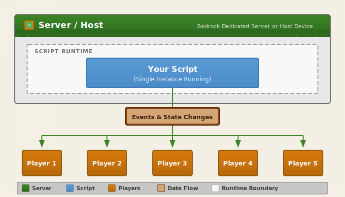

# Building Multiplayer-Aware Scripts

Writing scripts for single-player Minecraft is straightforward, but multiplayer introduces complexity around player management, event handling, and ensuring all players see consistent behavior. This guide covers how to write scripts that work correctly whether there's one player or twenty.

In this tutorial, you'll learn:

> [!div class="checklist"]
>
> - The basics of the Minecraft server-client architecture
> - How to manage multiple players effectively
> - How to handle player join and leave events
> - How to avoid common multiplayer pitfalls

## Prerequisites

- Familiarity with the Script API basics
- Understanding of event handling in Minecraft scripts
- Experience creating at least one scripted add-on

## Understanding multiplayer architecture

A key point of Bedrock's server/client architecture is that scripts run on the _server_ side, not the _client_ side. This has a few important implications:

- The state of the world is shared between players.
- The script sees all the entities (including players) in the world.
- Your code can't assume there's just a single player in the world.
- Likewise, your code can't assume there are _any_ players in the world, especially during startup.



This means that it's up to you to keep track of state across the world. Your script needs to know which player triggered which event, to make sure that it's filtering the entities/players it's acting on so it's only affecting the correct ones, and so on.

## Managing multiple players

Players have unique IDs that persist across sessions:

```javascript
import { world } from "@minecraft/server";

// Store per-player data
const playerData = new Map();

// Initialize player data on join
world.afterEvents.playerSpawn.subscribe((event) => {
    if (event.initialSpawn) {
        const player = event.player;
        playerData.set(player.id, {
            joinTime: Date.now(),
            score: 0,
            team: null
        });
    }
});

// Clean up on leave
world.afterEvents.playerLeave.subscribe((event) => {
    playerData.delete(event.playerId);
});

// Access player data
function getPlayerData(player) {
    return playerData.get(player.id);
}
```

Dynamic properties are retained across server restarts, so you can use those when data needs to be persisted across different play sessions of a world:

```javascript
import { world } from "@minecraft/server";

// Save data to a player (persists with the world)
function savePlayerScore(player, score) {
    player.setDynamicProperty("game:score", score);
}

// Load data from a player
function loadPlayerScore(player) {
    return player.getDynamicProperty("game:score") ?? 0;
}

// World-level data (shared across all players)
function saveWorldHighScore(score) {
    world.setDynamicProperty("game:highScore", score);
}
```

## Handling player events

### Player spawning

The [`PlayerSpawnAfterEvent` signal](../../ScriptAPI/minecraft/server/PlayerSpawnAfterEventSignal.md) fires after a player spawns, including initial join and respawns:

```javascript
import { world } from "@minecraft/server";

world.afterEvents.playerSpawn.subscribe((event) => {
    const player = event.player;
    
    if (event.initialSpawn) {
        // Player just joined the world
        handlePlayerJoin(player);
    } else {
        // Player respawned after death
        handlePlayerRespawn(player);
    }
});

function handlePlayerJoin(player) {
    player.sendMessage("Welcome to the server!");
    initializePlayerData(player);
}

function handlePlayerRespawn(player) {
    player.sendMessage("You respawned!");
}
```

### Player leaving

The [`PlayerLeaveAfterEvent` signal](../../ScriptAPI/minecraft/server/PlayerLeaveAfterEventSignal.md) fires after a player disconnects from the server:

```javascript
import { world } from "@minecraft/server";

world.afterEvents.playerLeave.subscribe((event) => {
    // Note: player object is no longer valid
    // Only playerId and playerName are available
    const playerId = event.playerId;
    const playerName = event.playerName;
    
    // Save any data before cleanup
    savePlayerProgress(playerId);
    
    // Clean up per-player data
    cleanupPlayer(playerId);
    
    // Notify other players
    for (const player of world.getAllPlayers()) {
        player.sendMessage(`${playerName} left the game`);
    }
});
```

If needed, there is also a [`PlayerLeaveBeforeEvent` signal](../../ScriptAPI/minecraft/server/PlayerLeaveBeforeEventSignal.md) that can be subscribed to.

## Common multiplayer pitfalls

Earlier, we described the implications of Minecraft: Bedrock Edition's multiplayer architecture. Here are a few ways to make sure you avoid the most common pitfalls those implications create:

- Don't treat the game as if it's always single-player. It might be that way in testing, but it won't necessarily be when it's released!

    ```javascript
    // BAD: Assumes one player
    const player = world.getAllPlayers()[0];
    player.sendMessage("Hello!");

    // GOOD: Handle all players
    for (const player of world.getAllPlayers()) {
        player.sendMessage("Hello!");
    }

    // GOOD: Target specific player from event
    world.afterEvents.itemUse.subscribe((event) => {
        const player = event.source;  // The player who used the item
        player.sendMessage("You used an item!");
    });
    ```

    Similarly, if information needs to be tracked per player, you should store that information using the player's ID value as an index. If you're keeping score for players in a game, for instance:

    ```javascript
    const playerScores = new Map();

    function getScore(player) {
        return playerScores.get(player.id) ?? 0;
    }

    function setScore(player, score) {
        playerScores.set(player.id, score);
    }
    ```

- Clean up data structures when players leave the game.

    ```javascript
    const playerTimers = new Map();

    world.afterEvents.playerSpawn.subscribe((event) => {
        if (event.initialSpawn) {
            playerTimers.set(event.player.id, Date.now());
        }
    });

    // The timer created above should be deleted when the player leaves.
    // Otherwise, the playerTimers map grows forever!
    world.afterEvents.playerLeave.subscribe((event) => {
        playerTimers.delete(event.playerId);
    });
    ```

- Watch out for race conditions.

    ```javascript
    // BAD: Player might not be fully loaded
    world.afterEvents.playerSpawn.subscribe((event) => {
        if (event.initialSpawn) {
            // Player might not be ready for all operations
            event.player.teleport({ x: 0, y: 100, z: 0 });
        }
    });

    // GOOD: Delay sensitive operations
    import { system } from "@minecraft/server";

    world.afterEvents.playerSpawn.subscribe((event) => {
        if (event.initialSpawn) {
            const player = event.player;

            // Wait for player to be fully loaded
            system.runTimeout(() => {
                if (player.isValid()) {
                    player.teleport({ x: 0, y: 100, z: 0 });
                }
            }, 20); // 1 second delay
        }
    });
    ```

- When your code works with player entities, check to make sure the player hasn't left the game.

    ```javascript
    import { system } from "@minecraft/server";

    // BAD: Player might have left
    system.runTimeout(() => {
        player.sendMessage("Delayed message");
    }, 100);

    // GOOD: Check player is still valid
    system.runTimeout(() => {
        if (player.isValid()) {
            player.sendMessage("Delayed message");
        }
    }, 100);
    ```

## See also

- [Introduction to Scripting](./introduction.md)
- [Error Handling Best Practices](./error-handling.md)
- [Script API Reference](../../ScriptAPI/index.yml)
- [Debugging Scripts](./debugging-scripts.md)
