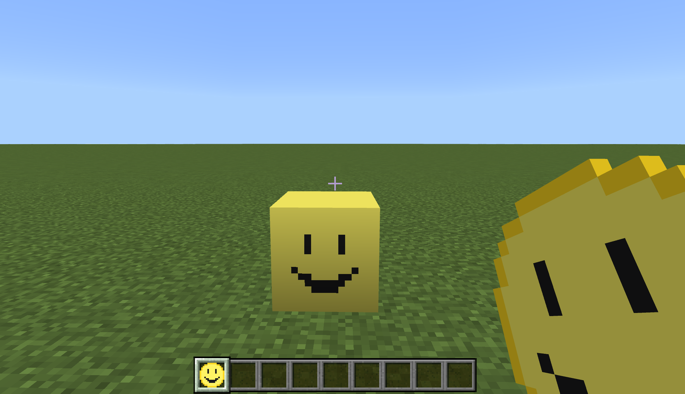
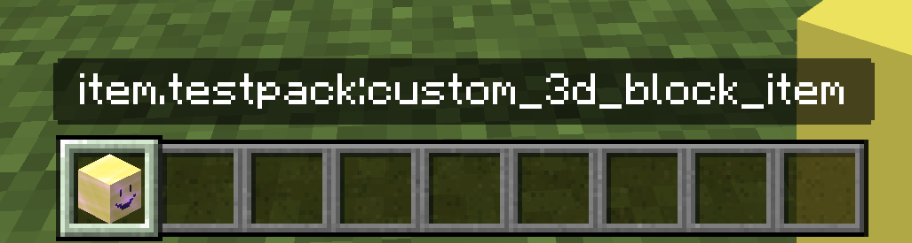
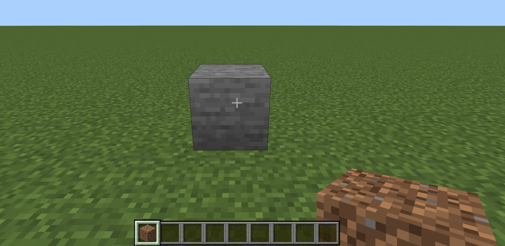

# Customizing the Item for a Block

The `"minecraft:block_placer"` item component (added in version `1.20.10`) allows you to specify the block that an item places. 

As of `1.21.40`, there are additions to this component (behind the "Upcoming Creator Features" toggle) that allow you to further link and customize the item for your block.
The `"minecraft:item_visual"` block component (behind the "Upcoming Creator Features" toggle) allows you to specify alternate geometry and materials for a block's item.
## Overriding the Default Item for a Block

Previously, the `"minecraft:block_placer"` component did not support overriding the default item created for a block. When you create a data-driven block, a default item is automatically created. This item is returned by default when the placed block is picked or broken, and is displayed in the inventory if the `menu_category` is defined for the block. 

Items with `"minecraft:block_placer"` would place the block, but would not be able to be used as the default item for the block. 

With `"minecraft:block_placer"` version `1.21.40` and the "Upcoming Creator Features" toggle, you can use the `"replace_block_item"` field to specify the item that should be used as the default item for the block. The identifier of your custom item must also match the identifier of the block. This is because you can have any number of custom items that place the same block, but each block can only have one "default" item that is explicitly linked to it.

### Block Example

```json

{
  "format_version": "1.21.40",
  "minecraft:block": {
    "description": {
      "identifier": "testpack:custom_block_with_icon",
      "menu_category": {
        "category": "items",
        "group": "itemGroup.name.custom"
      }
    },
    "components": {
      "minecraft:geometry": {
        "identifier": "minecraft:geometry.full_block"
      },
      "minecraft:material_instances": {
        "*": {
          "texture": "custom_texture"
        }
      }
    }
  }
}
```

### Item Example

```json
{
  "format_version": "1.21.40",
  "minecraft:item": {
    "description": {
    "identifier": "testpack:custom_block_with_icon"
    },
    "components": {
      "minecraft:icon": {
        "textures": {
          "default": "custom_block_icon"
        }
      },
      // other components here
      "minecraft:block_placer": {
        "block": "testpack:custom_block_with_icon",
        "replace_block_item": true
      }
    }
  }
}
```



## Use the BlockPlacer Component to Define the Item Icon

The `"minecraft:block_placer"` component, when used with the "Upcoming Creator Features" toggle, can be used to define the item icon for the block. This is useful if you want to create a custom item that renders the block it places or add components other than the `"minecraft:icon"` component to the overridden default item for your block, as shown in the example. 

If you create an item with the `"minecraft:block_placer"` component and do not add a `"minecraft:icon"` component, the item will use the block's icon. You can then add other components to this block placer item like `"minecraft:glint"` or `"minecraft:enchantable"`.

Item Example:

```json
{
  "format_version": "1.21.40",
  "minecraft:item": {
    "description": {
    "identifier": "testpack:custom_3d_block_item"
    },
    "components": {
      "minecraft:block_placer": {
        "block": "testpack:custom_block"
      },
      "minecraft:glint": true
    }
  }
}
```



## Use ItemVisual Component to Specify an Item Icon for a Block

The `"minecraft:item_visual"` block component, when used with the "Upcoming Creator Features" toggle, can be used to specify alternate geometry and materials for a block's item. This is helpful when you are creating a custom block and want to change the way the default block item display looks.

When using the `"minecraft:item_visual"` block component, you will need to provide a `"geometry"` and `"material_instances"` parameter which map to the existing `"minecraft:geometry"` and `"minecraft:material_instances"` components respectively.

Both `minecraft:geometry` and `minecraft:material_instances` components are required when using the `minecraft:item_visual` component.

Example:
```json
{
  "format_version": "1.21.60",
  "minecraft:block": {
    "description": {
      "identifier": "testpack:custom_block_with_item_visual",
      "menu_category": {
        "category": "items",
        "group": "itemGroup.name.custom"
      }
    },
    "components": {
      "minecraft:geometry": {
        "identifier": "minecraft:geometry.full_block"
      },
      "minecraft:material_instances": {
        "*": {
          "texture": "dirt"
        }
      },
      "minecraft:item_visual": {
        "geometry": {
          "identifier": "minecraft:geometry.full_block"
        },
        "material_instances": {
          "*": {
          "texture": "stone",
          "render_method": "opaque"
          }
        }
      }
    }
  }
}
```

This is an image of a custom block that looks like dirt in your hand and hotbar, but looks like stone when you place it.


