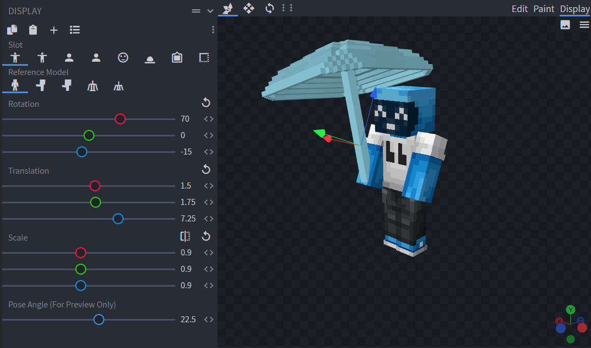
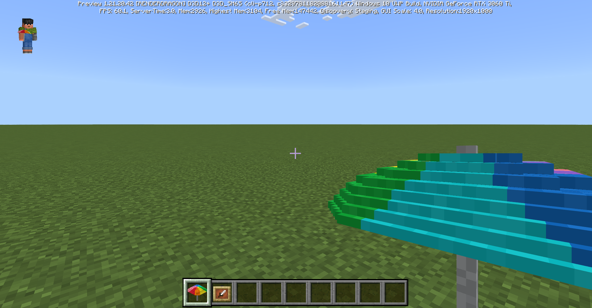
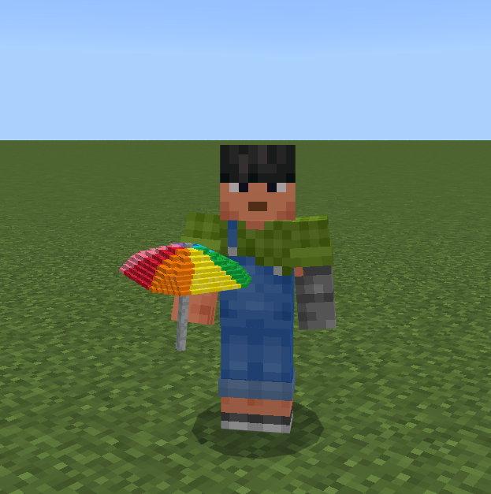
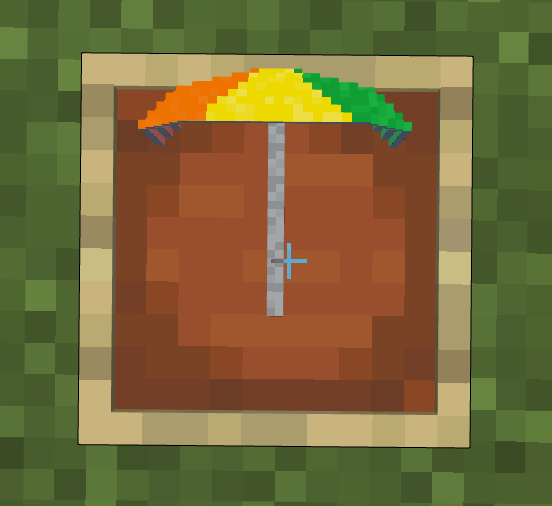
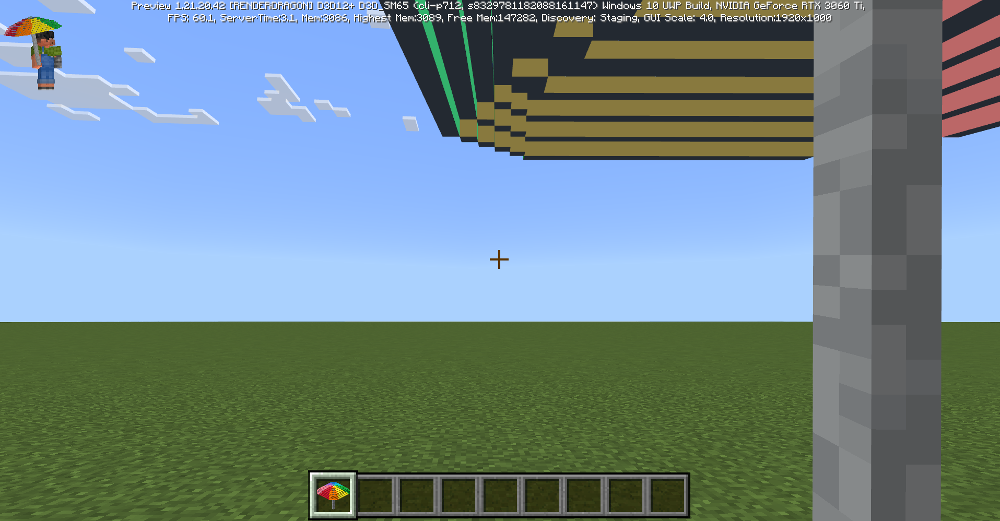
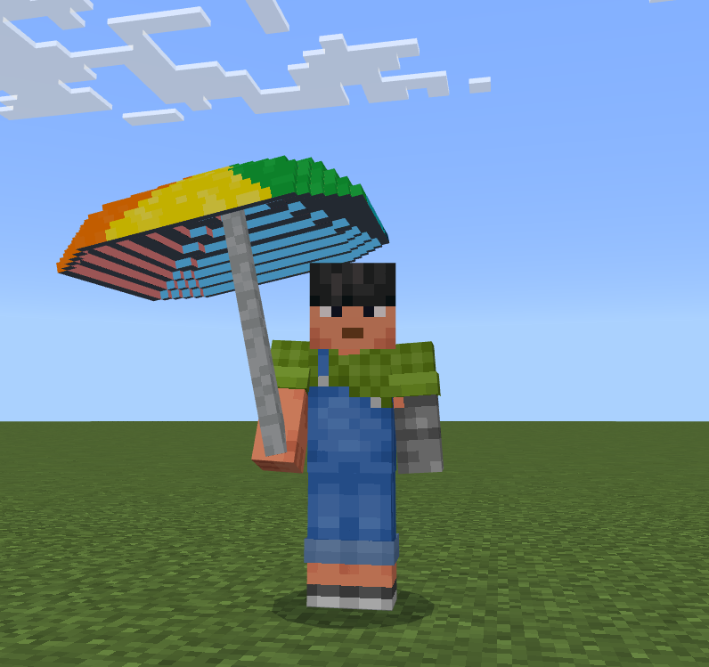
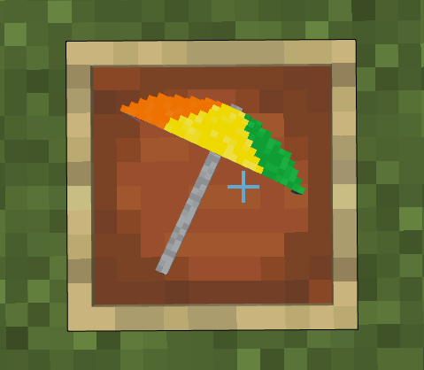

# Advanced Block Visuals - Item Display Transforms

For custom blocks that do not use a basic 1x1x1 cube geometry or have multiple rotation states, the item representation of the block can look a bit odd with the standard block item orientation. To change how a custom block looks in any of the scenarios where the block is rendered as an item, the `"item_display_transforms"` field in the geometry can be used to configure a custom orientation to properly display the block geometry.

> ![Note]
> You must use geometry version `1.21.0` or greater and the `Upcoming Creator Features` toggle to use `"item_display_transforms"`.

## What are ItemDisplayTransforms

`"item_display_transforms"` allow you to configure the `"translation"`, `"rotation"`, `"scale"`, `"rotation_pivot"`, and `"scale_pivot"` used to render a custom block geometry in the following item scenarios: 

- First Person main hand - `"firstperson_righthand"`
- First Person off hand - `"firstperson_lefthand"`
- Third Person main hand - `"thirdperson_righthand"`
- Third Person off hand - `"thirdperson_lefthand"`
- Item Frame - `"fixed"`
- Floating Item Entity - `"ground"`
- Inventory/Gui - `"gui"`

**Example**

```json
{ 
  "format_version": "1.21.0",
  "minecraft:geometry": [ 
    { 
      "description": { 
        "identifier": "geometry.example",
      }, 
      "bones": [ 
        ...
      ],
      "item_display_transforms" : {
        "gui": {
            "rotation": [0, 45, 0],
            "translation": [0, 0, 0],
            "scale": [1, 1, 1]
        },
        ...
      }
    }
  ]
}
```

The default values for the item scenarios are:

```json
"gui" : {
    "translation": [0, 0, 0],
    "rotation": [30, 225, 0],
    "scale": [0.625, 0.625, 0.625]
  },
  "firstperson_righthand": {
    "translation": [0, 0, 0],
    "rotation": [0, 45, 0],
    "scale": [0.4, 0.4, 0.4]
  },
  "firstperson_lefthand": {
    "translation": [0, 0, 0],
    "rotation": [0, -135, 0],
    "scale": [0.4, 0.4, 0.4]
  },
  "thirdperson_righthand": {
    "translation": [0, 2.5, 0],
    "rotation": [75, 45, 0],
    "scale": [0.375, 0.375, 0.375]
  },
  "thirdperson_lefthand": {
    "translation": [0, 2.5, 0],
    "rotation": [75, 45, 0],
    "scale": [0.375, 0.375, 0.375]
  },
  "ground": {
    "translation": [0, 3.0, 0],
    "rotation": [0, 0, 0],
    "scale": [0.25, 0.25, 0.25]
  },
  "fixed": {
    "translation": [0, 0, 0],
    "rotation": [0, 0, 0],
    "scale": [0.5, 0.5, 0.5]
  },
  "head": {
    "translation": [0, 0, 0],
    "rotation": [0, 0, 0],
    "scale": [1, 1, 1]
  }
```

The defaults for all `"scale_pivot"` and `"rotation_pivot"` values are `[0, 0, 0]`. 

The valid ranges for all parameters are:

- `"translation"` : `[-80, -80, -80]` to `[80, 80, 80]`
- `"rotation"` : `[-360, -360, -360]` to `[360, 360, 360]`
- `"scale"` : `[0, 0, 0]` to `[4, 4, 4]`
- `"scale_pivot"` : `[-80, -80, -80]` to `[80, 80, 80]`
- `"rotation_pivot"` : `[-80, -80, -80]` to `[80, 80, 80]`

## Blockbench

The "Display" tab in the Blockbench model editor will help you to figure out what your block model looks like with custom `"item_display_transforms"`. 



> [!NOTE]
> This feature is currently in development for Bedrock edition models. If you convert your model to a Java model, you should be able to use the values from the "Display" tab for your Bedrock model `"item_display_transforms"`. 

## Example - The Umbrella Block

If you load the umbrella block from the ["Advanced Block Visuals: Sizing and Culling"](../../../../Documents/CustomBlockOversized.md) tutorial, you should see that it looks like this in the following item scenarios:

### First person main hand



### Third person main hand



### Item Frame



Because this is an umbrella block, we'd like it to look like the player is holding the umbrella. 

Currently, the geometry for the umbrella block looks like this:

```json
{ 
  "format_version": "1.12.0", 
  "minecraft:geometry": [ 
    { 
      "description": { 
        "identifier": "geometry.umbrella", 
        "texture_width": 128, 
        "texture_height": 128, 
        "visible_bounds_width": 3, 
        "visible_bounds_height": 3.5, 
        "visible_bounds_offset": [0, 1.25, 0] 
      }, 
      "bones": [ 
        { 
          "name": "umbrella", 
          "pivot": [0, 13, 0], 
          "cubes": [ 
            {"origin": [-3, 28, -5], "size": [6, 1, 2], "uv": [0, 3]}, 
            {"origin": [-5, 27, -7], "size": [10, 1, 2], "uv": [66, 53]}, 
            {"origin": [-5, 27, 5], "size": [10, 1, 2], "uv": [66, 37]}, 
            {"origin": [5, 27, -5], "size": [2, 1, 10], "uv": [66, 42]}, 
            {"origin": [-7, 27, -5], "size": [2, 1, 10], "uv": [36, 64]}, 
            {"origin": [-9, 26, -7], "size": [2, 1, 14], "uv": [18, 64]}, 
            {"origin": [7, 26, -7], "size": [2, 1, 14], "uv": [0, 63]}, 
            {"origin": [9, 25, -9], "size": [2, 1, 18], "uv": [46, 62]}, 
            {"origin": [11, 24, -10], "size": [1, 1, 20], "uv": [44, 21]}, 
            {"origin": [12, 23, -10], "size": [1, 1, 20], "uv": [0, 42]}, 
            {"origin": [13, 22, -10], "size": [1, 1, 20], "uv": [22, 1]}, 
            {"origin": [14, 21, -10], "size": [1, 1, 20], "uv": [0, 21]}, 
            {"origin": [-12, 24, -10], "size": [1, 1, 20], "uv": [44, 0]}, 
            {"origin": [-13, 23, -10], "size": [1, 1, 20], "uv": [22, 43]}, 
            {"origin": [-14, 22, -10], "size": [1, 1, 20], "uv": [22, 22]}, 
            {"origin": [-15, 21, -10], "size": [1, 1, 20], "uv": [0, 0]}, 
            {"origin": [-11, 25, -9], "size": [2, 1, 18], "uv": [44, 43]}, 
            {"origin": [-9, 25, 9], "size": [18, 1, 2], "uv": [66, 21]}, 
            {"origin": [-9, 25, -11], "size": [18, 1, 2], "uv": [66, 16]}, 
            {"origin": [-10, 24, -12], "size": [20, 1, 1], "uv": [66, 14]}, 
            {"origin": [-10, 23, -13], "size": [20, 1, 1], "uv": [66, 10]}, 
            {"origin": [-10, 22, -14], "size": [20, 1, 1], "uv": [66, 6]}, 
            {"origin": [-10, 21, -15], "size": [20, 1, 1], "uv": [66, 2]}, 
            {"origin": [-10, 23, 12], "size": [20, 1, 1], "uv": [66, 8]}, 
            {"origin": [-10, 22, 13], "size": [20, 1, 1], "uv": [66, 4]}, 
            {"origin": [-10, 21, 14], "size": [20, 1, 1], "uv": [66, 0]}, 
            {"origin": [-10, 24, 11], "size": [20, 1, 1], "uv": [66, 12]}, 
            {"origin": [-7, 26, 7], "size": [14, 1, 2], "uv": [66, 34]}, 
            {"origin": [-7, 26, -9], "size": [14, 1, 2], "uv": [66, 31]}, 
            {"origin": [-7, 26, -7], "size": [2, 1, 2], "uv": [6, 16]}, 
            {"origin": [-9, 25, -9], "size": [2, 1, 2], "uv": [12, 12]}, 
            {"origin": [-9, 25, 7], "size": [2, 1, 2], "uv": [12, 9]}, 
            {"origin": [7, 25, 7], "size": [2, 1, 2], "uv": [12, 6]}, 
            {"origin": [9, 24, 9], "size": [2, 1, 2], "uv": [6, 10]}, 
            {"origin": [9, 24, -11], "size": [2, 1, 2], "uv": [0, 9]}, 
            {"origin": [10, 23, -12], "size": [1, 1, 1], "uv": [25, 27]}, 
            {"origin": [10, 22, -13], "size": [1, 1, 1], "uv": [25, 9]}, 
            {"origin": [10, 21, -14], "size": [1, 1, 1], "uv": [0, 24]}, 
            {"origin": [11, 21, -13], "size": [1, 1, 1], "uv": [15, 23]}, 
            {"origin": [12, 21, -12], "size": [1, 1, 1], "uv": [22, 22]}, 
            {"origin": [13, 21, -11], "size": [1, 1, 1], "uv": [22, 18]}, 
            {"origin": [11, 22, -12], "size": [1, 1, 1], "uv": [25, 7]}, 
            {"origin": [12, 22, -11], "size": [1, 1, 1], "uv": [22, 24]}, 
            {"origin": [11, 23, -11], "size": [1, 1, 1], "uv": [15, 27]}, 
            {"origin": [11, 23, 10], "size": [1, 1, 1], "uv": [22, 26]}, 
            {"origin": [12, 22, 10], "size": [1, 1, 1], "uv": [12, 24]}, 
            {"origin": [13, 21, 10], "size": [1, 1, 1], "uv": [22, 16]}, 
            {"origin": [12, 21, 11], "size": [1, 1, 1], "uv": [22, 14]}, 
            {"origin": [11, 21, 12], "size": [1, 1, 1], "uv": [22, 12]}, 
            {"origin": [10, 21, 13], "size": [1, 1, 1], "uv": [22, 10]}, 
            {"origin": [11, 22, 11], "size": [1, 1, 1], "uv": [8, 24]}, 
            {"origin": [10, 22, 12], "size": [1, 1, 1], "uv": [4, 24]}, 
            {"origin": [10, 23, 11], "size": [1, 1, 1], "uv": [12, 26]}, 
            {"origin": [-11, 23, 11], "size": [1, 1, 1], "uv": [8, 26]}, 
            {"origin": [-11, 22, 12], "size": [1, 1, 1], "uv": [25, 23]}, 
            {"origin": [-11, 21, 13], "size": [1, 1, 1], "uv": [22, 8]}, 
            {"origin": [-12, 21, 12], "size": [1, 1, 1], "uv": [22, 6]}, 
            {"origin": [-13, 21, 11], "size": [1, 1, 1], "uv": [14, 21]}, 
            {"origin": [-14, 21, 10], "size": [1, 1, 1], "uv": [6, 21]}, 
            {"origin": [-12, 22, 11], "size": [1, 1, 1], "uv": [25, 17]}, 
            {"origin": [-13, 22, 10], "size": [1, 1, 1], "uv": [25, 15]}, 
            {"origin": [-12, 23, 10], "size": [1, 1, 1], "uv": [4, 26]}, 
            {"origin": [-12, 23, -11], "size": [1, 1, 1], "uv": [0, 26]}, 
            {"origin": [-13, 22, -11], "size": [1, 1, 1], "uv": [15, 25]}, 
            {"origin": [-14, 21, -11], "size": [1, 1, 1], "uv": [13, 18]}, 
            {"origin": [-13, 21, -12], "size": [1, 1, 1], "uv": [0, 18]}, 
            {"origin": [-12, 21, -13], "size": [1, 1, 1], "uv": [14, 3]}, 
            {"origin": [-11, 21, -14], "size": [1, 1, 1], "uv": [14, 0]}, 
            {"origin": [-12, 22, -12], "size": [1, 1, 1], "uv": [25, 13]}, 
            {"origin": [-11, 22, -13], "size": [1, 1, 1], "uv": [25, 11]}, 
            {"origin": [-11, 23, -12], "size": [1, 1, 1], "uv": [25, 25]}, 
            {"origin": [-11, 24, -11], "size": [2, 1, 2], "uv": [6, 7]}, 
            {"origin": [-11, 24, 9], "size": [2, 1, 2], "uv": [0, 6]}, 
            {"origin": [7, 25, -9], "size": [2, 1, 2], "uv": [0, 12]}, 
            {"origin": [-7, 26, 5], "size": [2, 1, 2], "uv": [12, 15]}, 
            {"origin": [5, 26, 5], "size": [2, 1, 2], "uv": [0, 15]}, 
            {"origin": [5, 26, -7], "size": [2, 1, 2], "uv": [6, 13]}, 
            {"origin": [-5, 27, 3], "size": [2, 1, 2], "uv": [22, 3]}, 
            {"origin": [-5, 27, -5], "size": [2, 1, 2], "uv": [22, 0]}, 
            {"origin": [3, 27, -5], "size": [2, 1, 2], "uv": [8, 21]}, 
            {"origin": [3, 27, 3], "size": [2, 1, 2], "uv": [0, 21]}, 
            {"origin": [-3, 28, 3], "size": [6, 1, 2], "uv": [0, 0]}, 
            {"origin": [-5, 28, -3], "size": [10, 1, 6], "uv": [66, 24]}, 
            {"origin": [-1, 0, -1], "size": [2, 30, 2], "uv": [0, 78]} 
          ]
        }
      ]
    } 
  ]
} 
```

The `"item_display_transforms"` to make the umbrella look like the player is holding it are as follows:
```json
{ 
  "format_version": "1.12.0", 
  "minecraft:geometry": [ 
    { 
      "description": { 
        "identifier": "geometry.umbrella", 
        ...
      }, 
      "bones": [ 
        ...
      ],
      "item_display_transforms" : {
        "thirdperson_righthand": {
          "rotation": [70, 0, -15],
          "translation": [1.5, 1.75, 7.25],
          "scale": [0.9, 0.9, 0.9]
        },
        "firstperson_righthand": {
          "rotation": [0, 0, 0],
          "translation": [1.5, 3, 1],
          "scale": [0.9, 0.9, 0.9]
        },
        "fixed": {
          "rotation": [0, 0, 25],
          "translation": [2.5, -3.5, 0],
          "scale": [0.5, 0.5, 0.5]
        }
      }
    }
  ]
}
```

Now the block should look like this:

### First person main hand



### Third person main hand



### Item Frame



