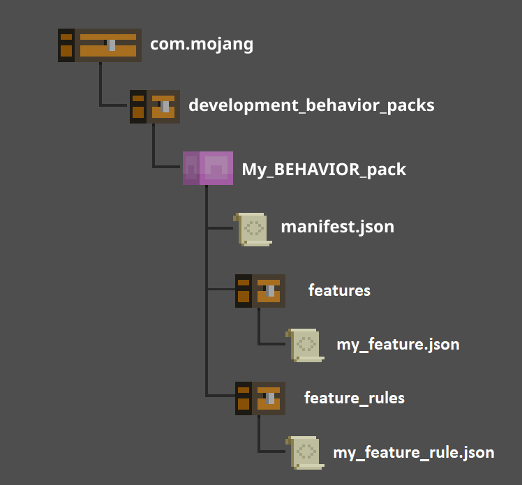

# Features Documentation - Introduction to Features

Features are decorations scattered throughout the world. Things such as trees, plants, flowers, springs, ore, and coral are all features. Basically, if it isn't the terrain or an entity, it's probably a feature!

Features can be standalone or composed of multiple sub-features. In practice, most features in Minecraft are defined as a chain of two or more features. These chains typically end with features that place blocks in the world. Other feature types control flow such as conditional, sequential, or random distribution.

## JSON Format

All features must specify the version that they target via the "format_version" field. The remainder of the data is contained in independent JSON sub-objects for each supported feature type. These feature types define the behavior of the feature and include properties specific to that behavior. To be valid, a definition must include exactly one of these type objects. See the full feature schema below for additional details and the full list of supported feature types.

### Example

A comparison of different versions for the same feature.

**Version 1.13.0**

```json
{
  "format_version": "1.13.0",
  "minecraft:scatter_feature": {
    "description": {
      "identifier": "example:scatter_flowers_feature"
    },
    "places_feature": "example:flower_feature",
    "iterations": 10,
    "scatter_chance": 50.0,
    "x": {
      "distribution": "uniform",
      "extent": [ 0, 15 ]
    },
    "y": 64,
    "z": {
      "distribution": "uniform",
      "extent": [ 0, 15 ]
    }
  }
}
```

**Version 1.21.10**

Uses "distribution" field to define the scattering settings.

```json
{
  "format_version": "1.21.10",
  "minecraft:scatter_feature": {
    "description": {
      "identifier": "example:scatter_flowers_feature"
    },
    "places_feature": "example:flower_feature",
    "distribution": {
      "iterations": 10,
      "scatter_chance": 50.0,
      "x": {
        "distribution": "uniform",
        "extent": [ 0, 15 ]
      },
      "y": 64,
      "z": {
        "distribution": "uniform",
        "extent": [ 0, 15 ]
      }
    }
  }
}
```

## Adding Features

Features are read from JSON files in the "features" subfolder of behavior packs. Loading enforces one feature per file; the file name and the name of the feature must match. Feature names can include a namespace of the form `"namespace:feature_name"` to help distinguish them from features that may be in other behavior packs.
This namespace is not considered when matching the filename to the feature name. For example, in a file called `"my_tree_feature.json"`, both `"my_tree_feature"` and `"my_pack_name:my_tree_feature"` would be valid identifiers.

If two behavior packs define the same feature name (including namespace), then the feature from the highest pack in the stack will be used. This allows users to override base features.

### Behavior pack definition

To add features, you need to know the behavior pack structure for them.
In your behavior pack folder you will want to create a **features** folder and  **feature_rules** folder. These two folders will contain all of the required JSON files to define your features.

The `"min_engine_version"` for the pack needs to be 1.20.20.

The features system does not require a resource pack.



If you are using structures in your features that contain custom blocks or items, you will need to follow the resource pack setup that adds the dependency of a resource pack.

There are examples of structures in the [structure blocks sample behavior pack](https://github.com/microsoft/minecraft-samples/blob/main/structure_blocks_sample_behavior_pack/README.md).
There's more information about behavior pack and resource pack dependencies in the [Introduction to Behavior Packs](../../../../Documents/BehaviorPack.md#create-the-dependency).

## Supported features

| Name| Description |
|:-----------|:-----------|
| [minecraft:aggregate_feature](Features\minecraftAggregate_feature.md)| A collection of features in an arbitrary order.|
| [minecraft:cave_carver_feature](Features\minecraftCave_carver_feature.md)| Carves a cave through the world in the current chunk, and in every chunk around the current chunk in an 8 radial pattern.|
| [minecraft:fossil_feature](Features\minecraftFossil_feature.md)| Generates a skeletal structure composed of bone blocks and parametric ore blocks.
| [minecraft:geode_feature](Features\minecraftGeode_feature.md)| Generates a rock formation to simulate a geode.|
| [minecraft:growing_plant_feature](Features\minecraftGrowing_plant_feature.md)| Places a growing plant in the world.|
| [minecraft:nether_cave_carver_feature](Features\minecraftNether_cave_carver_feature.md)| Carves a cave through the Nether in the current chunk, and in every chunk around the current chunk in an 8 radial pattern.|
| [minecraft:multiface_feature](Features\minecraftMultiface_feature.md)| Places one or a few multiface blocks on floors/walls/ceilings.|
| [minecraft:ore_feature](Features\minecraftOre_feature.md)| Places a vein of blocks to simulate ore deposits.|
| [minecraft:scatter_feature](Features\minecraftScatter_feature.md)| Scatters a feature throughout a chunk.|
| [minecraft:search_feature](Features\minecraftSearch_feature.md)| Sweeps a volume searching for a valid placement location for its referenced feature.|
| [minecraft:sequence_feature](Features\minecraftSequence_feature.md)| A collection of features sequentially, in the order they appear in data.|
| [minecraft:single_block_feature](Features\minecraftSingle_block_feature.md)| Places a single block in the world.|
| [minecraft:snap_to_surface_feature](Features\minecraftSnap_to_surface_feature.md)| snaps the y-value of a feature placement pos to the floor or the ceiling within the provided `vertical_search_range`.|
| [minecraft:Surface_relative_threshold_feature](Features\minecraftSurface_relative_threshold_feature.md)| Determines whether the provided position is below the estimated surface level of the world, and places a feature if so.If the provided position is above configured surface or the surface is not available, placement will fail. This feature only works for Overworld generators using world generation 1.18 or later.|
| [minecraft:structure_template_feature](Features\minecraftStructure_template_feature.md)| Places a structure in the world. The structure must be stored as a .mcstructure file in the "structures" subdirectory of a behavior pack.|
| [minecraft:tree_feature](Features\minecraftTree_feature.md)| Places a tree in the world.|
| [minecraft:underwater_cave_carver_feature](Features\minecraftUnderwater_cave_carver_feature.md)| Carves a cave through the world in the current chunk, and in every chunk around the current chunk in an 8 radial pattern.|
| [minecraft:vegetation_patch_feature](Features\minecraftVegetation_patch_feature.md)| Carves a cave through the world in the current chunk, and in every chunk around the current chunk in an 8 radial pattern.|
| [minecraft:weighted_random_feature](Features\minecraftWeighted_random_feature.md)| Randomly selects and places a feature based on a weight value.|

## Unsupported features

> [!WARNING]
> These features existed in the original Features experiment but are no longer available.

| Name| Description |
|:-----------|:-----------|
| minecraft:beards_and_shavers | Would build a 'beard' or 'shave' out space so as to provide a clear space for a feature to place.|
| minecraft:conditional_list | Placed the first suitable feature within a collection.|
| minecraft:rect_layout | Scanned the surface of a Chunk, calling place() on the surface of each block column. |
| minecraft:scan_surface | Scanned the surface of a Chunk, calling place() on the surface of each block column.|

### Full Feature Schema

The [Example Feature Schema](ExampleFeatureSchema.md) document has an example of the full feature schema.

## Attaching Features

Features must be attached to at least one biome in order to show up in the world. During world generation, biomes attempt to place their attached features chunk-by-chunk. Features can be attached via a feature rule definition.

## Feature Rules

Feature rules are separate JSON definition files found in the "feature_rules" subfolder of behavior packs. Feature rules follow the same filename rules as features. Each feature rule controls exactly one feature and serves as the root of a chain of feature data. To attach a feature to a biome with a feature rule, the "conditions" object must include the "minecraft:biome_filter" field. This is a list of filter tests that are performed on each biome to determine if the feature should be attached. Most relevant is the "has_biome_tag" test.

Biome names for use in the `tag` field can be found on the [Entity Documentation - minecraft:biome_filter](../../EntityReference/Examples/Definitions/NestedTables/biome_filter.md) page.

To control the world generation pass at which a feature rule is applied, you can set the `"placement_pass"`. Order is not guaranteed within each pass. These are the available `"placement_pass"` types:  

| Placement Pass Types|
|:-----------|
|first_pass|
|before_underground_pass|
|underground_pass|
|after_underground_pass|
|before_surface_pass|
|surface_pass|
|after_surface_pass|
|before_sky_pass|
|sky_pass|
|after_sky_pass|
|final_pass|

### Example: birch_forest_surface_trees_feature

```json
{
  "format_version": "1.13.0",
  "minecraft:feature_rules": {
    "description": {
      "identifier": "minecraft:birch_forest_surface_trees_feature",
      "places_feature": "minecraft:legacy:birch_forest_tree_feature"
    },
    "conditions": {
      "placement_pass": "surface_pass",
      "minecraft:biome_filter": [
        {
          "test": "has_biome_tag",
          "operator": "==",
          "value": "forest"
        },
        {
          "all_of": [
            {
              "test": "has_biome_tag",
              "operator": "==",
              "value": "birch"
            },
            {
              "test": "has_biome_tag",
              "operator": "!=",
              "value": "mutated"
            }
          ]
        }
      ]
    },
    "distribution": {
      "iterations": 1,
      "x": 0,
      "y": 0,
      "z": 0
    }
  }
}
```

## Feature rule schema

```json
{
  version "format_version"
  object "minecraft:feature_rules"
  {
    object "description"
    {
      string "identifier" // The name of this feature rule in the format 'namespace_name:rule_name'. 'rule_name' must match the filename.
      feature_reference "places_feature" // Named reference to the feature controlled by this rule.
    }
    object "conditions" // Parameters to control where and when the feature will be placed.
    {
      string "placement_pass" // When the feature should be placed relative to others. Earlier passes in the list are guaranteed to occur before later passes. Order is not guaranteed within each pass.
      biome_filter_group "minecraft:biome_filter" : opt // List of filter tests to determine which biomes this rule will attach to. Object of type FilterGroup
    }
      object "distribution" : opt // Parameters controlling the initial scatter of the feature. Object of type ScatterParams
  }
}
```

### Coordinate Evaluation Order

CoordinateEvaluationOrder enumerator, supported values are: "xyz", "xzy", "yxz", "yzx", "zxy", "zyx".

### Coordinate Range

Represents the scatter distribution over a coordinate (x/y/z), can also be built by an expression.

| Name| Type | Required? | Description |
|:-----------|:-----------|:-----------|:-----------|
| distribution | *n/a* | Required | Type of distribution. Supported distributions are defined by "Random Distribution Type". |
| extent | Array | Required | Lower and upper bound (inclusive) of the scatter range, as an offset from the input point to scatter around. |
| grid_offset | Integer | Optional | When the distribution type is grid, defines the offset along this axis. |
| step_size | Integer | Optional | When the distribution type is grid, defines the distance between steps along this axis. |

### Filter Group

Filters allow data objects to specify test criteria which allows their use. Filters can be defined by a single object of type (Filter Test), an array of tests, collection groups, or a combination of these objects.

| Name| Type | Required? | Description |
|:-----------|:-----------|:-----------|:-----------|
| AND | Object of type Filter Group | Optional | Evaluates all tests in the group, all must pass in order for the group to pass. |
| NOT | Object of type Filter Group | Optional | Evaluates all tests in the group, all must fail in order for the group to pass. |
| OR | Object of type Filter Group | Optional | Evaluates tests in the group, one or more must pass in order for the group to pass. |
| all | Object of type Filter Group | Optional | Evaluates all tests in the group, all must pass in order for the group to pass. |
| all_of | Object of type Filter Group | Optional | Evaluates all tests in the group, all must pass in order for the group to pass. |
| any | Object of type Filter Group | Optional | Evaluates tests in the group, one or more must pass in order for the group to pass. |
| any_of | Object of type Filter Group | Optional | Evaluates tests in the group, one or more must pass in order for the group to pass. |
| none_of | Object of type Filter Group | Optional | Evaluates all tests in the group, all must fail in order for the group to pass |

### Filter Test

| Name| Type | Required? | Description |
|:-----------|:-----------|:-----------|:-----------|
| domain | Object | Optional | The domain the test should be performed in. |
| operator | Object | Optional | The comparison to apply with 'value'. |
| subject | Object | Optional | The subject of this filter test |
| test | String | Required | The name of the test to apply. |
| value | Object | OptionalOptional | The value being compared with the test. |

### Random Distribution Type

`RandomDistributionType` enumerator, supported values are: "uniform", "gaussian", "inverse_gaussian", "triangle", "fixed_grid", "jittered_grid".

### Scatter Chance

Scatter probability represented by an expression or an object with a numerator and denominator.

| Name| Type | Required? | Description |
|:-----------|:-----------|:-----------|:-----------|
| denominator | Integer | Required | Denominator for scatter probability. |
| numerator | Integer | Required | Numerator for scatter probability. |

### Scatter Params

Controls the scatter distribution of a particular object.

| Name| Type | Required? | Description |
|:-----------|:-----------|:-----------|:-----------|
| coordinate_eval_order | *n/a* | Optional | The order in which coordinates will be evaluated. Should be used when a coordinate depends on another. If omitted, defaults to "xzy". Supported orders are defined by "Coordinate Evaluation Order". |
| iterations | Object of type struct SharedTypes::Legacy::ExpressionNode | Required | Number of scattered positions to generate. |
| scatter_chance | Object of type Scatter Chance | Optional | Probability that this scatter will occur. Not evaluated each iteration; either no iterations will run, or all will. |
| x | Object of type Coordinate Range | Required | Distribution for the coordinate (evaluated each iteration). |
| y | Object of type Coordinate Range | Required | Distribution for the coordinate (evaluated each iteration). |
| z | Object of type Coordinate Range | Required | Distribution for the coordinate (evaluated each iteration). |

## Forced Features

Features attached with the second method are called "forced" or "explicit" features.

Unlike feature rules, forced features are not defined in separate JSON files. Instead, they are specified in the existing biome JSON definitions via the `"minecraft:forced_features"` component.
Like feature rules, this component includes fields that define when features should be placed ("placement_pass") and how they should be scattered ("distribution").

For more information about biome components (including the complete JSON schema), consult the [biome documentation](../../BiomeReference/Examples/BiomeOverview.md).

## Feature Samples

All currently listed features as of version 1.20.40 have been combined into a [sample pack](https://github.com/microsoft/minecraft-samples/blob/main/FeaturesSamples.mcaddon) that can be used in your world as a tutorial to further learn how the feature and feature rules work.

Additionally, check the `feature` and `feature_rules` folders of the latest [Minecraft Dedicated Server](https://www.minecraft.net/en-us/download/server/bedrock) for examples of Vanilla feature rules.
