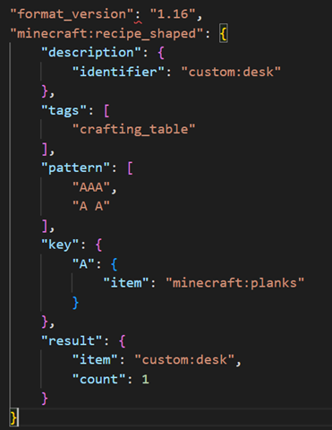
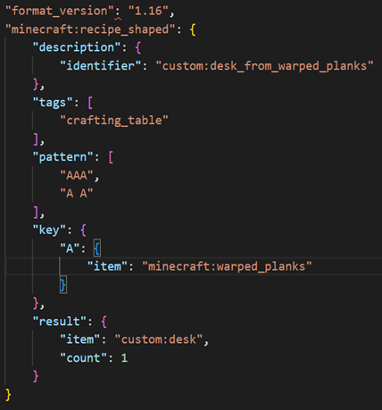
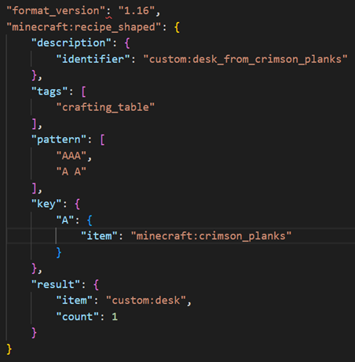
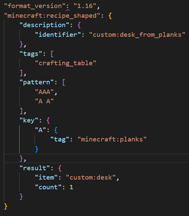

# Tags as Recipe Input

Imagine you are a creator, and you want to create a desk that can be crafted from any type of plank. Sounds pretty straightforward, doesn't it?

Currently, you would have to create at LEAST four versions of the recipe as shown in the examples below, with more if you intend on creating any custom planks. Additionally, you will have to stay diligent if you want to recipe(s) to stay relevant, as any new planks added to the game will necessitate additional recipe variations.

| Recipe 1: Planks  |Recipe 2: Mangrove Planks  |
|--------------|-----------|------------|
|**Recipe 3: Warped Planks**   |**Recipe 4: Crimson Planks**  |

Fortunately, tags may now be used as recipe input, which streamlines the process greatly. Utilizing this new functionality into our scenario above, your effort in creating a desk that can be made from planks will now look like this:

That's right, just one recipe! Not only does this account for all types of planks currently in the game, it will work for any custom planks and any future planks added to the game, provided they are tagged properly.

Now that you're familiar with the basics of using tags as input, you're ready to start experimenting. Create a recipe that uses both tags and items, set up recipes that use multiple tags, and more! As with most things in Minecraft: Bedrock Edition, the only limit is your imagination.

In order to assist you in the creation process, we have provided [a list of all tags current as of Minecraft:Bedrock Edition Version 1.19.50](../../RecipeReference/Examples/RecipeTagList.md).
